## The Analysis Process

As a forensics examiner, you need a solid understanding of operating systems — it helps you know what you're doing and understand what evidence is created by the system versus what's created by the user. Analysis is the process of looking at individual findings, seeing the invisible chain between actions, and connecting the evidence to answer the who, what, when, where, why, and how.

As investigators, we can't grab a disk and start going wild hunting through every artifact. We need a clear goal and a path toward it. These goals can take different forms:

- **Binary:** Was file X stolen? What file caused this?
- **Qualitative:** Did X know they were getting fired? Sometimes finding one chat message is all you need.
- **Fully quantitative:** Some cases require collecting every piece of evidence — rare, but these cases are very important.

:::note
The value of information deteriorates over time. Once you've found what you need, you don't need to dig for another 20 hours to find the same thing again.
:::

Spending some time making a **Digital Investigation Plan (DIP)** is well worth it. A typical DIP has three parts:

1. **Background** — what you're going into.
2. **The item** — a clear, detailed explanation of what's requested, so you know the goal you're trying to achieve.
3. **Plan of action** — using the background info, imagine the possible actions taken to commit, facilitate, communicate, research, or cover up the crime. Based on that plan, determine which artifacts to review.

Using these steps, analysts can take notes and efficiently review and investigate data, maximizing the time spent on the investigation.

:::note
Windows 11 has almost the same structure and artifacts as Windows 10, with some notable changes:
- Cortana is removed
- Edge is installed by default
- Windows Search index changed from Extensible Storage Engine to SQLite format
- The Windows Subsystem for Android can run Android apps on Windows
- Deeper integration of Microsoft Phone Link
- New Program Compatibility Assistant application execution artifact
:::

### Image Mounting

One of the best tools for this is **Arsenal Image Mounter**. Its key benefits:

- Examiners with minimal training can interact with mounted files in their native format or associated locally installed applications.
- Files can be copied out of the mounted filesystem since the image is read-only, preventing accidental deletion of evidence.
- The image appears as a separate drive attached to the host system.
- Antivirus and EDR can run against mounted files.

:::tip
Arsenal is the first and only open-source solution for mounting disk images as a complete disk in Windows.
:::

### Triage Acquisition

Triage acquisition is a 5-step process:

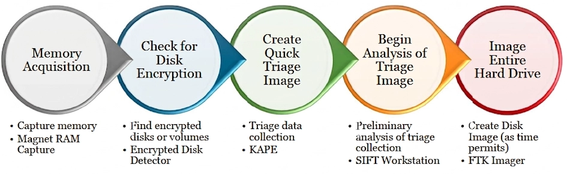

## Memory Acquisition

Memory acquisition is one of the most important developments in computer forensics, having been around for over 15 years. Some investigators still resist it due to perceived complexity, but with today's tools it's straightforward. Tools like F-Response made imaging RAM as simple as imaging a physical drive.

There's ongoing debate about how to respond to a powered-on device — some simply pull the plug from the back, while others recommend collecting and documenting volatile data first before shutting down.

:::important
The United States Department of Justice advises incident responders to preserve as much information as possible, especially volatile data. With the growth of encryption app usage, pulling the plug can result in full encryption and total data loss. If the system is controlled by a RAT or virus, the case becomes much harder to defend without volatile data.
:::

### What's Inside the Memory

Volatile data is any data that disappears once the system is powered off. This includes:

- RAM contents
- Current active network connections
- Running applications
- Open/listening network connections

Much of this data is extremely valuable for determining whether someone had remote access to the computer.

Some claim that collecting volatile data will affect the state of the evidence and is therefore unacceptable. This is **NOT TRUE**. In court, failing to collect it would look like the incident responder intentionally destroyed gigabytes of potential evidence.

Acquiring RAM benefits your case and helps determine whether a SODDI (Some Other Dude Did It) defense holds up. There is no method to write-block memory from being changed — but as long as you document your actions and what changes you caused, the evidence remains valid.

:::tip
After memory acquisition, you can make further assessment of the system to determine if it's safe to shut down and apply write blocking. Conducting on-site triage is important: it helps immediately confront a suspect with the information gained, increasing the likelihood of a confession.
:::

What you'll find in memory: all processes, files, directories, and other info — including residue such as old command history, old emails, visited sites, and plaintext passwords for encryption settings. With the increased use of encryption utilities, collecting a RAM image has become one of the most important steps in forensic acquisition.

:::note
In most cases, programs will not encrypt or obfuscate data in memory, so you'll find it sitting there in plaintext — just not wrapped inside a convenient `<password>` tag.
:::

### Windows Memory

Several acquisition tools are available, and they operate similarly. Prior to Windows Server 2003 SP1, a handle named `\Device\PhysicalMemory` could be used to address and copy memory — this was removed due to security concerns. Any memory acquisition software must be digitally signed so antivirus doesn't remove it.

Regardless of the tool used to dump memory, any major analysis tool should be able to analyze it. **WinPMEM** is recommended by SANS — it supports both 32-bit and 64-bit systems and has an option for live memory analysis.

:::note
In order to dump memory, the system must be up and running.
:::

There are also copies of memory created automatically by the OS:

- **`hiberfil.sys`** — Windows systems (especially laptops) maintain a hibernation capability. This file is created when a system transitions to a power-save state (sleep or hibernation) and is a complete copy of everything in RAM. Simply copying this file from the root of the system drive gives you a pre-made RAM dump.

- **Crash dumps** — look for `memory.dmp` files in `%WINDIR%`. A full crash dump includes a complete copy of RAM (making it a large file), though these are rare. Systems can be configured to perform them via this registry key:
  ```
  SYSTEM\CurrentControlSet\Control\CrashControl\
  ```

- **`pagefile.sys` and `swapfile.sys`** — while not complete copies of RAM, they contain portions of it. `swapfile.sys` first appeared in Windows 8 and Windows Server 2012. It holds the working set of memory for suspended modern apps that have been swapped to disk. The page file can be moved to different locations and volumes; more information can be found in this registry key:
  ```
  SYSTEM\CurrentControlSet\Control\Session Manager\Memory Management
  ```

Taking memory dumps from any Windows version follows an identical process, but keep in mind that drivers must be signed via the Windows Hardware Quality Labs (WHQL). This is a good requirement, but it's an obstacle for many tools that haven't submitted their drivers to WHQL.

### Memory Imaging Tools

Memory imaging tools typically take an output path and filename as arguments and dump the entire memory to a file at that location. Best practices:

:::tip
Run the imaging tool from external media and save the output back to that same media. Keep in mind that tools are executed on the live system, so they leave their own artifacts behind. For example, WinPMEM drops the driver it uses into `AppData\Local\Temp`. At some point during the investigation you may find this deleted file and go down a rabbit hole trying to figure out what it was — this is exactly why good documentation is critical.
:::

**Document everything:** tool name, version, time of execution, and the username that ran it.

::github{repo="Velocidex/WinPmem"}

Magnet RAM Capture is another option: https://www.magnetforensics.com/resources/magnet-ram-capture/

### Analyzing Memory

There are many tools available for memory analysis. Basic tools examine memory images like disk images, carving files and artifacts based on headers, signatures, and keywords. A basic tool like **AXIOM** uses these simple but powerful techniques to recover chat sessions, internet history, pictures, Windows artifacts, and webmail.

More advanced tools include **Volatility** and **MemProcFS**. It's also possible to recover encryption keys from memory — such as BitLocker and TrueCrypt keys — using commercial tools like **Passware Kit** and **Elcomsoft Disk Decryptor**, which require continuous research and development investment.

## Checking for Disk Encryption

Now that you've imaged the RAM, can you pull the power plug? Well — you're right, but also wrong.

Modern disk encryption can stand in your way. Full disk, volume, or file-level encryption is increasingly common. Estimates show that by 2027, encryption will be adopted by 14% of users.

:::warning
It's more important than ever to access the system while it's still powered on and the user is logged in. Any encrypted data will be inaccessible once the system is shut down, put to sleep, or hibernated.
:::

Memory images are very helpful for defeating encryption, but it's preferable to capture data in its unencrypted state while you have the chance. Also keep in mind that some data can only be acquired when the system is online and running — such as cloud storage items and DPAPI credentials.

Two free tools to use:

- **Magnet Forensics Encrypted Disk Detector**
- **Elcomsoft Encrypted Disk Hunter**

Both perform multiple checks to identify the presence of encryption, including:

- Searching disks and volumes for signatures
- Searching running processes
- Identifying loaded drivers and known encryption products

These tools are highly effective at finding common products like **BitLocker**, **TrueCrypt/VeraCrypt**, **PGP**, and **SafeBoot**. However, they can miss things.

:::caution
A manual review of the system is also helpful — look at installed applications and view volumes in Windows Disk Management. Also keep in mind that there may be hardware-level encryption, which these tools won't detect. When in doubt, assume encryption and collect your triage and disk image while the system is still running.

If you perform a live image due to encryption, make sure you image the **logical drive**, not the physical one. The logical disk is typically unencrypted by the local machine, while the physical disk is encrypted at the disk level.
:::

### Encrypted Disk Detector (EDD)

EDD is a command-line tool that checks local physical drives for TrueCrypt, PGP, VeraCrypt, BitLocker, and SafeBoot encrypted volumes.

:::note
EDD does not attempt to locate encrypted volumes that are not mounted. It only scans and alerts the user for currently accessible volumes and drives.
:::

It's a useful first-response tool for quickly checking for encrypted volumes on a system and deciding whether a live acquisition needs to be made to preserve evidence that would be lost if the plug were pulled.

:::tip
Always run low-level analysis tools with administrator privileges for best results.
:::

When EDD is run on a system, it shows:

- The physical drives installed
- The logical volumes on those drives
- Any detected encryption processes or signatures on the disk
- The presence of cloud storage sections

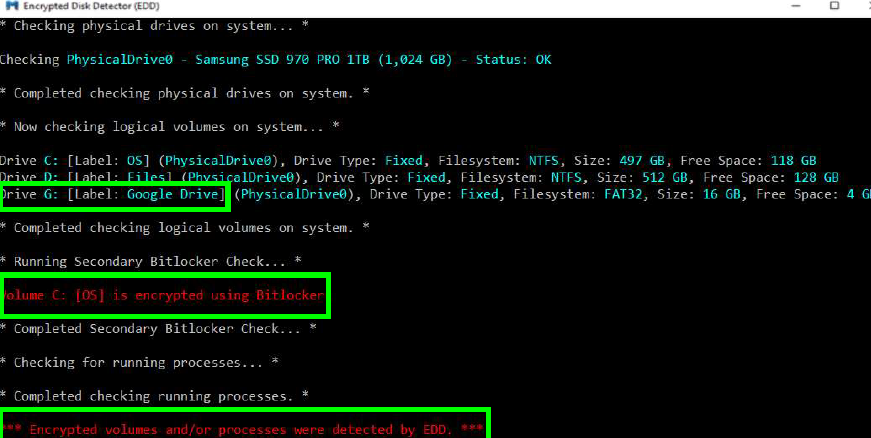

## Creating a Triage Image
 
Nowadays we need to be speedier and more efficient to keep up with the massive amount of potential evidence. Proper acquisition techniques and planning are critical. Gathering triage data is not new — it's been documented for years.
 
### Items in the Triage Image
 
What files should be included in a triage image:
 
- All **registry** hives and perhaps backup registry hives:
  - SAM
  - SYSTEM
  - SOFTWARE
  - DEFAULT
  - NTUSER.DAT
  - USRCLASS.DAT
- **LNK files** (`*.lnk`): LNK files provide evidence of file and folder opening.
- **Jump Lists**: Jump Lists contain a massive collection of shell items showing files and applications used.
- **Prefetch files** (`*.pf`): Prefetch files are created during application execution.
- **Event Logs** (`*.evtx`): Modern Windows systems maintain hundreds of logs located in the `Windows\System32\winevt\Logs` folder.
- **Other log files**: Other logs include `setupapi.dev.log` (plug-and-play log file), antivirus/security logs, IIS logs, and so on.
- **`AppData` folder**: Each user profile maintains an AppData folder where many applications store valuable artifacts like logs and databases. Browsers, cloud storage, and chat clients are common examples.
- **`$MFT`**: The master file table is the metadata database for every file and folder on the system.
- **NTFS `$Logfile` and `UsnJrnl $J`** (file system journal and change log): These databases record granular file activity (file open, close, creation, deletion).
- **`pagefile.sys`**: The Windows page file (an extension of virtual memory).
- **`hiberfil.sys`**: The hibernation file is a compressed image of RAM from the last time the system was placed into hibernation.
### KAPE
 
Kroll Artifact Parser and Extractor is a tool written by the one and only Eric Zimmerman — he wrote it after years of experience working with wide data sources. Using KAPE, you can decide what's collected and when it's collected.
 
There are many options to choose from; some may perform certain functions very well but often have weaknesses. KAPE doesn't have any of these issues, and it's super fast!
 
So why use it? It's a triage program that finds the most forensically relevant artifacts and parses them in a few minutes. Because of its speed, KAPE allows investigators to find and prioritize the most critical systems in their case. You can also use it to collect the most critical artifacts at the start of the imaging process and investigate while the imaging completes.
 
What is it? It's a multi-function program with two primary functions:
 
1. Collect files
2. Process collected files with one or more programs
As is, KAPE doesn't know how to do anything on its own, but it knows how to read config files — and based on those files it collects and processes files. This makes it very extensible. At a high level, KAPE works by adding file masks to a queue; this queue is used to find and copy files from the source. If a file is locked by the OS, a second pass is taken to bypass this. At the end, KAPE makes a copy and preserves the metadata of all the files from the source. The second option is processing the data against one or more programs — this works by targeting specific file names or directories. Programs run against the files and their output is saved in a directory named after the category. By grouping things like this, examiners can discover information without needing to go to the artifact itself.
 
### What Makes KAPE Different?
 
- Faster than other tools
- Has both a GUI and a command line
- Collects OS-locked files
- Predefined and custom scripts
- VSS can be processed as part of the targets collected
- Batch mode allows you to automatically start collection with predefined targets
- Several output options: zip, VHD, and VHDX
- You can process collected data with CLI tools
### Targets
 
These configurations contain a list of file masks that allow for finding files on storage devices. They allow collection of files by full name, extension, or even entire directories.
 
A target is a collection of file and directory specifications. KAPE reads these specifications, expands them to files and directories that exist on the system, then starts copying files from the source to the destination.
 
Files locked by the operating system can't be copied normally — they're added to a secondary queue. This queue contains all the locked or in-use files; after the primary queue is done, the secondary one is processed using raw disk reads to bypass the lock. This gets you a copy of any file you want, even if it's in use.
 
All copied files are copied as-is — same timestamps, same destination path — and even the metadata is collected into log files, both in text and CSV.
 
Targets should include specific files or a group of them. For example, a target that collects jump lists should collect both automatic and custom ones. A target that collects LNK files should match `*.lnk`. You should NOT put these two together — it's better to keep each target very specific. An exception to this rule can be NTFS file data like `$MFT`, `$J`, and `$LogFile`. By keeping targets like this, we have the flexibility to create other targets that reference known ones.
 
```yaml title="Target Configs"
Description: Amcache.hve
Author: Eric Zimmerman
Version: 1
Id: 13ba1e33-4899-4843-ad1f-c7e6b20d759a
RecreateDirectories: true
Targets:
  - Name: Amcache 
    Category: Applicationcompatibility
    Path: C:\Windows\AppCompat\Programs\Amcache.hve  # <- path to collected file 
    IsDirectory: false  # <- shows it's a file not a dir 
    Recursive: false # <- just collect this file  
    Comment: ""
 
  - Name: Amcache transaction files
    Category: Applicationcompatibility
    Path: C:\Windows\AppCompat\Programs\Amcache.hve.LOG*  # <- collect anything with .LOG like .LOG1 ...
    IsDirectory: false
    Recursive: false
    Comment: ""
```
 
### Modules
 
These configurations contain information about a program to run, including the command line arguments and export format. You can run them against a live system or just logical files.
 
Like targets, modules are defined using YAML to run programs. These programs can target files collected via a target, or any other programs you may want to run on a live system. For example, you can use a tool like `JLECmd` to dump the contents of jump lists into CSV, or `RECmd` to process registry files. If you want the output of `netstat` or `ipconfig/dnscache`, you can do that — each will be run separately then grouped under any name you choose.
 
Each module should only reference a single executable. Each defined process allows the executable to export data in different formats, keeping KAPE able to generate all data types that can be passed to big data systems like SOF-ELK or Splunk.
 
Another aspect to understand is that each module is tied to a category. While you can change them, it's better to stick with common categories.
 
```yaml title="Module Configs"
Description: 'AmcacheParser: extract program execution information'
Category: ProgramExecution
Author: Eric Zimmerman
Version: 1
Id: 4190c518-524f-4623-8038-a014784c018c
BinaryUrl: https://f001.backblazeb2.com/file/EricZimmermanTools/AmcacheParser.zip
ExportFormat: csv
FileMask: Amcache.hve  # <- this is the source file 
Processors:
  - Executable: AmcacheParser.exe
    CommandLine: -f %sourceFile% -csv %destinationDirectory% -i  # <- command line to run the tool giving all arguments and input/output 
    ExportFormat: csv
```
 
### Creating Triage Data
 
The GUI provides an easy way to construct a triage collection by checking the forensic artifacts you want to include in the image — this is on the targets side. Under it you can see additional features like collecting VSS and collecting data into different outputs like VHDX or zip. As you select items in GKAPE, a command line is constructed, so you learn how to write command lines too. The CLI tool makes it easier to automate KAPE collection and processing.
 
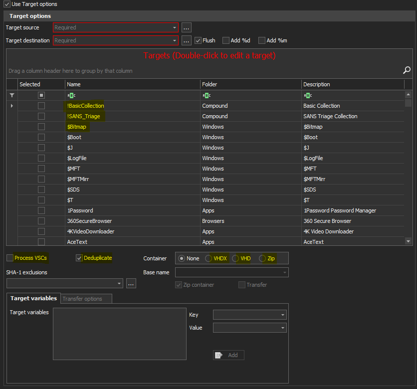
 
### Collection Criteria
 
**Step 1:** Define the source to collect from and the destination where data is stored. The source is the drive letter like `C:` or `D:`. KAPE doesn't process data from forensic images like E01 — if you want to process this data, use Arsenal Image Mounter to mount it, then collect from it. You can save the collected data to a USB, network share, or SFTP.
 
**Step 2:** Checking the `%m` option tells KAPE to append the machine name to the output file names. This is useful when collecting data from multiple machines.
 
**Step 3:** Click the box on the left of the target name you want to collect. The target may be a single artifact, a group of related artifacts, or an entire set of artifacts needed for a case. A complete set of artifacts is already in KAPE and if you want more you can easily create your own.
 
**Step 4:** KAPE can process Volume Shadow Copies if you want to include them in the collection. All you need is to check "Process VSCs" and KAPE will do it for you — but you can't select specific VSCs, it's all or none.
 
**Step 5:** KAPE offers a few output formats: Zipped, VHD, VHDX, and Zipped VHDs.
 
**Step 6:** Execute to start the collection process.
 
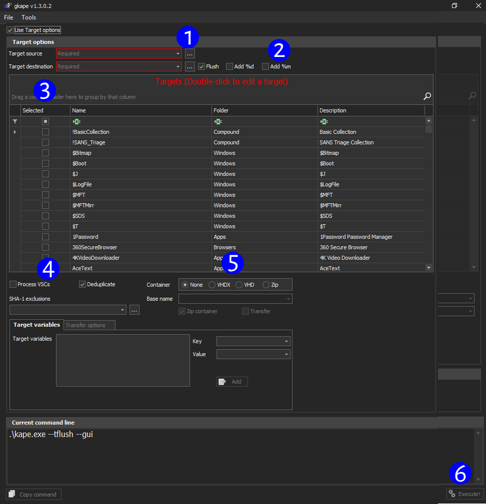
 
If you want to learn more about KAPE, have a look at this video: https://www.youtube.com/watch?v=DXE0INTu9ek
 
---
 
As I mentioned before this book, we'll focus on Windows forensics — but up until now we were talking in general terms about basic incident response. Now let's go into **deep forensics**. Each section will focus on a core component, and we'll start with the file system.
 
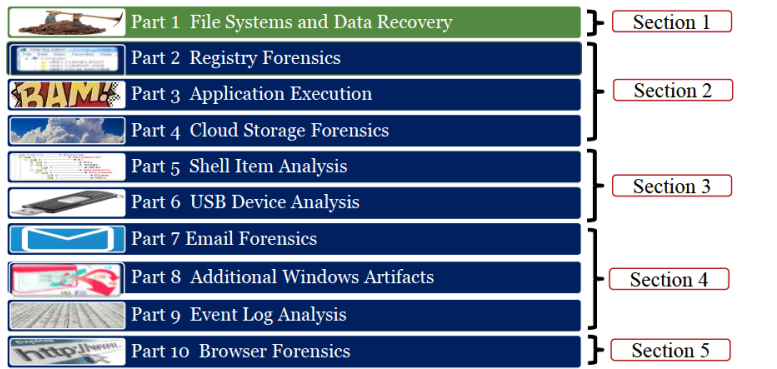
 
## Windows File Systems

### Overview

We don't have time to dive deeply into file systems, but at least we'll get to know the ones we can encounter during a Windows investigation.

The most well-known is the **FAT** file system, created in 1977 for floppy disks. It was very simple and had no security features. There are four variations of FAT: FAT12, FAT16, FAT32, and exFAT. The core difference is the size of addressable entries in the File Allocation Table (FAT), which determines the maximum volume size. FAT12 was made for floppy disks, while FAT16 and FAT32 were made in the early days of hard disks and Windows. exFAT is the newest version and can be found in Windows versions after Vista, as well as other Microsoft products like Windows CE and Xbox. To this day, FAT32 and exFAT are still used due to their compatibility with macOS and Linux.

**NTFS** was designed to overcome the shortcomings of FAT and to be more applicable in an enterprise environment. NTFS is robust, flexible, and can manage volumes up to 16 exabytes. It's the dominant file system used by Windows products and will likely remain so for the foreseeable future.

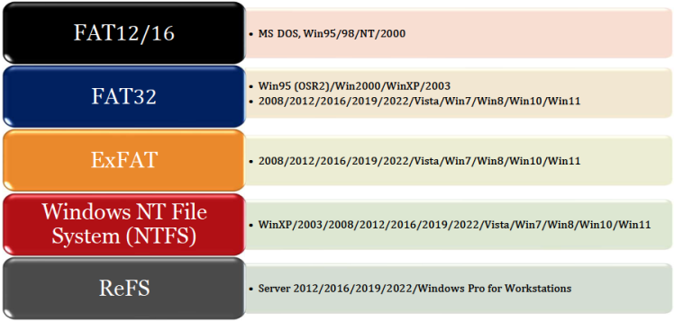

**Why NTFS:**

- Supports mixed-case filenames in different code pages
- Supports long filenames up to 255 characters (compared to FAT's 8+3)
- Less fragmentation of data
- Extent-based space allocation
- Transaction journaling for crash recovery
- B+ tree structure for directories
- Support for compression, encryption, and quota enforcement at the filesystem layer
- Support for sparse files, soft links, and hard links
- POSIX support
- Smaller cluster sizes to reduce wasted space

The most recent addition to Windows file systems is the **Resilient File System (ReFS)**, developed in 2012. It was initially introduced for file servers and made some improvements on NTFS, aimed at very large data volumes that require self-healing integrity checks. It's rarely seen on production systems — some systems can format volumes as ReFS, but it's not gaining much adoption over the years.

:::tip

A great book if you want to learn more is **File System Forensic Analysis by Brian Carrier**.

:::

### NTFS Features:

Some of these features are only applicable in an enterprise environment.

- NTFS **uses log files** to record changes to the metadata to always track the state and integrity of the filesystem. This also allows correcting inconsistencies caused by system crashes. Other file systems call this **"journaling"**, whereas NTFS calls it "transaction logging".

- NTFS can track all the files that were changed on the system via a **USN (Update Sequence Number)** journal, or Change Journal. This allows tools like backup utilities or virus scanners to know what files are new or changed since they last ran. It runs incrementally.

- POSIX compliance requires NTFS to support **hard and soft links**. A hard link is when a single file responds to multiple names; at the user level, you see two files, but you're interacting with one. A soft link is where a second file is created, but it doesn't have any data inserted. It's just an alias or pointer to another file, and opening it opens the other file's data.

- NTFS has robust **security controls** to prevent users from opening files they are not allowed to. These controls are often bypassed by attackers via **privilege escalation**.

- NTFS allows admins to limit users to a specific amount of disk space via **disk usage quotas**.

- **Reparse points** allow the system to interact with files in all kinds of ways. Soft links, volume mount points, and single-instance storage are all implemented via reparse points. Anyone can program a filesystem filter driver and make their own reparse points that do what they want.

- NTFS uses **Object IDs** to track certain files no matter where the file is moved or how many times it's renamed. The Distributed Link Tracking system will update all links to the files so they are never lost.

- NTFS implements transparent file-level encryption at the filesystem level, **Encrypting File System (EFS)**, which is separate from **BitLocker**, the volume-based encryption technology.

- NTFS introduced **file-level compression** at the filesystem level, saving disk space.

- NTFS keeps volume backups via the incredible **Volume Shadow Copy** feature. If you deleted a file and want it back, you can revert to an earlier version using a shadow copy.

- NTFS allows files to have **alternative content**. Downloaded files can have a tag so Windows warns the user before opening them, and it can also be used by threat actors to hide data.

- NTFS allows mounting volumes as a folder instead of a drive letter. This can be done using a **mount point**, such as `C:\NewDrive`, instead of a drive letter like `D:\`. This is used by system admins to keep the directory tree organized while still utilizing the increased speed gained by spreading data across multiple drives.

- NTFS can save disk space on large files by keeping one instance of a file. For example, if each user has a 300 GB file, we would have a file for each user, but NTFS can convert these copies into a single copy using links that point to one file instead.

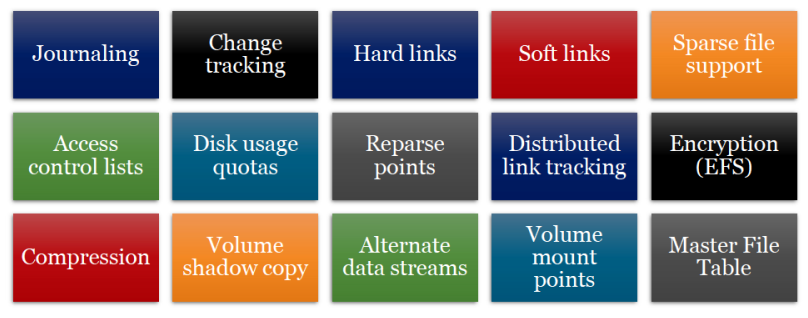

## Master File Table (MFT):

The MFT is at the heart of NTFS. It's a very structured database storing information used to retrieve files from an NTFS partition. Every object gets a FILE record within the MFT, and each record contains a series of attributes that contain data and metadata related to that file. File directory listings and volume names are also recorded.

Each record is 1024 bytes long. If the file is small enough, all the file data will be saved in the MFT record with its metadata (resident data). If it's not, there will be a pointer to the cluster containing the file contents (non-resident data).

The MFT can become quite large. A 1 TB drive with over 400k files on it will produce an MFT that is over 485 MB in size. If the MFT becomes fragmented and the system has to seek all over the drive to get to its various parts, the speed of the system will be very degraded. To prevent this, NTFS drives will create an `MFT Zone` for the MFT to reside in. This reserves the first 12.5% of the drive for the MFT. Then, user files are placed around that zone so the MFT has free space to grow. If the rest of the drive, the other 87.5%, is full, the MFT Zone will be halved, with the new free space becoming available for files. This continues until the drive is full. Once the MFT becomes fragmented, it can't be defragmented by normal means.

The first 24 MFT entries are reserved for special use by the NTFS volume. The first 12 are used by the system files to make NTFS work. All of them start with `$` and are hidden from view unless you're using specialized tools.

### MFT Entries:

| Record # | Filename | Description |
| :--- | :--- | :--- |
| 0 | `$MFT` | Master File Table – A database that tracks every file in the volume |
| 1 | `$MFTMIRR` | A backup copy of the first four records of the MFT |
| 2 | `$LOGFILE` | Transactional logging file |
| 3 | `$VOLUME` | Contains volume name, NTFS version number, dirty flag |
| 4 | `$ATTRDEF` | NTFS attribute definitions |
| 5 | `.` | Root directory of the disk |
| 6 | `$BITMAP` | Tracks the allocation (in-use versus free) of each cluster in the volume |
| 7 | `$BOOT` | Boot record of the volume |
| 8 | `$BADCLUS` | Used to mark defective clusters so that NTFS will not attempt to use them |
| 9 | `$SECURE` | Tracks security information for files within the volume |
| 10 | `$UPCASE` | Table of Unicode uppercase characters used to assist sorting filenames |
| 11 | `$EXTEND` | A directory containing `$ObjId`, `$Quota`, `$Reparse`, and `$UsnJrnl` |

`$MFT` is the first record, ID 0. This record provides the name and information necessary to find all the clusters contained on the MFT. The Volume Boot Record (VBR) contains a pointer to the cluster this record will lie in, and a pointer to the start of the MFT contains pointers to the clusters for every other object. Unlike FAT, in NTFS the VBR is the only object tied to a specific sector on the disk and can't be relocated.

`$MFTMIRR` is the second record. It contains a backup of the `$MFT` record, in case the record cannot be read due to physical damage to the disk. Due to the difference between the record size of 1 KB and a cluster size of 4 KB, this record actually backs up the first four records on the `$MFT`.

`$LOGFILE` contains transactional log information used by NTFS to maintain the integrity of the file system in the event of a crash. This process is called journaling in other systems.

`$VOLUME` contains the friendly name of the volume for display, as well as the NTFS version number and a set of flags that tell the system if the volume was unmounted cleanly on the last use.

`$ATTRDEF` defines the NTFS attributes for the NTFS version used on its volume.

`$MFT` record `5` is the root directory. It functions no differently from any other directory. Its record number is always 5, and its name is `"."`.

`$BITMAP` is a long string of binary data, with a bit for each cluster in the volume. Each bit is 0 or 1, showing if the cluster is allocated or not.

`$BADCLUS` helps the system mark and avoid using physically bad clusters. This file is a sparse file that has a size equal to the volume size and is filled with zeros. Sparse files are files where the zeros are not actually written to the disk, so no space is allocated to them. If a cluster is bad, then data will be written in the file at the offset corresponding to the location of the cluster. This causes the `$BITMAP` to mark this cluster as in use, so no new file will be written there. There is also hard disk controller logic that will remap failing sectors, so this fail-safe is mostly not used.

`$SECURE` contains an index to track security information for the files. Each individual file will have security information like who owns the file and who is allowed to open it. This index allows the system to hold information about the owners so the information lookup doesn't have to happen for every file.

`$UPCASE` contains a table of uppercase and lowercase Unicode letters for each page used for the filenames within the system.

`$EXTEND` — even though there are 24 records for system use, when the new system files were introduced, rather than placing those files in the remaining records (12–23), a directory entry was placed in record number 11 to hold the new system files. Because the files are written by the format command before the user files are written, they will be located in the first non-reserved records (24–28).

:::note

It was made this way to keep backward compatibility. Older NTFS versions won't have files 12–24, so they would crash if they encountered system files that were unknown and in places that should be empty. But a folder can just be ignored. The records 12–23 are all now marked as reserved so nothing can be written on them.

:::

`$EXTEND\$ObjId` contains object IDs that are on the drive. This allows a file to be tracked even if it is removed, renamed, or changed in a way that would otherwise make a pointer, like a link file, unable to find the file.

`$EXTEND\$Quota` contains information about how much allocated space each user is allowed to use and has consumed on this volume, so system admins can prevent users from taking too much space.

`$EXTEND\$Reparse` is filled with an index of the reparse points on a logical drive. Reparse points can be used for symbolic links, where a file is just a pointer to another file, and editing this file will modify the file it points to. They are also used to mount other volumes as a directory.

`$EXTEND\$UsnJrnl` is the Update Sequence Number (USN) Journal, also called the Change Journal. It's an index listing all the files changed on the system and why the change took place.

### Windows NTFS Time Rules:

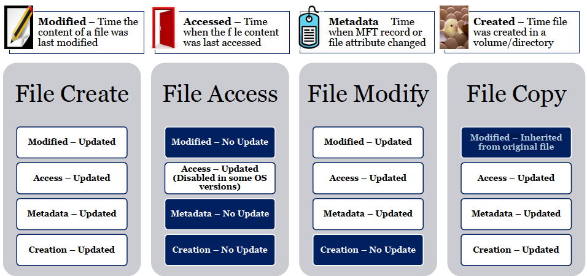

NTFS has four different timestamps for files and folders:

1. Last modification time of file data (`Modified` timestamp)
2. Last access time of file data (`Accessed` timestamp)
3. Last modification time of the MFT record (`Metadata` timestamp)
4. File creation time of the MFT record in the volume (`Created` timestamp)

The timestamps are stored natively using the UTC time zone and have a granularity of 100 nanoseconds.

When a file is created, all timestamps are set to the time of the creation. Post-creation, different actions affect these timestamps differently. When the contents of a file are read, the file's `Accessed` timestamp is updated. When the contents of a file are written to (`updated`), the `Modified`, `Accessed`, and `Metadata` timestamps are updated. This makes sense, as the file contents must be read (`accessed`), changed (`modified`), and file information like the size must be updated (`metadata`). When something about the file gets updated, the `Metadata` time is updated. For example, renaming a file updates its `Metadata` time since it changes the corresponding MFT record.

Strangest of all is a file copy. It doesn't get four new timestamps as you'd expect with a new file creation. Instead, it copies three out of the four timestamps to the time of the copy, and only inherits the `Modified` timestamp.

:::note

The reason for this is a paradoxical situation where the `Modified` time is before the `Created` time. In normal operation, that's not possible, but this pattern provides a means of proving the file didn't originate from this volume and was instead copied.

Only the `Modified` timestamp remains unchanged during a copy operation.

:::

### Alternate Data Streams (ADS):

ADS provides the ability to hold extra data content tied to a file via the addition of a new attribute in the existing NTFS MFT record. ADS can be detected by the presence of more than one data stream in the MFT record. Data attributes after the first must be named. This happens via including a Unicode string before the content of the ADS for resident attributes and immediately preceding the data for non-resident attributes. For example: `file.txt:Zone.Identifier`.

This functionality was introduced in Windows NT as part of Services for Macintosh functionality, as a way for Windows servers to support the file resource fork that exists in Mac. Ironically, Mac doesn't use this and instead treats a second file as containing the second set of data. Because Windows is designed to focus on the main data stream, most apps ignore any existence of the Alternate Data Stream, including its size and contents, and no other metadata. This makes ADS an attractive place to be abused by hackers. Each Windows version tries to place harder restrictions on ADS so it's less useful for attackers, but there is always a workaround.

ADS was unused legitimately until Internet Explorer began to tag downloaded files with an ADS named `Zone.Identifier`. The goal was to enable policies for downloaded files from the internet or from corporate resources. The following are the `ZoneID` values: `NoZone` = -1, `MyComputer` = 0, `Intranet` = 1, `Trusted` = 2, `Internet` = 3, and `Untrusted` = 4. This became known as the Mark of the Web (`MOTW`), which helped with the problem of maliciously downloaded files.

In many cases, a commonly asked question is whether a file was downloaded from the internet. One of the easiest ways to prove it is from the `Zone.Identifier` stream. `MOTW` is now extended across all web browsers and apps. Even better, web browsers include the source URL of the downloaded file, and even the referring page that led the user to this download URL. This is a rich source of data that can help identify malicious websites serving malware or attacker tools, and determine if something was downloaded from a legitimate source.

:::important

This information is not included when files are downloaded via private/incognito browsers. This is intended as a privacy feature for users. Sadly, this reduces the amount of information available. However, the absence of this information can inform the investigator that private browsing was in use, leading to more advanced techniques.

:::

Office uses `MOTW` to open documents in Protected View and disable macros on documents from internet sources. A common compromise-hunting technique is to look for executables tagged with a zone identifier ADS. Tools like PowerShell, FTK Imager, and MFTECmd all have capabilities to alert on the presence of ADS and provide the contents.

### Windows File System Layout:

Windows forensics relies on a range of artifacts on the file system. Many are in the system area and are unfamiliar to the normal user. A good understanding of these artifact locations helps you take advantage of these artifacts, and it helps inform you of areas to collect during triage and acquisition.

- `Program Files`: this is a standard location where 64-bit apps are stored.
- `Program Files (x86)`: this is an app storage location for older 32-bit applications.
- `Windows`: a massive collection of folders that holds a majority of the critical operating system files.

- `System32`: an important subfolder of Windows that holds many of the OS executables and libraries (DLLs), as well as log files, registry hives, and databases like SRUM.

- `Windows.old`: a large backup of critical files used to roll back the OS in case of a problem during upgrades.

- `Users`: this is the location of user profiles and associated files. Each user account keeps its own set of config files like the `NTUSER.dat` hive, and additional user folders like Desktop, Documents, Downloads, Pictures, etc.

- `AppData`: this is per-user and per-app configuration data stored under each user profile and includes a wealth of data like LNK shell items, cloud storage databases, and web browser folders.

- `OneDrive`: an example of a cloud storage folder. It's a default on modern versions of Windows, but many other cloud storage services also organize files under the user profile.

### Windows.old Folder:

A major Windows update can remove or overwrite a sizable number of forensic artifacts when they occur. Registry timestamps can be updated to the time of the update, event logs cleared, and Prefetch files removed. Luckily, these updates are uncommon. One way to recover from this is a set of folders created by the update process, named `C:\Windows.old`. This contains the source from the previous (old) Windows installation. The purpose of this collection is to facilitate rolling the system back to its previous state, so it contains massive amounts of files and gigabytes of data. More importantly, it copies the most important Windows forensic artifacts: Registry hives like `NTUSER.dat` and `USRCLASS.dat`, a copy of system logs, and folders like `Prefetch`. It also contains the full contents of other folders like `Program Files`, `Windows`, and `Windows\System32`. This is valuable if you are looking for a specific file, such as potential malware.

Sadly, nothing lasts forever, and eventually the `Windows.old` folder will be removed from the updated system. The average lifespan is about 30 days, and maybe longer, but apps like Disk Cleanup will remove the folder and may speed up its removal. Anyway, if you ever find this folder, make sure to copy it and make a note of its existence.

### Universal Windows Platform Application Artifacts:

`Universal Windows Platform (UWP)` apps are here to stay. This technology was originally called Metro apps, then Modern apps, and finally it settled on UWP. In the latest versions of Windows, many native apps are implemented in this format, as well as third-party apps. This means the locations of artifacts are changing and new artifacts are coming to the stage. The new Windows 11 Notepad, for example, provides a history of data in each tab stored in `.bin` files located in `%UserProfile%\AppData\Local\Packages\Microsoft.WindowsNotepad_8wekyb3d8bbwe\LocalState\TabState\`.

UWP apps are a major part of the file system. They fill tons of files like `C:\ProgramData\Microsoft\Windows\AppRepository\Packages\`, `C:\Windows\SystemApps\`, and

`C:\Program Files\WindowsApps\`. But they aren't our main focus other than proving that the app existed. The more interesting location is `C:\Users\<account>\AppData\Local\Packages\`. This folder keeps all the app settings, registry hive tracking activity, and even internet artifacts like cached files and cookies. You may be asking why UWP apps are keeping this type of data away from the shared repositories used by other apps. Well, it's because of the design: Universal apps run in an isolated sandbox environment and don't have access to the Windows registry and file system. This is good for security, but it complicates forensic analysis by separating artifacts into different locations.

Knowledge of `UWP` apps is important because you'll see them a lot in forensic artifacts. SRUM, UserAssist, Prefetch, and BAM all identify UWP execution. Jump Lists are created for UWP apps, showing files and folders accessed. The Internet Explorer WebCacheV*.dat database has been repurposed to track internet access and metadata for UWP apps. Some Windows Search components have moved to the "Packages" folder. Some interesting new apps like Phone Link only exist as UWP apps. The unique naming scheme is `([Application Name]_[Publisher Name Hash], i.e. DropboxInc.Dropbox_wrkt425jdc3sga)`, and it's referenced in the "Packages" folder. This means we're dealing with UWP apps.

### MFTECmd.exe MFT Record Parsing:

This tool takes an `NTFS MFT` file as input and parses each record into human-readable information. Written by the one and only Eric Zimmerman, it's a powerful tool that makes it easy to find every variation in the file system: deleted items, alternate data streams, copied files (modification before creation time), items with a specific extension, and so on.

The tool is designed to output CSV or JSON files. It can also mount existing volume shadow copies and supports deduplication with the `--dedup` option, making it easier to pick out previously unknown files. `MFTECmd` is super fast, providing a CSV file in under 40 seconds.

`MFTECmd` output can be opened by any tool that supports CSV format. One of the best tools to do so is Timeline Explorer; it can open, filter, and search large output files. `MFTECmd` also includes some special attribute columns like: In Use (file is not deleted), Is Directory (folder vs. file), Has ADS (an alternate data stream is present), Copied (was this file copied), and Zone Id Contents (extracts the contents of the ADS).

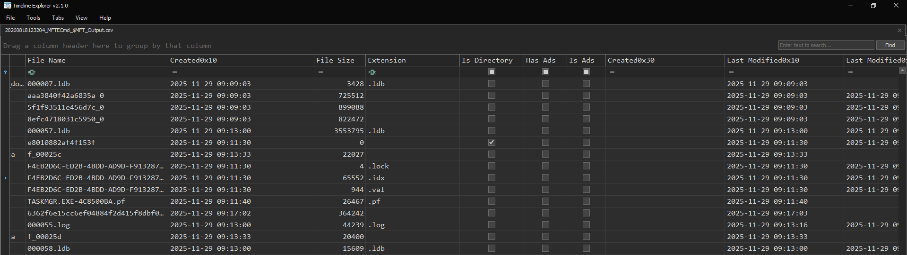

### MFT Explorer:

MFT Explorer is the GUI alternative to `MFTECmd`. It shows the files and folders in a tree view like Windows File Explorer, which helps with visualization. It also helps present the wealth of information, like raw hex of each MFT record, to the analyst. This tool is good for someone who wants to explore and learn more about MFT. It can certainly be used as an investigation tool, but it's very slow. In some cases, if the MFT is large, it can take up to an hour to load it, so investigators just prefer doing it the fast way.

## Data Recovery

## Windows Volume Shadow Copies

Volume Shadow Copy Service (VSS or VSC) debuted with Windows Vista and has been available in every subsequent version of Windows. It's also available on servers. It's used by other features like System Restore and Previous Versions. The service monitors write operations on the file system and makes backup copies of data blocks before new data is written to the disk. This is a copy-on-write (COW) technique used to store data differences. These backed-up blocks are stored in 16 KB chunks in files inside the `System Volume Information` directory in the root of the volume. This directory includes a file that tracks each active Volume Shadow Copy, with its VSC ID and a timestamp for when it was created. This file is called a catalog, and its name is the GUID that follows this value: `{3808876b-c176-4e48-b7ae-04046e6cc752}`. For each active Volume Shadow Copy, there is a file that keeps the backed-up 16 KB blocks. Each of these files is given a new GUID followed by the GUID of the catalog file, for example: `{08bf868a-b118-41e8-a902-a2c6c7001600}{3808876b-c176-4e48-b7ae-04046e6cc752}`. Using this process, the VSC provides the ability to rewind a file or directory.

Volume Shadow Copies can be created by:

- Scheduled system snapshots
- Software installation or uninstallation
- Manual (admin-requested) snapshots

Starting with Windows 7, Volume Shadow snapshots are scheduled to take place every 7 days, but that's not exact, as the snapshot is created only during idle periods or system shutdown/reboot. A VSS-enabled volume will have a live Volume Shadow Copy. This file saves the 16 KB block changes as they occur, and once a VSC is created, these changes are committed, the shadow copy is archived, and it remains unchanged until deleted.

The ability to "rewind" the contents of a file/folder or a complete volume is limited to the times when each shadow copy was archived. For example, if a VSC exists for `2023-03-13 12:01:00 UTC`, tools can be used to see the contents of this volume as they existed at that exact time. This means investigators can't determine every change that occurred on the system, but multiple shadow copies often exist, allowing us to view the volume at multiple discrete times. The number of shadow copies is limited by storage space. The more changes that occur on the drive, the more differences that must be stored in the VSC, making the resulting file larger and providing less space for the other copies. The latest versions of Windows allocate around 3–5% of the volume for VSC storage, which can be a lot of space on modern hard drives. The amount of allocated space can be increased or decreased using `vssadmin.exe` or via Group Policy.

Windows 8 introduced ScopeSnapshot, which can have a significant impact on the forensic usefulness of Volume Shadow Copies. This feature is enabled by default in recent versions of Windows. When ScopeSnapshots are enabled, volume snapshots will monitor files in the boot volume that are relevant to System Restore only. This degrades the ability to recover files and folders that are not important to System Restore. A paper named *VSS Does Not Protect User Data* by Mamoru Saito tested putting a file on the user's Desktop and recovering it from a Volume Shadow Copy, but the recovered file was corrupted due to snapshots. On the plus side, the testing indicated that Windows Server still uses the more complete Volume Shadow Copy, and therefore servers still have a nearly complete backup. Although ScopeSnapshots limit the ability to recover the contents of some user data, they can still show/prove the existence of files and folders, and they still save metadata like file name, size, and timestamps. There is a registry setting that can be used to disable ScopeSnapshots on client systems. It can be done by creating a registry `DWORD` value named `ScopeSnapshot` in `HKLM\Software\Microsoft\Windows NT\CurrentVersion\SystemRestore` and setting it to `0`.

A registry key in the SYSTEM hive contains subkeys controlling items present in Volume Shadow Copies:

`SYSTEM\CurrentControlSet\Control\BackupRestore`

- `FilesNotToBackup`: names of files and directories that backup applications should not back up or restore.
- `FilesNotToSnapshot`: files to be omitted from newly created shadow copies.
- `KeysNotToRestore`: names of the registry subkeys and values that backup applications should not restore.

### Shadow Exploring

Volume Shadow Copies have the potential to be serious game changers: recovering files that were wiped or deleted, reviewing previous copies of event logs, or looking at older versions of the Windows Registry. These are just a few examples of evidence that can be captured and restored from Volume Shadows. There are tools like `X-Ways` and `Magnet Forensics AXIOM` that have the capability to analyze data within Volume Shadow Copies. There are also open-source tools that provide access to VSCs. VSCMount can mount shadow copies to a folder that can be traversed with native tools like Windows File Explorer. Triage tools have the capability of accessing shadow copies, which gives us the ability to mine useful artifacts from previous versions of the drive during data collection. KAPE has this ability, and it also includes deduplication to minimize extraneous collections. ShadowExplorer is a simple tool that allows analysts to quickly walk through available VSCs and export interesting files. While most of these tools are designed to run on Windows and take advantage of the built-in shadow copy service, Libvshadow is a library consisting of a complete emulation of this service. This allows access to information even on Linux or when you don't want to rely on running the service (dead images).

### ShadowExplorer

Examining Volume Shadow Copy data is easier with ShadowExplorer. It allows a user to browse the VSCs through a familiar Windows Explorer interface, which helps investigators quickly identify, parse, and extract the needed files.

Step 1:

Mount the disk image in `Arsenal Image Mounter` using **Disk Device — Write Temporary**. Make sure to use a clean new file, as ShadowExplorer has some difficulty if this is not done. `Arsenal Image Mounter` should be used instead of `FTK Imager` because `FTK Imager` does not expose the VSCs to the OS.

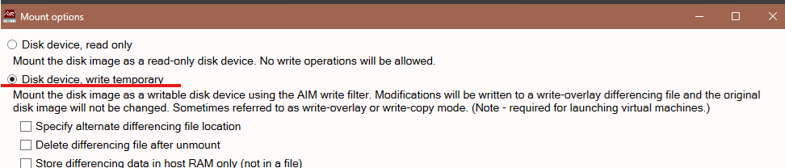

Step 2:

Launch `ShadowExplorer` as admin. If you don't launch it that way, it might not be able to parse all the files/folders available in the VSCs.

Step 3:

Browse the snapshots, just like in Windows Explorer.

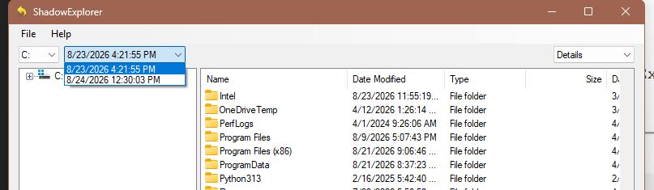

Step 4: Extract the needed files using `Right-Click -> Export`.

### VSC Triage Collection with KAPE

Volume Shadow Copy (VSC) analysis requires access to a full volume or disk image because the VSCs are differential files that must be applied to the current volume to rebuild it in the previous state. Thus, all the tools require access to the disk image. However, there might be times when taking a full disk image is not possible or desirable. In these situations, KAPE can help get around that by extracting VSC data at the time of triage collection, when it still has access to the file system.

When enabling the **Process VSCs** option, KAPE will identify and mount existing Volume Shadow Copies and perform collection on them as they are targeted on the current version of the volume. Each KAPE target will collect data on the current file system and then iterate through each VSC to also collect previous versions of that data source. Most of the files don't change between Volume Shadow Copies, so KAPE includes the deduplication feature that only collects files that are different from those present on the current file system. This helps save a lot of time and space. The results are organized in the destination folder by each corresponding VSC.

:::note

Numbering of these VSC outputs is by their Windows-assigned name, which increments as new VSCs are added to the system and older ones are removed. You can have VSS31, for example, but most likely there was also a VSS30 that is no longer on the volume.

If you're unsure whether you want the older versions of the file system, this can be a nice feature to have, but it comes at a cost: processing VSCs takes more processing time and much more space.

:::

## Metadata Recovery

A disk cluster is the smallest amount of space that can be allocated to a file. Clusters are some multiple of a hard disk sector size. NTFS has a default cluster size of 4096 bytes. Each cluster will be in one of two states: allocated or unallocated. Each cluster is either owned by an existing file or is available to be used. Unallocated clusters are seen as free space, but even if the space is free to write, it doesn't mean it's free of data. Files that were deleted from the system can still be present in unallocated clusters. Thus, unallocated space provides a unique feature for forensic analysts: bringing files back from the dead.

Even if a file is not fully recoverable, pieces of the file may still be recoverable. These pieces are called file fragments. Each fragment is one or more sectors of data, not the whole file. For example, an email may be partially recoverable with only the header, or multiple emails may be recovered while the overall email archive database is not.

Forensic tools can audit the available clusters, determine their allocation status, and provide the capability to access the cluster content when needed. There are easy ways to accomplish this, and there are also more advanced ways.

### Deleted and Wiped Files

Forensics professionals rely on the fact that, in nearly every file system, when a file is deleted, its contents are not overwritten immediately. Instead, the data location is marked as unallocated, and the data can still exist on the disk and be recovered until that free space is reallocated by the OS and overwritten. You might think the lifespan of deleted data is short and that the space is being used again quickly, but this is not always the case. For example, unallocated space tends to persist longer on spinning hard disks compared to SSDs. So, forensic techniques can recover deleted files long after they were deleted.

Once a file is overwritten, either through normal system activities or anti-forensics tools like file wipers, the chances of recovery are very slim. There could be copies of the file present for recovery, or maybe a feature like Volume Shadow Copies can be used to roll the file system back to a previous state. Excluding these exceptions, a single-pass overwrite is sufficient to defeat most forensic recovery capabilities.

So, if that's the case, why do some policies still require multiple overwrites during data destruction? Simply because those policies are outdated. NIST Special Publication 800-88, *Guidelines for Media Sanitization*, states: "For storage devices containing magnetic media, a single overwrite pass with a fixed pattern such as binary zeros typically hinders recovery of data even if state of the art laboratory techniques are applied to attempt to retrieve the data." Solid-state drives are a different challenge because they have a difficult-to-access reserved area and employ firmware-level optimizations like wear leveling, which makes it difficult to confirm full data destruction. The recommendation is to use a tool designed for SSD wiping.

### How File Recovery Works

Metadata layer recovery means a file is recovered by examining its properties, such as the starting cluster, file size, filename, and parent directory. Using metadata is by far the easiest and most reliable means of extracting deleted data. The difficulty is that many operating systems recycle deleted metadata locations quickly and, as a result, overwrite the metadata. Actions like drive formatting can also destroy available metadata.

In these situations, all is not necessarily lost. Even if the metadata of a file is overwritten, in many cases it is still possible to recover a file directly from the clusters of a file system volume that belonged to the file. This is the data layer. Tools that focus on the data layer or unallocated space can scan the beginning of every cluster, looking for file headers that match known file types.

A file header is how a file is identified by applications. These common headers include file information that is passed to the application for validation. Almost every file format has a unique header or identifier for the file. The file header can be as small as 2 bytes and as large as 64 bytes in some instances. File-carving tools can scan a file system volume looking for these headers and extract anything that matches the header signature.

For example, Windows executable files use the `MZ` header. In bytes, the example signature is `0x4d, 0x5a, 0x90, 0x00`: `4d` is `M` and `5a` is `Z`. If a carving utility finds this combination of bytes, there is a chance that a Windows executable `.exe` or a dynamic library `.dll` is present. You see that "there is a chance" part because file carving is only as powerful as its hypothesis, and it's possible for these 4 bytes to occur randomly. So, while data-layer recovery can get data long lost from the metadata layer, it can and will also return a lot of garbage and false positives that you must sift through.

Data-layer recovery also suffers from other limitations that aren't present in the metadata layer. It relies on data files being contiguous, which is common, but if a file was fragmented, it will mostly fail to be recovered through this method. Since the metadata layer has all the pointers to clusters on disk, it can more easily recover fragmented files. Recovery at the data layer also has only a limited means to determine file size. Some file formats have both header and footer signatures, but these are rare. If a footer doesn't exist, the carving tool must guess the file size, often based on similar files. In limited cases, the carving tool might be able to scan the header of the file for its size. Certain file types will embed the file size into the header, and this information can be used to accurately extract the exact file from unallocated space. Without this information, the carving tool must make its best guess, and if the guess is incorrect, recovery will fail and the result may be a corrupted file.

### Metadata File Recovery

Forensic tools make metadata recovery fairly effortless. They can detect unallocated metadata records and notify you. Most tools use some red `X` to mark the unallocated records. The tool can parse the metadata records, follow the pointers to the previously owned file system clusters, and attempt to rebuild the original file. Even if a perfect copy of the metadata still exists, there is no guarantee that one or more of the original clusters of the file have not been overwritten or assigned to a new file.

In these situations, recovery fails and the output may be a corrupted file. But if the recovery is successful, the files reappear like magic. It's possible to recover hundreds or even thousands of files from a file system using this method. Even if the contents are unrecoverable, sometimes the metadata itself is an important artifact. For example, the existence of an MFT record for a `.lnk` file provides enough information to know the file/folder name and when it was first and last seen through its creation and modification times.

Many forensic tools include the ability to recover files via metadata. All the commercial suites have this capability, with a few free options like Autopsy that can undelete files. FTK Imager can parse metadata structures and assist with exporting files. The Sleuth Kit, used in Autopsy, has a tool named `tsk_recover` that iterates through metadata records, attempting recovery of every unallocated file.

Each MFT record keeps a pointer to the file's parent folder. If the parent folder is no longer present, it becomes impossible to know where the file existed in the original file system. The file might still be recoverable, but its corresponding file hierarchy could be missing. In this situation, the file is deemed an orphan file and will be placed in an orphan folder.

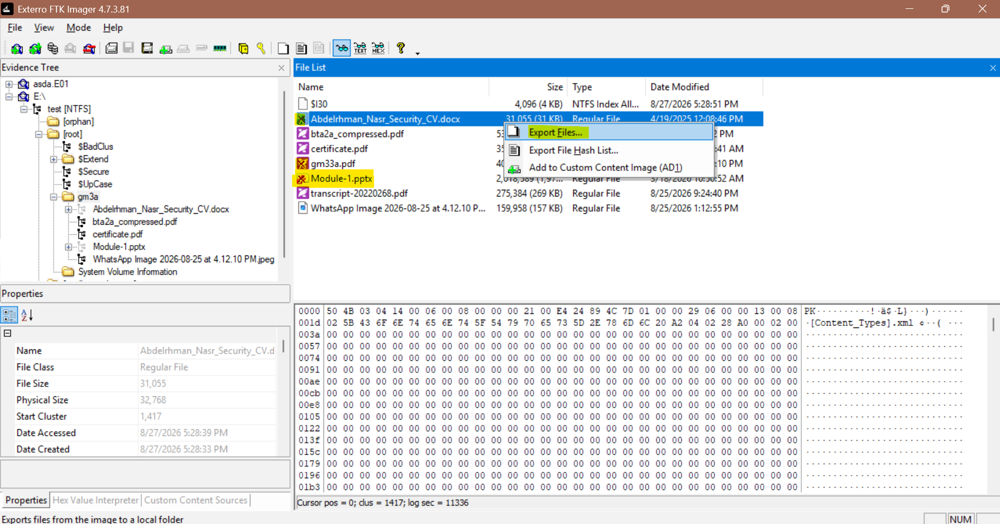

This example shows how metadata recovery works in FTK Imager. You just add an evidence item and select the logical drive (the disk must be mounted). All the deleted files will be marked with a red `X`. Any item of interest can be selected with right-click and exported if needed. In the bottom-left box, we can see a properties pane that shows the metadata of this file.

## File Carving

Carving is one of the simplest and most powerful recovery techniques. It relies on the fact that most files have a unique set of bytes in their header, also called magic bytes. If we know this sequence of bytes, we can write a tool that searches each byte in the data stream for matches and extracts data after the header to recover the full contents of the file.

A file header is how a file identifies itself to the application trying to interpret the data. These common headers include file information that is passed to the application for validation checks. The file header can vary from 2 bytes to 64 bytes. A file will have the same header regardless of which OS or file system it is on, even in memory. File-carving tools scan a data source looking for these headers and extract anything that matches the header signature. Since the technique uses simple byte matching, it doesn't matter if the data source is a legitimate file system.

There is an online site, `https://filesig.search.org`, that acts like a database of signatures available for common and very obscure file types. Sometimes different versions of software can change the signature, like RAR versions 4 and 5. Making sure the tool is using the correct signature is critical for your carving success.

It's very possible for a byte signature to occur randomly, which we'll face in the byte-matching algorithm. Some signatures are more accurate than others. The probability of a four-byte signature occurring is higher than that of an eight-byte signature, so the shorter the signature, the higher the false-positive rate. Carving may be powerful, but it takes a lot of time to complete a byte-level search and then filter the results into something useful for an investigation. So, it is recommended to be used only when needed, like after file deletion, when activity on the system happened a long time ago, or after a catastrophe such as a partition format or OS reinstallation.

### PhotoRec

This is a widely used file-carving program that has been under development for over 20 years. It's primarily command-line based, but it also has a GUI. It's open-source and consistently ranks among the top file-carving apps, with X-Ways being one of the tools that ranks equally or higher. It has over 320 built-in internal signatures targeting the most common file types. It can also accept custom signatures if you want to add them. It can be used both on a live system and on a mounted drive image.

PhotoRec includes some advanced features that aim to reduce false positives and speed up the results. Instead of just searching byte by byte, it understands common file systems and can identify clusters and block sizes to focus the search at the beginning of these data structures. This makes it faster and more accurate since most headers start at cluster boundaries. It can read file headers and take advantage of file-size information present in the header of some file types. File-size information ensures that enough data is captured to represent the complete file. It can also be used for file validation to reduce false positives: results that are smaller than the known file size are marked as incomplete findings. It even includes a limited capability to handle file fragmentation via "brute force." This is limited to JPEG images and uses a library to detect possible fragments or incomplete files.

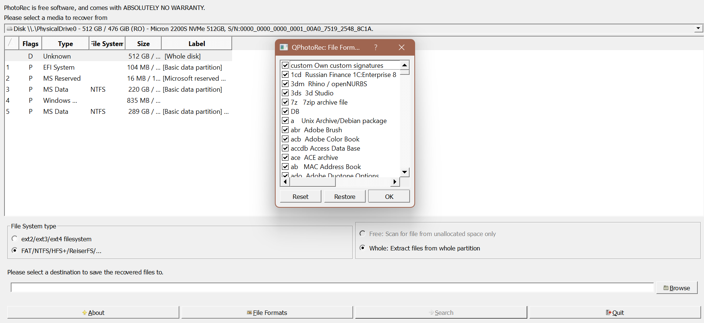

A great feature of PhotoRec is its GUI, as it shows a progress meter and a summary of recovered files. This keeps the examiner informed about progress and helps identify issues. If you see tons of obscure signatures, there might be something wrong. There are also third-party tools that optimize the results from PhotoRec. Instead of having all the outputs in one folder, for example, some extensions can make a folder for each file extension, or they can leverage EXIF metadata to organize pictures by date and much more. You can search for these tools on GitHub.

### The Curse of SSDs

Data recovery techniques in this section are operating-system- and file-system-based, meaning they are valid regardless of the hardware, but the hardware does affect the efficacy of these techniques. The clearest example is the impact of SSDs. They are being used more and more often, but their characteristics can lead to lower rates of data recovery success.

Wear Leveling:

SSDs can only withstand a limited number of writes before degrading to an unstable state. In some scenarios, only around 1,000 writes in the same location may be enough to wear it out, so wear leveling was introduced to help counter this negative effect. As file content is changed, it is frequently moved to a new location on the media to spread out the number of writes. This accelerates the overwriting of unallocated space and destroys forensic residue like file slack.

So let's think about what happens when a file is changed on the SSD: it doesn't necessarily stay in the same space it was in before the edit.

Drive Trimming or TRIM:

Modern operating systems have a feature designed specifically for SSDs called TRIM. Storage media doesn't know anything about the file system structure, like whether a sector is allocated or unallocated. This is an efficiency problem for SSDs because writes can only occur to prepared (erased) locations, but erasures must be done on large blocks. So there must be a way for an OS to inform the SSD so unused parts can be grouped for erasure, which is exactly what the TRIM command does. TRIM enables the OS to mark a sector as free for new data and then send the TRIM command to the SSD. After trimming, the SSD does not preserve the contents of that block in the same way an HDD would.

For forensics, this means you'll find fewer deleted files through metadata recovery and less unallocated space available for file/stream carving. You can find the same model of SSD with no unallocated space at all on one system and another SSD with plenty of unallocated space on another. You won't know until you look at the drive contents. Always try, because you're not sure what you can find.

## Stream Carving

There are two types of carving. The one we already covered is file carving, which is basically recovering intact files from memory or unallocated space. This works by scanning for a known file header and carving the data by predicting its length or until a footer is found.

Stream carving emerged as a capability after file carving. In some use cases, file carving can have a small success rate. The content of RAM is inherently fragmented, so it's rare to successfully carve large files from it. It's also difficult to recover complete copies of large files like databases from disk unallocated space because what are the chances that one or more of the clusters were reassigned to a new file since the file was deleted? To solve these issues, stream carving was brought to light. What it does is carve small fragments instead of the entire file. These fragments can have great meaning because they are parts of larger data files. For example, a browser database stored in SQLite might contain thousands of websites that were visited. When history is cleared, those now-unallocated database records could still be resident in memory or disk free space. Even if it's impossible to recover the original database, in some cases fragments have all the metadata needed to interpret them, including timestamps and source information.

Magnet Forensics Internet Evidence Finder (now `AXIOM`) was an early innovator in this area. AXIOM scours a hard drive or memory image for both fragments and full files that are common in forensic investigations, like data from chat clients, web browsers, cloud apps, and email clients. Fragments of those databases can be very helpful to an investigation. Fragments of data can be extracted from memory, unallocated space, and even existing files. For example, with the Windows Registry, deleted keys can be examined and extracted from a registry hive present on the system, but you need a tool to identify and extract those fragments. Unfortunately, this capability doesn't have many open-source tools to use.

Social Media

- Facebook Chat and Email
- Facebook Pages
- Instagram Posts and Pictures
- Twitter

Webmail Fragments

- Gmail
- Yahoo! Webmail
- ProtonMail
- Hushmail
- Outlook

Windows Operating System

- Event Logs
- Prefetch
- LNK Files
- Registry Data

Web History

- Search Terms
- Google Chrome Incognito Artifacts
- Microsoft Edge and IE InPrivate Sessions
- Firefox Private Browsing

### AXIOM

AXIOM is now a fully functional forensics suite for analyzing full disk images, mobile devices, and even memory images. It is built on the original foundations of stream carving. The predecessor to AXIOM was Internet Evidence Finder, one of the first true data stream-carving tools. Simply put, it extracts any fragments that might be useful. This is useful when searching for hard-to-find artifacts like chat sessions, webmail, and private browsing activity. All of these categories will likely be found on memory images, which are more difficult to examine.

One downside of stream carving is that it recovers data with little context. Sometimes user information or time information is not recovered. We should use the knowledge from carved information to help us and correlate it with other artifacts.

## String Searching

String searching is a very common technique and useful for a wide range of investigative efforts, like memory analysis, malware reverse engineering, and searching unallocated space of a disk image. Much of the evidence commonly looked for is represented as strings: IP addresses, domain names, filenames, internet communications, malware command-and-control packets, and even usernames and passwords. You can search everything from extracted memory page files to disk images.

`bstrings`, by Eric Zimmerman, provides a combination of string extraction and searching capabilities and is available for both Windows and Linux. It includes capabilities like simultaneous extraction of both ASCII and Unicode strings and the ability to perform in-depth searches. Searching can be done individually, using a file containing a list of searchable terms, or via regular expressions. One helpful feature is the built-in collection of common regular expressions like `{email, ipv4, ipv6, guid, urlUser}` and much more.

```bash title="bstrings commands"
bstrings -f file -m 8                  # Find all strings of length 8 or greater
bstrings -f file -s search_term        # Find all instances of "search_term"
bstrings -f file --lr ipv4             # Use a regex to find IPv4 addresses
```

Forensic suites often include the ability to pre-index evidence sources, extracting all strings into a keyword database that can be quickly searched. This is optimal for large data sets like disk images and facilitates examinations that require multiple searches. The downside to indexing is that it is heavy on time and disk space. Also, some strings are ignored for efficiency purposes.

String searching is one of the earliest and most basic discovery techniques in digital forensics, and it's not only for keyword strings but also for numerical and hex value searches. There are two approaches to string searching.

First, a direct bit-by-bit search using tools like `grep` and `bstrings`, or a hex editor, can be used to locate a specific term or value. This is the most complete method of searching. If an analyst is looking for something very specific and wants to be as thorough as possible, this is likely the method to use. However, if the term of interest is inside a compressed file like a Windows 10/11 pagefile, Outlook OSTs and PSTs, or even Office documents, then basic searching tools will be unable to find the term. For these files, we need to use forensic tools that know how to decompress the file prior to searching it. There are several tools that can do this, including most commercial suites. However, most tools only support a subset of compressed file types, so gaps are still possible.

Second, indexed search is common in major forensic software suites. It leverages technology like Apache Solr or dtSearch to create a comprehensive keyword index from processed images. After processing is completed, which takes some time, subsequent searches are very fast. The index essentially becomes a keyword search engine for the evidence files. One benefit of using forensic suites is that they are generally able to search inside some compressed file types while creating the index. The main downside is that indexing software has to make assumptions about what designates a string and where a string starts and ends. It may divide strings or treat common characters as spaces, which you might want to include in your string search. For example, if `@` is excluded from the index, searching for email addresses becomes more challenging. Most indexing engines allow this to be adjusted, and a workaround is using proximity searches.

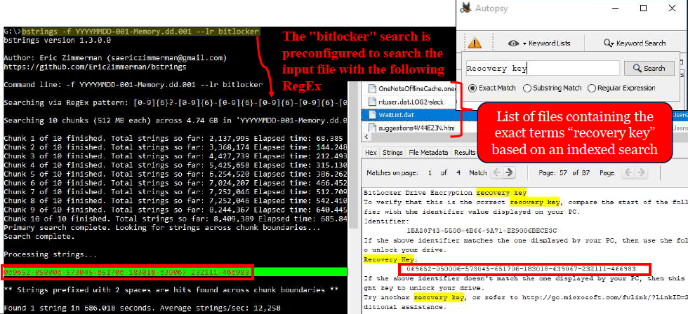

This is an example of using the two strategies. On the left, we can see `bstrings`, where we're searching a memory image for a BitLocker recovery key. After 10 minutes, the search is complete and finds a match.

On the right, we can see Autopsy using the indexing feature to search the whole disk image for the keyword `recovery key`. We had a lot of false positives, but one file had the exact data we're searching for.

## File Metadata

Most file formats maintain a set of metadata embedded within the file itself. This information can be valuable because it's hidden or forgotten about, and it's also more difficult to manipulate than other artifacts. It also follows the file wherever it's moved. This point can be useful when recovering files. We might be able to carve files from unallocated parts of a drive, but the data is often recovered without context like file-system timestamps. The timestamp within the file can help.

Imagine a situation where company information embedded in an MS Word file can prove the document originally came from a competitor and was stolen by a recent hire, or the embedded information guides investigators to a computer used by someone in some famous location, leading them to the person's true location. Metadata has helped with tons of real-life investigations.

ExifTool, by Phil Harvey, is a world-class open-source tool that is continuously updated and supports over 180 different application metadata formats.

Examining the metadata of a file is very easy. Once you mount your disk image, just browse to the folder containing the file of interest and drag and drop it into a terminal with ExifTool. Metadata available in documents varies by both the file type (PDF, PPTX, DOCX, etc.) and the application that created the document. The history of Microsoft Office has been interesting to watch as available metadata waxes and wanes according to the version. Older versions of MS Word, for example, had a "last print time" that was removed later.

```text title="ExifTool Metadata Output"
ExifTool Version Number         : 10.46
File Name                       : Design and evaluation of CO2 capture plants.docx
File Size                       : 19 kB
File Modification Date/Time     : 2018:09:06 12:16:47-06:00
File Access Date/Time           : 2018:09:06 12:16:47-06:00
File Creation Date/Time         : 2018:09:06 12:16:47-06:00
File Permissions                : rw-rw-rw-
File Type                       : DOCX
Template                        : Normal
Total Edit Time                 : 42 minutes
Pages                           : 1
Words                           : 218
Characters                      : 1243
Application                     : Microsoft Office Word
Doc Security                    : None
Lines                           : 10
Paragraphs                      : 2
Company                         : Stark Research Labs
Links Up To Date                : No
Characters With Spaces          : 1459
Shared Doc                      : No
Hyperlinks Changed              : No
App Version                     : 16.0000
Title                           : 
Subject                         : 
Creator                         : Maria Hill
Keywords                       : 
Description                    : 
Last Modified By               : Гидра
Revision Number                : 3
Create Date                     : 2018:07:17 90:17:002
Modify Date                     : 2018:99:06 15:17:002
ContentTypeId                   : 0X0101009FECE60E5A545B43A00381EBEC582F6C
```

The screenshot here shows metadata from a document made in Microsoft Office 365 (App Version 16.000). We can see some interesting information like the company name (Stark Research Labs), the total edit time (42 minutes), the number of revisions (`Revision Number = 3`), and the name of the document creator (Maria Hill).

If we look closely, we can see even more information. The `Last Modified By` field is different from the author, and it looks like someone using the Cyrillic language pack made modifications. We know this because Word keeps embedded `Create Date` and `Modify Date` metadata. These timestamps move along with the file. In some cases, an attacker might copy the document to their system, modify it, and then save it back into the network. We can also see that the `Modify Date` is 3 hours before the `File Creation Date/Time`. This is an interesting clue because the embedded timestamps are in UTC. This means that the file may have existed and been modified elsewhere before being newly created on a different system 3 hours later.

Using ExifTool from the command line is simple, like this, and we can even use the `-r` argument to make it run recursively and `-csv` to select the output format.

```bash
exiftool.exe <filename> > output.txt
exiftool.exe -csv -r <folder> > output.csv
```

We all know that images also include metadata, like GPS coordinates. Mobile devices and digital cameras have been embedding this information for years. Historically, some devices had this capability enabled by default, but because of privacy issues, most devices now require it to be user-enabled. A huge number of users turn on location-based options on their devices. They might be on vacation and want photos to be automatically tagged online when uploaded. Then the trip passes and the user forgets this setting was enabled in the first place, and now all their photos have GPS coordinates. Some social media platforms have historically kept photo metadata present and available for subsequent downloads. Twitter used to do this, and the photo-sharing site Flickr is one example where photo metadata is saved.

The name Exif comes from the image-file standard and stands for Exchangeable Image File Format. In images, you can find data like the camera model, camera settings, copyright information (including the owner's name in some cases), dates and times, and information about post-processing software. Sometimes you can even find a thumbnail image of the original photo. The last two items can become handy in cases of image manipulation. Most of the time, the most exciting information is the GPS coordinates.

It's important to understand that embedded metadata can be manipulated. In fact, ExifTool itself has an option to change or remove metadata. There are other attacks, including changing the device location or spoofing GPS signals to fool apps. When performing your investigation, you should consider whether the subject of the investigation has the knowledge, skills, and motive to manipulate metadata. Is there any evidence that would lead you to believe manipulation could have occurred? Do you see browser searches indicating an interest? Do you see tools executed or installed/uninstalled apps with the capability to change metadata? We should trust our findings, but not rely on a single piece of evidence. Instead, we should layer evidence from multiple sources to form a strong conclusion.


**الحمد لله done**

