# Sec 504 book1

incidence’s happens every where and you cant possibly be 100% your safe , the question isn't if you will get compromised  but when , the main ai is to reduce the time need ed to detect an incident ,

incident handling: is all the non-technical aspects , coordination with other departments , creating a command structure.  

while incident response: consider all the technical aspects.

## Example:

lets start by an incidence example: the victim is Argous corporation , the threat actor is green penguin.

to start lets under stand the Argous corporation network is consists of domain controller server  , file server , and a data base server and a hundred user users work station all of that is behind its fire wall, and anther CRM web app.  

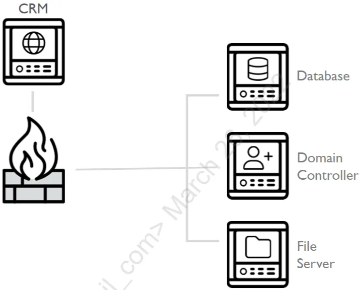

the information security team found odd traffic to port 4444 from on the CRM server , then after investigation they found office_remoter.exe active connection on port 4444 so they killed this process and also found Office_Techneter.exe and also killed it after it suspiciously connected to port 443 , then seeing no odd traffic they told the system admins that the CRM server is now ready to go.

lets take a look form the threat actor POV 

Green penguin ran a scan against the CRM web app , and found all about the whole network , they did not try to be stealthy in any way ,they just used a vpn , though the scans created a ton of alerts in the firewall.

mistakes #1 network admins ignored the generated alerts 

mistakes #2 no threat intelligence , about the ip’s so is was counted as random

then scanning the CRM app Green penguin found remote file inclusion (RFI) and command injection,  they uploaded a php backdoor and ran it.

mistakes #3 Argous had a pen-test done but chose to ignore these viabilities.

 

then Green penguin installed a proxy to forward all the traffic of port 4444 to the internal network bypassing the firewall , and installing the tool Office_Remoter.exe .

mistakes #4 there was no internal monitoring in the network , as the it team felt good fire was just enough 

now that they have access to the hosts behind the firewall they found some hashed passwords and usernames in the database , which weas easily cracked , and most of them was reuse ,among the cracked credential was the database admin.

mistakes #5 easily creaked passwords , and reusing them.

after some more reconnaissance they found a local account across all hosts with the name AssetMgtAcct , they used the database to extract the NT hash from memory and cracked the bass word offline though this took serval days , it paid off when they had admin access to all the machines , after some privilege escalation they had access to the Argous Corporation domain controller, installing malwares along every step  to remain precipitance. 

mistakes #6 admin password was the same across all systems 

mistakes #7 no alerts was triggered when installing any malware 

then Green Penguin installed the Office_Techneter.exe  , even after the incident responders killed the 2 process they still maintained persistence , all over the other systems 

mistakes #8 the victim did not check for other ioc’s on the network , missing the other compromised systems.

## PICERL model:

many organization's follow the PICERL model

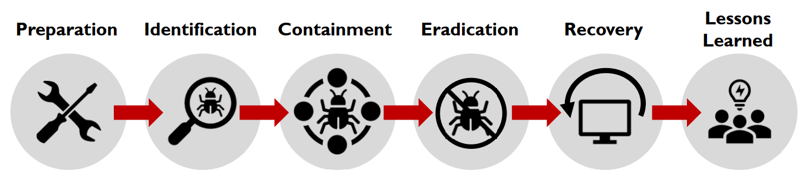

### preparation:

 all the things an organization should  do before any incident , policy , procedure , internal mentoring ,…

### Identification:

 you cant respond without identifying the danger , this can happen in many forms a help disk calls , an alert from and ids , aka detection.

### Contamination:

the compromised system must be contained to prevent any further spreading , may be divided into two steps short team then evidence collection then long term more invasive , but after evidence collection .

### Eradication:

undoing the damage caused by the thread actor killing process changing passwords,…

### Recovery:

the steps tacked to get  your business back to running like normal 

### Lessons learned:

the last step where the report is written and the venerability used are fixed.

downsides:

though  PICERL  is implemented in many companies, but most of its down siders are not in theory but it’s visible when executed.

so start preparation , most comes fail to meet the basic security measures , also an absent in mentoring network ,hosts ,… and finally they don't implement threat intelligence as effective as it should be.

in indemnification most just identify some of the incident , limiting the scope only to hosts whom they know are compromised , which they should at least  make a full scan .

failure to contain an incidence , or wrong containment can kill vital evidence , making understanding the incidence  much more harder , and allowing  the threat actor to maintain persistence. 

during lessons learned is not identifying/ fixing the core problem , what happened and how to fix it form the root .

the biggest weakness is how this approach is linear.

## Dynamic Approach to Incident Response (DAIR):

there is no recipe for incident response , multiple event happens at once the linear method cant do well here , so instead of thinking about it as steps , thing of it as waypoint or outcomes.  

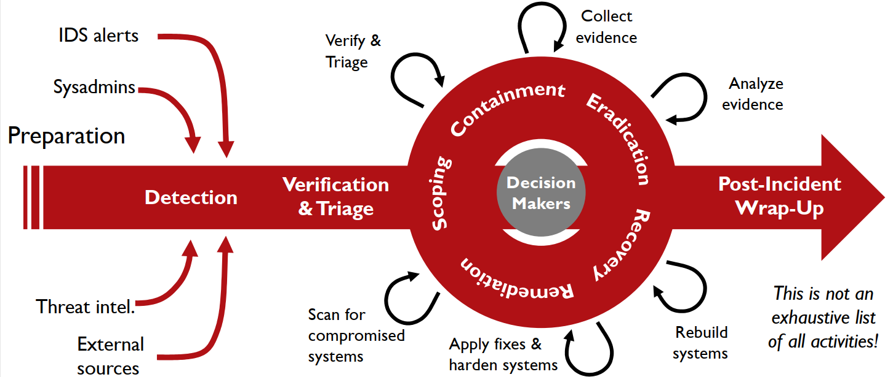

preparation, detection, verification are way points to detect an incidence you have to verify it first, but y want stop  every thing because of an incident.

once detected  you’ll have to verify it , then some initial triage , to help us know what to do next.

then well need to try and meet the waypoint inside the circle , which can be achieved by making the activates in the out side. how do you know what to do next , well that depends on the evidence you have and what do you want to achieve.

at last you’ll have to move away from an incident and apply lessons learned.

### Preparation:

to sum up this step , know what you defending , what are the critical assets you are looking for , internal visibility is key 
internal visibility is key to know every thing in your domain, network or host that a debate , both have pros and  cons , even though you will need both . and they need to be reviewed what use are collected logs when no one is looking at them, and recovery plans too backups  and procedures, and preparing the IR team itself.  

### Detection:

Network: monitored by firewalls  IDS IPS , , logs are generated from routers , this give us the earliest warning, host: monitor the host system or apps , antivirus, file integrity checkers , end point security happens here, admins and users noticing some odd behavior , threat intelligence ,and the least wanted 3rd parties.  

the first thing to do is verification , once verified start triaging , to know what to do next and how much time and recourses you’ll pour into this incident 

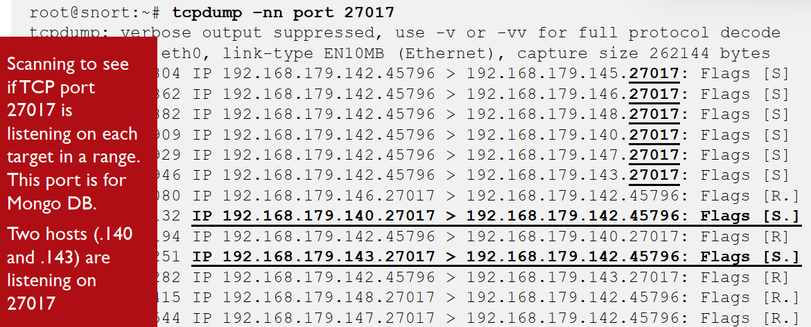

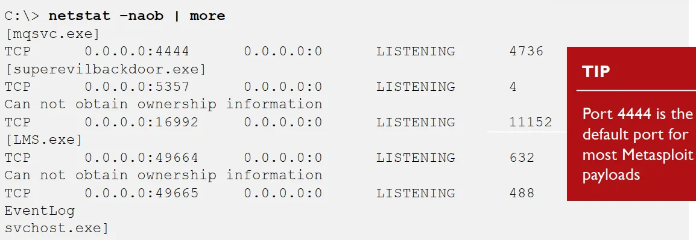

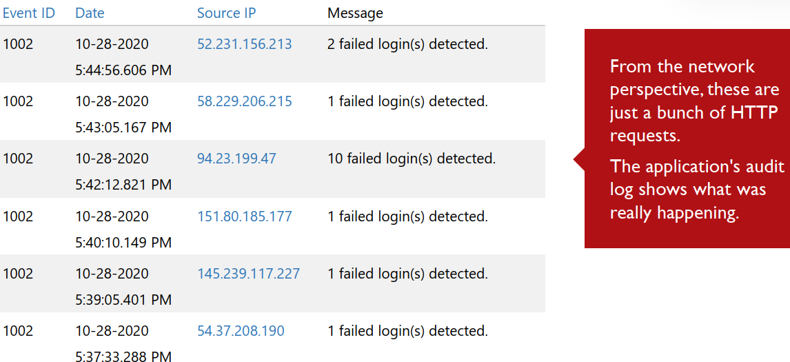

here we have all the types of log , in network we see two hosts interacting through port 27017 mango-bd some suspicious handshakes are going in here so i may be custom packet and the ip is from an internal host with admin , 

in the  host logs we see the process superevilbackdoor.exe making the connection to port 4444 which is the default of most Metasploit payloads.

and the app logs shows it was a password-guessing attacks , we see how important are tis app logs as the http was just showing http logs here we know exactly what they are.

### Scoping:

lateral movement means how the attacker makes his moves inside the system once passing the firewall , there are many ways to do thing and many to make it look legit , scoping is essential to know where the attacker is , scoping can change as the incident progress any scan can show new IOC’s , like systems that was not knowing for being comprised , or false positive, when running ana make sure that you goo all out , use any and every tool you have , and you can go even further by making your own scripts.

### Velociraptor:

is a large scale incident response software , it uses client endpoint software to collect and report info across all operating systems.

agent can be run as a service , background task ,scheduled intervals and offline mood , its asynchronous server can request info and the host send it whenever its online. server supports filebasedatastore , or MySQL database backend. used to collect any needed data , using remote virtual file system , registry data, and running remote commands on any system.

### Containment:

our aim now it to stop the threat actor from doing any actions at all , lateral movement and persisting in an environment are not uncommon, failure to perform proper scoping leads to improper containment. Examples of containment are :isolating a system physically or from the network , pathing systems ,removing backdoor’s.

so activates done here can help with the next step like eradication , this shows how to think of the activates as outcomes not just liner phases , some times containment must be broken into multiple stages like business availability over perfection , or to collect evidence from the original state.

### Eradication:

undoing what the threat actor have done , it differs from containment as containment stops the treat actor from operating , Eradication remove what they did. some examples are: restoring the system from backups , removing backdoors, … some of the activates here can help with the next stages like recovery.

### Recovery:

containment and eradication both focus on non-business aspects , but business is the key to decisions , recovery solo aim is to business impact on an incidence.

the best cost effective way to restore a compromised system is to rebuild it , because you cant know if the attack hid a back door in a place that you did not look at , so its just better to start all over gain , if you cant keep a system offline while rebuilding it , u can short term  Containment kill process, change passwords… this can buy you some more time while your replace it. try restoring a system during off times as it will help you monitor it better as there will be less network traffic.

### Remediation:

fixing the root of the incidence , short term are considered containment , don't blame the system admin for using  weak password but ask your self  why and how is there a weak password, after systems are back online you should monitor them closely to make sure the threat actor's don’t return.

### Post-Incident:

when the incident is moving toward closer , you’ll need to make a final incident report , there are a lot of reports that are done like the public breach reports , it shows what happened but briefly so the general public understands it , 
and the post-incident final developed by an incident responder have e more technical and detailed info.

the best time to ask for any upgrades in any thing security related , is after an incident occurs , so they are in the heat of it , to reduce the fading effect you should schedule  a follow up meting to discuses what have you done and any new findings 

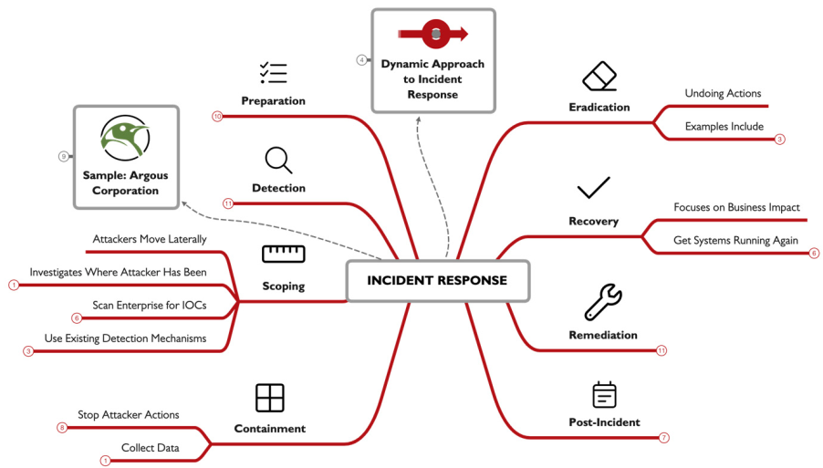

## Digital Investigation:

### investigation:

examination of evidence to answer questions, examining specific evidence can yelled specific answers , which help in answering high level questions. there are some factors that can effect your investigation like type of incident your dealing with , recourses like time and evidence provided , and the aim is it for business recovery or for threat intel .

### Notes:

its essential during any  incident. cuz  they help you remember what you found , when and where, notes will be the base of other documentation you’ll make. they let you know when your going too fast **if you are typing too fast to take notes, you are just going too fast altogether.** your document in the hands of some one with similar knowledge, skill, and background should dop what you did. what you write is your reasonability so don't be bias , or any thing that can make you look unprofessional.  

### Data Reduction:

you cant analyze every single file so you should do some filtration, common techniques can be; ignore good file hashes , highlight flagged malicious files , use tool-specific filtration, incident-specific knowledge to focus in artifacts

### Encoded Data:

its common to see different types of encoding during your investigation , things like base64 URL UTF-8 or 16. [CyberChef](https://cyberchef.io) is a fantastic tool m you will be using a lot as an incident responder , you enter the input drag and drop an operation , click bake and boom your done the output is here. 

### Pivoting:

its common to go in different paths when your investigating , some may help you , and others may be false leads , in investigation pivoting means using a piece of data as a lead , like knowing an Ip and then using it to get the process name , use this pid to search for childe process that involved in the incident.

your Pivoting when your investigating an example is; Examine a suspect system, Find IOC’s, Scan for other systems that might be infected, Examine new system, for a new IOC, Repeat. its a strategy not a step of a phase , so its limited to a time or anything.

### Timeline:

its a common element that should be found in any investigation, because knowing the when helps tremendously, its a simple list of events in chronological order. 

you may face a problem if evidence don't have timestamp info , but you should be able to correlate it with the data you have, also you may face clock skew , you can calculate it manual or configure and use NTP. 

also time zone information are important , wither its there or not depends on source of evidence and the tool used in collection , so make sure you know your tools, take in note the daylight saving.

### Artifact Timelines:

it comes directly from the evidence , often its metadata , you’ll find the timestamps from data in the memory , file systems , operating systems,… low level 

### Event Timelines:

entries are single events not an individual artifact, the event time line is formed upon patterns and groups of timestamps from the same evidence. high level 

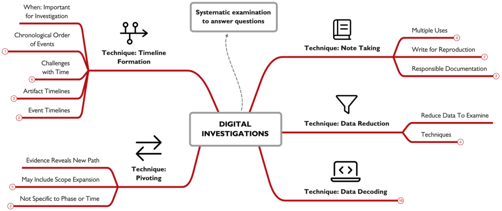

## Live Examination:

how to find if the treat actor is present if you don't know he's there. some might suggest watching over the network but the threat actor can easily blend in legitimate traffic or even encrypt the packets.

### Examining Processes:

you can use taskmanger or the `tasklis`command , also there is `Wmic`its a cmd tool , but is was remover as it was considered a lolbin.

### Identifying Suspicious Processes:

how to know if a process is SUS , most of the time it will depend on experience but here is the most famous indicators you can take into consideration , is this process new to the system , dose its name look random , dose it have a legit name but runs from an unknown location , is it a child of a Suspicious Process , dose it use any encoding. 

### Network Usage:

using the `netstat`command `-na` shows listening and active TCP and UDP ports , add `-n` it runs every n seconds,     `-o`shower the owner process id  , `-b`shows the exe using the port and the dll loaded ,                                               `netsh advfirewall show currentprofile`  shows personal firewall settings 

### Suspicious Network Activity:

any network activity that abnormal for an associated process , like note pad making connections , can be an update , and can be malicious , abnormal network activity , like in non business hours , a fixed activity at fixed times , traffic from known malicious hosts .

### Services:

`services.msc` shows various services and their status,  `net start`list of running services, `sc query | more` detail on the status of each service, `tasklist /svc`  which services are running out of each process on your system.

### Registry:

the AutoStart Extensibility Points (ASEPs)  keys are a very important set of keys that can be used maliciously ,the most common keys are  `HKLM - HKCU  \Software\Microsoft\Windows\CurrentVersion\Run - RunOnce - RunOnceEx` . you can view them with a gui like registry editor , or a cli tool like `reg query ....` and you enter the key you want. autoruns.exe is a great tool created by Microsoft that we can use. 

### Accounts:

investigating local accounts is a crucial step we can do that by using the `lusrmgr` GUI tool , or by using the command `net user` to should the local users , or use `net localgroup`  to list groups on the system , or append a user group on like so `net localgroup administrators` to show the group members.

### Scheduled Tasks:

you need to know what tasks are scheduled on the system , we can use the Task Scheduler app to look at the tasks we have on the systems and keep a heads up for tasks with admin SYSTEM or blank privilege , we can also use `AT` command (not available on win11), `schtasks` is anther command we can use.

### Log Entries:

we can use the Event Viewer app to look at the anomalous events, like a massage saying event log service was stopped , or file integrity disabled , new user or group created , many failed login attempts. we can also run a command like this `wevtutil qe security` , to show us the security events , or a PowerShell command like this `Get-EventLog -LogName Security | Format-List -Property *`.

### Additional Tools:

Sysinternals suite are a great sum of tools we can use and here are so of them  ,Process Explorer: gives much datils about running process , process monitor: shows file system, registry, network and process activity in real time, TCPview list udp and tcp ports and what happening with them , autoruns: shows auto run apps , Sysmon: logs detailed information that can come i handy at all given time , Procdump: capture memory of running process. 

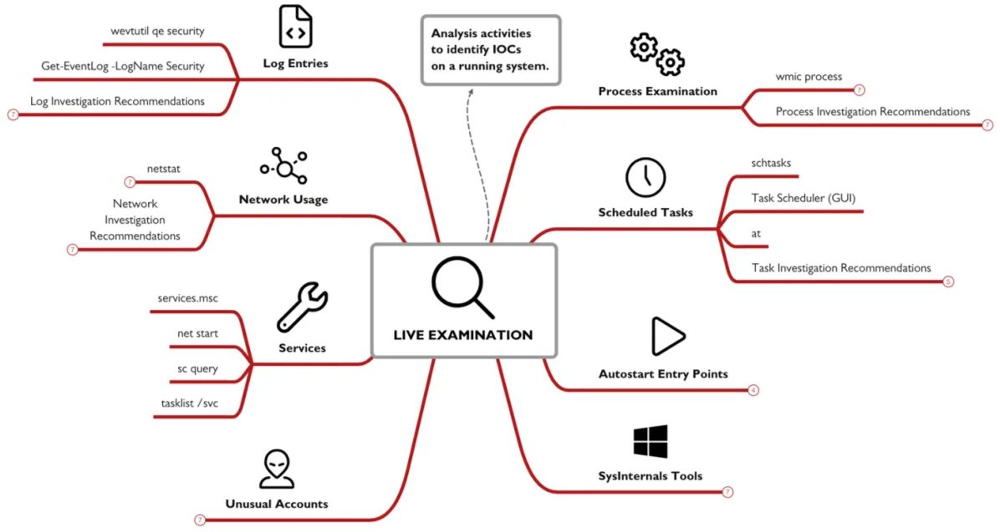

## Network Investigations:

network traffic can provide venerable insights into what happened , there are 2 main categories of logs the row network traffic and the logs created from network devices like firewall logs for example, but there are some issues with network logs , accessibility as not every device logs data in a user friendly format , and some times it may not even be exported , fidelity as not every source have to contain a the details you need for every packet so data may be limited, and encryption this can limit what you can do with the data you have.

### Packet Captures:

full captures are considered a gold mine as they provide the lowest view of  a network data, but there are some limitations to it they are large , overwhelming and often encrypted , the 2 most common formats are pcap which is an older version with limited capabilities , and pcapng which provides some more advanced options.

### tcpdump:

one of the popular tools used in capturing and filter packets , it offers basic protocol analysis. some useful commands `tcpdump -i interface` capture traffic in the specified interface , `tcpdump -i vmnet42 -w output.pcap`   w for writing the capture data into a file , you can use the `-r`  option to read the file , you can follow it by `-nn` to not resolve ip and ports , `-A` to show ascii data. 

### Berkley Packet Filters:

yo have 3 qualifiers  type: host, net, port, direction: like src, dst, and protocol like ip, tcp, udp, icmp,… you can use operators like  (and, &&), (or, ||), and (not, !), you can add {} to have it priority evaluated. 

### Web Proxies:

used in companies to cash data and reduce internet usage , filtering sites , proxy logs are valuable as they can help you build a portfolio about user activity and help you spot suspicious traffic 

### Access Logs:

they record individual request sent , end each contain Timestamp, Duration, Client, Result Codes, Size, HTTP Method,  URL, User, Hierarchy Code, Content Type.

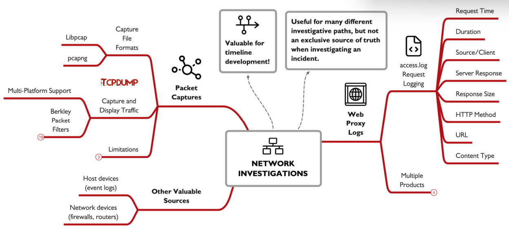

## Memory Investigations:

here we investigate images of the RAM, as it contains some variable information that can not be found else where, to collect memory images we use a tool called WinPmem which collects memory images for us.  

### Volatility:

a python framework foe memory analysis , first relapsed on 2007 , has 2 major versions, V2 the stable one and V3 the beta.

### Usage:

we’ll focus on V2 here the main interface is the vol.py file , the `-f` points to the file we’ll investigate the `--profile` points to the operating system used in the analysis , you can acquire it previously like using the `ver`or `systeminfo` , on the live system , or use the `imageinfo` on Volatility to get the closest versions , options withe 2 dashes - - are called long options as they require an argument. volatility have some major plugins that are useful to get them all you can use the `--info` argument.

### Plugins:

we can use the `pslist` plugin to list the process in the memory , it lists the PID p-name ,PPID , start and some time end time , `pstree` this list all process in a  child parent relationship , showing almost the same data as the last plugin. the `netsacn` can the memory  for data related to networking it outputs every connection made with the corresponding process related to it . the `userassist` plugin lists any apps that was ran from the GUI it shows the count , location , first time and last time used, you can also use the `hivelist` and the `printkey` if you want to investigate the registries . `cmdline` this shows the process id and the command line for this process.

### Applying Mem Investigation:

it all start withe an event of interest EOI , yo start by pulling a thread , withe very little info then you use the plugins to try and get more and more info.

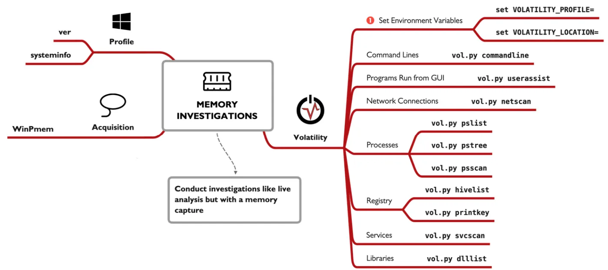

## Malware Investigations:

we can find a suspicious looking file but how do we know for sure its a malware  and how can we extract indictors out of it , the two basic approaches to analyze a malware are to first monitor a malware in an environment and see what it dose , the second approach is to look at the malware code using things like disassemblers and debuggers.

### Online Analysis:

a site like virustotal, helps with analyzing suspicious files , as it runs against mutable antivirus software's ,  Hybrid Analysis on the other hand uploads you file and run it in virtual machine and records the behavior , in virus total you cant run private analysis , while in Hybrid Analysis you can but it will COST you. 

**Good Hygiene:** to start analyzing any malware you should first prepare an environment  a secured one , maybe a vm with only host only network connection , disabling shared folders , and clipboards , and transferring data using usb.

### Basic Attributes:

some basics you need to know , getting a file has you can do it using `certutil -hashfile file MD5` and replace the MD5 with any algorithm you want , there is a PowerShell command also you can sue it , in Unix its just `md5sum` , also using the `strings` command so get printable data from any file. 

### Environment Monitoring:

you need to monitor your environment to know exactly what the sample did to it , the basics steps are preparing the tools  and sample , then take a clean snapshot , once ready start the monitoring tool , run you malware , interact with it , then kill it , pause the monitoring , review the results.

there is 2 main types **Snapshot:** take a snap shot before and after you run a malware and see the difference **, Continuous:** here you monitor every thing step by stem what exactly the malware dose , an advantage of Continuous reporting is it give you so much more data , if a malware creates then deletes a file  continuous will capture it but snapshot will not , but unlike the snapshot the amount of data generated can be overwilling. 

### Regshot:

is an  example of snapshot reporting , this tool will record the registry and selected file systems in two points of time , which gives you a summer of what happened. 

here's how to use it , start and configure the app you can select the scan dir option to scan for file system , get your sample ready , then take the 1st shot , run the malware interact with it after your done kill it and take the 2nd shot , once done click compare and you’ll see the output. it will show files , or registry changed or deleted or created. 

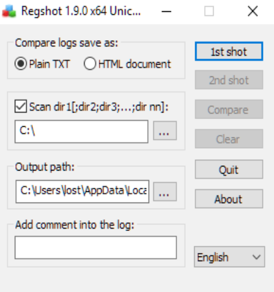

### Process Monitor:

this tool monitors registry, file system, network, process activity and events , you can filter any of the 5 mentioned categories , you can filter even further , it produces a lot of useful information you can use , you can filter further under the tools tab then you have the summary tab  5 summaries for each categories. 

### Process Tree:

a tool within process monitor that list all process that the system ran even if it was closed , with showing all the datils about the start /end time ,command line , location and much more 

Analyzing Code: tools like IDA pro and Ghidra , where you need to know reverse engineering and some fundamentals in the programing language used by the malware. **Check out FOR610, SEC660 and SEC760 for more** 

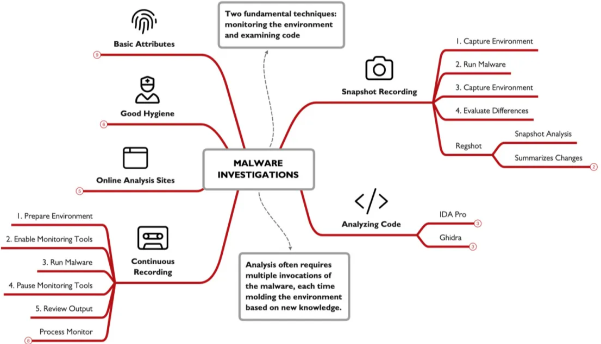

## Cloud Investigations:

cloud forensics are  in a way simpler to the techniques already covered , how ever the tools are different.

### Cloud Attacker and Defender:

attackers can easily replicate a target environment to explore variabilities , and all the ways you can go around the system making you more prepared and knowing exactly what your facing and how to deal with it , also insider network access by lunching a nod in the same provider some times you can bypass network filtration rules , lasty attack can benefit from admins misunderstanding in security or cloud make it easier for them. 

for defenders assets management is a plus in cloud making the defenders know what happening in there system ,programmatic access make you have full visibility over the platform system and account , easily imaging and cloning as the time is decreased here unlike live systems.

### Security Responsibility:

all providers  work with the shared responsibility model , as you have a part in security and they have a part in security ,  Cloud services are often categorized as Infrastructure as a Service (IaaS), Platform as a Service (PaaS), and Software as a Service (SaaS). each one proving the user with control to a level IaaS providing the most low level cloud functionality , PaaS mid and SaaS high. with decreasing security reasonability on your end  the higher you get.

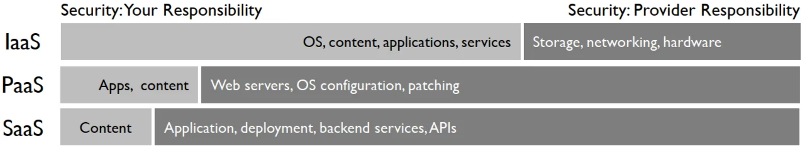

another thing is like the amazon  EC2 , which amazon security include only the hardware beyond that the os and so its all your responsibility.

### Preparation:

conducting IR on a local machine can be hard and costly in time from downloading the data from the cloud then importing them into the IR environment , so instead the most common practice is gating a cloud based IR system which include every thing you’ll need , just consider putting this into anther account so the attacker can access this system as if he did all your IR activates will be visible to him and he can temper with them. 

**Configuring Logging:** a logging system in essential to log every aspect in the system than can help you later.

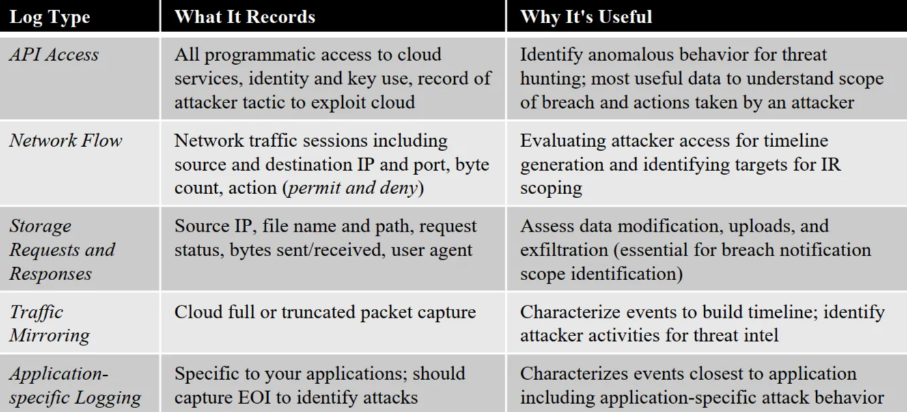

### Detection:

**Cloud Analysis Tools:** after setting up the logging we start the detection and threat hunting , its better to use the tools recommended by the cloud provider and use some manual analysis to deeper understand. Microsoft Azure, Amazon AWS, and Google Cloud each one provides its own unique tools , all are rapidly changing and improving just like the cloud tech is , a second option is using the cloud provider SIEM solution , they will provide variable info.

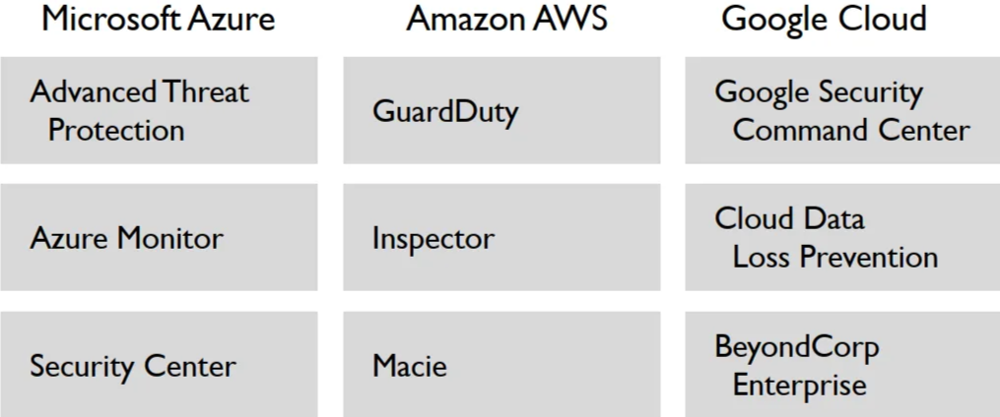

### Containment:

cloud improves this step by the following you can easily remove the system form production , isolate it just by editing a security group option or by putting t it on a virtual private cloud , preventing instance from being accidentally terminated so volatile data don't get lost by activating termination protection , use the cloud provider snapshot tool to clone it easily , marking it as under investigation so no one change or try to access it.

### Cloning:

one of the biggest advantage of cloud over normal systems ,is how quickly you can duplicate a system or create an image , this image can be used to replication, exporting . it may require you to shutdown the system to guarantee disk integrity during cloning, so you should always create a memory image using WinPmem for windows  or AVML in Linux. 

### Data Collection:

after taking an image you can export the data you want a block storage for later analysis , use this command  `aws ec2 describe-volumes | jq -r '.Volumes[] | select (.AvailabilityZone | contains("us-east-1") ) | .VolumeId'` to list available block storage this act as a cloud USB yo u can use , then use this command `aws ec2 attach-volume --volume-id vol-0c0d039aeaa4c9b58 --instance-id i-044cd28257a5b6811 --device /dev/sdh` to attach the block to the system , in windows the storage will show automatically in Linux you’ll need to mound it manually.

### Analysis:

the provider logging tools format is not always user Findley maybe a one line log , or in a JSON or XML , this make it harder to analyze data out of the provider analysis tool , but fortunately there are some tool you can sue that will help you like come PowerShell commands like `Get-EventLog` and `Get-WinEvent` or the CMDtools like `wevtutil`, or evet 3rd parties tools like `s3logparse` or `vpc-flow-log-analysis` .

### Response:

most cloud incident involve an access key, either compromised or maliciously created , so we must be familiar with tools to investigate this , the providers provide an Identity and Access Management , that can help us mange the access keys.

### Recovery:

with snapshots and backups being easier in the cloud we can quickly restore a system inro production , just before doing this make suer you fix the root of the problem , review all access mechanisms make suer 2fa is enabled verify the policy and privilege control , you can increase the logging and monitoring in a machine after recovery just to make suer the attacker did not gain access again.  

### Additional Considerations:

make sure the developers and DevOps team don't restart the system to fix a “bug” , as this kill the volatile data we have , conducting IR in the cloud is better but costly  so make sure your organization is aware , access to cloud support channels , this can be cost but its useful in IR, conduct a tabletop exercises  walk through on how the incident response happens in the cloud , so all know what to do.

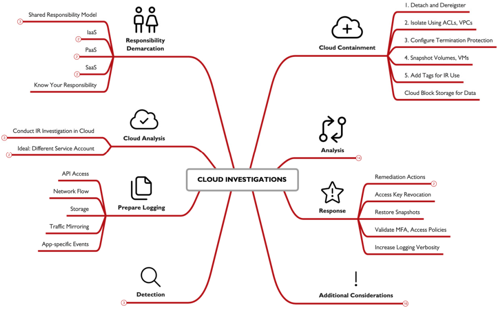

**تم بحمدالله**