Incidents happen everywhere and you can't possibly be 100% safe. The question isn't *if* you will get compromised, but *when*. The main aim is to reduce the time needed to detect an incident.

**Incident Handling:** All the non-technical aspects — coordination with other departments, creating a command structure.

**Incident Response:** All the technical aspects of dealing with an incident.

---

## Example: The Argous Corporation Breach


Let's walk through a real-world style incident. The victim is **Argous Corporation**, and the threat actor is **Green Penguin**.

Argous Corporation's network consists of a domain controller, a file server, a database server, and roughly a hundred user workstations — all behind a firewall — plus an external CRM web application.

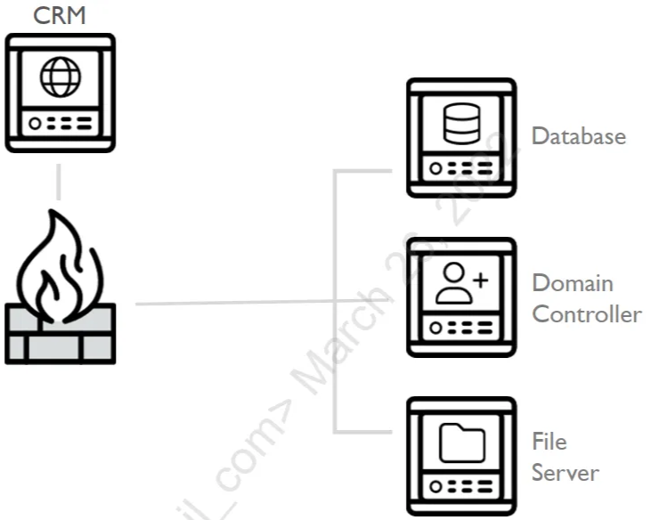

The information security team noticed odd traffic to port `4444` from the CRM server. After investigation, they found `office_remoter.exe` maintaining an active connection on port `4444`, so they killed the process. They also found `Office_Techneter.exe` suspiciously connecting to port `443` and killed that too. Seeing no further odd traffic, they told the system admins the CRM server was ready to go.

Now let's look at it from Green Penguin's perspective.

Green Penguin ran a scan against the CRM web app and mapped out the entire network. They made no effort to be stealthy — they just used a VPN — though the scans generated a flood of alerts in the firewall.

:::warning[Mistake \#1]
Network admins ignored the generated firewall alerts.
:::

:::warning[Mistake \#2]
No threat intelligence on the scanning IPs, so they were dismissed as random noise.
:::

Scanning the CRM app, Green Penguin found a **Remote File Inclusion (RFI)** vulnerability and a **command injection** flaw. They uploaded a PHP backdoor and executed it.

:::warning[Mistake \#3]
Argous had a penetration test done but chose to ignore the findings.
:::

Green Penguin then installed a proxy to forward all traffic on port `4444` to the internal network, bypassing the firewall entirely, and installed `Office_Remoter.exe`.

:::warning[Mistake \#4]
No internal network monitoring — the IT team felt the firewall was enough.
:::

With access to hosts behind the firewall, Green Penguin found hashed passwords and usernames in the database. Most were easily cracked, and many were reused. Among the cracked credentials was the database administrator account.

:::warning[Mistake \#5]
Weak, easily cracked passwords — and widespread password reuse.
:::

After more reconnaissance, they found a local account named `AssetMgtAcct` present across all hosts. They extracted the NT hash from memory using the database and cracked it offline. Though it took several days, it paid off — they now had admin access to every machine. After privilege escalation, they reached the Argous Corporation domain controller, installing malware along every step to maintain persistence.

:::warning[Mistake \#6]
The admin password was the same across all systems.
:::

:::warning[Mistake \#7]
No alerts were triggered when malware was installed.
:::

Even after the incident responders killed the two processes, Green Penguin still maintained persistence across all other compromised systems through `Office_Techneter.exe`.

:::warning[Mistake \#8]
The victim didn't check for other IOCs across the network, missing all other compromised systems.
:::

---

## The PICERL Model

Many organizations follow the **PICERL** model for incident response.

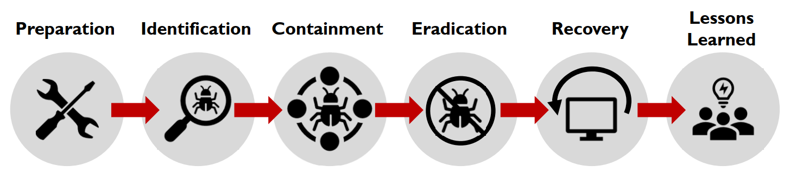

### Preparation

Everything an organization should do *before* any incident — policies, procedures, internal monitoring, etc.

### Identification

You can't respond without identifying the danger first. Detection can come in many forms: a helpdesk call, an alert from an IDS/IPS, unusual traffic patterns, and so on.

### Containment

The compromised system must be contained to prevent further spreading. This is often divided into stages:

1. **Short-term containment** — quick isolation to stop the bleeding.
2. **Evidence collection** — capture forensic data before making invasive changes.
3. **Long-term containment** — more thorough measures after evidence is secured.

### Eradication

Undoing the damage caused by the threat actor — killing malicious processes, changing passwords, removing backdoors, etc.

### Recovery

The steps taken to get your business back to running normally.

### Lessons Learned

The final step — a report is written, root causes are identified, and vulnerabilities are fixed.

---

### PICERL Downsides

While PICERL is widely implemented, its weaknesses become visible in execution:

- **Preparation failures:** Most companies fail to meet basic security measures, lack internal monitoring, and don't implement threat intelligence effectively.
- **Identification failures:** Teams often only identify part of the incident, limiting scope to known compromised hosts rather than scanning broadly.
- **Containment failures:** Wrong or rushed containment can destroy vital evidence and may allow the threat actor to maintain persistence.
- **Lessons Learned failures:** Teams often fail to identify and fix the *root cause* — focusing on symptoms rather than the underlying problem.

:::caution
The biggest structural weakness of PICERL is that **it's linear** — real incidents aren't.
:::

---

## Dynamic Approach to Incident Response (DAIR)

There's no recipe for incident response. Multiple events happen simultaneously, and a linear model breaks down. Instead of thinking about phases as steps, think of them as **waypoints** or **outcomes**.

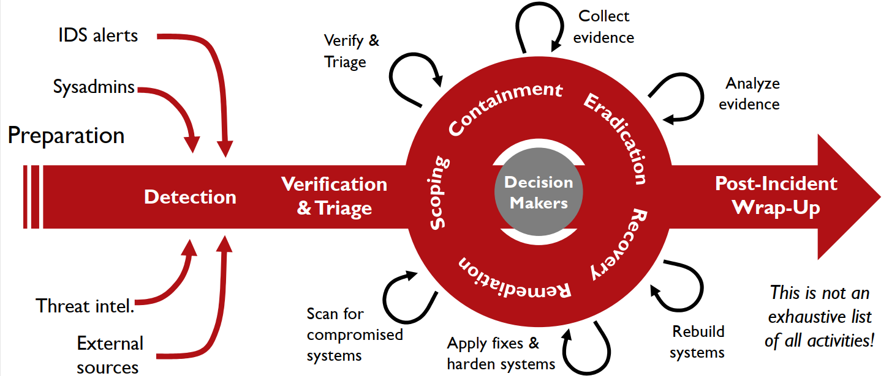

**Preparation → Detection → Verification** are waypoints. You don't stop everything when an incident occurs — you verify it first, then triage, then decide what actions are needed based on the evidence you have.

The goal is to work toward the outcomes inside the cycle by performing the appropriate activities based on what the evidence tells you. At the end, you step away from the incident and apply lessons learned.

---

### Preparation

Know what you're defending. Identify your critical assets. **Internal visibility is key** — you need to know everything happening in your domain, whether that's network-level or host-level visibility (both have pros and cons, and you'll need both).

:::tip
Collected logs are useless if nobody reviews them. Preparation also includes recovery plans, backups, procedures, and preparing the IR team itself.
:::

### Detection

Detection sources include:

- **Network:** Firewalls, IDS/IPS, router logs — these give the earliest warning.
- **Host:** Antivirus, file integrity checkers, endpoint security, system logs.
- **Human:** Admins and users noticing odd behavior.
- **Threat Intelligence:** External feeds correlating known-bad indicators.
- **Third Parties:** The least desirable way to find out, but it happens.

Once a potential incident is detected, the first step is **verification**, followed by **triage** to determine how many resources to allocate.

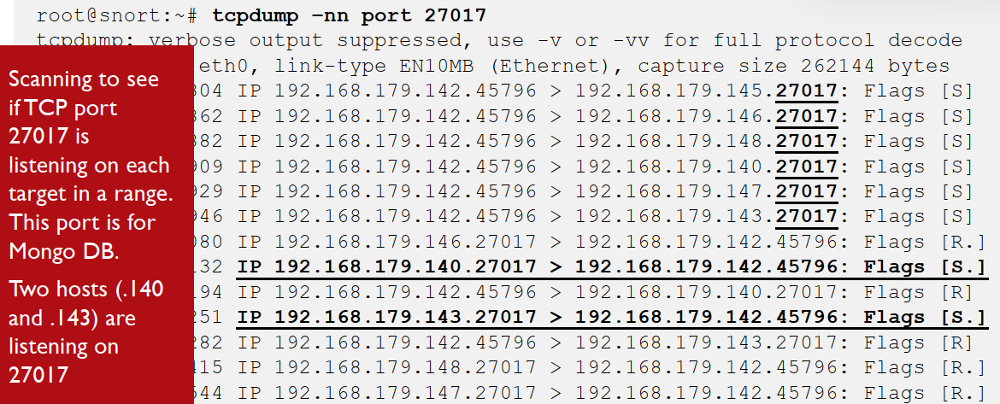

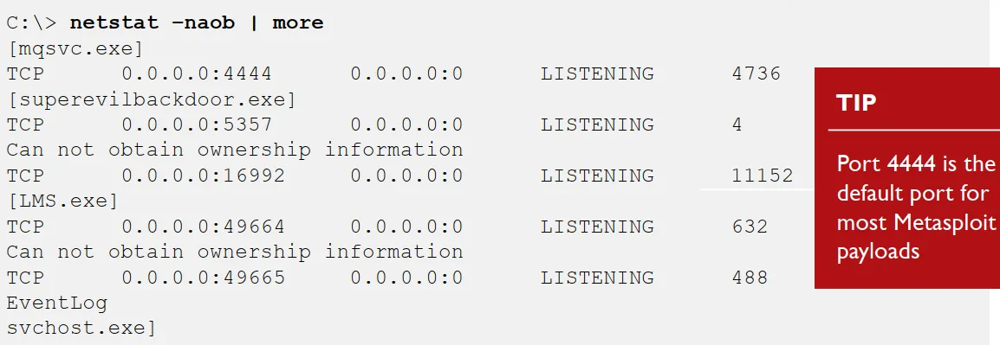

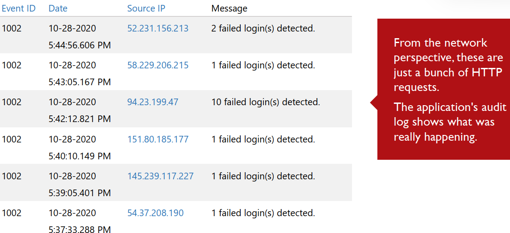

In the network logs above, we see two hosts interacting through port `27017` (MongoDB). Suspicious handshakes suggest custom traffic, and the IP belongs to an internal host with admin privileges.

In the host logs, we see `superevilbackdoor.exe` making a connection to port `4444` — the default for most Metasploit payloads.

The app logs reveal a password-guessing attack. Notice how much more informative the app logs are compared to raw HTTP logs — here we know exactly what the attacker was doing.

### Scoping

Lateral movement describes how an attacker moves through the network once past the perimeter. Scoping is essential to understand *where* the attacker currently is and *where they've been*.

:::note
Scope can change as the investigation progresses — a scan might reveal newly compromised systems or rule out false positives. When scoping, go all out. Use every tool available, and don't hesitate to write custom scripts.
:::

### Velociraptor

Velociraptor is a large-scale incident response platform. It uses client endpoint agents to collect and report data across all operating systems.

- Agents can run as a service, background task, on scheduled intervals, or in offline mode.
- The asynchronous server can request data, and hosts respond whenever they're online.
- Supports a file-based datastore or MySQL backend.
- Used to collect artifacts via remote virtual file system, registry data, and remote command execution.

### Containment

The aim is to stop the threat actor from taking any further actions. Lateral movement and persistence are common, so proper scoping is critical before containment — otherwise you'll miss compromised systems.

Examples of containment actions:
- Physically or logically isolating a system from the network.
- Patching vulnerable systems.
- Removing backdoors.

:::important
Sometimes containment must be broken into stages — prioritizing business availability over perfection, or preserving evidence from the original state before making invasive changes.
:::

### Eradication

Eradication is different from containment: **containment stops the threat actor from operating; eradication removes what they did.**

Examples include restoring systems from backups and removing backdoors. Some eradication activities directly support the next step: recovery.

### Recovery

Containment and eradication both focus on security. Recovery focuses on **business impact**.

:::tip
The most cost-effective way to restore a compromised system is to **rebuild it from scratch** — you can never be 100% sure the attacker didn't leave a backdoor somewhere you didn't look. If you can't take a system offline while rebuilding, short-term containment (killing processes, changing passwords) can buy time.
:::

Try to restore systems during off-hours — less traffic makes it easier to monitor for any returning attacker activity.

### Remediation

Fix the root cause of the incident. Don't blame the sysadmin for using a weak password — ask *why* weak passwords were possible in the first place.

After systems are back online, monitor them closely to confirm the threat actor hasn't returned.

### Post-Incident

As the incident winds down, a final incident report is required. Common report types include:

- **Public breach reports** — brief, written for general audiences.
- **Post-incident final report** — detailed and technical, written by the incident responder.

:::tip
The best time to request security upgrades is right after an incident, while the pain is fresh. Schedule a follow-up meeting to discuss findings and new developments to reduce the "fading effect" over time.
:::

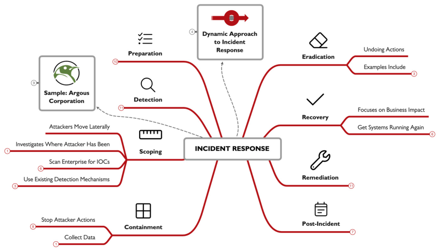

---

## Digital Investigation

### Investigation

Examination of evidence to answer questions. Specific evidence yields specific answers, which help answer high-level questions. Key factors that shape your investigation:

- The **type** of incident you're dealing with.
- **Resources** available — time, access to evidence, tooling.
- The **goal** — business recovery, legal action, or threat intelligence.

### Notes

Taking notes is essential during any incident. They help you remember what you found, when, and where — and they serve as the foundation for all other documentation.

> If you are typing too fast to take notes, you are just going too fast altogether.

Your notes should be detailed enough that someone with similar skills and background could reproduce your exact steps. Write objectively — your documentation is your professional responsibility.

### Data Reduction

You can't analyze every single file. Use filtration to focus:

- Ignore files with known-good hashes.
- Highlight files flagged as malicious.
- Use tool-specific filters.
- Apply incident-specific knowledge to prioritize artifacts.

### Encoded Data

It's common to encounter various encodings during investigations — Base64, URL encoding, UTF-8, UTF-16, and more.

:::tip
[CyberChef](https://cyberchef.io) is a fantastic tool you'll use constantly. Enter your input, drag and drop an operation, click **Bake**, and you have your output.
:::

### Pivoting

Pivoting means using one piece of data as a lead to find more. For example:

1. Examine a suspect system.
2. Find an IOC (e.g., a suspicious IP address).
3. Use that IP to find the associated process name.
4. Use the PID to search for child processes involved in the incident.
5. Repeat.

:::note
Pivoting is a strategy, not a phase — it's used continuously throughout an investigation with no time limit.
:::

### Timeline

A timeline is a chronological list of events. Knowing *when* something happened is enormously valuable in incident response.

Challenges to watch for:

- Evidence missing timestamps — correlate with other available data.
- **Clock skew** — calculate manually or configure NTP.
- **Time zones** — whether timestamps are in local time or UTC depends on the evidence source and tool used. Know your tools and account for daylight saving time.

### Artifact Timelines

Derived directly from evidence — often metadata. Timestamps come from memory, file systems, operating system logs, etc. This is **low-level** timeline data.

### Event Timelines

Entries represent single events, not individual artifacts. Formed from patterns and groups of timestamps from the same evidence source. This is **high-level** timeline data.

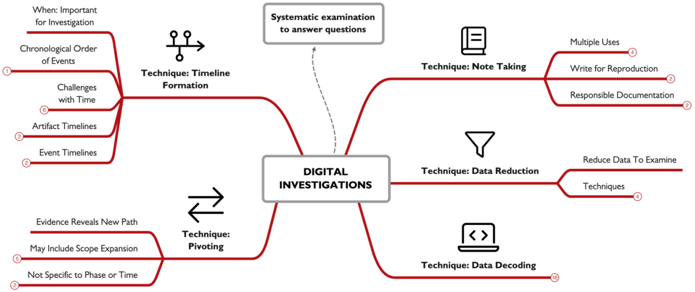

---

## Live Examination

How do you know if a threat actor is present if you don't know they're there? Watching the network alone isn't enough — attackers can blend into legitimate traffic or encrypt their communications.

### Examining Processes

```powershell title="Process Examination"
# Lists all running processes with PID and memory usage
tasklist
```

:::note
`wmic` was a useful CMD tool for process examination, but it has been removed from newer Windows versions as it was considered a living-off-the-land binary (LOLBin). Use `tasklist` or PowerShell alternatives instead.
:::

### Identifying Suspicious Processes

Key indicators of a suspicious process:

- Is this process new to the system?
- Does its name look random or auto-generated?
- Does it have a legitimate name but run from an unexpected location?
- Is it a child of another suspicious process?
- Does it use any encoding in its arguments?

### Network Usage

```powershell title="Network Usage Commands"
# Shows all listening and active TCP/UDP ports
netstat -na

# Refreshes the output every 5 seconds
netstat -na 5

# Adds the owning Process ID to the output
netstat -nao

# Adds the executable and DLLs using the port
netstat -naob

# Shows the current Windows firewall profile settings
netsh advfirewall show currentprofile
```

### Suspicious Network Activity

- Any network activity abnormal for a given process (e.g., Notepad making outbound connections).
- Activity during non-business hours.
- Fixed, recurring activity at regular intervals.
- Traffic to or from known malicious hosts.

### Services

```powershell title="Service Investigation Commands"
# Opens the Services GUI (run via Win+R or Start menu)
services.msc

# Lists all running services
net start

# Queries detailed info on every service, page by page
sc query | more

# Maps services to their running Process IDs
tasklist /svc
```

### Registry

The **AutoStart Extensibility Points (ASEPs)** are a critical set of registry keys commonly abused for persistence. The most common:

```
HKLM\Software\Microsoft\Windows\CurrentVersion\Run
HKLM\Software\Microsoft\Windows\CurrentVersion\RunOnce
HKLM\Software\Microsoft\Windows\CurrentVersion\RunOnceEx
HKCU\Software\Microsoft\Windows\CurrentVersion\Run
HKCU\Software\Microsoft\Windows\CurrentVersion\RunOnce
```

Query them via CLI:

```powershell title="Query ASEP Registry Key"
# Lists all programs set to run at startup for all users
reg query "HKLM\Software\Microsoft\Windows\CurrentVersion\Run"
```

:::tip
**Autoruns** from the Sysinternals suite gives a comprehensive GUI view of all ASEPs in one place.
:::

### Accounts

```powershell title="Account Investigation Commands"
# Opens the Local Users and Groups GUI
lusrmgr

# Lists all local user accounts
net user

# Lists all local groups
net localgroup

# Lists members of the Administrators group
net localgroup administrators
```

### Scheduled Tasks

```powershell title="Scheduled Task Investigation"
# Lists all scheduled tasks with details
schtasks
```

:::caution
`AT` command is not available on Windows 11. Use `schtasks` instead. Watch for tasks running under `SYSTEM`, admin accounts, or with a blank user field — these are red flags.
:::

### Log Entries

```powershell title="Query Security Event Log (CMD)"
# Outputs security log events to the terminal
wevtutil qe security
```

```powershell title="Query Security Event Log (PowerShell)"
# Retrieves all security log events with full property detail
Get-EventLog -LogName Security | Format-List -Property *
```

Events to watch for:
- Event log service stopped.
- File integrity monitoring disabled.
- New user or group created.
- Many failed login attempts in a short period.

### Additional Tools — Sysinternals Suite

| Tool | Purpose |
| --- | --- |
| **Process Explorer** | Detailed info about running processes |
| **Process Monitor** | Real-time file system, registry, network, and process activity |
| **TCPView** | Lists active TCP/UDP connections and their owning processes |
| **Autoruns** | Shows all auto-start applications and locations |
| **Sysmon** | Logs detailed system activity to the Windows Event Log |
| **Procdump** | Captures memory dumps of running processes |

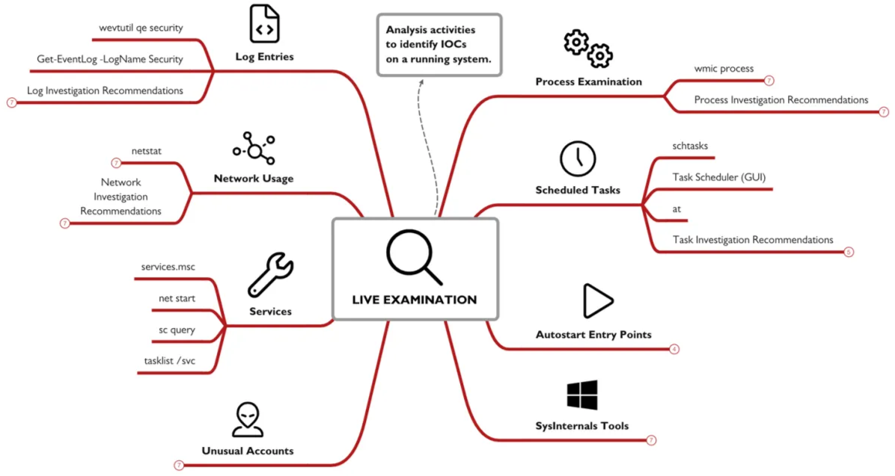

---

## Network Investigations

Network traffic provides valuable insight into what happened. There are two main categories:

1. **Raw network traffic** — full packet captures.
2. **Logs from network devices** — firewall logs, proxy logs, router logs.

Common challenges with network logs:

- **Accessibility** — not every device exports logs in a user-friendly format.
- **Fidelity** — not every source captures full packet details.
- **Encryption** — encrypted traffic limits what you can extract.

### Packet Captures

Full packet captures are considered a gold mine — they provide the lowest-level view of network data. Limitations: they are large, overwhelming, and often encrypted.

Two common formats:
- **pcap** — older format with limited capabilities.
- **pcapng** — newer format with more advanced options.

### tcpdump

```bash title="tcpdump Commands"
# Capture all traffic on the eth0 interface
tcpdump -i eth0

# Capture traffic and write it to a file
tcpdump -i eth0 -w output.pcap

# Read a capture file — no IP/port resolution, show ASCII data
tcpdump -r output.pcap -nn -A
```

### Berkeley Packet Filters (BPF)

| Qualifier | Examples |
| --- | --- |
| **Type** | `host`, `net`, `port` |
| **Direction** | `src`, `dst` |
| **Protocol** | `ip`, `tcp`, `udp`, `icmp` |

Operators: `and` / `&&`, `or` / `||`, `not` / `!`

Use parentheses `()` to control evaluation priority.

### Web Proxies

Used in organizations to cache data, reduce bandwidth, and filter sites. Proxy logs are valuable for building a picture of user activity and identifying suspicious traffic.

### Access Logs

Each entry contains: Timestamp, Duration, Client IP, Result Code, Size, HTTP Method, URL, Username, Hierarchy Code, Content Type.

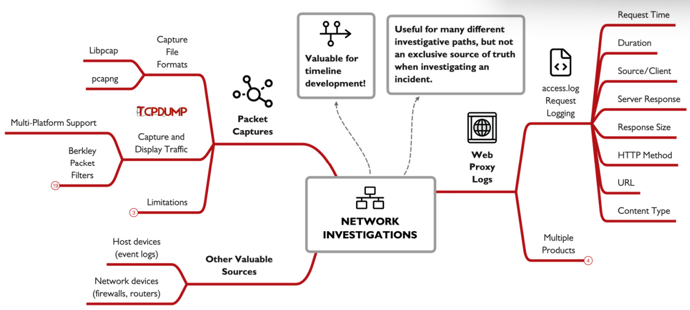

---

## Memory Investigations

Memory images contain valuable information that can't be found anywhere else on disk.

:::important
Use **WinPmem** to capture memory images from live Windows systems before doing anything else — volatile data is lost the moment the system is powered off or rebooted.
:::

### Volatility

A Python framework for memory analysis, first released in 2007. Two major versions:
- **V2** — stable, widely used.
- **V3** — newer, actively developed.

### Usage (V2)

```bash title="Volatility V2 Usage"
# Run the pslist plugin on a memory image with a known profile
vol.py -f memory.img --profile=Win10x64 pslist

# Auto-detect the best matching profile for the image
vol.py -f memory.img imageinfo

# List all available plugins
vol.py --info
```

### Key Plugins

| Plugin | Description |
| --- | --- |
| `pslist` | Lists running processes (PID, name, PPID, start/end time) |
| `pstree` | Shows processes in parent-child relationship |
| `netscan` | Scans memory for network connections and their processes |
| `userassist` | Lists GUI-launched applications with run count and timestamps |
| `hivelist` | Lists loaded registry hives |
| `printkey` | Dumps a specific registry key from memory |
| `cmdline` | Shows the command line used to launch each process |

### Applying Memory Investigation

It always starts with an **Event of Interest (EOI)**. Pull a thread with minimal information, then use plugins to progressively gather more context, pivoting from one artifact to the next.

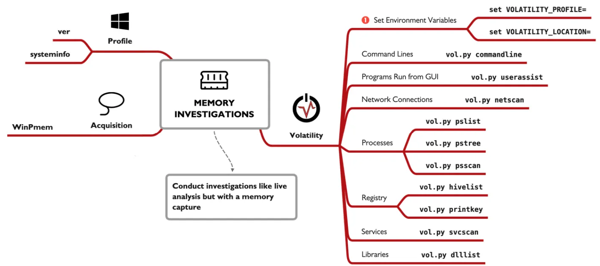

---

## Malware Investigations

A suspicious file is found — how do you confirm it's malware, and how do you extract indicators from it?

Two basic approaches:
1. **Dynamic Analysis** — run the malware in a controlled environment and observe its behavior.
2. **Static Analysis** — examine the malware's code using disassemblers and debuggers.

### Online Analysis

- **VirusTotal** — scans a file against dozens of antivirus engines. No private analysis option.
- **Hybrid Analysis** — runs the file in a virtual machine and records behavior. Private analysis is available but costs money.

### Good Hygiene

:::caution
Before analyzing any malware, prepare a secure isolated environment:
- Use a VM with a **host-only** network adapter.
- Disable shared folders and shared clipboard.
- Transfer samples only via USB or isolated methods.
:::

### Basic Attributes

```powershell title="File Hashing (Windows)"
# Hash a file using MD5
certutil -hashfile malware.exe MD5

# Hash a file using SHA256
certutil -hashfile malware.exe SHA256

# Alternative using native PowerShell
Get-FileHash malware.exe -Algorithm MD5
```

```bash title="File Hashing & String Extraction (Linux)"
# Hash a file using MD5
md5sum malware

# Extract all printable strings from a binary
strings malware
```

:::tip
Use `strings` to extract readable text from any binary — it often reveals URLs, registry keys, and hardcoded configuration strings.
:::

### Environment Monitoring

Steps for dynamic analysis:

1. Prepare tools and sample.
2. Take a **clean snapshot** of the VM.
3. Start the monitoring tool.
4. Run the malware and interact with it.
5. Kill the malware.
6. Pause monitoring.
7. Review results.

Two main monitoring approaches:

| Approach | Description | Advantage | Disadvantage |
| --- | --- | --- | --- |
| **Snapshot** | Compare system state before and after execution | Simple, clear diff | Misses transient changes (e.g., files created then deleted) |
| **Continuous** | Record every action in real time | Captures everything | Generates overwhelming amounts of data |

### Regshot

A snapshot-based tool that records the registry and selected file system paths at two points in time, then compares them.

**How to use:**
1. Configure the app — optionally set a scan directory for file system monitoring.
2. Take **Shot 1** (clean state).
3. Run the malware and interact with it.
4. Kill the malware.
5. Take **Shot 2**.
6. Click **Compare** — review added, deleted, and modified files and registry keys.

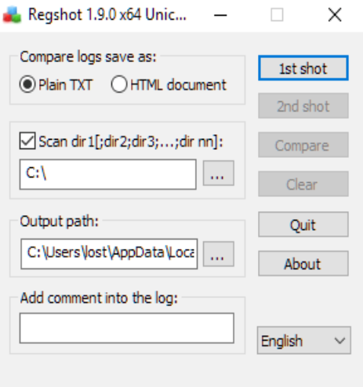

### Process Monitor

Monitors registry, file system, network, process, and event activity in real time. Offers powerful filtering across all five categories, plus a summary view under the **Tools** tab.

### Process Tree

A view within Process Monitor that lists all processes that ran on the system — including those that have already closed — with full details: start/end time, command line, file path, and more.

### Analyzing Code

Tools like **IDA Pro** and **Ghidra** allow low-level static analysis, but require knowledge of reverse engineering and the programming language/architecture used by the malware.

:::note
Check out **FOR610**, **SEC660**, and **SEC760** for deeper coverage of malware reverse engineering.
:::

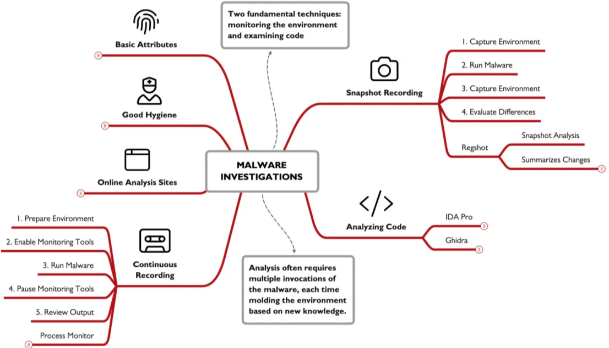

---

## Cloud Investigations

Cloud forensics are similar in technique to traditional IR, but the tools are different.

### Cloud Attacker Advantages

- Easily replicate the target environment to research vulnerabilities before attacking.
- Launch attack infrastructure from the same cloud provider to potentially bypass network filters.
- Exploit admin misconfigurations that are common in cloud environments.

### Cloud Defender Advantages

- Better asset management — easier to know what's running.
- Programmatic access gives full visibility over the platform, accounts, and services.
- Fast imaging and cloning compared to physical systems.

### Shared Responsibility Model

All major providers operate under the **Shared Responsibility Model** — both you and the provider are responsible for security, but at different layers.

| Service Model | Your Responsibility |
| --- | --- |
| **IaaS** (e.g., EC2) | OS, runtime, data, applications, network config |
| **PaaS** | Data, applications, some config |
| **SaaS** | Data only |

The higher up the stack, the less security responsibility falls on you — but you also have less control.

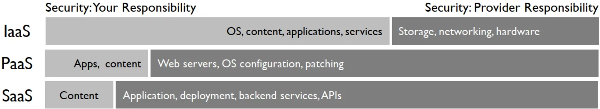

:::note[Example]
For Amazon EC2, AWS secures the underlying hardware. Everything above — the OS, applications, and data — is your responsibility.
:::

### Preparation

Downloading cloud data to a local IR environment is slow and costly. The most common practice is to set up a **cloud-based IR system** with all necessary tools pre-installed.

:::warning
Place your IR system in a *separate account*. If the attacker has access to the compromised account, they can see your investigation and tamper with evidence.
:::

**Configuring Logging:** A comprehensive logging configuration is essential. Log every aspect of the environment that could be relevant during an investigation.

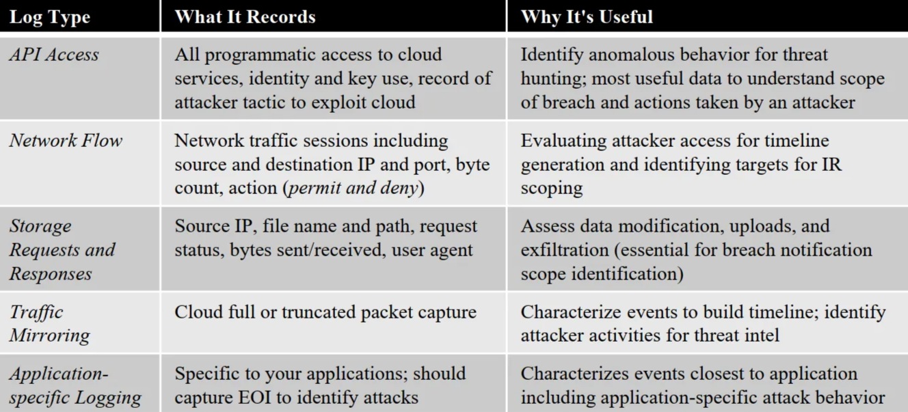

### Detection

Use the tools recommended by your cloud provider, supplemented with manual analysis for deeper understanding:

- **AWS** — CloudTrail, GuardDuty, Security Hub.
- **Azure** — Microsoft Defender for Cloud, Sentinel.
- **GCP** — Security Command Center, Chronicle.

:::note
Cloud security tools are rapidly evolving — always check current provider documentation for the latest options.
:::

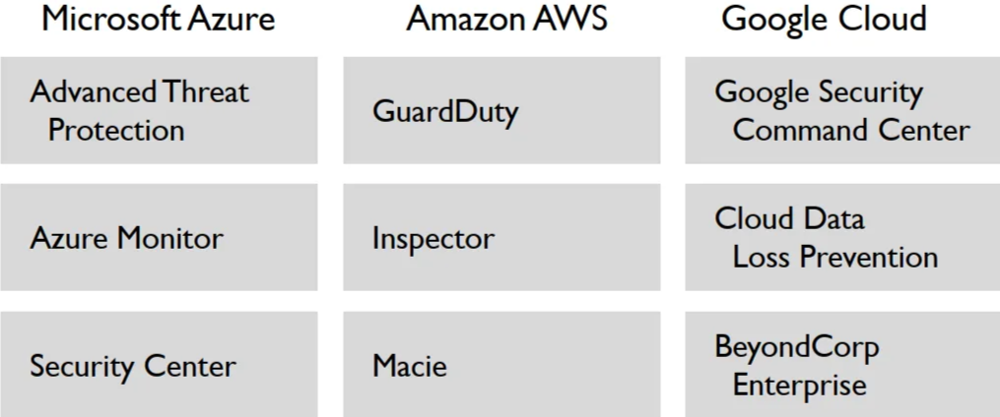

### Containment

Cloud-specific containment options:

- Remove the instance from production.
- Isolate it by modifying its security group or placing it in a VPC with no egress.
- Enable **termination protection** to prevent accidental deletion of volatile data.
- Use the provider's snapshot tool to clone the instance before making changes.
- Tag the instance as **under investigation** to prevent unauthorized access or modification.

### Cloning

One of the biggest advantages of cloud over physical systems is how quickly you can duplicate or image a system.

:::important
You may need to shut down the instance to guarantee disk integrity during cloning. Always capture a memory image first:
- **Windows:** WinPmem
- **Linux:** AVML
:::

### Data Collection

List available block storage volumes in a region:

```bash title="List Available Block Storage Volumes"
# Lists all EBS volume IDs in the us-east-1 region
aws ec2 describe-volumes | jq -r '.Volumes[] | select (.AvailabilityZone | contains("us-east-1") ) | .VolumeId'
```

Attach the volume to your IR instance:

```bash title="Attach EBS Volume to IR Instance"
# Attaches the specified volume to the IR instance as /dev/sdh
aws ec2 attach-volume --volume-id vol-0c0d039aeaa4c9b58 --instance-id i-044cd28257a5b6811 --device /dev/sdh
```

:::note
On Windows, the attached volume appears automatically. On Linux, you'll need to mount it manually.
:::

### Analysis

Cloud provider log formats aren't always user-friendly — single-line logs, JSON, or XML. Useful analysis tools:

```powershell title="Query Event Logs (PowerShell)"
# Retrieves all Security log events
Get-EventLog -LogName Security

# Alternative — works on newer Windows versions and remote systems
Get-WinEvent -LogName Security
```

```powershell title="Query Event Logs (CMD)"
# Outputs security log events to the terminal
wevtutil qe security
```

Third-party tools like `s3logparse` and `vpc-flow-log-analysis` can also assist.

### Response

Most cloud incidents involve a compromised or maliciously created **access key**. Use the provider's **Identity and Access Management (IAM)** tools to investigate and revoke access.

### Recovery

With snapshots and backups being easier in the cloud, restoring to production is faster. Before doing so:

- Fix the root cause of the incident.
- Review all access mechanisms.
- Verify MFA is enabled on all accounts.
- Review policies and privilege controls.

:::tip
Temporarily increase logging and monitoring intensity on recovered systems to detect any returning attacker activity.
:::

### Additional Considerations

:::caution
Ensure developers and DevOps teams don't **restart the system** to fix a "bug" — this destroys volatile data.
:::

- Cloud-based IR is more efficient but more costly — make sure your organization is aware of the financial implications.
- Obtain access to **cloud support channels** — costly, but invaluable during an incident.
- Conduct **tabletop exercises** simulating cloud-specific incident scenarios so every team member knows their role.

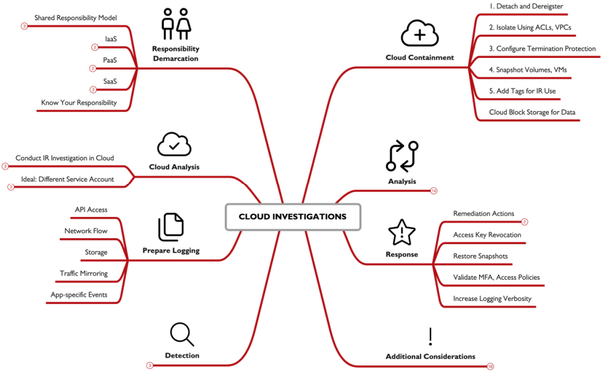

---

*تم بحمدالله*