# Sec 504 book2

in order to defend probably we need to understand how hackers move and operate , this book covers attack concepts we examine them and learn about attacker tools, techniques, and procedures (TTPs) , to defend better.

## MITRE ATT&CK Framework:

the MITRE ATT&CK (Adversarial Tactics, Techniques and Common Knowledge) framework. MITRE is a not-for-profit US company. the framework helps us map known adversary tactics, techniques, and procedures. also characterizing techniques used by adversary's , and identifying adversary groups. the enterprise matrix [https://attack.mitre.org](https://attack.mitre.org/) the categories are column, and techniques populate the columns. 

## Open-Source Intelligence:

reconnaissance helps an attacker to get a fell of your network before firing a packet, just like real world you try to gather as much info before you attack , like for example if your robing a bank , you’ll try to know the guards when they move , camera places , the mount of money , you’ll try to get your hand on some blueprints of the building , and so on. We can classify attackers into 2 main categories, non-discriminating who search any target that venerable to a venerability they know , more like a script kiddie , they skip recon and head straight to action. and attackers who focus in there target, before doing any thing they conduct detailed recon analysis to get as much info as they can about a target as this data will come in handy during the attack. 

### Planned Sharing:

information that are shared online such as annual reports, contact information, website information, etc.

### Unplanned Sharing:

Organizations share data online , and some  this is leaked information but not recognized as leaked by the organization (such as employee social media use), and sometimes it is the publication of leaked data obtained illegally (such as compromised passwords, stolen documents)

OSINT is collecting all data into useful manner , giving the attacker critical info ,like username emails , server host name , or more technical like the CEO word version. ID T1266  

### WHOIS:

when registering a domain they collect info about the registrant , like name number mail and so on , but after 2016  with the introduction of the European requirements for General Data Protection Regulation (GDPR) , though you still will find data but mostly unimportant  **ID T1596.002 .**

### Certificate Transparency:

the new who is , as new browser sue SSL/TLS certificates , this helps us to verify legit sites. Certificate transparency is a CA requirement where they must publish logs of all issued certificates. its used by attackers to get the organization host name. you can get it all here [https://crt.sh](https://crt.sh) , you can also get tings that is not yet publicly available.

### haveibeenpwned:

this sites check collects lists of usernames and passwords from major website breaches. it dose not provide the passwords but it shows breaches that leaded this info, its sometimes possible to collect the usernames and passwords associated with the known breaches. 

### OSINT Data Collection:

the main problem with osint  is in collect data from many different sources each provide different data most of the services are free but some are paid , The accessibility and confidence in OSINT data sources can also be a challenge, there are some OSINT data aggregator tools that can help.

### SpiderFoot:

is an open source osint data collection and analyzing tool, it collects data from hundreds of online sources and shows it to you , it supports graphical view of data.

when dose osint stops:

collect data from public sites and third parties , when you interact directly withe the target this is no longer OSINT

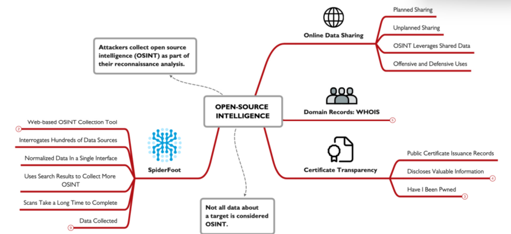

## DNS Interrogation:

Domain Name System (DNS) provide valuable recon info for an attacker , as it provides Ip addresses , host names, emails, Mail eXchange (MX) records and more. the two primary tools used are `Nslookup`and `Dig`.

### Zone Transfer:

zone transfer allows the attacker to connect to DNS server and get all records about a domain , from this dump attacker can see what machines are available on the internet, we can run a zone transfer using this commands `nslookup`, `server dnsserver`, `set type=AXFR` , `ls -d targetdomain`  the set means we want all types of DNS records. this will work for windows and some versions of Linux, so we’ll use this `dig @dnsserverip targetdomain AXFR` .

### Automated Interrogation:

most DNS servers will not permit zone transfer , so we’ll use Automated Interrogation, is uses a list of command host names and a target domain to determine if the DNS name is present in the DNS server. to do in we’ll have to use a tool like Nmap , like this command `sudo nmap --script dns-brute --script-args dnsbrute.domain=holidayhackchallenge.com,dns-brute.threads=6,dnsbrute.hostlist=./namelist.txt -sS -p 53`  lets break this command down to understand it , `--script-args` start the argument the script will take , `dns-brute.domain` specify the domain name, `dns-brute.threads` specify the number of requests that can be sent in the same time, `dns-brute.hostlist` specify the wordlist, the rest of the line is jus needed commands. the better the wordlist the better the out come,  a good ward list be be found [here](https://github.com/danielmiessler/SecLists/tree/master/Discovery/DNS).

### Defending:

to defend DNS recon , we need to limit the zone Transfer , the primary DNS server should only allow zone Transfer from secondary or tertiary DNS servers, these servers should deny all zone Transfer requests , use split DNS , you’ll have two DNS servers internal and external. public DNS  info is loaded into the external and the internal can only be accessed from inside your network , this will prevent the attacker from accessing your DNS server. 

use DNS server logging to identify any attack , you can use Windows DNS logging , you can easily get mixed between legit DNS and an attack so be cautious  when tacking actions, what you should o is report this Ip to the threat intel team and add it to a watch list until your sure its an attack.

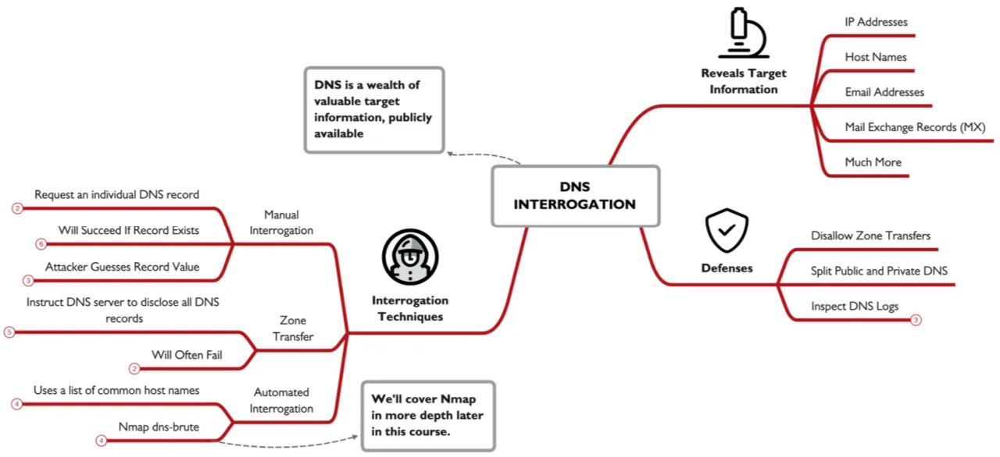

## Website Reconnaissance:

corporate websites often have info like phone numbers or emails which are useful for social engineering , some site maty include description about their platform or architecture. 

### Exiftool:

after getting a document using exiftool can help you get all the meta data from it , some times it shows the app used to created this document , and the machine and os, which attacker may get CVE’s that found in these versions.

### Website Crawl and Wordlist Generation:

CeWL (Custom Word List generator) is a tool that collect all web pages from a target , and common file formats, to make a wordlist emails, metadata. this commands get words that +8 characters and file metadata and mails from the whitehous.gov site `cewl.rb -m 8 -w whitehouse.txt -a --meta_file whitehouse-meta.txt -e --email_file whitehouse-email.txt https://www.whitehouse.gov/` 

### Search Engines:

using things like google search modifiers we can get thing that not visible in normal search, Google Hacking Database (GHDB) have a lot of useful searches to locate many problems on target domains. Fast Google Dork Scan (FGDS) is a script that uses Google Dorks and a target domain name to acquire information about a target organization.

### Other Website Information:

The U.S. Securities and Exchange Commission (SEC) help when getting data collecting data for public US traded companies. sites such as namechk and WhatsMyName.app will help u get even more info. other sites include www.shodan.io www.network-tools.com viewdns.info www.securityspace.com .

### Defending:

chick osint once in while to make sure there’s no data leaked , you can also add robots.txt to your site to block some urls from showing in searches but be carful of not being so obvious of what your hiding , because any one can just access the robots.txt file and see what you **Disallow** , take a look at your logs as they will notify you before anything happens.

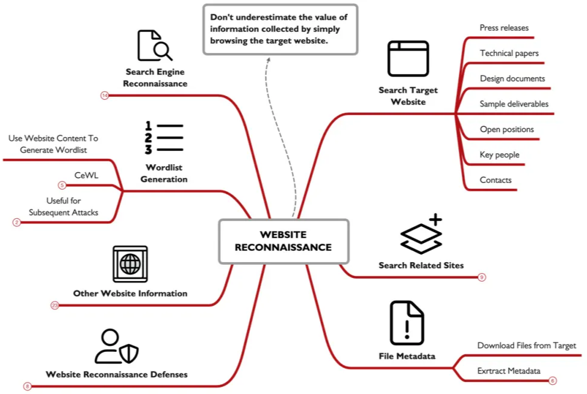

## Network and Host Scanning with Nmap:

an attacker must under stand the network topology has working with, the layout of the routers and hosts can show vulnerabilities or show the attacker where things are , Nmap is a famous tool that can be used to map networks and scan ports, its a CLI tool but it also have a GUI version called Zenmap, miter ID T1046.

### Sweeping:

a common initial step in network mapping is to sweep through the network, it sends a packet to each address and waits for a respond ,to know if the address is used or not. it sends 4 packets  ICMP Echo Request, TCP SYN to port 443, TCP ACK to port 80 (if Nmap is running with UID 0), and an ICMP Timestamp request. If Nmap is not root , it only sends a TCP SYN to port 80 and to port 443 (as non-root, Nmap cannot craft the ACK packet sent to port 80).

**Host Discovery:**`sudo nmap -sn 192.168.1.1-254` this command scan the given range for hosts , we can add the  `-pn` to disable port scanning. 

### IP Header:

areas associated with mapping . The source and destination IP address , the Time to Live(TTL) field for IPv4 and the Hop Limit field for IPv6.

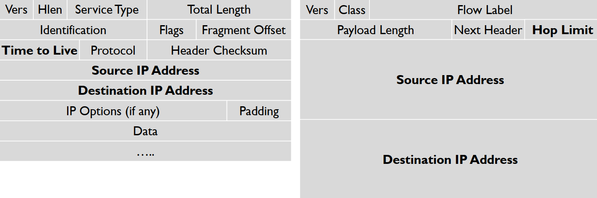

the TTL and HOPs indicates how many hops a packet can go across a network before dropping , we can use `tracert 
traceroute` commands to see it. 

### Traceroute:

when a router receives a packet it first check the TTL value and decrease it by 1 and forward it out, if its zero it sends a Time Exceeded message to the originator of the incoming packet, its use to get parts of the network that interconnected , by sending a series of packets with different  TTL values  by doing this you’ll eventually get all the devices in the network. Ex. `sudo nmap -sn --traceroute 216.239.191.182-200 -oA insecure-net`  the `-sn` disable port scanning , `--traceroute` request each path to all discovers hosts `-oA` will record the scan results. once Nmap is done we can use the Zenmap GUI to get a look at the network graphically.

### Port Scanning:

port are like open windows the attacker can use to access your system , port scanning are a must for attackers as it gives possible openings for the system. miter ID T1046 , there are 6556 ports for UDP and the same number for TCP , each port is a service , and there is nothing called port 0 even if its have packets will be dropped.

### TCP Three-Way Handshake:

a legit TCP connection is established by this handshake.

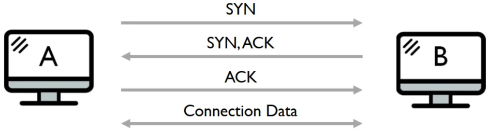

Six control bits describe the packet's role in the connection:

SYN: Synchronize, ACK: Acknowledgment, FIN: End a connection, RESET: Tear down a connection, URG: Urgent data is included, PUSH: Data should be pushed through the TCP stack.

### Scan Types:

Ping sweeps: Send a variety of packet types.

ARP scans: Identify which hosts are on the same LAN as the machine running Nmap. 

Connect scans: Complete the three-way handshake; are slow and easily detected. Because the entire handshake is completed for each port in the scan.

SYN scans: Only send the initial SYN and await the SYN-ACK response to determine if a port is open. The final ACK packet from the attacker is never sent. The result is an increase in performance and a much stealthier scan. host only log completed a connection.

UDP scanning: Helps locate vulnerable UDP services. For most UDP ports, Nmap sends packets with an empty payload.

Version scanning: Tries to determine the version number of the program listening on a discovered port for both TCP and UDP.

IPv6 scanning: Iterates through a series of IPv6 addresses, scanning for target systems and ports, invoked with the -6 syntax.

 `sudo nmap -sS 192.168.1.10 -O -oA target-host`  this command will return all open ports and the serves running on them 

### NSE Scripts:

nmap have the Nmap Scripting Engine (NSE) which provide scripts that can be used , `-sC` will use the default scripts.

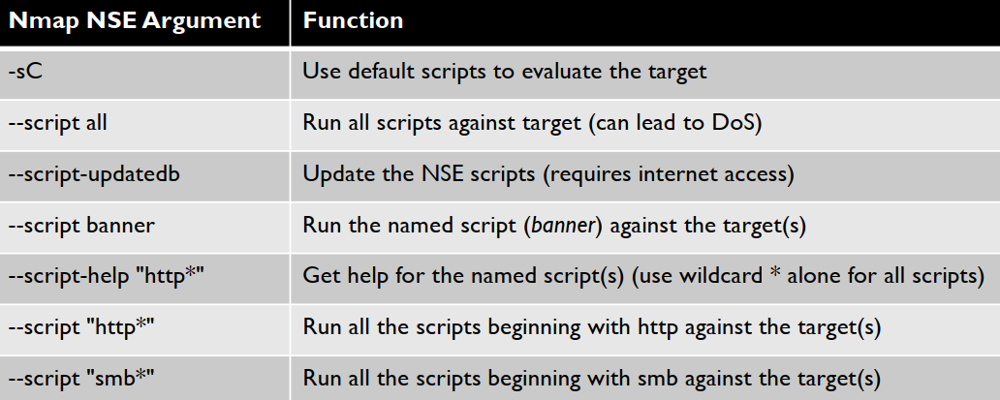

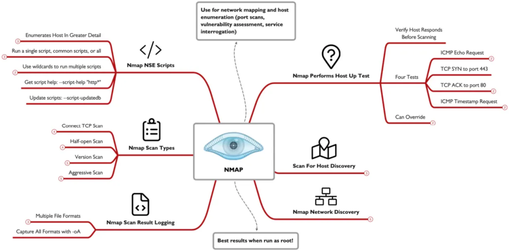

## Cloud Spotlight: Cloud Scanning:

scanning a cloud server seems to be undoable but , attackers cant take this word they found ways to do it , which will be explained later , attacker can do all they want withe a cloud network because its mostly not monitored some time you can pass firewalls if your attacking a cloud system from the same provider, miter ID T1046

### JQ and JSON:

whenever you dealing with cloud systems your dealing with JSON as its used by all cloud providers in various tasks , and the best tool to deal with it is the JSON Query tool, JQ its a light weight tool and parsing language  , which is great when dealing with JSON.

### Cloud Scanning:

scanning is just one technique attacker can use to identify assets, we can use osint DNS info and so on to get their hands to that sweet info , [BuiltWith.com](http://BuiltWith.com)  is a site that can show you some info you’ll need and that will help you as an attacker it can help you to get the cloud provider for the target.

### Exhaustive IP Address Enumeration:

once the attacker get you cloud provider he can get the list of Ip associated with this provider which the targets Ip is include in it.

using this query will give a list of all the iP’s associated with each of this 3 cloud providers 

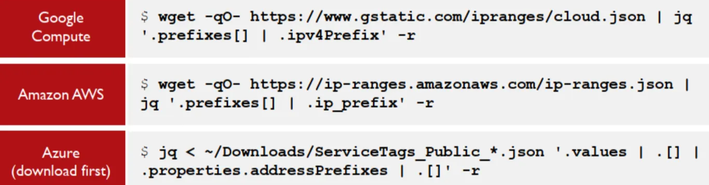

### Masscan:

when dealing with this much  iP’s Nmap become insufficient , as its slow and will take ages to do this task , instead w will use masscan Nmap sends the SYN then wait for the ACK to get back , masscan docent do this it sends all the SYN then anther part handles receiving the ACK, making port scanning much faster, `wget -qO- https://ip-ranges.amazonaws.com/ip-ranges.json | jq '.prefixes[] | if .region == "us-east-1" then .ip_prefix else empty end' -r | sort -u > us-east-1-range.txt` using a query like this we gat all the ip’s from AWS we can then filter it down to only get the us east1 region and save it to a file, `sudo masscan -iL us-east-1-range.txt -oL us-east-1-range.masscan -p 443 -rate 100000` here we will use this file and only scan TCP port 443 with a rate of 100k requests per second using this we can scan 33 million Ip address in just 5.5 hours , though at this rate this may cause false negatives , lowering this rate will increase the positives.

**Attributing Hosts:** from this result we now have a list of ip‘s with open port 443 we now can abuse teh TLS certificate to get some data , `openssl s_client -connect 18.207.73.1:443 2>/dev/null | openssl x509 -text | grep Subject:` this command will get all the SSL info in the subject line , but **openssl** can only connect to one server at a time, that why we’ll use **TLS-Scan**  this tool reads from a list op Ip’s extracts certificate information , from multiple ports  `cat us-east-1-range.tlsopen | tls-scan --port=443 --cacert=ca-bundle.crt -o us-east-1-range-tlsinfo.json` , this command reads the ip list then using the certificate list we have we get all the info and save it in the JSON file tls-scan is fast and non-blocking but it’ll take some time. we then need to pars the data using some JQ

### EyeWitness:

anther tool we can use , this tool will help us with recon as it takes screenshots from sites detect and identify the purpose of it , get you default pages and management pages , return indexed directories , and even some identify default credentials in some apps, to use it we feed it data from masscanand TLS-scan URL’s, `python3 /opt/eyewitness/EyeWitness.py --web -f urllist.txt --prepend-https` then using this command the magic happens.

### Defense:

we as defenders cant log and look at every step mentioned earlier, so the best thing we can do is to limit access to the servers like the API server should only be accusable through the app firewall,  not to the public, most of the time we can do anything about scanning but we can deal with what come afterwards so keep your eyes on the logs. 

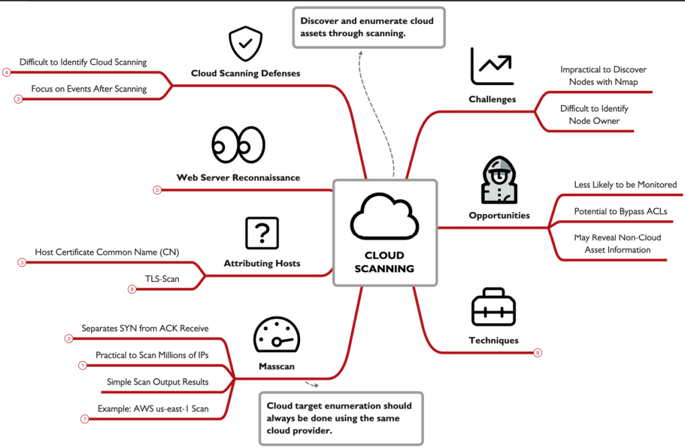

## SMB Sessions:

Microsoft Server Message Block (SMB) , used to make network accessibility to windows machines , features like file explorer net use reg , and soo on basically you control main functionality's, that way its targeted by attackers , its used on TCP port 445 , and some older versions use TCP and UDP ports 135 to 139, MITER ID T1135 ,T11077,T1110.

### Establishing an SMB Session from Windows:

using the `net use \\targetip` command because we did not provide a suer name it will use the name of who ran this command , same with the share name, or we can use this `net use \\targetip\sharename password /u:username` you don't have to be an admit to connect to anther device.

### Interrogating Targets:

after connecting to a target using `net use \\targetip` we can just use the `net view \\targetip` command to get a list of all users in this machine but not the default admins. 

**Password Guessing:**  `net user /domain > users.txt` here we just get a list of all the users , then we can create a word list to save out password at just make sure the number of password is less than the account lockout threshold so u don't get yourself kicked, finally using the command  `@FOR /F %p in (pass.txt) DO @FOR /F %n in (users.txt) DO @net use \\SERVERIP\IPC$ /user:DOMAIN\%n %p 1>NUL 2>&1 && @echo [*] %n:%p && @net use /delete \\SERVERIP\IPC$ > NUL` we will loop on each user name test the passwords and if its correct it will be echoed in the consol. YES its that easy and yeas attacker do it, and also it bypasses most  IPS/IDS.

### SharpView:

an enumeration tool it collects data about a windows device using a non amin account, command like `Get-DomainUser , Get-DomainGroup , Get-NetComputer` , all of them can get you  a lot of data for EX the `Get-NetComputer` return the machine name operating system version , and name and more.  `sharpview Get-DomainUser -Domain sec504.org -Credential ksmith/Password123 -Server 192.168.99.10 | findstr "^name"` this command get all the users in a domain.

### BloodHound:

another tool that maps relations premotions users of systems graphicly , which can help the attacker to know the best course of action go get the domain admin account.

### Establishing SMB Sessions from Linux:

you can also attack a windows system from a Linux , using the `smbclient` command , but here you may need to specify the SMB version , `mbclient -L //192.168.99.10 -U ksmith -m SMB2` this command will show you all the share name , you can also have an interactive connection to a machine `smbclient //192.168.99.10/accounting$ -U ksmith -m SMB2` with this command we can do things like`ls, cd, get, post` and so on a computer. Anther command we can use is `rpcclient -U username server` , which can make us also actively interact withe a systems after you enter the password, with commands like `enumdomusers`  list users, `enumalsgroupsd omain|builtin`  List groups (enum alias group), `lsaenumsid`  Show all users SIDs defined, `lookupnames`  see the SID for a username that you provide, `lookupsids`Show username associated with SID, `srvinfo` Show OS type and version.

### Seeing and Dropping SMB Sessions:

to see the session you made`net use` , you can select and drop a session using `net use \\[IPaddr] /del`
ort drop all using `net use * /del` , on the other hand to see all inbound session use `net session` , to drop one sue `net session \\[IPaddr] /del` , the ability to drop a session can become in handy when you in an incident because you can disconnect the attacker temporarily. buying you some more time.

### SMB versions:

older versions are still used till this day which  we should block and can by using this command `Disable-WindowsOptionalFeature -Online -FeatureName smb1protocol`

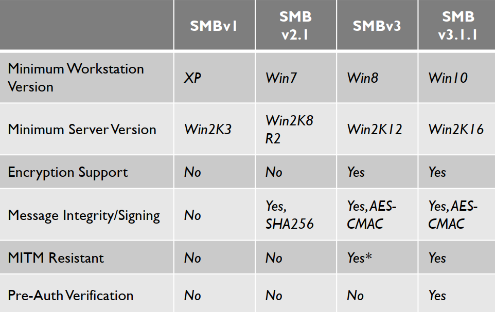

### Defending:

you should only allow SMB in specific servers like file servers or domain controller , config to block TCP port 445 and UPD/TCP 135-139 , also you can setup some PVLANs.

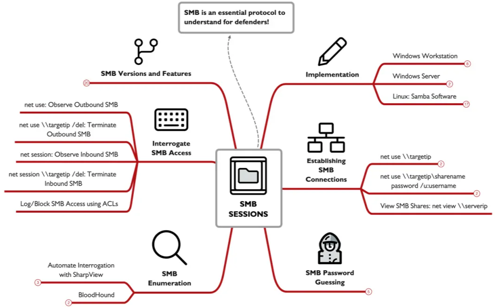

## DeepBlueCLI:

is a PowerShell script written by the one and only Eric Conrad, it parses windows event logs, it can make mistackes is a usful analysis tool not a perfect one, in dose not need any configrations it detects attacks from famouus attack frame works and show you the results using the logs, it can analysis data on a l;ive system or a reamot copnected , or ofline log files, 

 
this example shows an how the output looks like and even getting some artifact like the targeted username, and the attacking device name.

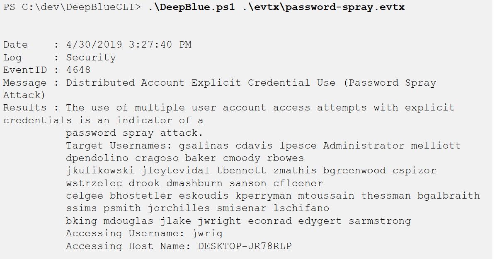

output formatting: as a PowerShell tool we can us ethe normal power shell commands wit it formatting the output in csv xml and any other format supported by PowerShell.

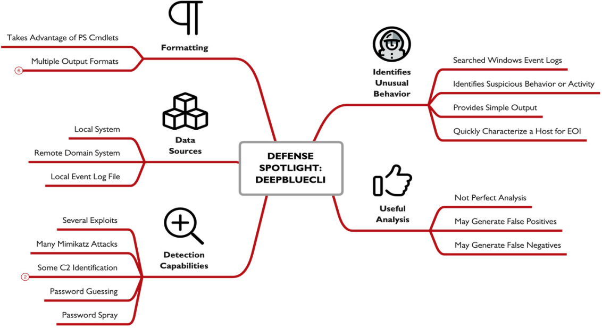

**الحمد لله done**