In order to defend, we first need to understand how hackers move and operate. This book covers attack concepts — we examine attacker tools, techniques, and procedures (TTPs) so we can defend better.


## MITRE ATT&CK Framework

The MITRE ATT&CK (Adversarial Tactics, Techniques, and Common Knowledge) framework is maintained by MITRE, a not-for-profit US company. The framework helps us map known adversary tactics, techniques, and procedures, characterize techniques used by adversaries, and identify adversary groups.

:::note
The enterprise matrix lives at [attack.mitre.org](https://attack.mitre.org/). Tactics are the columns, and techniques populate each column.
:::

## Open-Source Intelligence (OSINT)

Reconnaissance helps an attacker get a feel for your network before firing a single packet — just like in the real world, where you'd gather as much info as possible before robbing a bank: when the guards move, where the cameras are, how much money is on site, and maybe even the building's blueprints.

We can classify attackers into two main categories:

- **Non-discriminating attackers** — search for any target vulnerable to a known weakness. More like script kiddies, they skip recon and head straight to action.
- **Targeted attackers** — focus on a specific target. Before doing anything, they conduct detailed recon to gather as much info as possible, since that data comes in handy during the attack itself.

### Planned Sharing

Information shared online intentionally — annual reports, contact information, website content, etc.

### Unplanned Sharing

Organizations leak data online without realizing it. Sometimes this is unrecognized leaked information (like employee social media use), and sometimes it's the publication of data obtained illegally (compromised passwords, stolen documents).

:::note
OSINT is the practice of collecting all this scattered data into something useful — usernames, emails, server hostnames, or even something as specific as the CEO's Word version metadata. **MITRE ID: T1591.**
:::

### WHOIS

When registering a domain, registrars collect info about the registrant — name, number, email, and so on. After 2016, with the introduction of GDPR, most of that data is redacted, though you'll still find some unimportant fields exposed. **MITRE ID: T1596.002.**

### Certificate Transparency

Think of this as the new WHOIS. As browsers increasingly require SSL/TLS certificates to verify legitimate sites, Certificate Transparency became a CA requirement — CAs must publish logs of all issued certificates. Attackers use these logs to enumerate an organization's hostnames.

:::tip
[crt.sh](https://crt.sh) lets you search certificate transparency logs — sometimes surfacing subdomains that aren't yet publicly known elsewhere.
:::

### Have I Been Pwned

This site aggregates lists of usernames and passwords from major breaches. It doesn't hand out the actual passwords, but it does show which breaches a given account appeared in — and from there it's sometimes possible to correlate usernames with leaked passwords found elsewhere.

### OSINT Data Collection

The main challenge with OSINT is that data lives across many different sources, each providing a different piece of the picture. Most services are free, but some are paid, and accessibility/confidence in the data varies. This is where OSINT aggregator tools help.

### SpiderFoot

:::tip
SpiderFoot is an open-source OSINT data collection and analysis tool. It pulls data from hundreds of online sources and presents it with a graphical view of relationships.
:::

**When does OSINT stop?**

OSINT means collecting data from public sites and third parties. The moment you interact directly with the target, you've crossed out of OSINT territory.

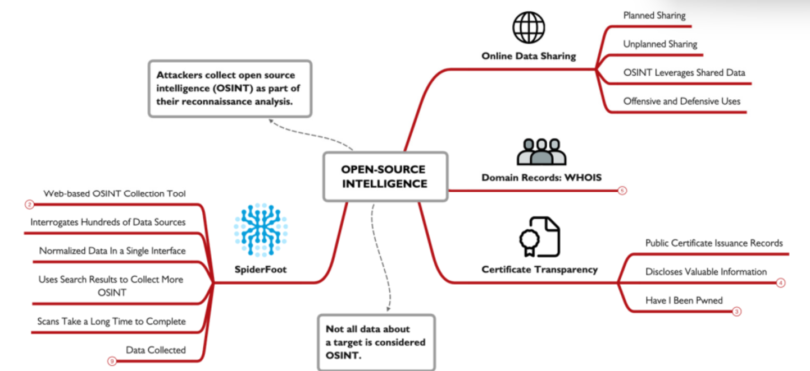

## DNS Interrogation

DNS provides valuable recon info for an attacker — IP addresses, hostnames, emails, MX records, and more. The two primary tools for this are `nslookup` and `dig`.

### Zone Transfer

A zone transfer lets an attacker connect to a DNS server and pull every record for a domain in one dump — revealing what machines are reachable on the internet. To attempt a zone transfer:

```bash title="Manual zone transfer via nslookup"
nslookup
server dnsserver
set type=AXFR
ls -d targetdomain
```

The `set type=AXFR` line tells `nslookup` we want all record types. This works on Windows and some Linux versions. On other systems, use:

```bash title="Zone transfer via dig"
dig @dnsserverip targetdomain AXFR
```

:::caution
Most DNS servers today don't permit zone transfers — they're considered a misconfiguration. If you get one, it's a serious finding.
:::

### Automated Interrogation

Since zone transfers are usually blocked, attackers fall back on automated interrogation — brute-forcing a list of common hostnames against a target domain to see which ones resolve. Nmap handles this well:

```bash title="DNS subdomain brute-force with Nmap NSE"
sudo nmap --script dns-brute --script-args dnsbrute.domain=holidayhackchallenge.com,dns-brute.threads=6,dnsbrute.hostlist=./namelist.txt -sS -p 53
```

Breaking this down: `--script-args` opens the argument list for the script, `dns-brute.domain` sets the target domain, `dns-brute.threads` sets how many requests fire concurrently, and `dns-brute.hostlist` points to the wordlist. The rest of the line is standard Nmap syntax.

:::tip
The quality of your wordlist directly determines the quality of your results. A solid starting point is [SecLists' DNS discovery wordlists](https://github.com/danielmiessler/SecLists/tree/master/Discovery/DNS).
:::

### Defending

To defend against DNS recon:

- Limit zone transfers — the primary DNS server should only allow transfers to secondary/tertiary DNS servers, and those servers should deny all transfer requests.
- Use split DNS — run separate internal and external DNS servers, so only public info is exposed externally and the internal server is reachable only from inside your network.
- Enable DNS server logging (e.g., Windows DNS logging) to spot brute-force or transfer attempts.

:::warning
It's easy to confuse legitimate DNS traffic with an attack, so be cautious before taking action on what looks suspicious. The right move is to report the IP to your threat intel team and add it to a watch list until you're confident it's malicious.
:::

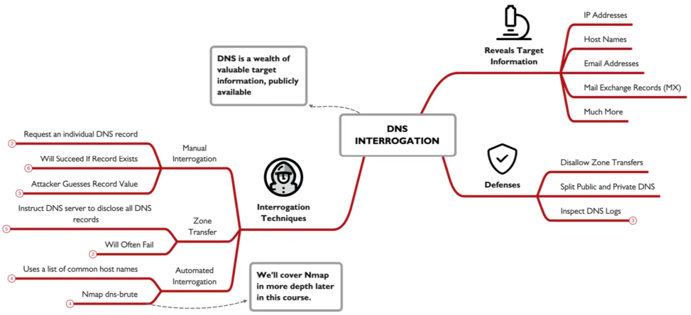

## Website Reconnaissance

Corporate websites often leak info like phone numbers or emails that are useful for social engineering. Some sites also describe their own platform or architecture in more detail than they should.

### Exiftool

After obtaining a document, `exiftool` can pull its metadata — sometimes revealing the application used to create it, along with the OS and machine details. An attacker can use this to hunt for CVEs affecting those specific versions.

### Website Crawling and Wordlist Generation

:::tip
CeWL (Custom Word List generator) crawls a target's web pages and common file formats to build a wordlist of words, emails, and metadata.
:::

Example — pull words 8+ characters long, plus metadata and emails, from whitehouse.gov:

```bash title="Crawling a site with CeWL"
cewl.rb -m 8 -w whitehouse.txt -a --meta_file whitehouse-meta.txt -e --email_file whitehouse-email.txt https://www.whitehouse.gov/
```

### Search Engines

Google search modifiers ("Google dorking") surface content that doesn't show up in a normal search. The Google Hacking Database (GHDB) catalogs a huge number of useful dork queries for finding exposed data on target domains. Fast Google Dork Scan (FGDS) is a script that automates running GHDB dorks against a target domain.

### Other Website Information

The U.S. Securities and Exchange Commission (SEC) is a useful source when researching publicly traded US companies. Sites like namechk and WhatsMyName.app help correlate usernames across platforms. Other useful sites include [shodan.io](https://www.shodan.io), [network-tools.com](https://www.network-tools.com), [viewdns.info](https://viewdns.info), and [securityspace.com](https://www.securityspace.com).

### Defending

Periodically check your own OSINT footprint to make sure nothing's leaked. You can add a `robots.txt` to block certain URLs from search indexing — but be careful: anyone can simply view `robots.txt` directly and see exactly what you're trying to hide via `Disallow` entries. Keep an eye on your logs, since they'll often flag suspicious activity before it escalates.

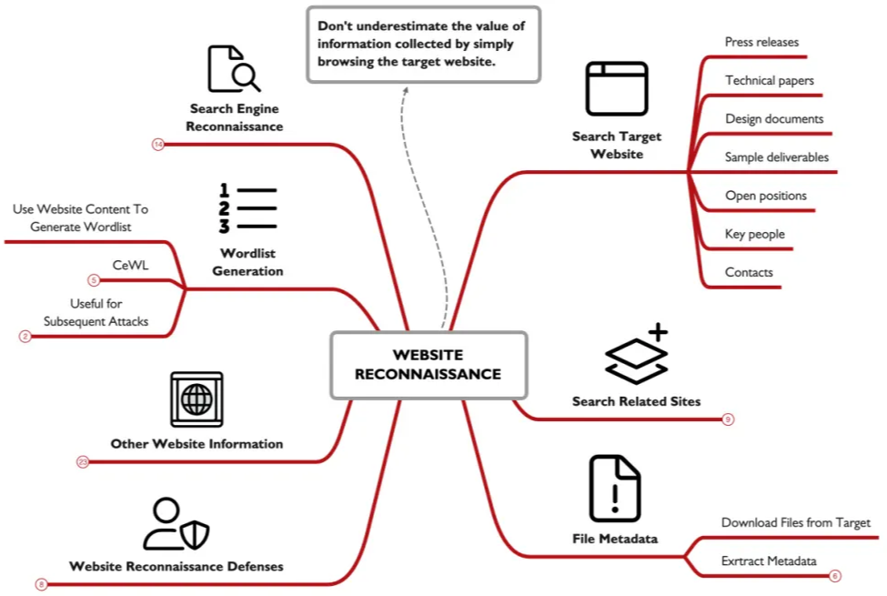

## Network and Host Scanning with Nmap

An attacker needs to understand the network topology they're working with — router and host layout can reveal vulnerabilities or show exactly where things are. Nmap is the standard tool for mapping networks and scanning ports. It's CLI-based, but also has a GUI front end called Zenmap. **MITRE ID: T1046.**

### Sweeping

A common first step in network mapping is sweeping the address space — sending a packet to every address and waiting for a response to determine if it's in use. As root, Nmap sends four probe types per host: ICMP Echo Request, TCP SYN to port 443, TCP ACK to port 80, and an ICMP Timestamp request. Without root privileges, Nmap can only send a TCP SYN to ports 80 and 443 (it can't craft the raw ACK packet without elevated privileges).

**Host Discovery:**

```bash title="Host discovery sweep with Nmap"
sudo nmap -sn 192.168.1.1-254
```

Add `-Pn` to skip the host-discovery phase entirely and treat all hosts as online.

### IP Header

Two fields matter most for mapping: the source/destination IP addresses, and the Time to Live (TTL) field in IPv4 (Hop Limit in IPv6).

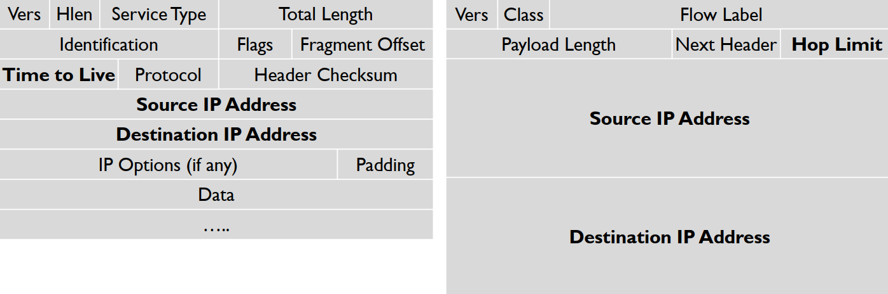

TTL/Hop Limit determines how many hops a packet can traverse before being dropped. You can observe this directly with `tracert` (Windows) or `traceroute` (Linux).

### Traceroute

When a router receives a packet, it checks the TTL, decrements it by 1, and forwards it on. If the TTL hits zero, the router sends a "Time Exceeded" message back to the originator. Traceroute exploits this by sending a series of packets with incrementing TTL values, eventually mapping every hop between source and destination.

Example:

```bash title="Traceroute mapping with Nmap"
sudo nmap -sn --traceroute 216.239.191.182-200 -oA insecure-net
```

`-sn` disables port scanning, `--traceroute` requests the path to each discovered host, and `-oA` saves the results in all output formats. Once Nmap finishes, you can load the results into Zenmap for a graphical view of the network.

### Port Scanning

Ports are like open windows an attacker can use to get into your system, so port scanning is a core recon step. **MITRE ID: T1046.** There are 65536 ports each for TCP and UDP (0–65535); port 0 is reserved and any traffic to it is dropped.

### TCP Three-Way Handshake

A legitimate TCP connection is established through this handshake:

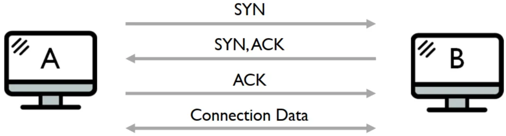

Six control bits describe a packet's role in the connection:

- **SYN** — Synchronize
- **ACK** — Acknowledgment
- **FIN** — End a connection
- **RST** — Tear down a connection
- **URG** — Urgent data is included
- **PSH** — Data should be pushed through the TCP stack

### Scan Types

- **Ping sweeps** — send a variety of probe packet types to identify live hosts.
- **ARP scans** — identify hosts on the same LAN as the scanning machine.
- **Connect scans** — complete the full three-way handshake. Slow and easily detected, since the entire handshake completes for every port scanned.
- **SYN scans** — send only the initial SYN and wait for SYN-ACK; the final ACK is never sent. Faster and stealthier, since most hosts only log fully completed connections.
- **UDP scanning** — locates vulnerable UDP services. For most UDP ports, Nmap sends an empty payload.
- **Version scanning** — attempts to fingerprint the version of the service listening on a discovered port (TCP or UDP).
- **IPv6 scanning** — iterates through IPv6 address ranges, invoked with `-6`.

```bash title="Full port and OS detection scan"
sudo nmap -sS 192.168.1.10 -O -oA target-host
```

This returns all open ports along with the services and OS running on the target.

### NSE Scripts

:::tip
Nmap's Scripting Engine (NSE) ships with a huge library of scripts for everything from vuln detection to enumeration. The `-sC` flag runs the default script set.
:::

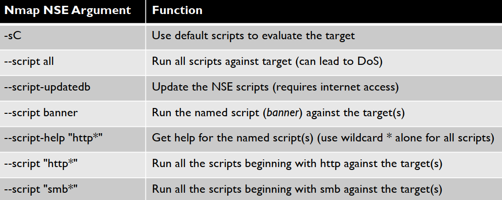

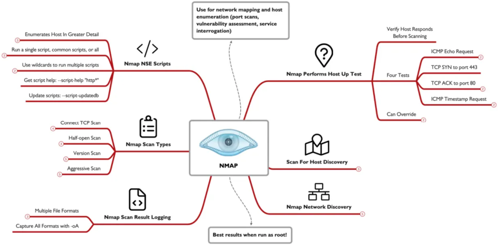

## Cloud Spotlight: Cloud Scanning

Scanning a cloud environment seems like it should be impossible, but attackers have found ways around it — explained below. An attacker operating from within the same cloud provider can sometimes bypass firewalls entirely, and cloud environments tend to be far less monitored than traditional on-prem networks. **MITRE ID: T1046.**

### JQ and JSON

Working with cloud platforms almost always means working with JSON, since every major cloud provider uses it extensively. [jq](https://jqlang.github.io/jq/) is a lightweight command-line JSON processor and query language, and it's essential for this kind of work.

### Cloud Scanning

Scanning is just one technique for identifying cloud assets — OSINT and DNS recon can also surface useful info.

:::tip
[BuiltWith.com](http://BuiltWith.com) can identify a target's cloud provider, which is often the first piece of info an attacker needs for this approach.
:::

### Exhaustive IP Address Enumeration

Once an attacker identifies the cloud provider, they can pull the full list of IP ranges associated with that provider — which will include the target's IP somewhere in that range.

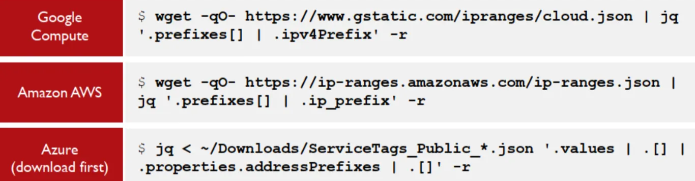

### Masscan

When dealing with IP ranges this large, Nmap becomes impractical — it's too slow for the task. Masscan solves this differently: instead of Nmap's send-SYN-then-wait-for-ACK approach, masscan fires all SYN packets up front and handles incoming ACKs in a separate process, making port scanning dramatically faster.

Pull all AWS IP ranges for the us-east-1 region:

```bash title="Pull AWS us-east-1 IP ranges"
wget -qO- https://ip-ranges.amazonaws.com/ip-ranges.json | jq '.prefixes[] | if .region == "us-east-1" then .ip_prefix else empty end' -r | sort -u > us-east-1-range.txt
```

Scan port 443 across that entire range:

```bash title="Mass port scan with masscan"
sudo masscan -iL us-east-1-range.txt -oL us-east-1-range.masscan -p 443 -rate 100000
```

At 100k packets/second, this can scan roughly 33 million IPs in about 5.5 hours.

:::caution
Running masscan at very high rates increases false negatives. Lowering the rate improves accuracy at the cost of scan time — there's a real tradeoff here, not a free lunch.
:::

**Attributing Hosts:** From the scan results, you have a list of IPs with port 443 open. You can now pull TLS certificate data to glean more info about each host:

```bash title="Pull certificate subject with openssl"
openssl s_client -connect 18.207.73.1:443 2>/dev/null | openssl x509 -text | grep Subject:
```

This pulls the Subject line from the certificate, but `openssl` only connects to one server at a time. For bulk work, use **TLS-Scan** instead, which reads a list of IPs and extracts certificate info across multiple hosts and ports:

```bash title="Bulk TLS certificate enumeration with TLS-Scan"
cat us-east-1-range.tlsopen | tls-scan --port=443 --cacert=ca-bundle.crt -o us-east-1-range-tlsinfo.json
```

This reads the IP list, pulls certificate info for each, and saves it to a JSON file. TLS-Scan is fast and non-blocking, but bulk scans still take time. From there, `jq` is your friend for parsing the resulting JSON.

### EyeWitness

:::tip
EyeWitness takes screenshots of target sites and helps identify their purpose — default pages, management interfaces, exposed directory listings, and in some cases even default credentials. Feed it URLs derived from your masscan/TLS-scan results:
:::

```bash title="Run EyeWitness against a URL list"
python3 /opt/eyewitness/EyeWitness.py --web -f urllist.txt --prepend-https
```

### Defense

As defenders, we can't realistically log and monitor every step of this chain. The best approach is to limit exposure — e.g., API servers should only be reachable through an application firewall, never directly from the public internet. Most of the time you won't catch the scanning itself, but you can control what happens afterward, so keep close watch on your logs.

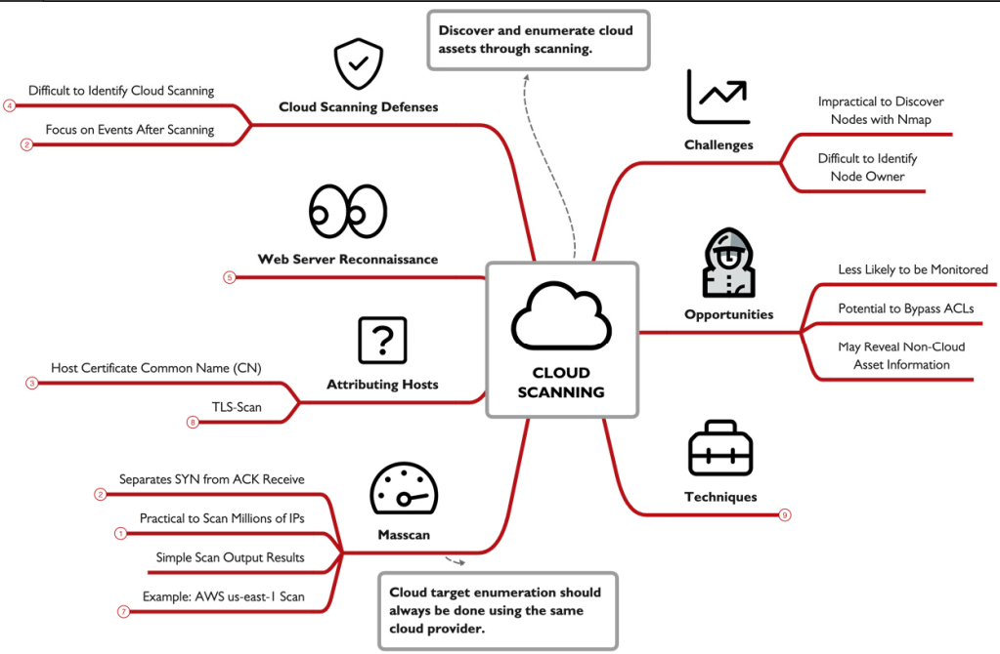

## SMB Sessions

Server Message Block (SMB) provides network access to Windows machines — file sharing, `net use`, registry access, and more. Because it controls so much core functionality, it's a high-value target for attackers. SMB runs on TCP port 445, while older versions also use TCP/UDP ports 135–139. **MITRE ID: T1135, T1077, T1110.**

### Establishing an SMB Session from Windows

```bash title="Establish an SMB session (implicit credentials)"
net use \\targetip
```

Without specifying a username, this uses the credentials of whoever ran the command. You can also specify credentials and a share explicitly:

```bash title="Establish an SMB session with explicit credentials"
net use \\targetip\sharename password /u:username
```

You don't need admin rights to connect to another device over SMB.

### Interrogating Targets

After connecting with `net use \\targetip`, run:

```bash title="Enumerate shares on a target"
net view \\targetip
```

This lists available shares (not the default admin shares).

**Password Guessing:**

```bash title="Dump domain users"
net user /domain > users.txt
```

This dumps a list of domain users. Build a password wordlist and pair it against the usernames.

:::caution
Keep your guess count below the account lockout threshold, or you'll lock out the accounts you're testing — and tip off the defenders.
:::

```bash title="Password spray against SMB with nested FOR loops"
@FOR /F %p in (pass.txt) DO @FOR /F %n in (users.txt) DO @net use \\SERVERIP\IPC$ /user:DOMAIN\%n %p 1>NUL 2>&1 && @echo [*] %n:%p && @net use /delete \\SERVERIP\IPC$ > NUL
```

This loops through every username/password combination and echoes any successful hit to the console. It's that simple — and yes, real attackers use exactly this technique, partly because it tends to slip past most IPS/IDS solutions.

### SharpView

:::tip
SharpView is an enumeration tool that collects data about a Windows environment using a non-admin account. Useful commands include `Get-DomainUser`, `Get-DomainGroup`, and `Get-NetComputer` — the latter returns machine names, OS versions, and more.
:::

```bash title="Enumerate domain users with SharpView"
sharpview Get-DomainUser -Domain sec504.org -Credential ksmith/Password123 -Server 192.168.99.10 | findstr "^name"
```

This pulls all usernames in a domain.

### BloodHound

Another graph-based enumeration tool that maps relationships between users, groups, and systems — helping an attacker chart the shortest path to Domain Admin.

### Establishing SMB Sessions from Linux

You can attack a Windows system from Linux too, using `smbclient`. You may need to specify the SMB version explicitly:

```bash title="List shares with smbclient"
smbclient -L //192.168.99.10 -U ksmith -m SMB2
```

This lists available shares. For an interactive session:

```bash title="Interactive SMB session with smbclient"
smbclient //192.168.99.10/accounting$ -U ksmith -m SMB2
```

From here you get an interactive shell with commands like `ls`, `cd`, `get`, and `put`.

Another option is `rpcclient`:

```bash title="Connect with rpcclient"
rpcclient -U username server
```

This gives you an interactive session after authentication, with commands including:

- `enumdomusers` — list users
- `enumalsgroups domain|builtin` — list alias groups
- `lsaenumsid` — show all defined user SIDs
- `lookupnames` — get the SID for a given username
- `lookupsids` — get the username associated with a SID
- `srvinfo` — show OS type and version

### Seeing and Dropping SMB Sessions

View active outbound sessions:

```bash title="View active outbound SMB sessions"
net use
```

Drop a specific session:

```bash title="Drop a specific outbound session"
net use \\[IPaddr] /del
```

Drop all sessions:

```bash title="Drop all outbound sessions"
net use * /del
```

View inbound sessions:

```bash title="View inbound SMB sessions"
net session
```

Drop a specific inbound session:

```bash title="Drop a specific inbound session"
net session \\[IPaddr] /del
```

:::tip
The ability to drop a session is genuinely useful during an active incident — it can disconnect an attacker temporarily, buying you time to respond.
:::

### SMB Versions

Older SMB versions are still in use today and should be disabled wherever possible:

```bash title="Disable SMBv1 on Windows"
Disable-WindowsOptionalFeature -Online -FeatureName smb1protocol
```

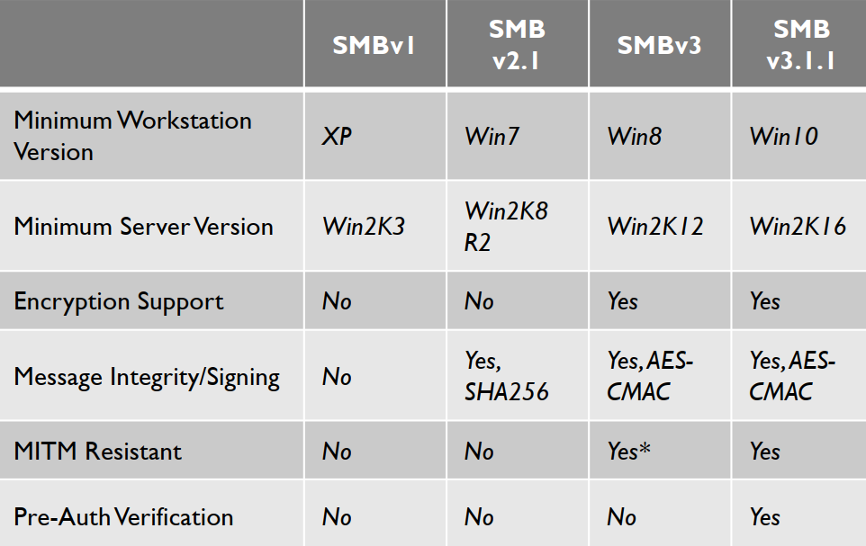

### Defending

Restrict SMB to specific servers — file servers and domain controllers — and block TCP 445 plus UDP/TCP 135–139 everywhere else. Consider segmenting with PVLANs as an additional layer.

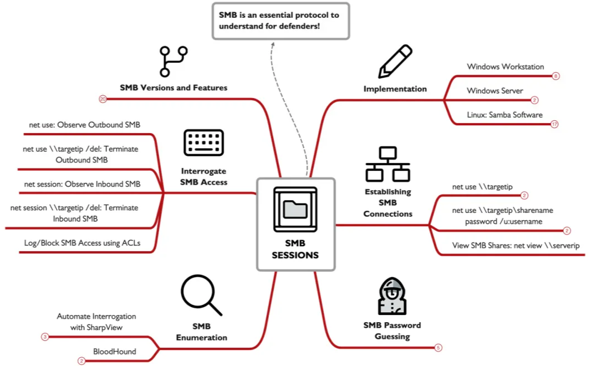

## DeepBlueCLI

:::important
DeepBlueCLI, written by Eric Conrad, is a PowerShell script that parses Windows event logs and flags activity matching known attack frameworks. It can produce false positives — it's a useful analysis aid, not a perfect detector — but it works against live systems, remote systems, or offline log files.
:::

The example below shows typical output, including extracted artifacts like the targeted username and the attacking device's name.

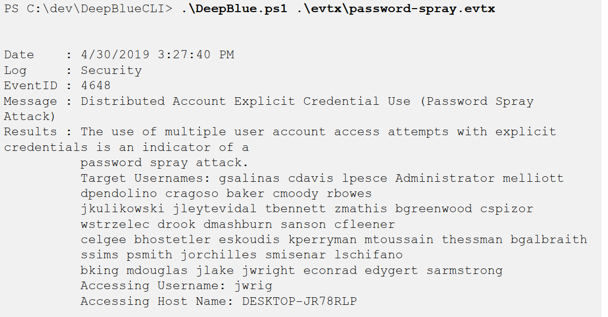

**Output formatting:** since it's a PowerShell tool, you can pipe its output through standard PowerShell formatting cmdlets to export as CSV, XML, or any other supported format.

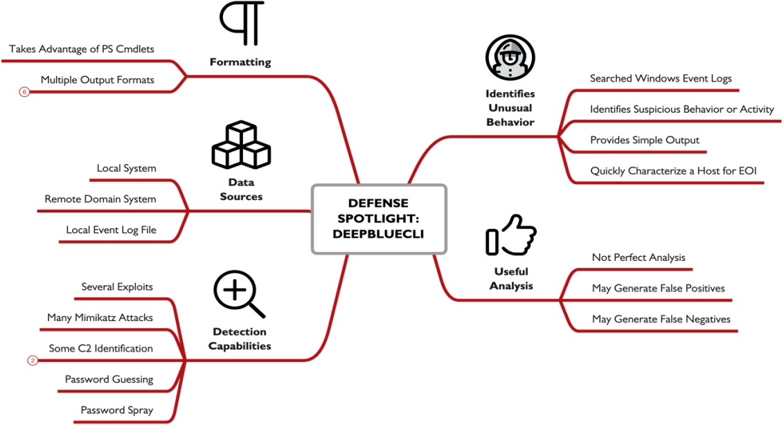

**الحمد لله done**