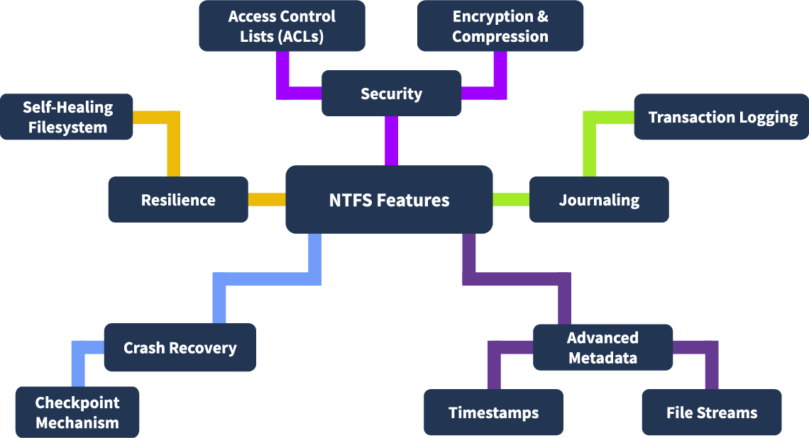

# NTFS

NTFS (New Technology File System) is the default file system for Windows operating systems, developed by Microsoft. This file system is known for its robustness, scalability, advanced features like file permissions, encryption, journaling, and support for large files and partitions. is organizes data in a way that makes it efficient for the operating system and significant for forensic investigations.

## **Overview:**

NTFS has been the default file system for Windows operating systems since Windows NT 3.1, way back in 1993. 

it can be also classified as a Journaling file system because it maintain the file system's consistency by recording the changes within the file system in a journal (log) before applying them. this is useful when recovering the OS from unexpected system crashes, power failures,...  

### key features of NTFS :

**Advanced Metadata:** it provides detailed metadata, including file creation, modification, and access times.

**Journaling:** uses  journaling to keep track of changes. This helps recover data after crashes and provides us with LOGS. which is very helpful in forensics .

**Security Features:** supports encryption (EFS) and permissions, which is  analyzed to understand access patterns and security breaches.

**Large Volume Support:** handles large volumes and files, making it reliable in the modern world .

**Resilience:**  resilient to corruption compared to FAT32, due to its robust structure and recovery mechanisms.

**Compatibility:** primarily for Windows, its can be read (sometimes written) on Linux and macOS with third-party tools.

**Compression:**  has built-in file compression.

### comparison with other file systems:

| Feature | NTFS | FAT32 | exFAT |
| --- | --- | --- | --- |
| **Max Drive Size** | 256 TB | 2 TB | 128 PB |
| **Max File Size** | 256 TB | 4 GB | 16 EB |
| **Crash Recovery** | Yes (keeps track of all changes) | No | No |
| **Encryption** | Yes (built-in encryption) | No | No |
| **Compression** | Yes | No | No |
| **File Permissions** | Yes (control who accesses what) | No | No |
| **Reliability** | High (less likely to corrupt) | Low (older and more prone to issues) | Moderate (better than FAT32 but not as good as NTFS) |
| **Works Across Devices** | Windows (limited compatibility with Mac/Linux) | Universal / works on almost anything | Universal  |
| **Best For** | Modern Windows systems | Older systems or small USB drives | Flash drives, SD cards, and external drives |

## NTFS Components

NTFS is organized into several components, each serving a specific purposes to ensure efficiency. From a forensic pov, these components hold critical information , like timestamps, deleted files, and traces of system activity.

/

### **Partition Boot Sector (PBS)**

at the First sector of an NTFS volume. Facilitates booting by locating and loading the operating system.

in contains: Jump instruction to bootstrap code. File system type indicator (e.g., NTFS). BIOS Parameter Block (BPB): Defines disk layout (e.g., sectors per cluster, Master File Table location). End-of-sector marker: 0x55AA.

**in Forensic** : Reveals boot process and disk configuration. Can detect tampering (e.g., malware/rootkits altering boot code). Validates BPB integrity.

### **Master File Table (MFT)**

Central database containing metadata for every file and directory on the NTFS volume. Divided into fixed-size records (typically 1 KB). Each file/directory has an MFT entry. Stores attributes: timestamps, permissions, data location.

**in Forensic**: Contains deleted file records for potential recovery. Timestamps (creation, modification, access) aid timeline analysis. Detects unauthorized metadata changes.

### **$MFTMirr (MFT Mirror)**

Backup of the first few MFT records for redundancy. Stored separately from the primary MFT.

**in Forensic**: Cross-verifies MFT integrity. Recovers metadata if primary MFT is corrupted or tampered.

### **System Files**

Manage internal NTFS operations.

**Key Files**:

- $MFT: Master File Table.
- $MFTMirr: MFT Mirror.
- $LogFile: Transactional log for file system consistency.
- $Bitmap: Tracks allocated/free clusters.
- $Boot: Stores boot sector information.
- $BadClus: Tracks bad sectors.
- $UpCase: Uppercase character mapping for case-insensitive comparisons.

**in Forensic:** $LogFile: Reveals history of file system operations. $Bitmap: Identifies recent cluster allocations/deletions. $BadClus: May indicate intentional data hiding in marked bad sectors.

### **File Data Area**

Stores actual file and directory content.

**Types**: **Resident**: Small files stored within MFT. **Non-resident**: Larger files stored in separate clusters.

**in Forensic**: Primary source for user data recovery. Slack space and file fragments may contain residual data.

### **Alternate Data Streams (ADS)**

Allows multiple data streams per file/directory. Primary stream: Main file content. Additional streams: Hidden metadata or content.

**in Forensic**: Hidden data in ADS may reveal malicious activity or concealed files. Does not affect visible file size, making it a forensic blind spot.

### **FTK Imager:**

**Loading the Disk Image**

Open **FTK Imager** Go to **File > Add Evidence Item**. Navigate to **Partition > NONAME [NTFS] > [root]** to view NTFS components.

**Artifacts**

$MFT: Master File Table (file metadata). $LogFile: Transactional log (file system operations). $I30: NTFS Index Attribute (directory indexing). $Extend: Metadata for extended features (e.g., reparse points). $UsnJrnl: Update Sequence Number Journal (tracks file changes).

locate each component in the root directory. Right-click each file and select **Export Files**. Save to **Desktop** for offline analysis.

**Forensic Significance of NTFS Components**

**Timeline Analysis**: $MFT and $UsnJrnl provide timestamps and change logs for reconstructing events.

**Data Recovery**: Deleted files in $MFT or slack space in the File Data Area. $MFTMirr for corrupted MFT recovery.

**Tampering Detection**: PBS and $LogFile reveal boot code or file system modifications. $BadClus may indicate hidden data.

**Hidden Data**: ADS and $Extend may conceal malicious or sensitive data.

## **Master File Table (MFT)**

the core component of the NTFS file system, acting as a database that tracks metadata for every file and directory on the disk.  Each file or directory has a corresponding MFT record (typically 1 KB), containing detailed metadata.

**in Forensic**: Provides a comprehensive map of file system activity, including deleted files, timestamps, and metadata, making it a critical resource for investigations.

### **Contents of an MFT Record**

**File Name**: Name of the file or directory.

**Standard Information**: Includes link count, timestamps, file attributes (e.g., read-only, hidden).

**Attributes**: Metadata such as MACB timestamps, permissions, and flags.

**File Data**:

- Resident: Small files stored within the MFT record.
- Non-resident: Pointers to clusters where larger file data is stored.

**File Index**: Indexes for directories, pointing to other files or subdirectories.

**Security Information**: Access Control Lists (ACLs) defining permissions.

**Visualization**: MFT records are viewable in hex format (e.g., via FTK Imager), showing structured metadata.

### **Forensic Value of MFT**

as they are considered an invaluable source of evidence because they provide a comprehensive map of the file system activity and the timeline. Some of the key aspects of MFT records, from the forensics point of view, are: It provides evidence of the presence of a certain file on the disk, even if the file is deleted. It can also provide evidence of file modification, which could be useful in certain forensics use case

### **Extracting MFT Records Using MFTECmd.exe**

`MFTECmd.exe --help`

 **Extract MFT Records**: `MFTECmd.exe -f ..\Evidence\$MFT --csv ..\Evidence --csvf ..\Evidence\MFT_record.csv`

**Output**:  MFT_record.csv  Automatically loads into **Timeline Explorer** for analysis.

### **Important Columns:**

- **Entry Number**:

Unique identifier for each MFT record. Tracks specific files/directories.

- **Parent Entry Number**:

Indicates the parent directory’s MFT entry. Reconstructs file system hierarchy.

- **Sequence Number**:

Increments when an MFT record is reused. Differentiates old vs. new files in the same entry.

- **File Name**:

Name of the file/directory. Matches files to user or process activity.

- **Timestamps (MACB)**:
    - **Creation Time**: File/directory creation.
    - **Modification Time**: Last content change.
    - **Access Time**: Last read/open.
    - **MFT Record Modification Time**: Last metadata update.
    - **Importance**: Critical for timeline analysis and event reconstruction.
- **Flags**:

Indicates file, directory, or unused record. Identifies active vs. deleted records.

- **Entry Flags**:

Attributes like read-only, hidden, system. Detects malware-related files (e.g., hidden/system).

- **In Use**:

Shows if the record is active or deleted. MFT retains deleted file records.

- **Logical Size**:

Size of the file’s actual data. Detects anomalies (e.g., empty files with data).

- **Physical Size**:

Disk space allocated to the file. Identifies slack space or fragmentation.

### **MACB Timestamps:**

Metadata timestamps in NTFS:

- **M (Modified)**: Last content change.
- **A (Accessed)**: Last file read/open.
- **C (Changed)**: Last metadata change (e.g., permissions).
- **B (Birth/Creation)**: File creation time.

**Forensic Importance**:

**Timeline Reconstruction**: Maps file activity to events (e.g., user actions, attacks). **Anomaly Detection**: Identifies unusual access/modification patterns (e.g., post-compromise changes). **Correlation**: Matches timestamps to logs or external events. **Timestomping Detection**: Attackers may alter timestamps to hide activity; inconsistencies in MACB times can reveal manipulation.

## NTFS Journaling

 maintains a transactional record of changes to the file system, ensuring integrity and recoverability after crashes or power failures. Prevents data loss and corruption. Facilitates forensic analysis by tracking file system activity.

**Key Features**:

- **File System Integrity**: Recovers from crashes, minimizing data loss.
- **Deleted Files**: Tracks deletions for timeline analysis.
- **USN vs. Log File**: USN Journal tracks file changes; $LogFile tracks MFT metadata changes.
- **Historical Data Access**: Volume Shadow Copies allow analysis of older journal versions.

### **Types of NTFS Journals:**

- **$LogFile:**

Records metadata changes (e.g., file creation, deletion, modification) before they are committed to disk. **Location**: Root directory of the NTFS volume. Ensures file system consistency during recovery by replaying transactions. Critical for maintaining NTFS reliability. **in Forensic** : Reveals history of metadata operations. Detects tampering or unauthorized changes to the file system.

- **USN Journal ($UsnJrnl)**

Tracks changes to files, directories, and attributes, providing a historical record of file system activity. **Location**: $Extend directory in the root directory. **$Max**: Defines maximum journal size and allocation policy. **$J**: Stores actual change records (implemented as an Alternate Data Stream, ADS).**in Forensic** : Tracks file system events (e.g., creation, deletion, renaming). Essential for timeline analysis and detecting suspicious activity.

### **Extracting and Analyzing $J (USN Journal)**

FTK Imager and `MFTECmd.exe` 

**in FTK Imager**. Navigate to $Extend > $UsnJrnl > $J. Right-click $J and select **Export Files** to ..\Evidence.

**Command to Parse $J**: `MFTECmd.exe -f ..\Evidence\$J --csv ..\Evidence --csvf USNJrnl.csv`

**Output**: USNJrnl.csv in the Evidence folder.

### **Examining the USN Journal ($J)**

**Key Column: Update Reason**:

Lists opcodes indicating the type of file system change.

- Common opcodes and their meanings:
    
    
    | Opcode | Description |
    | --- | --- |
    | USN_REASON_DATA_OVERWRITE | File/directory data overwritten. |
    | USN_REASON_DATA_EXTEND | File/directory data extended (e.g., size increased). |
    | USN_REASON_DATA_TRUNCATION | File/directory data truncated (e.g., size decreased). |
    | USN_REASON_NAMED_DATA_OVERWRITE | Alternate Data Stream (ADS) overwritten. |
    | USN_REASON_NAMED_DATA_EXTEND | ADS extended. |
    | USN_REASON_FILE_CREATE | New file/directory created. |
    | USN_REASON_FILE_DELETE | File/directory deleted. |
    | USN_REASON_RENAME_OLD_NAME | File/directory renamed (old name recorded). |
    | USN_REASON_CLOSE | File/directory handle closed after changes. |

**in Forensic** :

Reconstructs file system activity (e.g., file creation/deletion timelines). Identifies suspicious changes (e.g., mass deletions, ADS modifications).

## NTFS $I30 Index Attribute

is an NTFS index allocation attribute that serves as a directory index, maintaining a structured layout of files and subdirectories within a directory. Stores metadata about files and subdirectories (e.g., filenames, timestamps). Enables efficient file retrieval and management by the Windows OS. **Location**: Found in directories (e.g., [ROOT]/metasploit in FTK Imager), classified as NTFS Index Allocation.

### **Slack Space in $I30**

 Residual data in the $I30 index from files that were deleted, renamed, or moved. **Characteristics**: Deleted file entries may remain in $I30 until overwritten. Marked with a red cross in FTK Imager, indicating absence from the active directory.

### **Forensic Value of $I30**

**Deleted Files**: Metadata for deleted files persists in $I30, enabling recovery or confirmation of file existence.

**Renamed/Moved Files**: Tracks file renaming or movement, useful for reconstructing file history.

**Hidden Files**: File attributes in $I30 reveal hidden or system files, potentially indicating malware.

### **Analyzing $I30 with FTK Imager and MFTECmd.exe**

Open **FTK Imager**.Navigate to [ROOT]/metasploit directory. Locate $I30 (NTFS Index Allocation). Right-click and **Export Files** to ..\Evidence.

**`MFTECmd.exe`**

`MFTECmd.exe -f ..\Evidence\$I30 --csv ..\Evidence\ --csvf i30.csv`

Output: Saves parsed data as i30.csv in the Evidence folder.

### **Key Metadata in $I30**

- Filename
- From Slack
- File Size
- Parent Directory Information
- Timestamps (MACB)
- File Attributes
    - Read Only
    - Hidden
    - Directory / File
    - Archive / Compressed / Encrypted
    - System