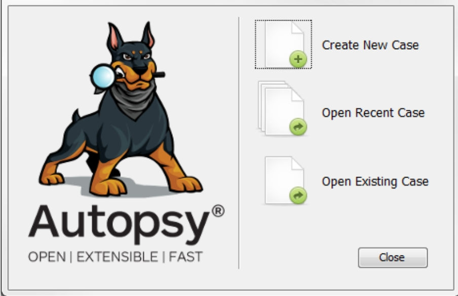
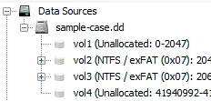

# Autopsy

**is the premier open source forensics platform which is fast, easy-to-use, and capable of analyzing all types of mobile devices and digital media.**

## **Workflow Overview:**

to start we will have to do a few steps:

- Create/open the case for the data source you will investigate
- Select the data source you wish to analyze
- Configure the ingest modules to extract specific artefacts from the data source
- Review the artefacts extracted by the ingest modules
- Create the report

the welcome tab have 3 functions :

create a new case: its when you are the open starting the investigation 

open recent and lastly existing case 

## **Data Sources:**

Autopsy can analyze multiple disk image formats.

- **Raw Single** (For example: *.img, *.dd, *.raw, *.bin)
- **Raw Split** (For example: *.001, *.002, *.aa, *.ab, etc)
- **EnCase** (For example: *.e01, *.e02, etc)
- **Virtual Machines** (For example: *.vmdk, *.vhd)

## **Ingest Modules:**

are plug-ins Each one is designed to analyze and retrieve specific data from the drive. You can configure Autopsy to run specific modules during the source-adding stage or later by choosing the target data source available on the dashboard.

## interface:

### **Tree Viewer** has **nodes**:

- **Data Sources** all the data will be organized as you would typically see it in a normal Windows File Explorer.
- **Views** - files will be organised based on file types, MIME types, file size, etc.
- **Results** - as mentioned earlier, this is where the results from Ingest Modules will appear.
- **Tags** - will display files and/or results that have been tagged.
- **Reports** - will display reports either generated by modules or the analyst .

### **Result Viewer:**

When ****a volume, file, folder, etc., is selected from the Tree Viewer, additional information about the selected item is displayed here. 

i fell decimation will take a lot of time so  from here on with tools i i will attach good videos  

[https://www.youtube.com/watch?v=fEqx0MeCCHg&t=5s](https://www.youtube.com/watch?v=fEqx0MeCCHg&t=5s)