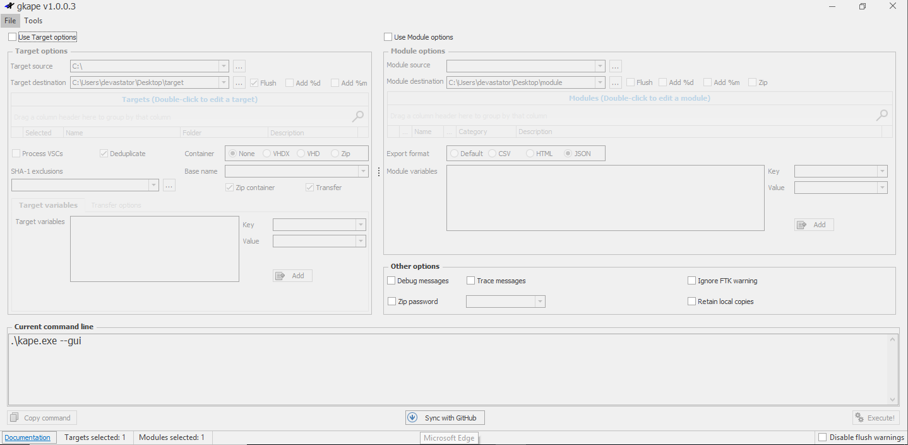

# KAPE

**Kroll Artifact Parser and Extractor**, is a powerful tool designed for Windows forensics. It significantly reduces the time required to respond to incidents by collecting and processing forensic artifacts from live systems or storage devices. KAPE is highly configurable and portable, meaning it doesn’t need to be installed and can be run from network locations or USB drives.

---

### Key Concepts in KAPE

1. **Targets**:
    - Targets are the forensic artifacts that KAPE collects from a system or image.
    - They are defined using `.tkape` files, which specify the paths, categories, and file masks for the artifacts.
    - Examples of targets include Windows Prefetch files, registry hives, and event logs.
    - Targets can be grouped into **Compound Targets**, which allow multiple targets to be collected with a single command (e.g., `!BasicCollection` or `!SANS_triage`).
2. **Modules**:
    - Modules are programs that process the collected artifacts and extract information from them.
    - They are defined using `.mkape` files, which specify the executable to run, command-line parameters, and output format.
    - Examples of modules include parsing Prefetch files (`PECmd`) or extracting information from registry hives (`Registry Explorer`).
    - Modules can also be grouped into **Compound Modules** for processing multiple artifacts at once.
3. **bin Directory**:
    - The `bin` directory contains executables required by modules but not natively present on most systems.
    - For example, Eric Zimmerman’s tools (e.g., `PECmd`, `RBCmd`) are often stored here.

### GUI Version (`gkape.exe`)

- The GUI version provides a user-friendly interface for configuring and running KAPE.
- Key options include:
    - **Target Source**: The drive or directory to collect artifacts from (e.g., `C:\`).
    - **Target Destination**: The directory where collected artifacts will be saved.
    - **Modules**: Tools to process the collected artifacts.
    - **Transfer Options**: Options for transferring collected data via SFTP or S3.
    
    after your done you just copy the generated command at the bottom and paste them in the cli version 
    

[GitHub - EricZimmerman/KapeFiles: This repository serves as a place for community created Targets and Modules for use with KAPE.](https://github.com/EricZimmerman/KapeFiles?tab=readme-ov-file)

[https://www.youtube.com/watch?v=DXE0INTu9ek](https://www.youtube.com/watch?v=DXE0INTu9ek)