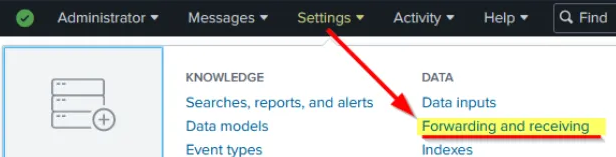
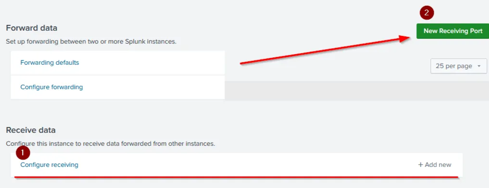
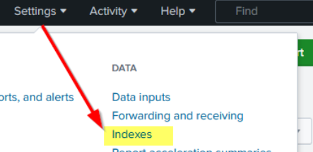
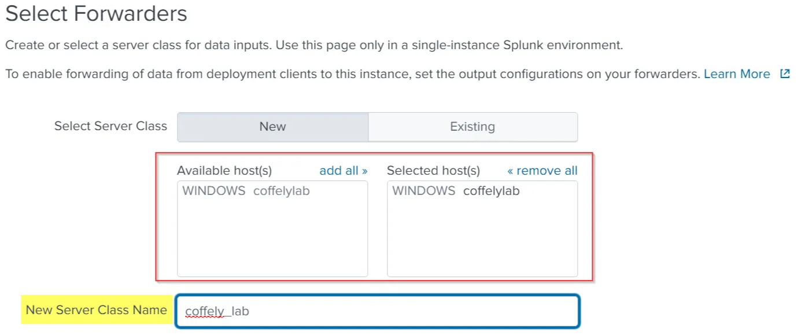
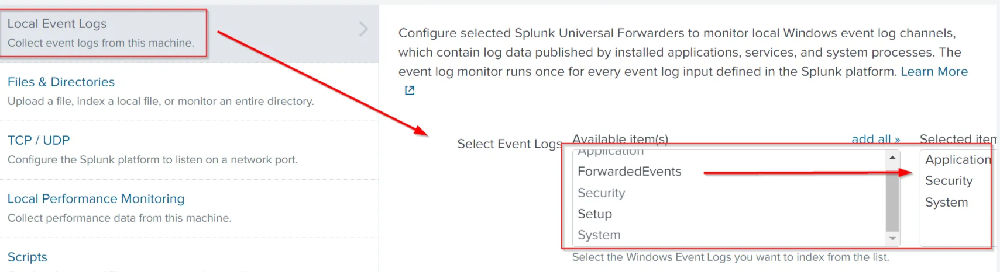
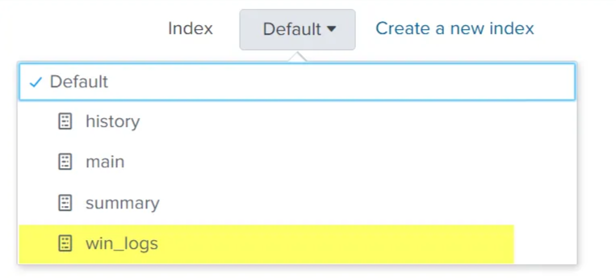

# Splunk

# **Installing Splunk:**

## **Installing Splunk for** Linux**:**

Download the Splunk Enterprise installer for Linux from the [Splunk Enterprise download page](https://www.splunk.com/en_us/download/splunk-enterprise.html).

Switch to Root  `sudo su` ,  Uncompress the Installer `tar xvzf splunk_installer.tgz` , Move splunk to to opt  `mv splunk /opt/`  ,Navigate to the Bin Directory  `cd /opt/splunk/bin` , Start Splunk `./splunk start --accept-license`  u will be asked to enter a user name and a passwords (you need to remember them) , Access Splunk at [http://coffely:8000](http://coffely:8000) 

### Useful commands:

- **Start:**

Start the Splunk server.  `./bin/splunk start` , Confirms Splunk processes are running and provides the web interface URL.

- **Stop:**

Stop the Splunk server. `Stop the Splunk server.`

- **Restart:**

Restart the Splunk server.  Apply configuration changes or resolve issues. `./bin/splunk restart`

- **Status:**

Check the status of the Splunk server. Verify if Splunk is running and identify errors. .`/bin/splunk status` , Displays the current state of Splunk (e.g., running processes, PID numbers).

- **Add one-shot:**

Add a single event to the Splunk index. so you can test or add individual events. `./bin/splunk add oneshot <file_path>`

- **Search:**

Search for data in the Splunk index. Perform simple or complex searches using Splunk's search language. `./bin/splunk search "<search_query>"`

- **Help:**

Access help documentation for Splunk CLI commands.  Learn about available commands and their usage. `./bin/splunk help`

### **Forwarders:**

- **Heavy Forwarders**:  Apply filters, analyze, or modify logs before forwarding.  Preprocessing logs at the source.
- **Universal Forwarders**: Lightweight agent to collect and forward logs without processing. Simple log collection and forwarding.
    - **Installing Universal Forwarder:**
    
    Get the Universal Forwarder from the [Splunk website](https://www.splunk.com/).
    
    Switch to Root  `sudo su` ,  Uncompress the Forwarder`tar xvzf splunkforwarder.tgz` , Move Forwarder to to opt  `mv splunkforwarder/opt/`  , Navigate to the Bin Directory  `cd /opt/splunkforwarder/`, Start forwarder **`./bin/splunk start --accept-license`**u will be asked to enter a user name and a passwords (you need to remember them) ,  Port Configuration if port 8089 is used then use port 8090. 
    

### splunk configuration:

Go to Settings → Forwarding and Receiving. Click Configure Receiving. Add a new receiving port (default: 9997).Save the configuration.

 Create an Index , Navigate to Settings → Indexes. Click New Index. Name and save  the index.

### Configuring Forwarder:

`cd /opt/splunkforwarder/bin.`then  `./splunk add forward-server <Splunk_IP>:9997` , now we will specify which loges we will monitor Specify which logs to monito for example `/var/log/syslog` ,so we will write this command `./splunk add monitor /var/log/syslog -index Linux_host` 

we can explore the inputs  `/opt/splunkforwarder/etc/apps/search/local/inputs.conf`.

logger Utility: Generate test logs. `logger "coffely-has-the-best-coffee-in-town"`

## Splunk for Windows:

### installing splunk:

download it from here https://www.splunk.com/en_us/download.html then its as easy as clicking next.

### installing forwarder:

Go to Settings → Forwarding and Receiving. Click on Configure Receiving. Add a new receiving port (default: `9997`).

Launch the installer. Accept the license agreement. and click next afterwards  set up Deployment Server IP and port (default: `8089`).Set Up Listener: Specify the receiver's IP and port (default: `9997`).

seting it up:

Go to **Settings** → **Forwarder Management**. Ensure the Windows host appears in the list of available hosts.

navigate to Settings → Add Data. Choose the Forward option. Move the host  from Available Host(s) to Selected Host(s). Click Next.

Select Local Event Logs to ingest Windows Event Logs. Choose specific Event Logs (e.g., Security, Application, System). Click Next.

Create New Index , Name the index chose it and click next.

# Splunk Processing language :

Splunk is a powerful Security Information and Event Management system that provides the ability to search and explore machine data. GUI:

Splunk is a powerful Security Information and Event Management system that provides the ability to search and explore machine data. Search Processing Language (**SPL**) is used to make the search more effective. It comprises various functions and commands used together to form complex yet effective search queries to get optimized results.

## **useful links:**

https://www.tutorialspoint.com/splunk/splunk_overview.htm

https://www.splunk.com/en_us/blog/learn/splunk-tutorials.html

**Search & Reporting App** is the default interface used to search and analyze the data on the Splunk Home page.

- Search Head is where we use search processing language queries to look for the data.
- Time Duration: This tab option provides multiple options to select the time duration for the search.
- Search History: This tab saves the search queries that the user has run in the past along with the time when it was run. The filter option is used to search for the particular query based on the term.
- Data Summary: This tab provides a summary of the data type, the data source, and the hosts that generated the events as shown below. This tab is very important feature used to get a brief idea about the network visibility.
- Field Sidebar can be found on the left panel of Splunk search. This sidebar has two sections showing selected fields and interesting fields. It also provides quick results, such as top values and raw values against each field.
    
    
    | Selected Fields | Splunk extracts the default fields like source, sourcetype, and host, which appear in each event, and places them under the selected fields column.  |
    | --- | --- |
    | Interesting Fields | Pulls all the interesting fields it finds and displays them in the left panel to further explore. |
    | Alpha-numeric fields 'α' | This alpha symbol shows that the field contains text values. |
    | Numeric fields '#' | This symbol shows that this field contains numerical values. |
    | Count | The number against each field shows the number of events captured in that timeframe. |

all this thing are under SLP

## Search Field Operators:

### Comparison Operators:

These operators are used to compare the values against the fields.

| Operator | Example | Explanation |
| --- | --- | --- |
| = | UserName=Mark | This operator is used to match values against the field. In this example, it will look for all the events, where the value of the field UserName is equal to Mark. |
| != | UserName!=Mark | This operator returns all the events where the UserName value does not match Mark. |
| < | Age < 10 | Showing all the events with the value of Age less than 10. |
| <= | Age <= 10 | Showing all the events with the value of Age less than or equal to 10. |
| > | Outbound traffic > 50 MB | This will return all the events where the Outbound traffic value is over 50 MB. |
| >= | Outbound traffic >= 50 MB | This will return all the events where the Outbound traffic value is greater or equal to 50 MB. |

### Boolean Operators:

| Operator | Syntax | Explanation |
| --- | --- | --- |
| NOT | field_A NOT value | Ignore the events from the result where field_A contain the specified value. |
| OR | field_A=value1 OR field_A=value2 | Return all the events in which field_A contains either value1 or value2. |
| AND | field_A=value1 AND field_B=value2 | Return all the events in which field_A contains value1 and field_B contains value2. |

### **Wildcard `*` :**

A symbol used to match one or more characters in a string. Broadens search queries to include variations of a term.

## Filters:

SPL allows us to use **Filters** to narrow down the result and only show the important events that we are interested in. We can add or remove certain data from the result using filters. The following commands are useful in applying filters to the search results.

### Fields:

Fields command is used to add or remove mentioned fields from the search results. To remove the field, minus sign ( - ) is used before the fieldname and plus ( + ) is used before the fields which we want to display. `| fields <field_name1>  <field_name2>` , `| fields + HostName - EventID`

### **Search:**

this command is used to search for the raw text while using the chaining command `|` , `| search  <search_keyword>`,             `| search "Powershell"`

### **Dedup:**

used to remove duplicate fields from the search results. We often get the results with various fields getting the same results. These commands remove the duplicates to show the unique values. , `| dedup <fieldname>` , `| dedup EventID`

### **Rename:**

 change the name of the field in the search results. It is useful in a scenario when the field name is generic or log, or it needs to be updated in the output. `| rename  <fieldname>`  , `| rename User as Employees`

## Structuring:

### Table:

allows us to create a table with selective fields as columns. `| table <field_name1> <fieldname_2>` ,`| table EventID Hostname`

### **Head:**

returns the first 10 events if no number is specified. `| head <number>` ,  `| head` return the top 10 events , `| head 20` return top 20 events.

### **Tail:**

returns the last 10 events if no number is specified. `| tail <number>` 

### **Sort:**

allows us to order the fields in ascending or descending order.`| sort <field_name>` , `| sort Hostname`

### **Reverse:**

 reverses the order of the events. `| reverse`

## Transformational commands:

commands that change the result into a data structure from the field-value pairs. These commands simply transform specific values for each event into numerical values which can easily be utilized for statistical purposes or turn the results into visualizations.

### **Top:**

 returns frequent values for the top 10 events.  `| top limit=6 <field_name>` ,  `top limit=3 EventID`

### **Rare:**

does the opposite of top command as it returns the least frequent values or bottom 10 results. `| rare limit=6 <field_name>` ,  `rare limit=3 EventID`

### **Highlight:**

shows the results in raw events mode with fields highlighted. `highlight <field_name1> <field_name2>` , `highlight User, host, EventID, Image`

## STATS Commands:

| command | Explanation | Syntax |
| --- | --- | --- |
| Average | This command is used to calculate the average of the given field. | stats avg (product price) |
| Max | It will return the maximum value from the specific field. | stats max(user_age) |
| Min | It will return the minimum value from the specific field. | stats min(product_price) |
| Sum | It will return the sum of the fields in a specific value. | stats sum(product_cost) |
| Count | The count command returns the number of data occurrences. | stats count(source_IP) |

## **Chart Commands:**

### **Chart:**

The chart command is used to transform the data into tables or visualizations. `| chart count by User`

### **Time chart:**

returns the time series chart covering the field following the function mentioned. Often combined with STATS commands.             `| timechart count by Image`(**SPL**) is used to make the search more effective. It comprises various functions and commands used together to form complex yet effective search queries to get optimized results.

# Reports:

they are a search quarry/s that will run for a specific time and generate an output , it will be saved and can be viewed after.

Go to the Reports tab in Splunk. you will find a list of saved reports.

Creating a New Report Perform a search query in Splunk. Click Save As → Report. Fill in the required details After saving, click View to see the report.

# **Dashboards:**

Provide a quick visual summary of important data. Present data to management (e.g., incident counts). Help SOC analysts identify trends (e.g., spikes in failed logins).

Go to the Dashboards tab. Click Create Dashboard. Fill in details Click Add Panel on the new dashboard. Select New from Report to add a saved report. Select a visualization type (e.g., column chart, bar chart). Add more panels to include additional reports. Click Save to finalize the dashboard.

# **Alerts:**

Get notified immediately when specific events occur. Detect anomalies like brute force attempts (e.g., multiple failed logins).

Perform a search query for the event you want to monitor. Track login events for a specific user (e.g., Sarah). Click **Save As** → **Alert**. Configure alert parameters:

### **Alert Type**:

- **Scheduled**: Run the search at set intervals.
- **Real-Time**: Trigger alerts instantly (requires specific licensing).

### **Trigger Conditions**:

- Define when the alert should trigger.
- Example: Trigger if login count for Sarah exceeds 5.
    - **Number of Results**: Set to `is greater than 5`.

### **Throttle**:

- Limit the number of alerts raised within a specified time period.
- Example: Send only one alert every 60 minutes to avoid alert fatigue.

### **Trigger Actions**:

- Define automated actions when the alert is triggered.
- Example: Send an email to `soc@tryhackme.com`.