بسم الله الرحمن الرحيم

So I hate macOS. I hate Apple laptops in general, so I was not going to do this lab. But one day I wanted to do a hard Sherlock and I had already done all of the active ones at that time, so I just looked at this Sherlock and was like "ok ok I'll do this Mac one."

Let's start with the description:

> An organization's macOS system was compromised after an attacker gained initial access through a disguised entity. The intrusion escalated privileges, established persistence, and enabled unauthorized remote access. You have been hired as a forensic analyst to examine the provided artifacts and reconstruct the attacker's actions.

Ok, after downloading the file we'll see it's a disk image. To start off we need to parse this disk image and get all the files we need and categorize them, so to do this we'll use mac_apt, an all-in-one tool which I found about while solving this Sherlock. It's an open-source tool which you can get from here:

::github{repo="https://github.com/ydkhatri/mac_apt"}

Also there is this video of the tool's author which is very interesting:

<iframe loading="lazy" class="w-full aspect-video rounded-xl" src="https://www.youtube.com/embed/DlJjF-O2XSM?si=RS4uLEen_WQEO2zC" title="YouTube video player" frameborder="0" allow="accelerometer; autoplay; clipboard-write; encrypted-media; gyroscope; picture-in-picture" allowfullscreen></iframe>

One last thing — the output of mac_apt is a format called plist, or Property List, which is a config and settings file used by Apple for their devices and OSes. You can't open it natively on Windows, so for this I found this open-source tool which I can use to open these files:

::github{repo="https://github.com/corpnewt/propertree"}

Now that we have all our tools, let's start the investigation.

So I just downloaded the mac_apt.exe one-file-ready-to-run, so the command will be simple:

```bash title="parsing the evidence"
mac_apt.exe MOUNTED ./ireks-Mac-Triage ALL -o ./mac_out
```

So what this command does: you first have to specify the type of data this tool will parse — in our case it's a logical file so we can write `MOUNTED`. Then we give the location of the Mac disk. `ALL` will allow us to select all 52 plugins. `-o` will allow us to specify the output folder after it. Going inside `/mac_out` we'll find `ASL.db` — this is the Mac system log file, and the `mac_apt.db` which is a summarized database that contains all the formatted and parsed data you can use for our investigation. I don't know if this has all the data, but the `/Export` folder contains all the parsed data in plist format, categorized and detailed.

### Task 1: What is the version of the macOS system?

So for this we'll just go to `/Export/BasicInfo/SystemVersion.plist`. Inside this we'll find `ProductVersion` where we'll get our answer.

> **13.0**

---

### Task 2: What is the name of the malicious entity responsible for the initial access?

So for this I got lost for a while, but my muscle memory led me to looking at the browser downloads. For this I looked in `Export/SAFARI/irek_Downloads.plist`. 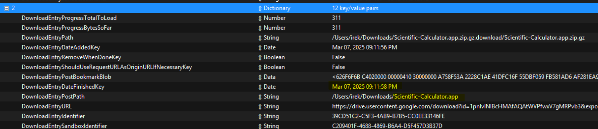 I found there is a suspicious download which is:

> **Scientific-Calculator.app**

---

### Task 3: When did the user first initiate the download of that malicious entity (UTC)?

In the same plist as the last question we can see when this file was downloaded. It's saved as `Mar 07, 2025 09:11:56 PM`, so changing it to UTC it becomes:

> **2025-03-07 21:11:56**

---

### Task 4: What was the timestamp (UTC) of the user's most recent interaction with the malicious file?

This one took me a while. I searched a lot in the files I already had from mac_apt but nothing was working, so I asked for a nudge and this is what I got: https://www.cyberengage.org/post/macos-file-system-events-the-power-of-spotlight — a blog post talking about Spotlight forensics for Mac. So I went and tried it after heading to `./ireks-Mac-Triage/spotlight/.Spotlight-V100/Store-V2/1ECCA0CC-6915-423E-99E6-56A18E9720E8/store.db`, a file which I couldn't parse. So after Googling I found this tool called spotlight_parser:

::github{repo="https://github.com/ydkhatri/spotlight_parser"}

And after using it against my files with this command:

```bash title="parsing the Spotlight db"
spotlight_parser.exe ./store.db ./spotlight_out
```

Where I just give it the location of the store.db and the output location I want. It generated a .txt file which I can use now. Searching for `Scientific-Calculator.app`, we'll find the field `kMDItemLastUsedDate` which has the answer:

> **2025-03-07 21:14:37**

---

### Task 5: The attacker used a tool to drop files and bypass Gatekeeper. What is the name of the tool used for this technique?

So for this question, I don't know if there are any present artifacts that can help me get it, but I looked at the bash history and didn't find anything related to it. So I Googled it and found two answers — the first one was `wget` which is not the answer, and the second was the answer:

> **curl**

---

### Task 6: What is the full file path of the Mach-O executable crafted by the attacker for privilege escalation?

Ohhhh boy, this task was the last one I solved. I just couldn't get it and asked for a hint. What I got was just one word: "Trash". Sooo I went to `.\ireks-Mac-Triage\Users\irek\.Trash` and in there I found some files. One of them was `switch_race.c` where inside it they mentioned an output file named `expooo`. 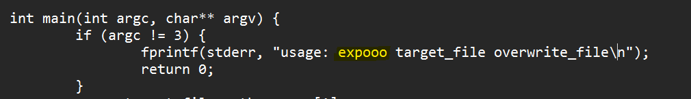 And so I just tried with any default installation location like the user's Downloads/Documents/Desktop, and yeah, after a while of trial and error I got it:

> **/Users/irek/Desktop/expooo**

---

### Task 7: What is the CVE number associated with the exploit leveraged by the attacker?

For this one I looked at the source code of the exploit. The key indicators were the function name `unaligned_copy_switch_race`, the `switcheroo_thread` pattern that races `vm_map` calls between RO and RW mappings, and the `vm_read_overwrite` Mach kernel API being exploited. These are all signatures of a well-known macOS kernel race condition bug. Searching for "macOS vm_read_overwrite unaligned copy race condition CVE" led me to the original PoC by [@zhuowei](https://github.com/zhuowei/MacDirtyCowDemo), confirming it as:

> **CVE-2022-46689**

---

### Task 8: During the privilege escalation phase, the attacker mimicked the use of a well-known system file by altering a specific word in its configuration, enabling them to gain a root shell. Based on the comparison between the original file and the modified file, what is the specific word that was changed to facilitate this exploit?

So this one took me some time too. I got the original CVE PoC on GitHub: 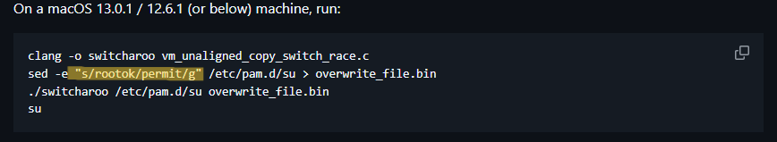

All I need is this line:

```bash
sed -e "s/rootok/permit/g" /etc/pam.d/su > overwrite_file.bin
```

This command targets `/etc/pam.d/su` and replaces `pam_rootok.so` (which checks if the caller is already root) with `pam_permit.so` (which always returns success), allowing any user to run `su` without a password. The word that was changed is:

> **permit**

---

### Task 9: After gaining root privilege, the attacker created a new user. When did he create that user (UTC)?

So for this one I guess I solved it with an unintended way. I saw "created a user" and headed to `./ireks-Mac-Triage/Users`. In there I found only the user we already know (`irek`) and a `deleted-users` folder which had `Loki.dmg`. I opened it using FTK Imager and looked for the oldest timestamp I found in there, made sure it's in UTC, and submitted it. 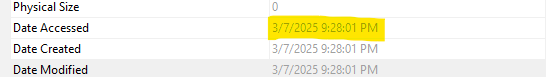

> **2025-03-07 21:28:01**

---

### Task 10: At what point did the attacker successfully enable SSH on the system (UTC)?

So for this it took me a lot of time to get. The hint I got was "system logs" which wasn't very useful. Desperate times call for desperate measures, so I just played around opening random directories and files until I found `ireks-Mac-Triage/private/var/log/com.apple.xpc.launchd`. I don't remember if I Googled it first or found it then Googled, but anyways — this isn't a single log file; it's an internal macOS system directory where `launchd` and the XPC (Cross-Process Communication) framework track low-level background processes, services, and system daemons. So I opened the 3 log files and searched for SSH. In `launchd.log.2` we found `Enabling service com.openssh.sshd`. 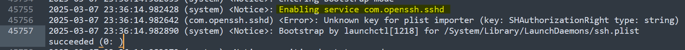

With the timestamp of `2025-03-07 23:36:14.982428` — trying this we got an error. Hmm, could it be that the machine time is not UTC? So we head to `ireks-Mac-Triage/private/etc/localtime`, or open the `mac_apt.db` file, and we'll see the timezone is `EET, UTC Offset: +0200`, making the timestamp:

> **2025-03-07 21:36:14**

---

### Task 11: The user noticed unusual activity on his laptop. After monitoring the situation for a period of time, he proceeded to shut down the device. A day after, he turned on his laptop. At what time (UTC) did he turn on his laptop?

So as I said before, Mac ASL logs are like the Windows event logs. I opened `ASL.db` using SQLite and searched for "shutdown". Huh, but the question is asking when he turned the device back on, not when he turned it down. So I got some help and what I understood was that Macs log the previous shutdown cause when the device is powered on again. So you can actually get when the device was powered on from the shutdown log — I hope it makes sense. Sorting them by time, 7 total events are shown, but we'll look at only events after the last task's timestamp. 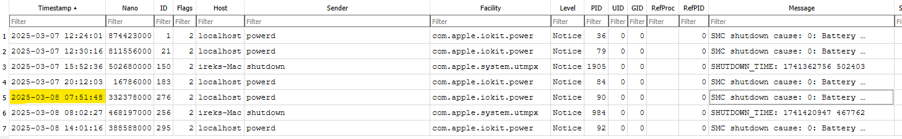

> **2025-03-08 07:51:38**

---

### Task 12: After enabling SSH on the system, the attacker successfully established an SSH connection when the user turned on their machine. Based on the timeline of events, at what specific time (UTC) did the attacker establish the SSH connection to the system?

While we're on the ASL logs, let's search for SSH. 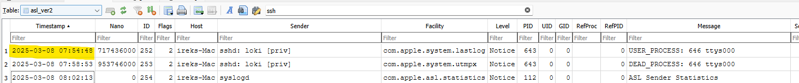

The ASL log shows a `USER_PROCESS` (ut_type 7) entry from `sshd: loki [priv]`, confirming the attacker connected as user `loki`.

> **2025-03-08 07:54:48**

---

### Task 13: The attacker downloaded and dropped a malicious file onto the system to establish persistence. What is the name of this malicious file?

Ok, so for this I just went and looked into the `Loki.dmg` file because that's the user the attacker had an SSH connection to. I just explored the contents of this user until I stumbled upon a suspicious-looking file on the Desktop named:

> **b4ckd00r**

---

### Task 14: The malicious file created a specific file to ensure the malware runs every time the user logs into the system. What is the name of this file?

Now that I have the file, I can just look up its hash on VirusTotal: https://www.virustotal.com/gui/file/6b379289033c4a17a0233e874003a843cd3c812403378af68ad4c16fe0d9b9c4. We'll go to Behavior and look at the dropped files, and there we see it:

> **com.appule.sysetmd.plist**

---

### Task 15: The file points to an executable that runs upon user login. What is the full path of this executable file?

So we look for the `com.appule.sysetmd.plist` file on our system and inside we see the answer:
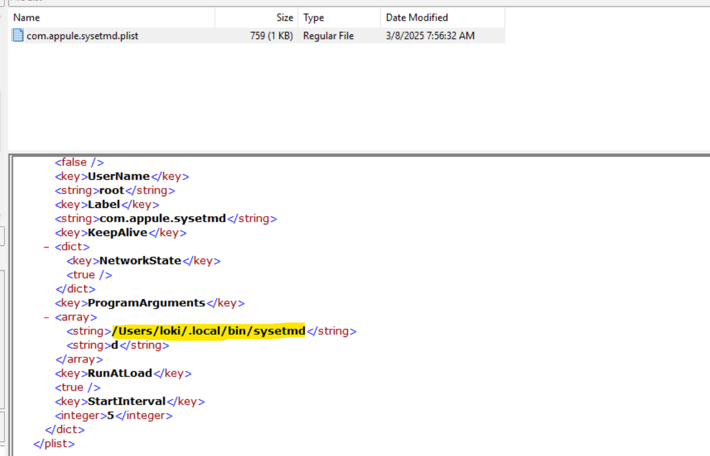

> **/Users/loki/.local/bin/sysetmd**

---

### Task 16: What is the MITRE ATT&CK technique ID associated with the persistence mechanism used by the attacker?

Once again, VirusTotal's Behavior tab has our answer:
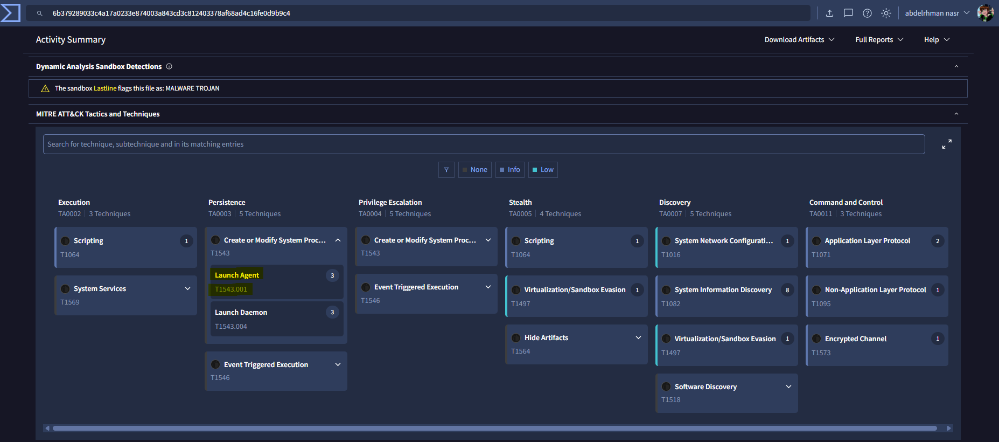

> **T1543.001**

---

### Task 17: Based on the analysis of the malicious file and its persistence mechanism, what is the most prevalent malware family associated with this attack?

We can easily find this in VirusTotal's Detection tab:
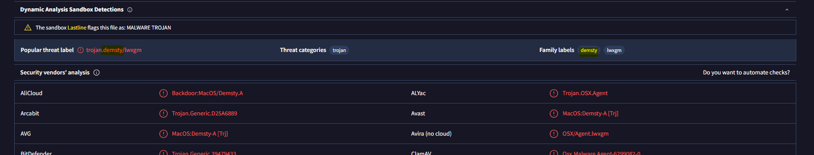

> **demsty**

---

### Task 18: The legitimate user noticed and deleted the unauthorized account created by the attacker. When did the user initiate the deletion of the attacker-created account (UTC)?

Last but not least — for this question we opened `Loki.dmg` with FTK Imager, and we saw that the last access to the folders in the disk was:
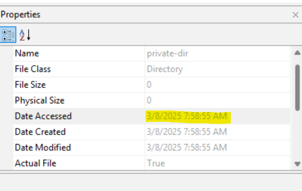

> **2025-03-08 07:58:55**

---

### My Feedback

Finally I'm free! This Sherlock consumed a lot of my time both solving it and making this writeup. I've made this writeup 3 months after solving it so I got stuck on some of the questions, but still this was a good macOS forensics challenge that introduced me to a lot of new things about how to parse Mac artifacts and how to deal with them. While solving this I found one last artifact which I could have used, and I'm going to leave it here as a bonus.

### Bonus

I found out about the Unified Logs file while finishing the challenge. The Unified Logs system is a structured, memory-efficient framework that records detailed system and application telemetry in a proprietary binary format. It's found in `ireks-Mac-Triage/UnifiedLogs` and can be parsed by `unifiedlog_iterator`:

::github{repo="https://github.com/mandiant/macos-UnifiedLogs"}

```bash title="parsing the Unified Logs"
unifiedlog_iterator.exe -m log-archive -i ./UnifiedLogs/ireks-Mac_20250308_160413.logarchive -o parsed_logs.csv -f csv
```

This command takes the mode which is a log archive as we have a folder on our disk image, `-i` for the input or the location of these logs, `-o` for the output file name, and finally `-f` for the format. This can be used in forensics cases, but be ready — the size will be huge. The Unified Log folder was 0.25 GB and the output was 4.50 GB, soo you need to know exactly what keyword you'll be using for the search so you dont get lost in there.

This was a great Sherlock. Learned a lot, struggled a lot, and it taught me to just do my best.

تم بحمد الله