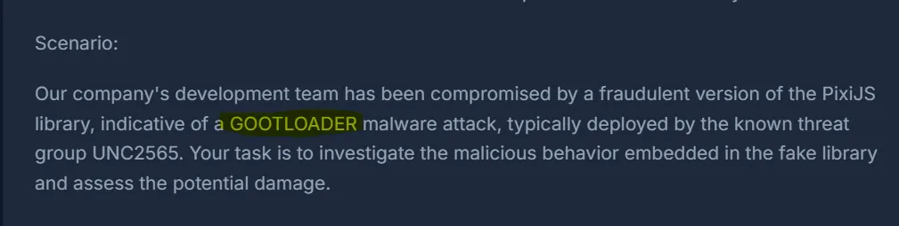
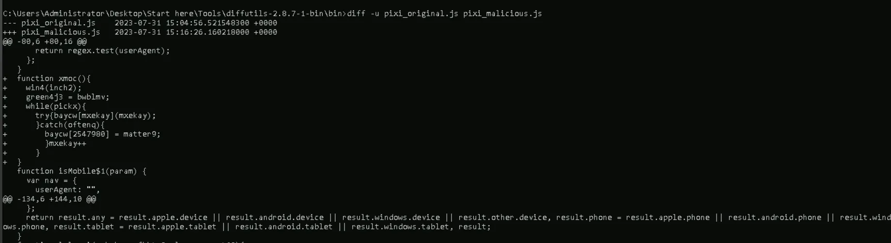
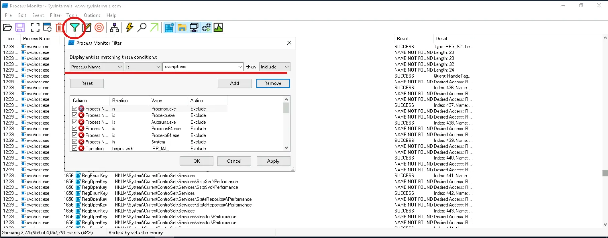
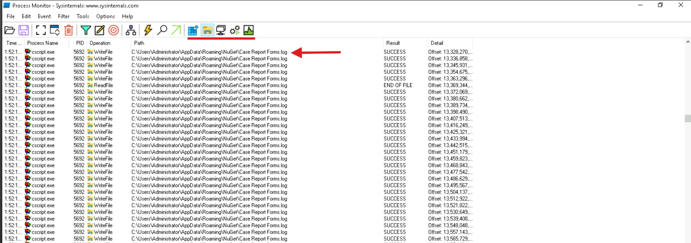
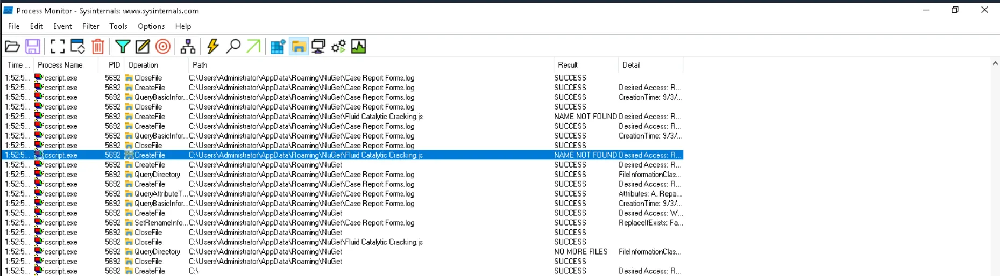
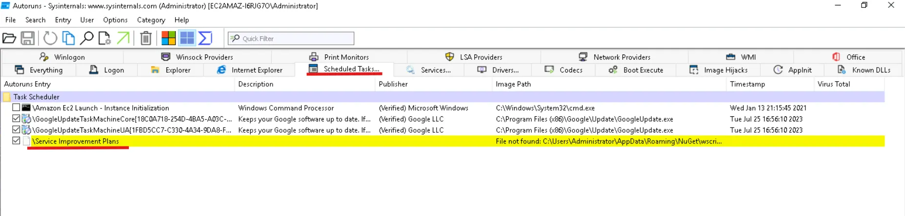
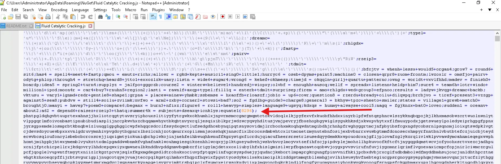
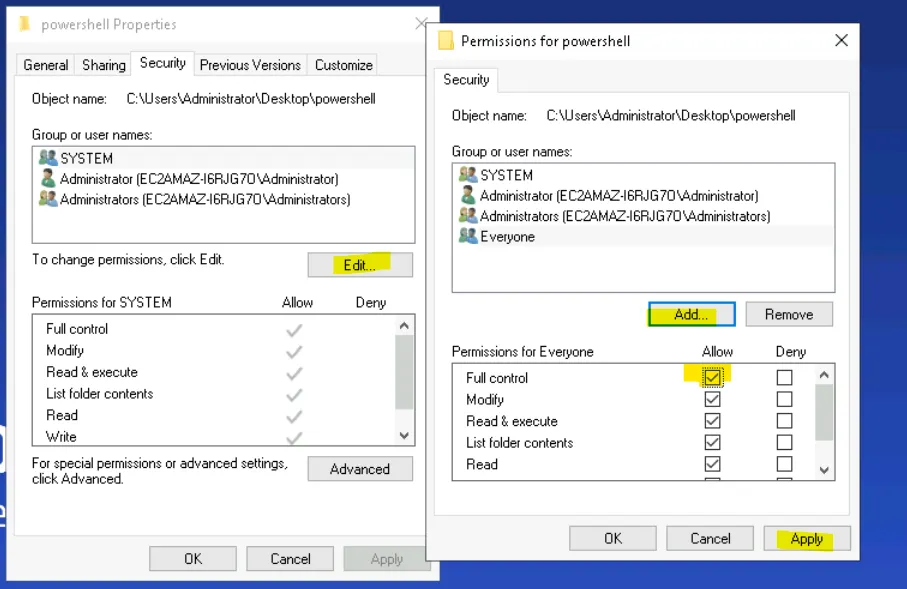
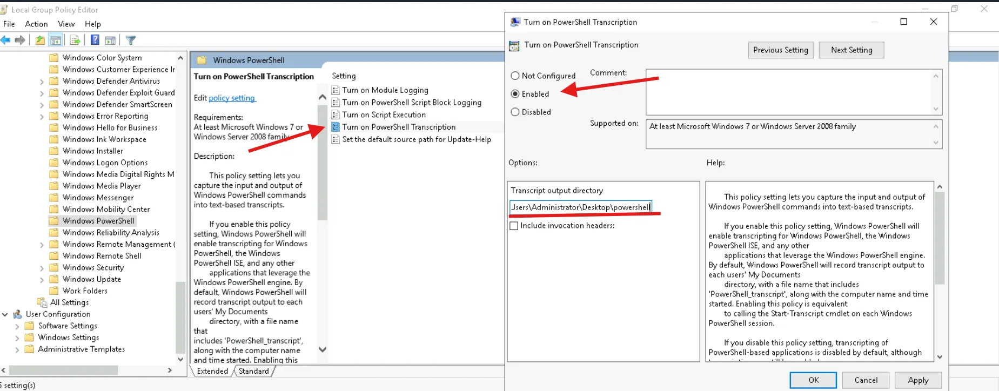
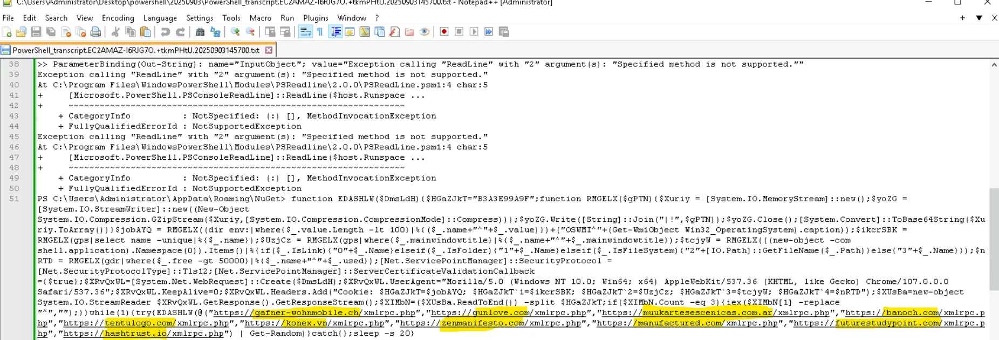

بسم الله الرحمن الرحيم

While working through the SOC Tier 3 path on CyberDefenders, I stumbled upon the T1059.007 lab. On the first day, I was completely lost. I spent hours trying to run the provided scripts, fixing syntax errors, and re-running commands — but every attempt ended with no output at all. At that point, I was honestly ready to give up.

I decided to skip the lab and move on with my day, thinking maybe I’d return later. The next morning, however, I made up my mind that I wouldn’t let this lab defeat me. I sat down determined to solve it, no matter how long it took.

The first thing I did was start Googling **T1059.007**. That quickly led me to the MITRE ATT&CK page. Reading through the technique helped me understand the general concept — adversaries using JavaScript execution as part of their attacks — but it still didn’t directly explain how to approach this specific lab.

That’s when I went back to carefully read the scenario provided in the challenge.



GOOTLOADER malware caught my eye while I was reading through the references. The name sounded familiar, so I decided to dig deeper. After some searching, I stumbled upon this video. I’ll leave it to you to watch :D

<iframe loading="lazy" class="w-full aspect-video rounded-xl" src="https://www.youtube.com/embed/zBt6uEuMOd4" title="YouTube video player" frameborder="0" allow="accelerometer; autoplay; clipboard-write; encrypted-media; gyroscope; picture-in-picture" allowfullscreen></iframe>

And from here I started to understand what I should do. So, first off, let's take a look at the tools provided.


**Diffutils** is a small package that contains utilities for comparing files. It consists of four main tools:

> `diff` → compares files line by line.
>
> `cmp` → compares files byte by byte.
>
> `sdiff` → shows two files side by side with differences highlighted.
>
> `diff3` → compares three files at once (useful in versioning or patch analysis).

Since in this challenge I only needed to compare two files, I decided to use ```diff```. I copied both files — the clean `pixi_original.js` and the suspected `pixi_malicious.js` — into this directory:

```text
C:\Users\Administrator\Desktop\Start here\Tools\diffutils-2.8.7-1-bin\bin
```

Then used this command to compare the two files:

```bash title="Comparing the JS files"
diff -u pixi_original.js pixi_malicious.js
```

Here’s how the output looked:



Any line that started with a `+` in the `diff` output represented the difference between the two files — and in this case, that difference was the injected malicious code.

The output was close to what I needed, but not quite perfect. So, I refined the command to grab only those added lines and save them into a new file:

```bash title="Extracting the payload"
diff -u pixi_original.js pixi_malicious.js | findstr /b "+" >1st_stage.js
```

This gave me a file with only the suspicious lines. I opened it in Notepad++, and from there all I had to do was remove the `+` at the beginning of each line.

Finally, I had the malicious script fully reconstructed. With that in hand, I could move on to analyzing the code and start answering the room’s questions.

### Q1: Understanding the initial foothold of the malware is crucial for assessing its spread within our infrastructure. What is the file name that was dropped into the system by the injected code from the counterfeit PixiJS library?

To start the dynamic analysis, I needed to monitor what the script actually does when executed. For that, I fired up **ProcMon** and applied a filter on the process name `cscript.exe`, since this is the process used to execute JavaScript files in Windows.



With the monitoring set up, I launched a CMD window inside the same directory mentioned earlier and executed the extracted script:

```bash title="Executing the first stage dropper"
cscript.exe ./1st_stage.js
```

This way, ProcMon would capture all the activity generated by the script — file operations, registry modifications, process creation, and network activity. From here, the real behavior of the malicious code started to reveal itself.

:::warning[Patience is Key]
Don’t be hasty — the malicious script might take some time to fully execute and generate telemetry inside of ProcMon!
:::



At first, ProcMon was only showing regular file system activity, so I kept scrolling through the logs carefully. Eventually, I spotted something interesting: the script had created a **new file** called:

> **Case Report Forms.log**

---

### Q2: After initial infiltration, malware often changes its file name to evade detection. To track this threat more effectively, what is the new name that the file, initially dropped by the injected code, was renamed to?

Continuing to scroll down in ProcMon from the previous finding, I came across another File Create event. This time, the malicious script had dropped a new file with a different name:



> **Fluid Catalytic Cracking.js**
---


### Q3: To ensure thorough risk mitigation and prevent any potential backdoors. What is the name of the scheduled task created by the injected code?

For this, I used **Autoruns**, which is a great tool for spotting anything that automatically executes on startup or is scheduled by malware. Sure enough, right after running the script, a new **Scheduled Task** appeared:



> **Service Improvement Plans**
---


### Q4: To assist our network team in identifying which hosts are compromised by the malicious JS file. How many URLs does this malware interact with?

Here we move on to analyzing the **second stage of the payload** that was dropped earlier. Opening the file revealed a **heavily obfuscated and strangely malformed script**. At first glance, almost 90% of the file was just one long meaningless string — clearly designed to mislead anyone casually inspecting it.



After deleting the junk string, the file became easier to work with. Based on the hints from the lab and from the GOOTLOADER video I had watched earlier, I already suspected what this code was doing: it was preparing to execute **PowerShell code**. That meant my next step was to capture and understand exactly what PowerShell was running.

To do that, I needed to enable detailed PowerShell logging. I started by creating a dedicated folder to store the logs: `powershell_logs` and saved it on the Desktop.

Then I set permissions to make sure logging would work correctly. I right-clicked the folder, went into **Properties → Security → Edit → Add**, typed in `Everyone`, clicked **Check Names**, and pressed **OK**. Finally, I checked **Full Control** for `Everyone`, hit **Apply**, and that finished the first step of the setup.



With the logging folder ready, the next step was to actually enable **PowerShell transcription** so that every command executed would be captured. I searched in Windows for **Group Policy**, clicked on the first result, and from there navigated to: 
**Computer Configuration → Administrative Templates → Windows Components → Windows PowerShell**

Inside this menu, I located the setting **Turn on PowerShell Transcription**, double-clicked it, and set it to **Enabled**. Then I filled in the **Transcript Output Directory** with the path I had created earlier.

From this point forward, every PowerShell execution would be recorded into that folder — giving me full visibility into what the second-stage malicious script was trying to run.



With transcription enabled, it was time to finally execute the second-stage script. I ran it using:

```bash title="Executing the second stage payload"
cscript.exe "Fluid Catalytic Cracking.js"
```

After letting it run, I navigated to the output folder I had set earlier: `C:\Users\Administrator\Desktop\powershell_logs`

Inside, I found a newly generated `.txt` file containing the full transcription of what the script had executed. Opening the log revealed the PowerShell commands that were hidden inside the obfuscated JavaScript — giving me a clear look at what the payload was doing.



And here, inside the PowerShell transcript, I finally uncovered the **URLs that the payload was trying to connect to**. The obfuscated script had been hiding a list of:

> **10 domains**
---


### Q5: To effectively detect and prevent malicious traffic on our network, we need knowledge of malware’s network IOCs behavior. What user agent does the malicious code use to communicate with malicious URLs?

Looking back at the PowerShell transcript from the last step, I found the **user agent** string sitting in plain sight.

> **Mozilla/5.0 (Windows NT 10.0; Win64; x64) AppleWebKit/537.36 (KHTML, like Gecko) Chrome/107.0.0.0 Safari/537.36**
---

### Q6: Identifying how malware conceals its communications unveils its network footprint. What is the name of the 1st cookie used in the requests sent to malicious URLs?

From the same PowerShell transcript, I dug a little deeper into the HTTP request variables. I copied out the very first variable I spotted, and boom — that was it. The malware was setting a cookie with the name:

> **B3A3E99A9F**

---

That wraps up the investigation. From catching the initial dropper, watching it morph into a new file, digging through scheduled tasks, and finally tracing the obfuscated second stage with PowerShell logging — it’s been quite the journey. What stood out to me is how much noise malware throws in just to confuse you, but with the right tools and patience, the real behavior always comes out.

If you enjoyed this breakdown and want to keep up with more of my hands-on malware analysis and blue team adventures, feel free to follow me on [LinkedIn](https://www.linkedin.com/in/abdelrhman-nasr-sec/).