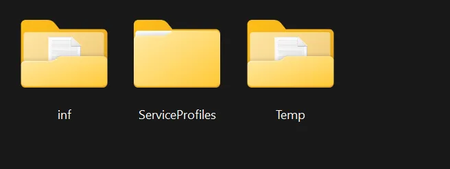
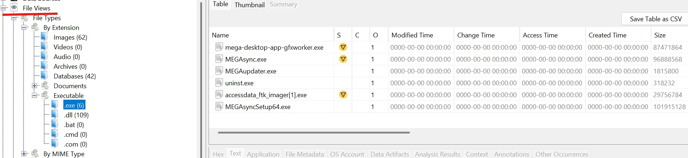
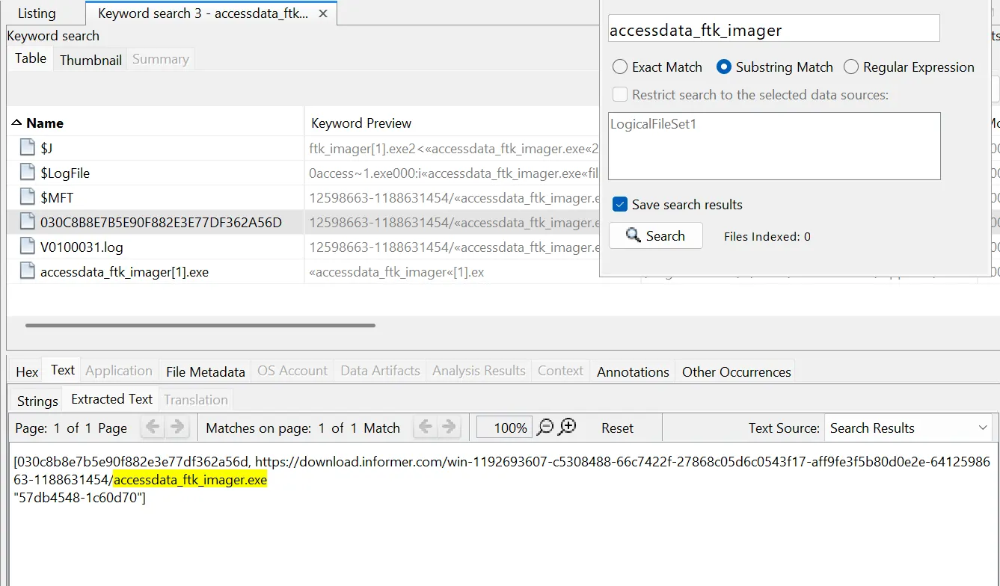
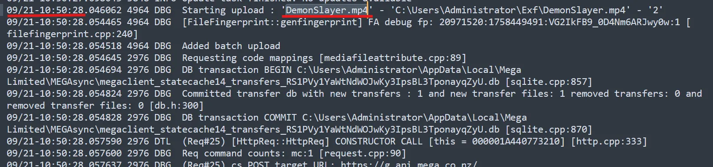
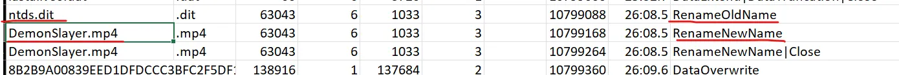

بسم الله الرحمن الرحيم

This was the last challenge dropped — we were exhausted, but far from finished.

I was working with my very talented teammate, [**Yousef Tamer**](https://www.linkedin.com/in/yousef-tamer-90176b239/), and we worked hard to get this flag.

## The Challenge:

A mid-sized company reports suspicious activity on one of its domain controllers. A privileged account appears to have exported sensitive directory information and then attempted to remove all local traces before leaving for the weekend. The triage was taken by on-site staff after the incident. No network captures are available — everything you need is on the Triage.

Answer these five questions from the evidence in the triage package. Provide the values in the exact flag format shown.

* **Q1** → Which tool was used to drop the executable onto the host?
* **Q2** → What is the SHA-1 hash of the link that was used to drop the executable?
* **Q3** → What was the original filename of the dumped file?
* **Q4** → What filename was used for exfiltration to bypass detection?
* **Q5** → Which tool was used to exfiltrate the file from the host?
* **Q6** → When did the exfiltration occur (timestamp)?

*Note: provide only tool names (no file extensions).*

**Format:** `CyCTF{tool_sha1(url)_secret.txt_secret2.txt_tool_YYYY-MM-DD HH:MM:SS}`

Let's start by loading the artifacts into Autopsy. While this happens, let's take a look at the log files... no log files **X﹏X**

### Questions 1 and 2:

Anyways, let's go back to Autopsy. It feels like there are not many artifacts in this challenge, so we shouldn't get lost too easily. We know it's an **executable**. so let go to Autopsy, under the file views tab, we have a section for executables. We can see the `.exe` tab only has 6 items, so let's take a look. All of them seem like legit **MEGA** files, except one: `accessdata_ftk_imager[1].exe`.

Let's search Autopsy and see what we get. Going through the 6 files, we find the URL: 
`https://download.informer.com/win-1192693607-c5308488-66c7422f-27868c05d6c0543f17-aff9fe3f5b80d0e2e-6412598663-1188631454/accessdata_ftk_imager.exe`

Converting that URL into an SHA-1 hash, we get:
> **4621cdc24718ed95bd6271e26b0e28307f159b32**

Looking at the location of this file (`030C8...`), we find it's located under the `CryptnetUrlCache` folder. After a little bit of Googling, I found that this folder is where 
>**`certutil.exe`** 

drops files when dealing with certificates.

### Questions 3, 4, 5, and 6:

For Q5, the answer is 
>**MEGA**

as we’ve seen it's already installed. Some Googling tells us that MEGA logs are saved in:
`%AppData%\Local\Mega Limited\MEGAsync\logs`

We open up `MEGAsync.log` and go through it. Inside, we see a file being uploaded called 
>**`DemonSlayer.mp4`**

That answers Q4! Right next to it, we get the timestamp:
> **`2025-09-21 10:50:28`**.

Q6 is now done.

Now we are only left with Q3. The first thing that came to my mind was parsing the Journal File `$J` into a CSV. I usually open them with TimelineExplorer, but the filtering will only show me the hit, so here I used Excel normally. 

We search for `DemonSlayer.mp4`. On the first hit, we can see the Rename operation (old and new name). We get the old name: 
>**`ntds.dit`**.

Q3 done!

### Putting It All Together

We add all the pieces together and we get the flag:

> CyCTF{Certutil,4621cdc24718ed95bd6271e26b0e28307f159b32,ntds.dit,DemonSlayer.mp4,MEGA,2025-09-21 10:50:28}

and boom,… boom anything , just Incorrect responses one after another and after a few minutes of double checking everything is right , we found it , it was the flag format its `_` not `,`

p]:flex [&>p]:justify-center [&>p]:items-center [&>p]:m-0 [&>p>img]:w-[600px] [&>p>img]:max-w-full [&>p>img]:rounded-lg [&>p>img]:shadow-xl my-6">

> **CyCTF{Certutil_4621cdc24718ed95bd6271e26b0e28307f159b32_ntds.dit_DemonSlayer.mp4_MEGA_2025-09-21 10:50:28}**

and finally we did it.